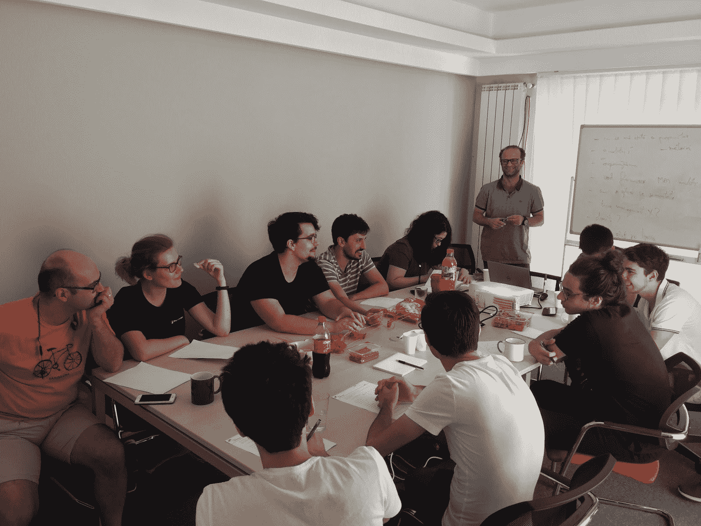
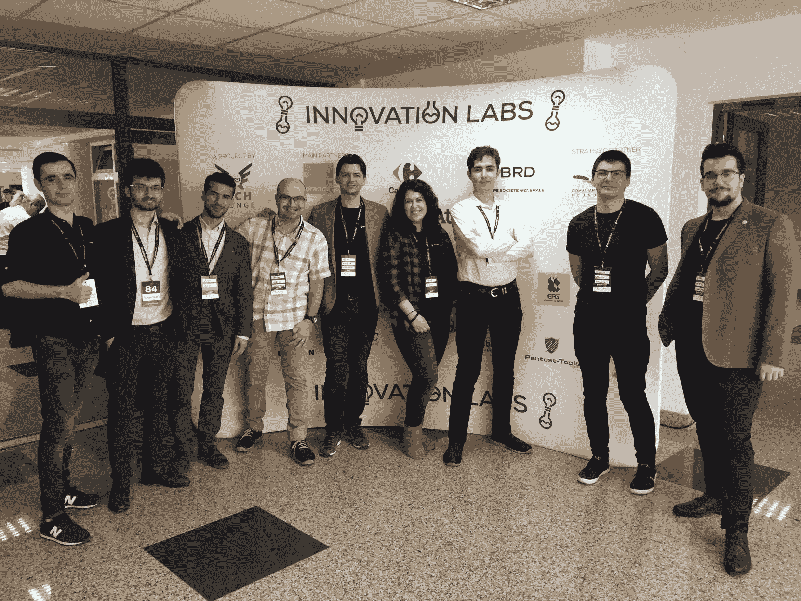

# 为什么我们继续支持年轻人在信息安全| Pentest-Tools.com 找到自己的路

> 原文：<https://pentest-tools.com/blog/build-infosec-career>

终身学习、不断实践以及与他人分享知识和想法的需要是我们加入 infosec 社区的原因。

因为我们都努力在工作中做到最好，并对我们的领域产生积极影响。为此，我们需要提醒自己保持参与，并始终身体力行。

在**Pentest-Tools.com**，我们不断投资于学生，通过内部活动为他们提供学习机会。我们鼓励他们通过我们的黑客日计划来培养他们的信息安全技能，或者通过分享本周新闻来激发好奇心以更好地了解这个行业。

我们通过实习职位雇用他们，并通过与资深同事的指导会议来促进关系。他们有机会应用在学校学到的技术知识，并在工作中执行特定的任务，以培养行业意识。

我们还为他们提供展示最佳作品和获得尽可能多的实践经验所需的工具。举个例子，我们的[谷歌呆子](https://pentest-tools.com/information-gathering/google-hacking)可以免费使用！

*敏捷培训课程中的 Pentest-Tools.com 团队(在《疫情时报》之前)*

我们相信教育项目和不断的实践是年轻人才追求成功职业生涯的支柱。

成为一个慷慨大方的人的社区的一员，对于建立一个良好的、有回报的职业生涯并为其培养必要的技能也是必不可少的。

我们的同事正在进行棉花糖挑战赛(我们怀念现场比赛！)

有决心的个人可以通过参加 [Capture the Flag (CTFs)](https://def.camp/ctfs-better-infosec-specialist/) 安全竞赛来实现这一目标，这些竞赛将奖励充满引人入胜的挑战、有趣的谜题和宝贵的学习机会的体验。

## **我们如何言行一致**

这就是为什么我们与来自[赛博教育](https://cyberedu.ro/)的朋友合作，支持他们即将举行的**牢不可破的道德黑客全国竞赛**。

[牢不可破的罗马尼亚](https://unbreakable.ro/#eveniment) #2 由 Bit Sentinel 与 Orange Romania 合作推出，将于 12 月 15 日至 16 日举行。

全国竞赛为高中和大学学生提供了一个极好的机会来测试和丰富他们的专业知识，解决交互式网络安全测验，并在受控环境中深入了解漏洞。这些**全部免费**。

你准备好变得牢不可破了吗？ [**免费注册**](https://unr1.cyberedu.ro/) 到赛博教育平台**准备好**获得精彩体验(外加丰厚奖品)！

### **回望创新实验室 2017 届校友**

[创新实验室](https://www.innovationlabs.ro/)，罗马尼亚最大的预加速项目，是我们大力支持和鼓励年轻一代加入的另一个教育项目。这种丰富的经历有助于你发展企业家精神，学习创业的基本知识，并接触来自创业生态系统和 ICT 行业的优秀导师。

我们从亲身经历中了解到这一点，因为我们在 2017 年完成了该计划， [**获得了大奖**](https://www.innovationlabs.ro/teams/Pentest-Tools.com) ，这是对我们在一个我们真正相信的项目中长期工作和努力的认可。

*Pentest-Tools.com 团队的一部分在*创新实验室**【2 月】** 2020 **布加勒斯特黑客马拉松**

加入 pre-accelerator 计划有助于我们作为一家早期技术创业公司在市场上建立对我们平台和服务的认识。在紧张的 3 个月中，我们得到了拥有多年经验和宝贵见解的技术导师和企业主的全力支持，以加快我们正在做的事情。

该项目还教会了我们经营企业所需的技能，包括销售、财务以及如何更好地与目标受众沟通。导师帮助我们理解风险和复杂性，并引导我们走向正确的方向。

我们在计划结束后很长一段时间内得到的持续支持以及我们与社区的培养关系证明了创新实验室是多么有帮助和有价值。

我们的使命是让[**Pentest-Tools.com**](https://pentest-tools.com)成为我们客户安全测试工具的必备工具，并帮助他们更好地识别系统中的关键漏洞。

这是我们同事眼中的程序。我们的一名软件开发人员 Cosmin 说:

> *创新实验室是一次真正有益的经历，我强烈推荐！这一切都是关于人和他们的能量，以支持他人使事情发生！在这个项目中，我遇到了优秀的导师，他们给我上了宝贵的商业课。它帮助我更好地了解创业生态系统，丰富了我的网络安全知识和技能。这些东西是从书本上学不到的！*

我们的高级软件开发人员 Eusebiu 也分享了他的建议:

> 通过这个项目，你将更深入地了解创业生态系统，并获得大量有用的资源和知识。这些指导来自拥有多年经验的人，他们来自失败和成功的创业公司，他们将指导你并学习更好地解决现实生活中的问题所需的技能。
> 
> 如果你曾经考虑过自己创业，但你正在等待一个绝妙的商业想法出现，我的建议是加入创新实验室，这种经历肯定会塑造你对创业的看法。

创新实验室旨在培养罗马尼亚新一代年轻企业家，支持他们的创新商业理念，为社区带来积极影响。

这个项目也是一个完美的地方，通过接触广泛的观点和方法，从创业社区获得有价值的见解。

今年，我们的创始人兼首席执行官阿德里安·富图纳(Adrian Furtuna)是**创新实验室决赛**的评审团成员，其中[演示日太空版](https://www.linkedin.com/events/6716681072039522304/)在𝗢𝗰𝘁𝗼𝗯𝗲𝗿 𝟭𝟱𝘁𝗵.举行

> *我从经验中得知，创新实验室将顽强的个人置于一个生态系统中，挑战并支持他们构建具有真正积极影响的解决方案。*

如果你想加入并支持 16 家入围的初创企业，[请查看详情](https://www.linkedin.com/events/6716681072039522304/)。

## **为什么您应该加入这些计划**

教育计划对于像您这样想要开始您的 infosec 职业旅程的积极学习者来说是非凡的体验。报名参加这些比赛对你有很多好处。

你对行业有了更深入的了解，用新的知识拓宽了自己的视野。你可以探索新的领域，测试你的技能，同时丰富你的知识。

这也是一个很好的机会来玩特定的工具和漏洞，打破东西，并更好地理解他们在一个有趣的环境中操作的上下文。

知道你能和像你一样对网络安全有着同样热情的人一起经历这一切，真是太棒了。

我们知道在网络安全领域工作是一个永无止境的学习和发展过程，帮助我们每个人成为更好的专业人士和人类。