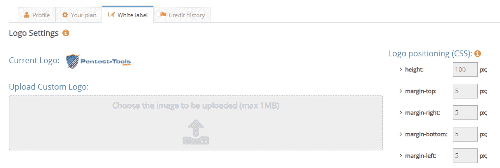
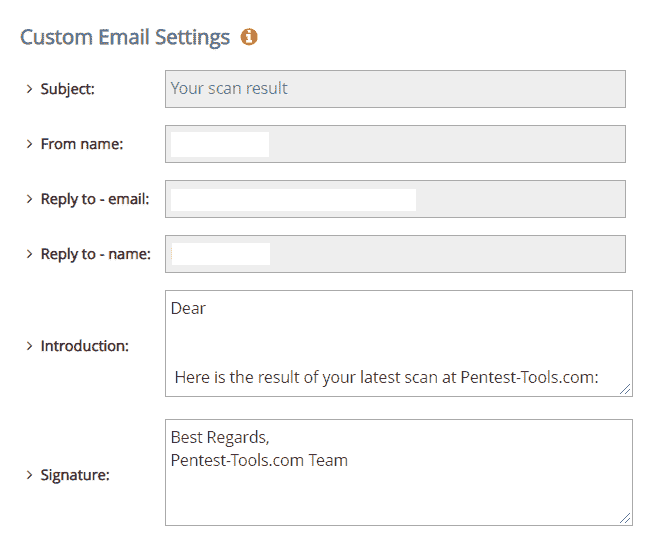
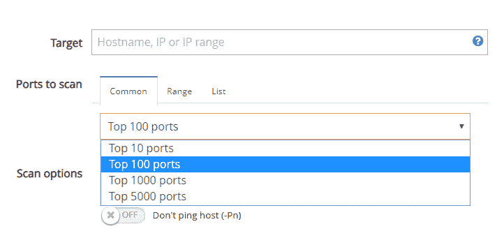
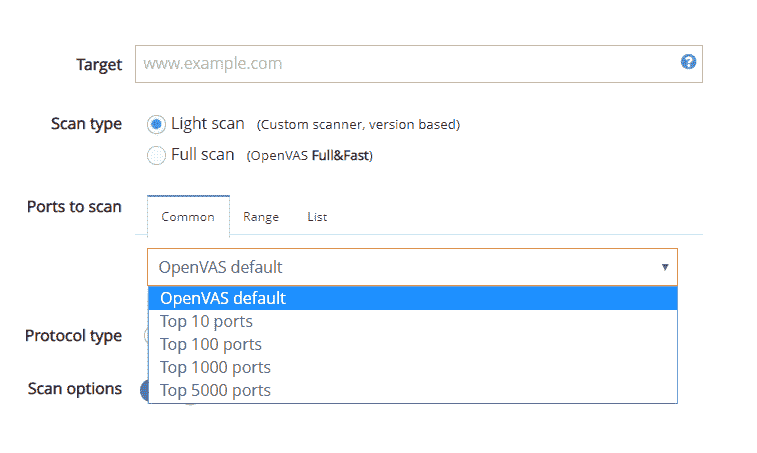
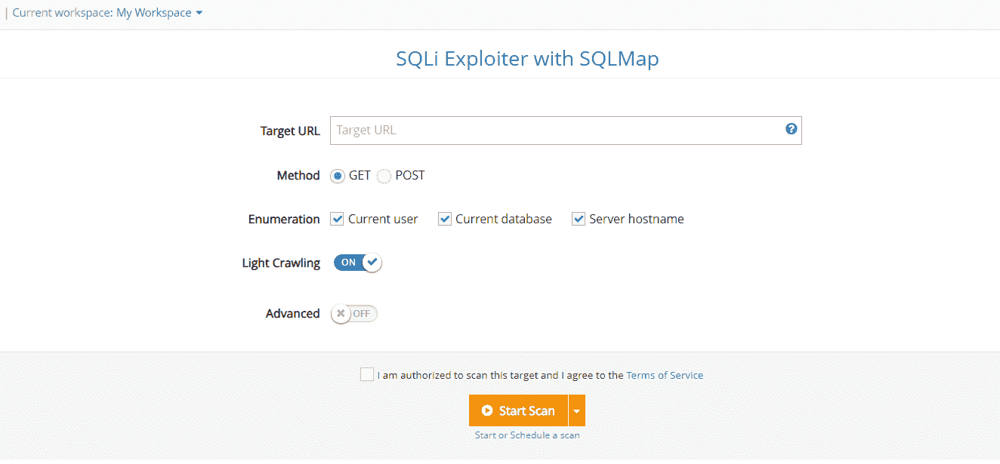
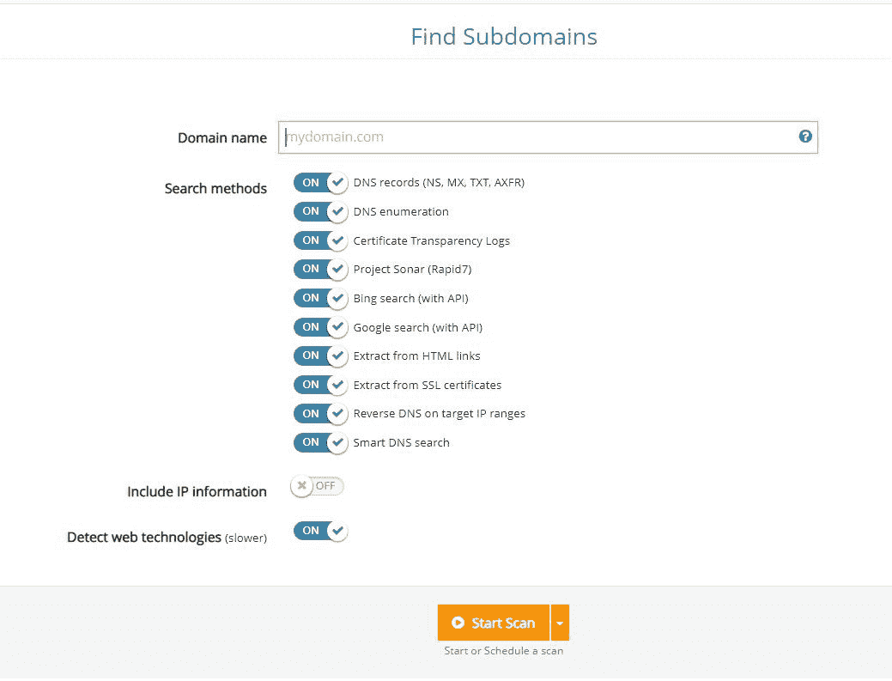

# 定制白色标签、网站扫描仪改进和其他平台更新| Pentest-Tools.com

> 原文：<https://pentest-tools.com/blog/customized-white-label-other-platform-updates>

这里是我们在当前更新中部署的 7 个平台改进，使 Pentest-Tools.com 成为您的 pentesting 工具箱的宝贵资产。

1.  添加了白色标签定制**标志**

2.  提供白色标签定制**电子邮件**

3.  **Nmap** 包括顶级端口选项

4.  **OpenVAS** 自定义端口扫描

5.  **SQLi Exploiter 工具增加了**轻型爬行选项

6.  网站扫描仪-**404 页**检测已启用

7.  **查找子域**速度提升

[**登录试试**](https://pentest-tools.com) [更新](https://pentest-tools.com)

## **1。使用白色标签自定义徽标来标记您的 pentest 报告**

使用您品牌公司的徽标名称(而不是 Pentest-Tools.com 徽标名称)定制您的测试报告，以便与您的客户分享。

要个性化您的报告:

1.  登录您的 Pentest-Tools.com 帐户

2.  转到**报告**

3.  点击**白色标签**标签

4.  上传您的**自定义标志**

注意:**只有企业用户**可以使用他们的自定义徽标，并使用一组自定义 CSS 参数配置其在 pentest 报告中的位置。

## **2。定制发送给客户的带有扫描结果的电子邮件**

我们添加到**白色标签**功能中的另一项改进是，当计划扫描完成时，可以定制发送给客户的电子邮件。

注意:此改进也仅适用于**企业客户**。

现在，您可以使用多个字段个性化电子邮件，如发件人(姓名)、回复(姓名和电子邮件)、主题、介绍和签名。

## ****

## **3。选择要扫描的公共端口**

对于 [**TCP 端口扫描**](https://pentest-tools.com/network-vulnerability-scanning/tcp-port-scanner-online-nmap) 和 [**UDP 端口扫描**](https://pentest-tools.com/network-vulnerability-scanning/udp-port-scanner-online-nmap) 工具，我们增加了选择可以扫描哪些常见端口的选项:前 10 个端口、前 100 个或前 5000 个端口。

以前的版本仅限于前 100 个端口，所以现在您可以更加灵活地选择扫描选项和检查开放的端口。

## **4。使用网络扫描 OpenVAS 扫描自定义端口**

如果您将 [**网络漏洞扫描器与 OpenVAS**](https://pentest-tools.com/network-vulnerability-scanning/network-security-scanner-online-openvas) 配合使用，您现在可以选择扫描自定义端口，方式与 TCP 和 UDP 端口扫描器工具相同。

[SQLi Exploiter 工具](https://pentest-tools.com/exploit-helpers/sqli-exploit-tool-sqlmap-online)现在包括选项**在扫描过程中对目标网站执行轻度抓取**(抓取深度=2)。

该参数使工具能够**通过将 URL 爬行到二级链接来自动发现 URL 目标中的注入点**。

## 6。为网站扫描仪轻松检测 404 错误页面

我们致力于为[网站扫描器](https://pentest-tools.com/website-vulnerability-scanning/website-scanner) **实现一种检测 404 页面的新方法。**

有了这一新的改进，结果应该反映在扫描结果中报告更少的误报。

## **7。查找子域工具的增强版**

我们还对我们的 [**查找子域**](https://pentest-tools.com/information-gathering/find-subdomains-of-domain) 工具进行了多项改进，使其比之前的版本更快更有效。

如果您想检查子域及其 IP 地址，并[确定目标 URL 的攻击面](https://pentest-tools.com/features/attack-surface)，请使用改进版本:

### **尝试新的平台功能，了解它们如何改善您的工作流程和结果！**