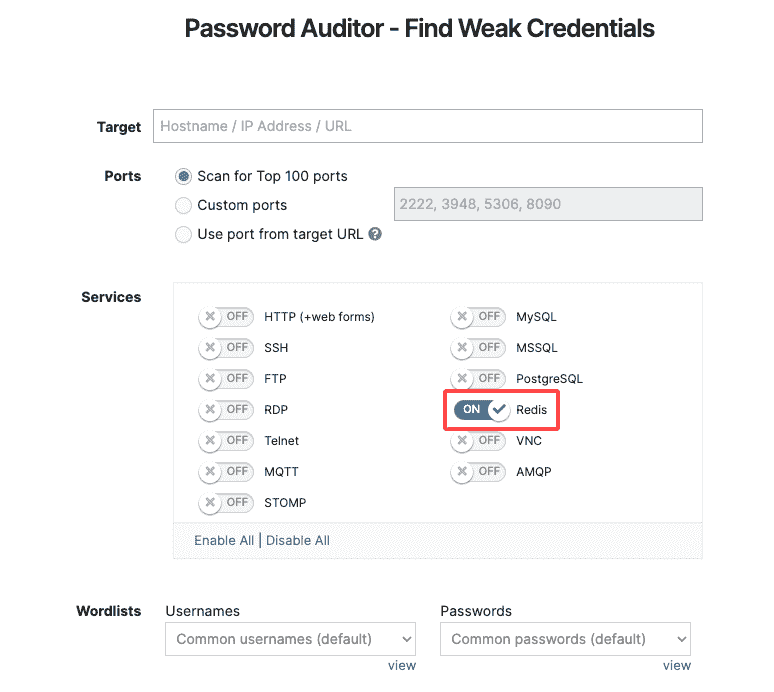
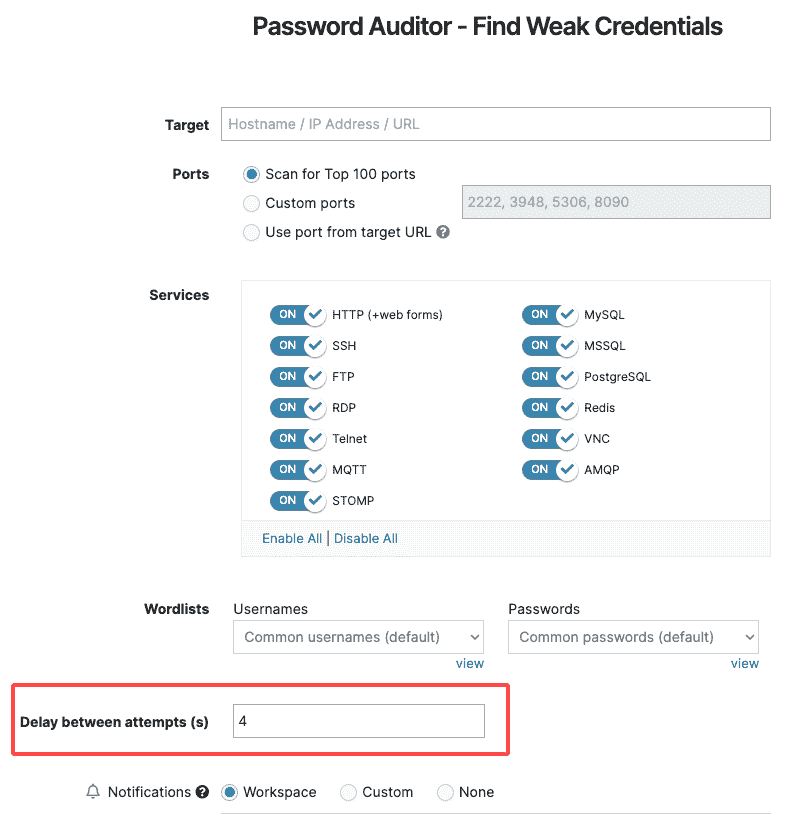
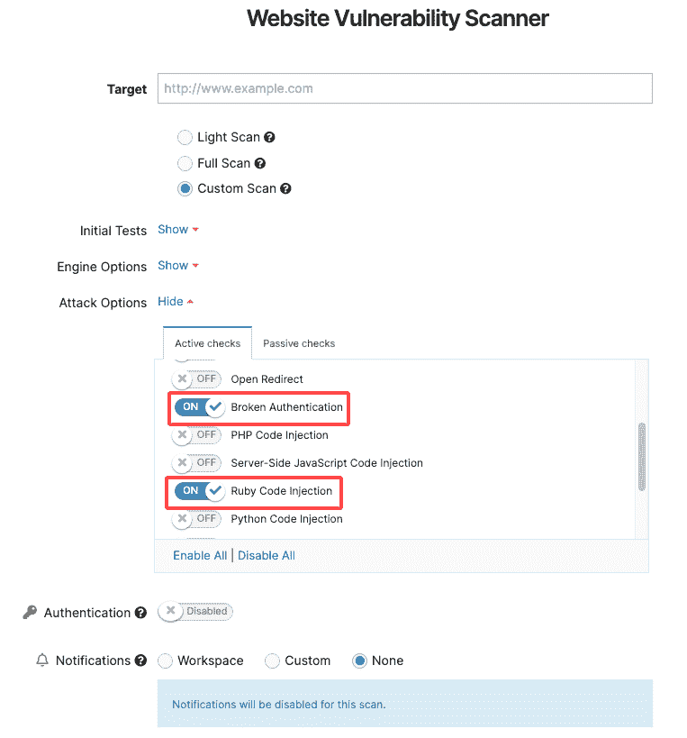
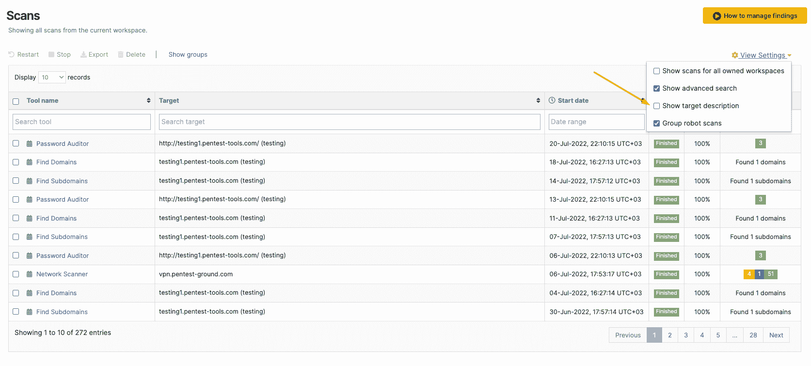

# 12 月更新:6 种新方法让你的工作流程更顺畅| Pentest-Tools.com

> 原文：<https://pentest-tools.com/blog/december-updates-6-ways-smoother-workflow>

希望 2022 对你来说是一个好的开始！

支持您的安全工作是我们所做的，因此这里是我们在 2021 年底推出的一批新的平台更新。

*为什么要检查它们*？

因为它们将帮助您使用您熟悉的相同工具和功能更快地完成更多工作(希望您喜欢！).

**TL；博士**

1.  用狙击自动开发者开发 4 个新的 rce

2.  **使用我们的网络扫描仪检测微软的高风险 XSS**

3.  用我们的密码审计员发现 **Redis** 服务中的弱凭证

4.  **使用密码审计器控制登录尝试之间的延迟**

5.  **用网站扫描仪找到被破坏的认证& Ruby 代码注入**问题

6.  将**关于目标**的具体信息添加到您的聚焦扫描中

**这里是一切工作的方式**

## **1。使用 Sniper** 自动确认这些关键 cv 的可利用性

我们的漏洞研究团队没有休息！他们建立了 4 个新的开发模块，而其他人都在轻松地度假。

这意味着您现在可以使用 [**狙击自动开发者**](https://pentest-tools.com/exploit-helpers/sniper) 在 2 分钟内自动验证、利用和进行后利用**:**

1.  Laravel PHP 框架中的 **RCE 漏洞**——[CVE-2021-3129](https://cve.mitre.org/cgi-bin/cvename.cgi?name=CVE-2021-3129)

2.  另一个**高风险 RCE** 在进出口邮件服务器中被发现，它使恶意行为者能够通过特制的电子邮件执行任意命令—[CVE-2021-10149](https://cve.mitre.org/cgi-bin/cvename.cgi?name=CVE-2019-10149)

3.  在 Apache Tomcat HTTP Server 中发现的 **Tomcat RCE 漏洞**，使得攻击者能够通过精心编制的请求将 JSP 文件上传到服务器—[CVE-2017-12617](https://cve.mitre.org/cgi-bin/cvename.cgi?name=CVE-2017-12617)

4.  多个 Apache OFBiz 版本中的 **RCE 反序列化漏洞**——[CVE-2021-26295](https://cve.mitre.org/cgi-bin/cvename.cgi?name=CVE-2021-26295)

[**试狙击**](https://pentest-tools.com/exploit-helpers/sniper?utm_source=converkit&utm_medium=email&utm_campaign=updatesDEC2021)

## **2。使用网络扫描器(+ Log4Shell)** 检测 Microsoft 中的此关键 XSS

对您的目标运行我们的网络漏洞扫描器，检查他们是否容易受到 Microsoft Exchange Server 中的**关键**预授权基于后反映**XSS**漏洞 ( [CVE-2021-41349](https://cve.mitre.org/cgi-bin/cvename.cgi?name=CVE-2021-41349) )的攻击。

尝试我们的[网络漏洞扫描器](https://pentest-tools.com/network-vulnerability-scanning/network-security-scanner-online-openvas)的全扫描选项，获得一份包含丰富、有用发现的即用型报告。

**专业提示:**不要忘记，您可以使用 Pentest-Tools.com 来查找受 Log4J RCE 漏洞(CVE-2021-44228)影响的目标。

使用**网站扫描器**和**网络扫描器**工具，您可以 [*有效地*](https://pentest-tools.com/blog/log4shell-scanner-detect-cve-2021-44228) [检测](https://pentest-tools.com/blog/log4shell-scanner-detect-cve-2021-44228) [**日志 4 外壳**](https://pentest-tools.com/blog/log4shell-scanner-detect-cve-2021-44228) 在您的测试约定中。我们甚至提供了一个更快的选项:即用型**[log 4 shell pentest 机器人](https://pentest-tools.com/features/pentest-robots)** [！](https://pentest-tools.com/features/pentest-robots)T32

好奇我们的 Log4J vuln 检测技术是如何工作的？我们分享了这一切。

## **3。在 Redis 中发现弱凭据**

如果您正在使用 **Redis** ，您现在可以运行密码审计器来*自动*发现其中的薄弱和默认凭证。

进入 [**密码审计器**](https://pentest-tools.com/network-vulnerability-scanning/password-auditor) ，添加你的**网址目标**，启用服务。听起来很容易？因为这是我们造成的。

[查找弱凭据](https://pentest-tools.com/network-vulnerability-scanning/password-auditor)

## **4。使用密码审计器**控制登录尝试之间的延迟

现在，您可以选择使用 Password Auditor 来控制两次连续身份验证尝试之间的延迟。确保在尝试之间累计 **43.200 延迟。**

这里是找到该选项的位置:

## **5。两个额外的检测模块使网站扫描器更加强大**

我们的网站扫描仪每个月都在进步！我们最近增加了两个新的检测模块，可以在你的网络应用中搜索**破坏认证**和 **Ruby 代码注入**。

要使用它们，请转到 [**网站扫描器**](https://app.pentest-tools.com/website-vulnerability-scanning/website-scanner) ，添加您的 **URL 目标**，并选择**全面扫描**。展开**攻击选项**，选择**主动检查**选项卡，启用中断认证或 Ruby 代码注入。

**[扫描你的网络 app](https://app.pentest-tools.com/website-vulnerability-scanning/website-scanner)**

## **6。运行聚焦扫描时添加目标的具体信息**

把你需要的所有信息都放在一个地方可以节省很多时间和精力。以下是我们帮助您保持简单高效的方法。

我们的团队改进了 Pentest-Tools.com 仪表板界面，增加了一个选项，可以轻松地**可视化您所有扫描的目标描述**，包括预定的扫描。

要启用它，请转至**扫描**，导航至**查看设置**并检查**显示目标描述**。

以下是如何做到这一点:

您将生成的每个 pentesting 报告都将目标的描述与扫描结果结合在一起。有用吧？

希望这些更新有助于改善您每天的测试工作流程！