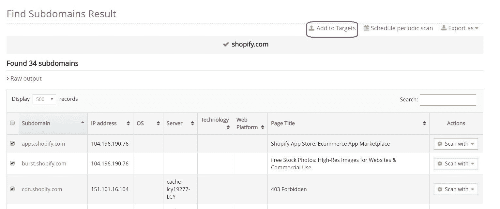
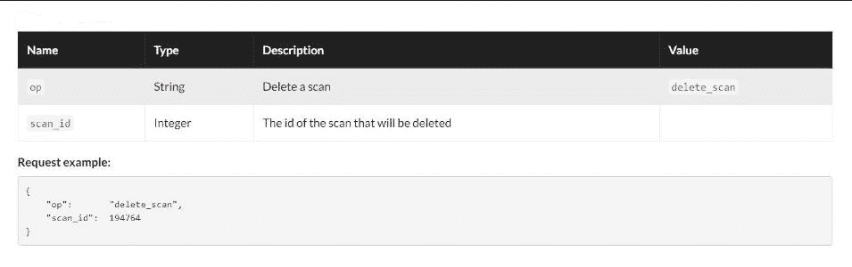
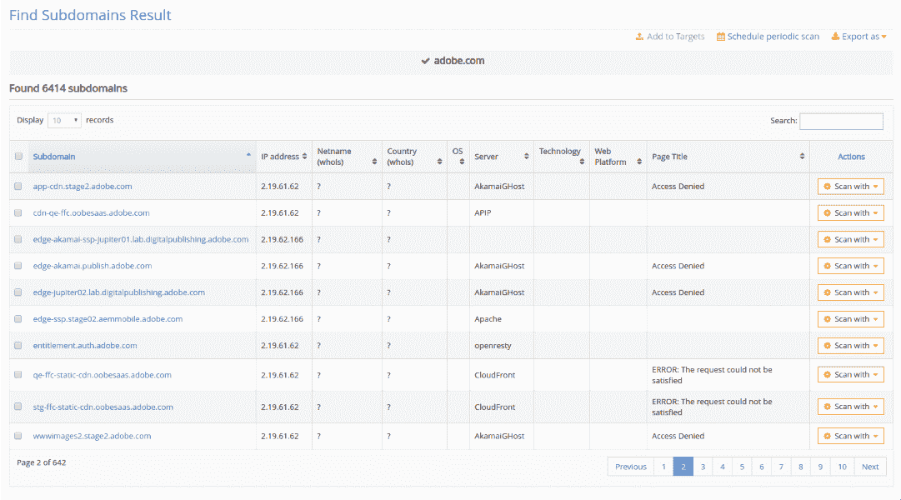
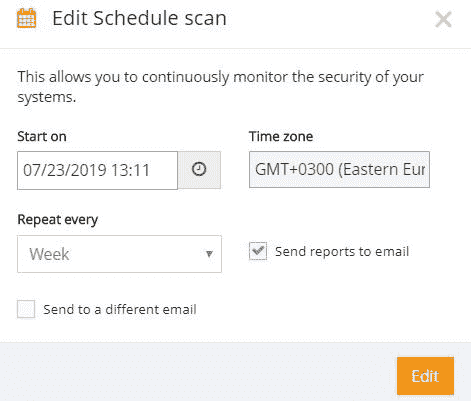
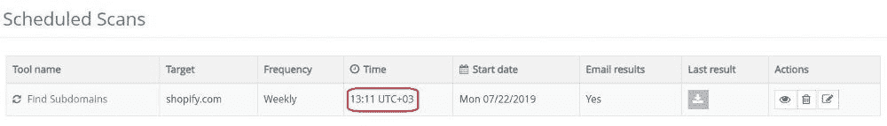

# 通过 API 删除扫描，编辑预设扫描，以及更多改进| Pentest-Tools.com

> 原文：<https://pentest-tools.com/blog/delete-scans-api-platform-improvements>

这里是我们在当前更新中进行的 5 个平台改进，使 Pentest-Tools.com 成为您的 pentesting toolkit 的必备资产。

1.  根据工具结果创建目标

2.  删除扫描 API 函数

3.  在查找子域中查看大量结果

4.  编辑预设扫描

5.  修正了时区问题

现在，您可以从“查找子域”和/或“查找虚拟主机”工具显示的结果中添加新目标。这有助于您更快地对发现的子域和虚拟主机执行新的扫描。

为此，进入**扫描，**选择您想要查看结果的工具，然后点击您想要**添加到目标的工具。**

使用此平台更新**轻松创建新目标**和**执行新扫描**以发现潜在的安全风险！

## **2。删除 API 中的扫描**

对于 API 用户，我们添加了“[删除扫描](https://pentest-tools.com/api_reference#delete_scan)”功能，允许您在不再需要时以编程方式删除扫描结果。

为此，请使用 API 参考中提供的特定参数。

## **3。在查找子域中查看大量结果**

我们还改进了扫描结果在[查找子域](https://pentest-tools.com/information-gathering/find-subdomains-of-domain)工具中的显示方式。现在，您可以使用带有分页的干净界面来浏览扫描结果。

在更清晰、更简单的视图中可视化所有扫描结果**并获得聚合数据的即时概览。**

## **4。编辑预设扫描**

我们增加的另一个改进是选项**编辑一个预定扫描**而不删除它们。

为此，从仪表板中选择**调度器**，选择一个工具- >编辑，并选择您的偏好。

别忘了，你可以把扫描结果直接发到你的收件箱里！

## **5。修正了时区问题**

我们在日程安排系统中修复了一些错误，以改善时区向用户显示的方式。在**预设扫描**选项中，用户的时区现已正确配置。

了解平台功能，了解它们如何改善您的工作流程和扫描结果！