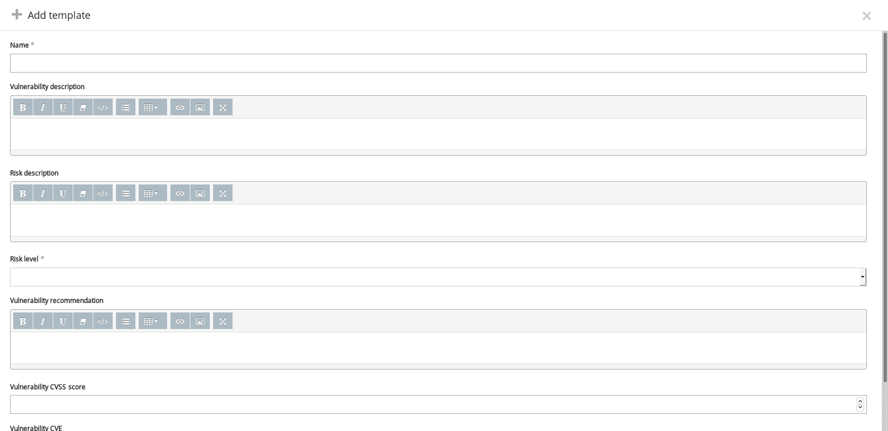

# 如何检测与 Pentest-Tools.com | Pentest-Tools.com 破认证

> 原文：<https://pentest-tools.com/blog/detect-broken-authentication>

OWASP Top 10 之所以成为行业标准是有原因的:因为它有令人难以置信的良好记录，并为努力确定漏洞优先级的安全专家提供了一个可靠的框架。

不管你的专长是什么——冒险、猎捕虫子等等。–你可以信赖这份清单。准备好全力以赴检测 OWASP 十大漏洞了吗？这里有一点帮助。

在我们的指南[如何用 Pentest-Tools.com](/blog/detect-injection-flaws)检测注入缺陷之后，是时候深入讨论一下被破坏的认证了。与专业的圣灵降临者[丹尼尔·贝切尼亚](/blog/authors/pentest-daniel)和[克里斯汀·角膜](/blog/authors/pentest-cristian)一起走过场。

## **有哪些被攻破的认证漏洞？**

虽然这是渗透测试中最容易验证的问题之一，但如果不解决，它可能会造成灾难。被破坏的身份验证有可能导致所有员工或客户(或两者)的大量个人信息(PII)泄露。)–所有这些都不需要攻击者利用技术上复杂的漏洞。它所需要的只是默认凭证或一个不强制进行身份验证的敏感页面。

身份验证失败是一种 web 应用程序安全缺陷，当身份验证和会话管理功能没有正确实现时就会出现这种缺陷。这使得攻击者能够危害和获取敏感数据，并接管有效帐户甚至整个应用程序。此漏洞的技术影响非常严重，因为攻击者可以访问合法用户可以访问的所有资源。

## **破解认证攻击的根本原因**

这种 web 应用程序风险的根本原因在于会话管理和密码安全问题。web 应用程序中身份验证漏洞最常见的来源是以正确的方式验证和管理会话的复杂性，以及没有强制执行密码策略。

此外，正如您在评估过程中可能经历的那样，许多开发人员出于多种原因而启用默认凭据，例如惰性、缺少适当的文档，或者只是忘记删除它们。不管是什么原因，这仍然会使他们的组织面临巨大的风险。

## **身份验证被破坏与其他 OWASP 问题有何不同？**

此漏洞最具挑战性的是 web 应用程序开发中使用的实践。使用弱凭据是如此普遍，以至于开发人员甚至没有意识到他们正在故意使 web 应用程序变得易受攻击。

密码和会话管理问题不受检查，安全审查也不总是规范的。大多数情况下，这种普遍的做法背后并没有恶意，但网络罪犯并不关心它是如何发生的，只要他们能够充分利用它。

## **为什么身份认证漏洞如此普遍？**

如果没有开发人员在开发、维护或实现应用程序时必须遵循的安全标准，大多数开发人员会默认使用最简单的方法来确保应用程序正常工作。这往往使安全性成为事后的想法，结果是攻击者的金矿。

对组织来说不幸的是——但对恶意行为者来说幸运的是——今天的大部分 web 应用程序都容易受到这个安全缺陷的攻击。

## **6 种常见的身份验证攻击**

创造力并不是网络罪犯所缺乏的，所以让我们回顾一下攻击者利用身份认证漏洞的主要原因。

### **证件塞**

凭据填充就像暴力攻击，在这种攻击中，您已经可以访问一个被破坏或受损的数据库。该策略包括针对 web 应用程序尝试各种被破坏的用户名和密码组合，以获得对帐户的访问权限。

当用户在不同的应用程序中设置相同的密码时，这种技术通常是有效的。

### **缺少或绕过认证**

当应用程序在身份验证过程中缺少重要的验证检查时，就会发生这种情况。

这里有一个例子:不比较用户(或攻击者)输入的密码和应用程序数据库中的密码。发生这种情况时，任何人都可以使用提供的用户名登录。

### **默认凭证**

我想知道为什么仍然启用“管理员/管理员”组合的人会问自己为什么会被攻破。*你不也是这么想的吗？*

默认凭证本身不是一个技术问题，而是系统管理员的疏忽，他们没有花时间去更改它们。后来，这变成了整个应用程序/系统的妥协。哎哟。

### **密码喷涂**

密码喷射是一种技术，在这种技术中，您试图使用一堆常用密码来访问大量用户帐户。

这不同于传统的暴力攻击，在传统的暴力攻击中，您试图获得对单个帐户的访问权限，这完全是大规模的妥协。

### **劫持认证会话**

这是一种攻击技术，在获取、猜测、反向工程或生成目标用户的会话 ID 后，您可以控制目标用户的会话，从而导致完全的身份模拟。

### **认证会话固定**

这在某种程度上与会话劫持相反。

会话固定是一种 web 应用程序攻击，在这种攻击中，您可以使用已从应用程序注销的用户的会话 ID 登录，但其操作不会失效。

虽然有很多方法可以利用这个漏洞，但您的工作是找到并报告它。因此，当您在清单上找到这一项时，请检查一下这个时间有效的策略，使用[Pentest-Tools.com](https://pentest-tools.com)扫描默认和弱凭据。

登录您的 Pentest-Tools.com 帐户。

在工具下，检查网络应用测试菜单，选择[网站扫描](https://pentest-tools.com/website-vulnerability-scanning/website-scanner)。

在扫描仪的配置中，设置你的目标网址。选择“完全扫描”选项。不要添加任何身份验证方法，因为您的目标是找到未经授权就可以访问的资源。如果您想有效地利用时间，请选择在扫描完成时收到电子邮件通知。

扫描仪完成扫描后，您可以浏览结果并检查“找到的有趣文件”,以查看哪些文件/文件夹可以在未经身份验证的情况下访问。

除了发现与您的目标相关的身份验证问题，您还可以发现来自同一平台的默认、易受攻击的用户名/密码组合。

以下是如何做到这一点:

登录您的 Pentest-Tools.com 帐户。

在工具下，检查[密码审计工具](https://pentest-tools.com/network-vulnerability-scanning/password-auditor)的基础设施测试菜单。

在密码审计器–查找弱凭据配置中，设置您的目标 URL。选择“使用来自目标 URL 的端口”选项。对于服务，只选择“HTTP”。确保为用户名设置了“常用用户名(默认)”，为密码设置了“常用密码(默认)”。此外，您可以选择在扫描完成时收到电子邮件通知。这么容易，这么快！

为像身份认证被破坏这样频繁出现的问题编写一份报告只需几分钟的时间。因为您有大量的工作要做，所以我们提供了一种方法来使您的工作流程更顺畅、更有效。

我们来快速分解一下。

登录到您的 Pentest-Tools.com[账户](https://pentest-tools.com/login)后，使用**报告**功能选择并包含您希望传达给客户或同事的调查结果。

对于最常见的身份验证漏洞，您可以使用我们的**预定义报告模板**。它们预先填充了关于您的发现的重要细节(漏洞描述、风险级别、建议、CVE 分数)，因此您可以**节省数小时的手动工作**。

这些与中断的身份认证相关的现成调查结果模板包括:

如果您对您的报告有特定要求，您还可以:添加您自己的调查结果，创建您自己的模板，并在导出报告之前使用特定信息对其进行编辑。

<template x-if="showVideo"></template>

### **如何创建包含被破坏的认证漏洞的可重复使用的模板**

连接到您的 Pentest-Tools.com 帐户。

在“报告”菜单下，选择“查找模板”。

在“查找模板”页面上，您可以添加新的损坏的身份验证模板。

在添加模板页面，您可以根据需要编辑漏洞描述、风险描述、风险等级、漏洞建议、漏洞 CVSS 评分、漏洞 CVE。很容易**修改和定制这些部分**，以包括链接、代码片段、截图、表格和其他有用的元素。

设置好模板后，您将能够在今后的几乎每个 pentest 项目中使用它们。

## **如何防止破解认证漏洞**

您可以采取各种措施来防止这类 OWASP 十大漏洞。

首先，确保**在您的应用中实施强密码安全策略和会话管理策略**。通过这种方式，每当用户在其中为自己的帐户设置密码时，该应用程序都会强制用户设置一个强而不常用的密码。

此外，**将会话限制在特定的持续时间内**，并且只允许有限数量的同时会话。除此之外，遵循这些准则也非常有帮助:

*   在 web 应用程序中实现强力保护，如速率限制或帐户锁定

*   强制执行一个强而不常用的密码策略

*   教育用户关于[网络钓鱼](/blog/how-to-simulate-phishing-attacks-with-http-request-logger)、社会工程和凭证收集攻击的知识

*   限制同一用户同时登录的次数

*   在密码更改、帐户禁用和注销后，使会话 cookies 无效。

## 系统管理员如何修复该漏洞？

系统管理员可以通过两种方式防止利用此漏洞:

## **关键要点**

*   检查并应用所有敏感端点的会话验证。

*   使用[Pentest-Tools.com](https://pentest-tools.com)扫描弱的和默认的凭证，为开发人员和系统管理员提供需要处理的优先级列表

*   确保所有系统和所有用户都正确执行您的密码策略。

***注***:[Pentest-Tools.com 渗透测试仪 Daniel Bechenea](https://www.linkedin.com/in/danielbechenea/) 也对本分步指南有所贡献。