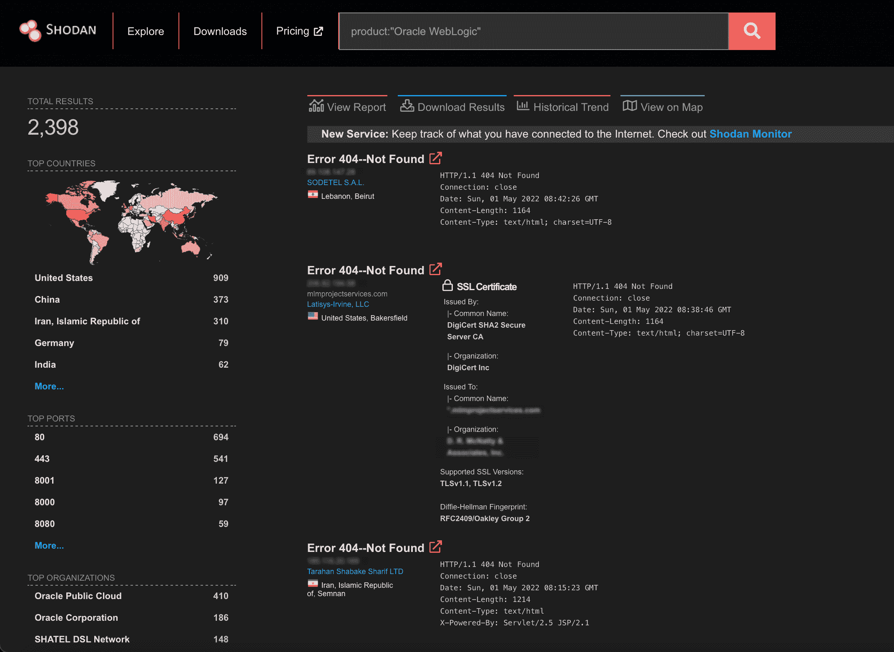

# 如何在 Oracle WebLogic Servers | Pentest-Tools.com 中手动检测 CVE-2022-21371

> 原文：<https://pentest-tools.com/blog/detect-cve-2022-21371-oracle-weblogic-servers>

如果您一直在思考更好的方法来发现系统中的关键漏洞，您并不孤单。

作为一名安全研究人员，我花了大部分时间来了解它们的根本原因及其对组织的潜在影响，努力帮助其他安全专家有效地传达它们。

在我详细解释了几个月前在 [Oracle WebLogic Server](/blog/detect-exploit-oracle-weblogic-rce-2020) 中发现的本地文件包含之后，另一个影响相同 Oracle 技术的漏洞激起了我的好奇心: **CVE-2022-21371** 。

让我们来分解这个漏洞，并找出如何有效地报告它。

## 什么是 Oracle WebLogic Server CVE-2022-21371？

[CVE-2022-21371](https://nvd.nist.gov/vuln/detail/CVE-2022-21371)(cvss v3 7.5)漏洞使得远程攻击者能够在 Oracle WebLogic Server 内部执行**目录遍历攻击**。

在我们进入更多的技术细节之前，让我们了解一下什么是 WebLogic server。它是一个 Java 应用服务器，用于开发、集成、部署和管理大规模分布式 web 应用程序、网络应用程序和数据库应用程序。

它将 Java 的动态功能和 Java 企业标准的安全性引入到广泛的 web 应用程序的开发、集成、部署和管理中。

## CVE-2022-21371 如何工作

该漏洞是由于处理 URL 中的破折号时的**输入验证错误** r 造成的。攻击者可以远程发送一个特制的【HTTP 请求和**读取系统上 web 应用**的部署描述符。这包括应用程序代码和数据、凭证和[部署描述符元素](https://docs.oracle.com/cd/E24329_01/web.1211/e21049/weblogic_xml.htm#WBAPP577)，这使得该漏洞成为 WebLogic Server 的真正威胁。

## 易受攻击的 Oracle WebLogic 版本

据 [NIST](https://nvd.nist.gov/vuln/detail/CVE-2022-21371) 介绍，此 CVE 影响 Oracle WebLogic Server 版本 12.1.3.0.0、12.2.1.3.0、12.2.1.4.0 和 14.1.1.0.0。

## CVE 的商业影响-2022-21371

如果攻击者能够访问易受攻击的系统，他们可以从 WebLogic 服务器读取敏感数据。例如，坏人可以访问配置文件，甚至进一步检查整个系统的结构和架构。

## 如何找到易受 CVE 攻击的目标-2022-21371

您可以使用 Shodan 搜索引擎和过滤器**产品:“Oracle WebLogic”**在互联网上查找暴露的目标。通过这个查询，我们在撰写本文时找到了 2，398 个结果。

另一个选择是尝试 PublicWWW 并搜索 **WebLogic 控制台**来找到潜在的易受攻击的目标。当我们发布这个指南时，这个搜索引擎显示了 848 个结果。

## 如何在道德黑客活动中手动检测 CVE-2022-21371

想知道如何手动检测这种高危 CVE 吗？

首先，**使用此特定列表中的一个易受攻击的端点向 Oracle WebLogic 发送 HTTP GET 请求**:

。//META-INF/清单。MF
。//WEB-INF/web.xml
。//WEB-INF/portlet.xml
。//WEB-INF/weblogic.xml

curl ' https:// **<主机>**'-请求-目标.//WEB-INF/weblogic.xml "

由于“.”，curl 的**–request-target**参数是必需的开始的时候。URL 是无效的，因为它不是以'/'开头的，并且，通过阅读 curl 手册，我们发现这个参数允许我们尝试另一个路径。

此 HTTP GET 请求可让恶意参与者访问 weblogic 服务器内部的 **weblogic.xml** 文件的内容。

该文件包含 WebLogic Server 中特定于部署的元素的完整引用。例如，**security-role-assignment**元素声明了 web 应用程序安全角色和 WebLogic Server 中的一个或多个主体之间的映射。 **run-as-role-assignment** 元素将 **web.xml** 中的 **run-as** 角色名( **servlet** 元素的子元素)映射到系统中的一个有效用户名。网络罪犯可以利用所有这些信息发起新的攻击，并获得关键基础设施的访问权限。

## 如何缓解 Oracle WebLogic 服务器中的 CVE-2022-21371

我们建议尽快将易受攻击的 WebLogic 服务器升级到最新版本，并确保遵循来自 [Oracle 关键补丁更新顾问](https://www.oracle.com/security-alerts/cpujan2022.html)的指导方针，以确保系统可以安全使用，并且攻击面仍在控制之下。

我们会很快听说 Oracle WebLogic Servers 中其他可利用的漏洞吗？

时间会证明一切。

作为攻击性安全专家，我们可以专注于帮助组织实施缓解措施，并将其集成到业务优先级中。通过这种方式，他们可以限制恶意行为者试图利用此类漏洞的机会，并控制攻击面。

请相信我们，我们会以有益的测试指南的形式继续分享我们的研究，提高您的道德黑客技能。