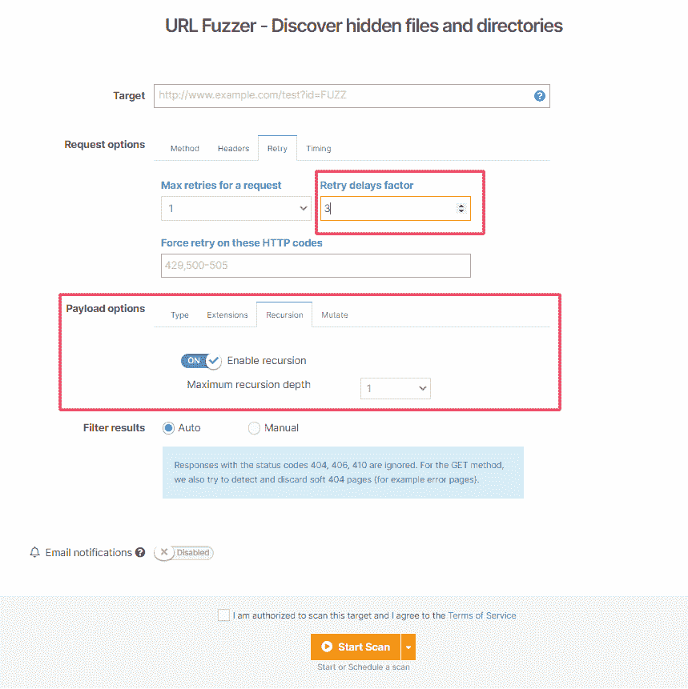

# 检测关键简历，扫描统计+更多更新| Pentest-Tools.com

> 原文：<https://pentest-tools.com/blog/detect-cve-scan-stats-july-august-updates>

如果你度过了一个紧张的夏天，那我们也一样。我们努力推出新的有用的更新，所以让我们来分解一下:

1.  使用新的网络扫描仪模块检测到 4 个关键的高风险 CVE(T2)

2.  **控制 URL Fuzzer 中请求之间的延迟**&递归选项

3.  使用新的网站扫描仪获取**扫描统计数据**

4.  按需运行**预设扫描**

5.  通过我们的 **API** 使用 **HTTP 请求记录器**

6.  使用 **CIDR 符号**添加目标

7.  在 WordPress 扫描仪中启用更多的**枚举选项**

让我们打开它们吧！

## **1。使用我们从头构建的新检测模块检测 4 个关键 cv**

当您对您的目标运行我们的网络漏洞扫描程序时，它们还会检查:

使用带有 OpenVAS 的[网络漏洞扫描器中的**全扫描**选项，并在**结果**中查看扫描结果。](https://pentest-tools.com/network-vulnerability-scanning/network-security-scanner-online-openvas)

## **2。控制请求之间的延迟，并使用 URL Fuzzer** 进行递归搜索

现在，您可以选择使用 URL Fuzzer 来控制 HTTP 请求之间的延迟。要成倍增加延迟，请确保**添加多达 120 次重试延迟/请求**。

如果你需要用 URL Fuzzer 验证有效负载，你现在可以自动地在你已经发现的所有目录中运行递归搜索。

进入[网址模糊器](https://pentest-tools.com/website-vulnerability-scanning/discover-hidden-directories-and-files)，添加你的网址**目标**，选择**有效载荷选项、**并启用**递归**。您可以设置最大 **3 递归深度级别/有效载荷。**

以下是这两个选项的快照:

## **3。使用新的网站扫描器**获得关于您的目标的具体扫描统计数据

我们的新网站扫描仪的扫描结果带有更丰富的摘要部分！

当你用我们专有的网站扫描器扫描你的 URL 目标时，你**会得到详细的、特定的扫描统计数据**，比如抓取的 URL、HTTP 请求总数、错误计数、检测到的注入点等等。

看看这个:

## **4。按需运行预设扫描**

我们增加的另一个改进是在您需要的时候可以选择**运行预定扫描**。

为了保持工作的灵活性和高效性，从仪表板中选择**调度器**，选择工具名称并**运行**特定扫描。

## **5。HTTP 请求记录器可用的 API 支持**

这个最新的平台更新允许您通过 API 以编程方式创建 HTTP 处理程序。使用特定的参数，您可以自动扫描并节省宝贵的时间。

## **6。使用 CIDR 符号添加目标**

在 Pentest-Tools.com 上，我们现在支持 **CIDR(无类域间路由)符号**，它允许你相应地添加你的 IP 目标(例如:192.168.1.0/24)。

## 7。WordPress 扫描仪提供更多枚举选项

WordPress 漏洞扫描器现在可以搜索**配置备份、数据库导出或 TimThumbs！**

添加你的 URL 目标并选择特定的枚举选项，在 WordPress 站点中发现有趣的发现。

[登录使用更新](https://pentest-tools.com/login)