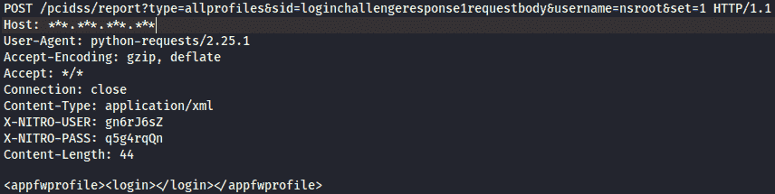
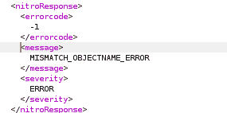
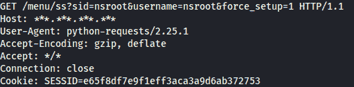
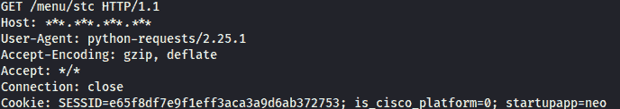
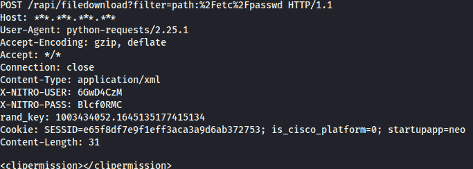
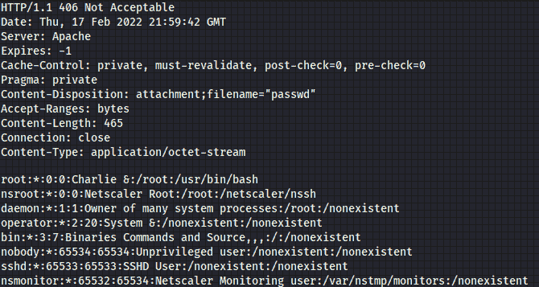
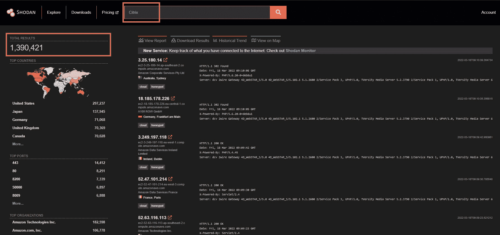
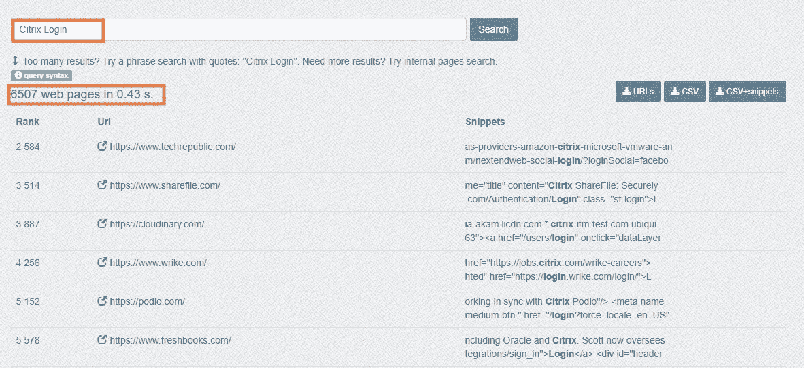

# 如何检测和利用 Citrix ADC 和 Citrix Gateway(CVE-2020-8194)| Pentest-Tools.com

> 原文：<https://pentest-tools.com/blog/detect-exploit-citrix-cve-2020-8194>

可以说，Citrix 系统非常受欢迎，甚至很有名。他们甚至赞助 f1 车队！但是尽管他们声名狼藉，他们在他们的设备上使用 FreeBSD 操作系统，在 web 服务上使用普通的 PHP，所以我很容易地访问了代码并对其进行了分析。

2019 年，Citrix 系统中名为 [CVE-2019-19781](https://cve.mitre.org/cgi-bin/cvename.cgi?name=CVE-2019-19781) 的未经认证的远程代码执行为全球企业带来了数据泄露的高风险。修补后，在随后的安全评估中发现了另一个关键漏洞——CVE-2020-8194。这让我很好奇，所以我去寻找细节。

## 什么是 CVE-2020-8194？

该漏洞**允许未经验证的用户在 Citrix 服务器**上上传、下载和创建目录。它由思杰公司与其他简历一起发布，如 [CVE-2020-8191](https://nvd.nist.gov/vuln/detail/CVE-2020-8191) 、 [CVE-2020-8193](https://nvd.nist.gov/vuln/detail/CVE-2020-8193) 、 [CVE-2020-8195](https://nvd.nist.gov/vuln/detail/CVE-2020-8195) 、 [CVE-2020-8196](https://nvd.nist.gov/vuln/detail/CVE-2020-8196) 。

[CVE-2020-8194](https://nvd.nist.gov/vuln/detail/CVE-2020-8194) 是*特别是*特别，因为它与**反射[代码注入](https://pentest-tools.com/blog/detect-injection-flaws)** 的概念一起工作，并允许恶意行为者修改下载的文件。

在谷歌上快速搜索，我们看到有 2000 多种设备，任何人都可以接触到。但是，我们无法找到受影响系统的数量，因为它受到 Citrix 的良好保护。

## **Citrix 反射代码注入漏洞的工作原理**

如果没有获得系统用户的有效会话，这个漏洞就不会被利用。

那么，我们如何获得它呢？这是一个*未经认证的*漏洞吧？

为此，首先，我们必须向`/pcidss/report`端点发送一个带有一些特殊参数的`POST`请求:

如你所见，对于 **Nitro 用户和 PASS 头**，我们使用了一些随机值，作为数据，我们发送了`<appfwprofile><login></login></appfwprofile>`来触发登录并给我们一个新的会话。

对于 POST 参数，我们发送`type=allprofiles`，一个`sid=loginchallengeresponse1requestbody`，作为用户我们说`nsroot`，最后一个参数是`set=1` **。**我们应该得到一个如下所示的 nitro 错误响应:

### 为什么要使用这些参数？

我们必须绕过一些检查来创建一个有效的会话，而不需要凭据。因此，要做到这一点，我们需要找到一个函数，可以帮助我们。

环顾四周，发现`pcidss.php`中有一个函数叫`report` 。这个和报告有关，进一步看，我们看到一个有趣的案例叫做`allprofiles`。

如果这个函数有一个 set 参数，它将触发 init()函数来创建一个会话。它实际上创建了一个会话，即使你没有任何凭证，你只需要绕过一些检查。

一个非常重要的注意事项是，它会在 URL 中搜索以查看`loginchallengeresponse`是否存在。之后，它在`&`之后拆分 params，然后寻找`requestbody` **。**

如果我们像截图中那样发送所有数据，我们应该会得到之前提到的 nitro 错误，这意味着我们可以进行下一步了。

### 但是，等等，还有更多！

事实证明，我们之前获得的有些有效的会话并不那么有效。为了成功登录，我们可以滥用强制登录。为此，我们必须向`/menu/ss`端点发出一个`GET` 请求，用`sid`参数、`username` **、**和最重要的部分用`force_setup`参数设置。

作为回应，我们应该得到一个 302 代码，一切都应该工作顺利。

下一步是为我们的会话获取一个随机数，以使其有效。这可以通过向**/菜单/标准**端点发出以下请求来轻松完成:

### 我们能利用这些新信息做什么？

我们现在有了一个有效的会话 id 和随机数，我们将把它添加到我们的请求中，我们可以开始从服务器读取一些文件。我们可以通过以下方式实现:

下面是输出的样子:

手动做起来有点复杂，但它确实有效！使用简单的 bash 命令，比如 curl，很痛苦，但是使用 Python 脚本也很困难。除了这些方法，我们可以使用[Pentest-Tools.com](https://pentest-tools.com/)，而不需要处理大量的命令和脚本。

## **易受攻击的版本**

此漏洞存在于 13.0-58.30、12.1-57.18、12.0-63.21、11.1-64.14 和 10.5-70.18 之前的 Citrix ADC 和 Citrix Gateway 版本中。

## **CVE-2020-8194 的业务影响**

对于客户来说，此漏洞非常重要，因为它允许攻击者跨设备读取敏感数据并在系统上写入文件。后一个问题在某种程度上受到新创建的用户会话可以访问的路径的限制，但是在很多地方都允许读取文件，这有助于您转储私钥，并使您的完全访问更加可信。

## **如何找到易受 CVE 攻击的目标-2020-8194**

您可以使用`product:Citrix`在 Shodan 上进行搜索，它会生成 1，390.421 个结果。

你也可以免费使用 [Google Dorks](https://pentest-tools.com/information-gathering/google-hacking) 进行`intitle:”Citrix Login”` 查询，在撰写本文时显示 2150 个结果。

此外，使用 **Citrix 登录**查询，可以在 **Publicwww** 上找到很多结果。

## **如何缓解 CVE-2020-8194**

您可以遵循并应用 Citrix 的这些指南，尽快为您的系统打补丁。此外，您可以尝试使用代理过滤对系统的请求。

如果您无法修补您的系统，我们建议限制对产品管理界面的访问。

## **安全研究就像一盒巧克力**

你永远不知道你会发现什么！

这个漏洞让安全专家们大吃一惊，因为他们是在检查旧安全问题的补丁时发现的。

CVE-2020-8194 是在对解决 [CVE-2019-19781](https://cve.mitre.org/cgi-bin/cvename.cgi?name=CVE-2019-19781) 的补丁版本进行安全评估时发现的。

公司受到了影响，因为恶意行为者可以在没有任何许可的情况下进入他们的网络，并使用他们的访问权限来窃取数据。

这种漏洞可以在 bug bounty 程序中识别，使用安全工具进行扫描以找到潜在的攻击媒介。

我们的 Pentest-Tools.com 安全研究团队已经审查了该漏洞，并使客户能够在安全评估期间检测和报告该漏洞，以使公司意识到这些缺陷和其他安全问题。

这个测试指南有多大帮助？让我们知道您的想法，并分享您希望我们探索的任何具体内容。

请相信我们会提供更多*实用且有用的测试指南，您可以直接从收件箱中获得！*