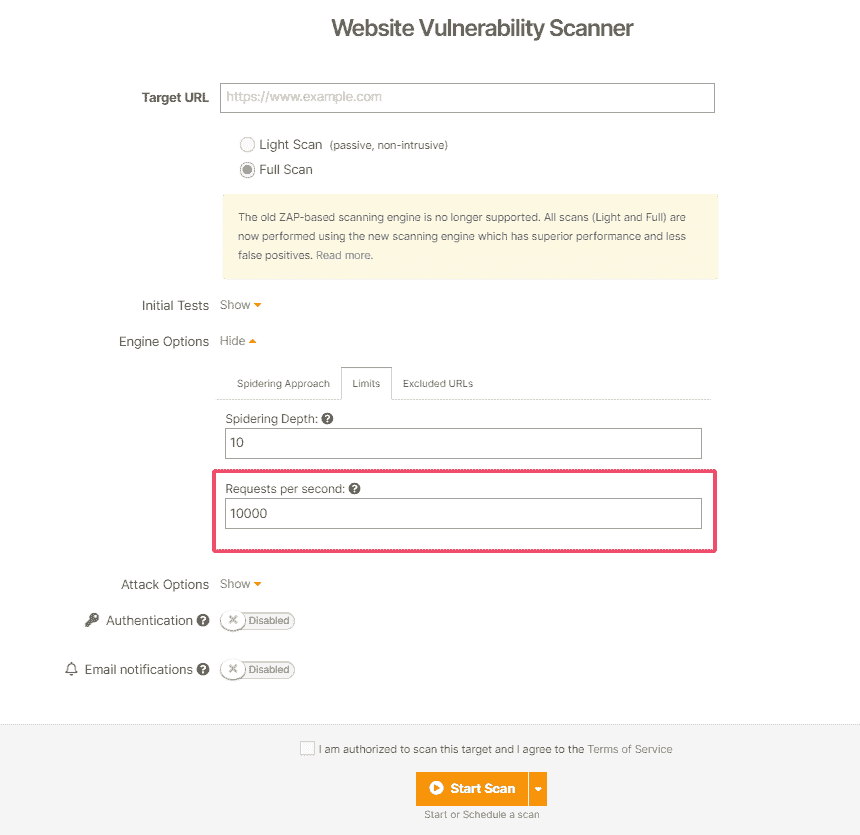
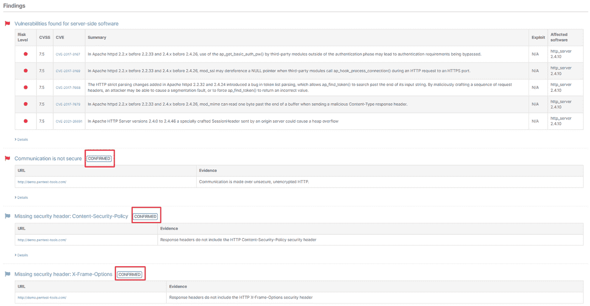
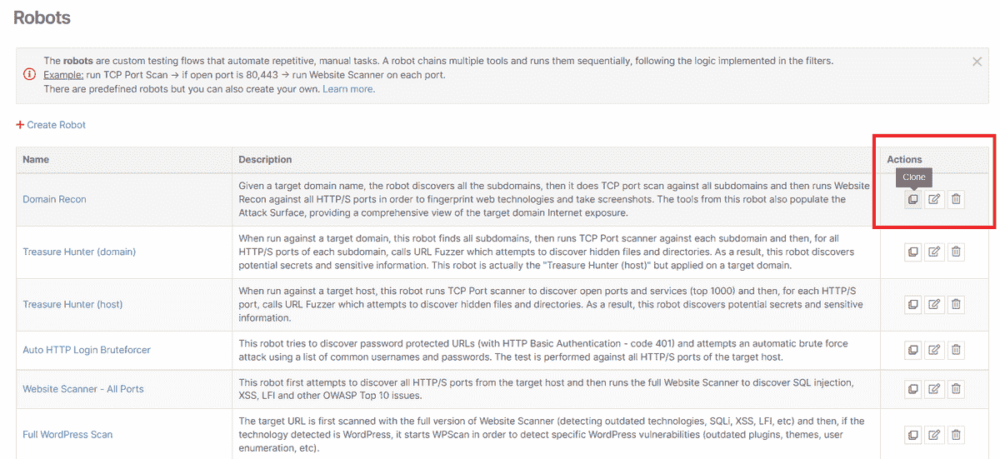

# 检测和利用最新的 CVEs +更多自动化更新| Pentest-Tools.com

> 原文：<https://pentest-tools.com/blog/detect-exploit-cves-automation-updates>

“[棒极了，变得更好](https://www.g2.com/products/pentest-tools-com/reviews/pentest-tools-com-review-4553978)”是我们在 Pentest-Tools.com 推出的每个月更新的承诺。

下面是我们部署的 6 个最新更新，旨在让您的安全测试流程*更加轻松、灵活和高效:*

1.  **使用网络扫描器检测 4 种新的高风险 CVE 病毒**

2.  在< 2 分钟内用狙击自动探测仪开发 3 个关键 cv

3.  **控制网站扫描器中的请求/秒限制**

4.  **自动验证**网站扫描仪**发现**获得确认标签

5.  在 Pentest-Tools.com 克隆 pentest 机器人

6.  **手动重置**你的 Pentest-Tools.com**API 键**

让我们深入细节吧！

## **1。用网络扫描仪检测 4 个广泛传播的 cv**

我们的漏洞研究团队夜以继日地工作，为最新的高影响漏洞嵌入新的检测模块。

针对您的目标运行我们的网络漏洞扫描程序，并检查:

*   vCenter server 中的关键 **VMware RCE** 漏洞—[CVE-2021-21985](https://nvd.nist.gov/vuln/detail/CVE-2021-21985)

*   微软交换服务器 RCE 的入口点(**代理服务器**)–[CVE-2021-31195](https://nvd.nist.gov/vuln/detail/CVE-2021-31195)

*   **VMware 的 vRealize Operations Manager API 中的 SSRF 漏洞**–[CVE-2021-21975](https://cve.mitre.org/cgi-bin/cvename.cgi?name=CVE-2021-21975)

*   **现代事件日历 Lite WordPress 插件中未认证的事件**–[CVE-2021-24146](https://cve.mitre.org/cgi-bin/cvename.cgi?name=CVE-2021-24146)

使用带有 OpenVAS 的[网络漏洞扫描器的**全面扫描**选项，获得一份包含详细调查结果的现成报告。](https://pentest-tools.com/network-vulnerability-scanning/network-security-scanner-online-openvas)

## **2。自动利用&用狙击手确认 3 个关键 cv**

如果你还没有尝试过，借此机会看看 [**狙击自动攻击者**](https://pentest-tools.com/exploit-helpers/sniper) 如何在 2 分钟内对最近的关键漏洞进行验证、攻击和后期攻击**。**

在您的目标上自动运行完整的利用序列，并验证:

*   VMware vCenter 服务器中的 **RCE 漏洞**—[CVE-2021-21972](https://cve.mitre.org/cgi-bin/cvename.cgi?name=CVE-2021-21972)

*   亚特兰蒂斯融合服务器中的 **OGNL 注入 RCE**—[CVE-2021-26084](https://cve.mitre.org/cgi-bin/cvename.cgi?name=CVE-2021-26084)

*   多台 Azure Linux 机器中的**未经认证的奥米戈德·RCE**漏洞 [CVE-2021-38647](https://msrc.microsoft.com/update-guide/vulnerability/CVE-2021-38647) ，以及其他十几个广泛存在的安全漏洞。

[**现在试试狙击**](https://pentest-tools.com/exploit-helpers/sniper)

## **3。使用网站扫描器限制每秒的请求数量**

现在，您可以选择控制每秒通过网站扫描器发出的最大请求数。

进入 [**网站漏洞扫描器**](https://pentest-tools.com/website-vulnerability-scanning/website-scanner) ，添加你的 URL **目标**，选择**引擎** **选项，**选择**限制**。在那里，您可以设置每秒 10.000 个请求的最大值。

它看起来是这样的:

## **4。自动验证的网站扫描器发现获得确认标签**

当你用我们专有的[网站扫描仪](https://pentest-tools.com/website-vulnerability-scanning/website-scanner)、**扫描你的目标时，发现的结果会被自动验证**并获得一个特定的标签。

每个发现都标记为**已确认**，这样您就可以轻松选择感兴趣的发现，并将其包含在最终的 pentest 报告中。

看看这个:

## **5。克隆预定义或自定义的 pentest 机器人**

如果你是我们 [pentest robots](/blog/pentest-robots-automation-feature) 自动化功能的重度用户，你现在可以克隆一个预定义的 pentest 机器人或任何你已经建造的机器人。

去你的 pentest 机器人那里，点击**动作**选项卡中的**克隆**按钮，并在你需要的时候使用它——编辑它，改进它或与你的团队分享它。

[**克隆一个机器人**](https://pentest-tools.com/features/pentest-robots)

## **6。手动重置您帐户上的 API 密钥认证**

从你的 Pentest-Tools.com 账户，你现在可以**手动重置你的 API 密钥**。

为此，进入**我的账户**，选择**计划详情**，点击**重置 API 密钥**按钮。

[**登录使用更新**](https://pentest-tools.com/login)

## **走之前**

仅在上个月，我们就在 Sniper 和我们的网络扫描仪中添加了 6 个新的自动开发和检测模块，并且速度正在加快。

你想知道我们什么时候发布新的产品而不需要等待每月的平台更新吗？当新的简历被整合到 Pentest-Tools.com 时，您会收到电子邮件通知。

[**给我报名**](https://pentest-tools.us16.list-manage.com/subscribe?u=e04d195b99ece443048117e10&id=3819299c16)