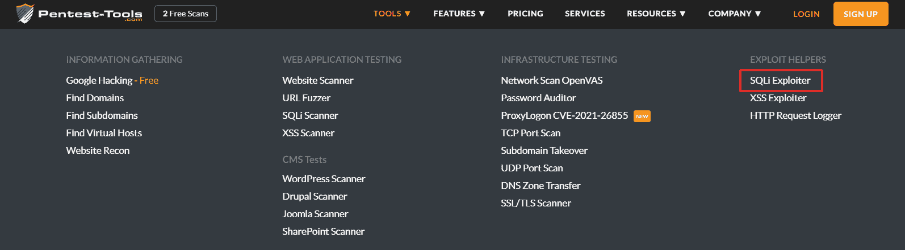

# 如何用 Pentest-Tools.com 检测注塑缺陷| Pentest-Tools.com

> 原文：<https://pentest-tools.com/blog/detect-injection-flaws>

无论你是渗透测试者、bug 赏金猎人还是安全专家，你可能都熟悉所有影响 web 应用程序的 [OWASP 十大漏洞](https://owasp.org/www-project-top-ten/2017/)。

早在顶级安全漏洞出现之前，这些基本的安全漏洞就已经是网络罪犯工具箱的一部分了。然而，它们仍然困扰着世界各地使用的产品、企业和技术。

因为我们致力于让您的工作更轻松，所以我们发布了可操作的指南，指导您如何使用我们构建并集成到[Pentest-Tools.com](https://pentest-tools.com)中的工具和功能来检测 OWASP 十大漏洞。

让我们深入探讨一下**注入缺陷**，这是十多年来(自 2010 年以来)一直占据 OWASP 十大安全漏洞的头号类别，因为它们**可以存在于*任何*类型的技术**中。下面看看这涉及到什么。

## **什么是注入漏洞？**

也被称为[代码注入](https://owasp.org/www-project-top-ten/2017/A1_2017-Injection)，这类漏洞发生在攻击者向 web 应用程序发送无效数据，让它做一些最初没有被编程或设计的事情。

根据 OWASP——以及我们自己的经验——注入缺陷比比皆是，特别是在没有从现在是最佳实践的开发方法中受益的旧软件中。

> 注入缺陷非常普遍，尤其是在遗留代码中。注入漏洞通常出现在 SQL、LDAP、XPath 或 NoSQL 查询、操作系统命令、XML 解析器、SMTP 头、表达式语言和 ORM 查询中。

您可以利用这种类型的漏洞来触发易受攻击的 web 应用程序中的异常行为，例如绕过登录机制或泄漏敏感信息。

## **注入攻击的根本原因**

注入攻击的根本原因是在应用层和服务器端获取和处理用户输入生成的数据时缺乏数据验证和数据净化。

尤其危险的是**这种漏洞可能存在于任何类型的技术中**。任何可编程并接受参数作为输入的东西都可能容易受到代码注入攻击。

## 代码注入与其他 OWASP 问题有何不同？

这类漏洞的一个特别之处在于，服务器不需要任何身份验证来处理数据，这使得它成为所有 OWASP 十大漏洞中最普遍的一个。

即使乍一看，它似乎是合法的，并被服务器或网页所接受，但其核心数据是恶意的，并被编程为运行不同的无限制命令，从而损害系统。相比之下，其他漏洞可能缺乏这种隐蔽的能力。

## **为什么代码注入如此普遍？**

有两个原因:因为数据最初没有从命令和查询中分离出来，也因为没有默认激活的服务器端验证。

正如您所料，恶意黑客一直在寻找这个漏洞，因为这是一个金矿，给了他们大量的机会进行攻击。

现在基础已经就绪，让我们来看一看规范它们的代码注入技术——以及它带来的“味道”。

## **SQL(结构化查询语言)注入**

### **什么是 SQL 注入？**

这是应用程序执行带有用户可控参数的 SQL 查询时最常见的代码注入技术。如果在数据库中成功执行，攻击者就可以窃取或修改数据库中的数据。

下面是一个易受攻击的代码示例。

你能发现易受攻击的线路吗？
*更何况你能想象这样被剥削的影响吗？*

```
user = request.POST['user']
password = request.POST['password']

query = "SELECT id from USERS where user='" + user + "' AND password='" +
password + "'"

database.execute(query)
```

当你准备好了，你可以探索[攻击者利用注入漏洞危害你的数据库的四种方式](/blog/sql-injection-attacks)。

### **SQL 注入的类型**

您在工作中肯定会遇到这四种类型的 SQL 注入攻击:

1.  基于错误的 SQL 注入

2.  基于联合的 SQL 注入

3.  盲目 SQL 注入

4.  带外 SQL 注入

如果你想学习如何手动利用这个漏洞*，请查看我们关于[常见 SQL 注入攻击](/blog/sql-injection-attacks)的指南。*

*但是，如果您处于工作流程中希望节省大量时间和精力的阶段，请继续阅读，看看如何利用我们的平台快速跟踪检测和利用。*

*1.登录您的 Pentest-Tools.com 帐户。*

*2.在工具下，找到 Web 应用程序测试菜单并选择 [SQLi 扫描仪](https://pentest-tools.com/website-vulnerability-scanning/sql-injection-scanner-online)。*

* 3。在 SQLi 扫描器配置中，设置您的目标 URL。如果您正在进行验证扫描，请添加验证 cookies。扫描完成后，您还可以收到电子邮件通知。*

* 4。扫描结束后，转到扫描并在列表顶部找到结果。在这个例子中， [SQL 注入扫描器](https://pentest-tools.com/website-vulnerability-scanning/sql-injection-scanner-online)发现了一个 SQL 注入问题。单击单个问题可查看“详细信息”选项卡，该选项卡提供了每个漏洞的详细信息，包括风险描述和建议。*

**

*有了这些信息，是时候开始开发了。在这个阶段，不需要查看您的工具包，因为您可以从用于识别 SQL 注入病毒的同一个平台上利用它们。*

*要快速有效地行动，你需要做到以下几点:*

*1.登录您的 Pentest-Tools.com 帐户。*

*2.在“工具”下，查看“开发助手”菜单并选择 [SQLi Exploiter](https://pentest-tools.com/exploit-helpers/sqli-exploit-tool-sqlmap-online) 。*

* 3。在 SQLi Exploiter 配置中，设置您的目标 URL。如果您正在运行验证扫描，请添加验证 cookies。如果您想在扫描完成时收到电子邮件通知，请选中该选项。*

* 4。扫描完成后，转到扫描菜单，在列表顶部查看结果。在本例中，SQLi 攻击者发现了一个 SQL 注入问题。单击“Raw output ”,查看该工具执行的测试的完整列表。*

**

*现在，您已经完全掌握了漏洞的相关信息，以及恶意黑客可以利用它们来达到其邪恶目的的证据。是时候在一份有说服力的报告中与客户或同行分享你的发现了。*

*在您开始搜索模板之前，以下是如何使用相同的平台简化这部分工作流程的方法。*

*当您使用 Pentest-Tools.com 发现一个易受 SQL 注入攻击的应用程序时，您可以使用我们现成的报告模板进行报告:*

* **下面是如何充分利用它的方法:***

*1.转到菜单中的查找结果，选择报告 SQL 注入的扫描，然后按报告按钮。*

* 2。基于您想要生成的报告，您有多个选项来导出结果，包括可编辑的 DOCX 渗透测试报告或 PDF 或 HTML 报告，以及多个过滤器。*

**

**

**

*如果您在“扫描”选项卡中，您可以将您的发现直接从该页面导出到 PDF、HTML、JSON、CSV 或 XLSX 格式的报告中，这是 pentester 的选择。*

### ***如何为包含 SQL 注入漏洞的未来项目创建可重复使用的模板***

*1.登录您的 Pentest-Tools.com 帐户。*

*2.在“报告”菜单下，选择“查找模板”。*

*3.在“查找模板”页面中，添加一个新的 SQL 注入模板。*

* 4。编辑基本字段以保存和重复使用您的最佳调查结果描述、风险详细信息和建议:漏洞描述、风险描述、风险级别、漏洞建议、漏洞 CVSS 分数、漏洞 CVE-基于您的特定需求。*

*虽然你很可能忙着检测网络应用中的 SQL 注入病毒，但还有其他类型的注入也值得你注意。*

*这里有一个快速演练。*

## ***OS(操作系统)注入***

*当应用程序根据用户提供的输入作为操作系统命令进行不安全调用以在系统级执行时，您可以检测到此问题。如果成功执行，您可以在易受攻击的应用服务器上运行任意操作系统命令。*

*下面是一个示例，展示了如何将任意命令与有效命令合并，以从服务器获得所需的输出:*

```
*`ping -c 5 127.0.0.1; whoami`*
```

*当您进入报告阶段时，Pentest-Tools.com 仪表板中还有一个操作系统命令注入模板，您可以开箱即用:*

* XPath 注入
这种类型的注入侧重于 XML(可扩展标记语言)查询语言。当您能够在 web 应用程序中控制或操作查询的一部分时，您就很可能能够绕过限制，读取未经授权的 XML 节点，等等。*

*在下面的示例中，您可以发送错误凭据的组合，并检索选定的 XML 节点。*

*输入:*

*用户: *pentest' or 1=1 或' a'='a*
通过: *pentest**

**FindUserXPath* 变成了▼*

```
 *`//Employee[User/text()='pentest' or 1=1 or 'a'='a' And
Password/text()='pentest']`*
```

*相当于▼*

```
*`//Employee[(User/text()='pentest' or 1=1) or ('a'='a' And
Password/text()='pentest')]`*
```

## ***服务器端模板注入***

*当应用程序使用模板引擎来呈现服务器端可读数据以供执行时，就会发生这种类型的注入。*

*如果你能控制传递给模板引擎的变量，那么你可能就能实现 SSTI(服务器端模板注入)。*

*因为服务器也接受逻辑和算术函数，所以您也可以操纵它的操作，如下所示。*

## ***LDAP(轻量级目录访问协议)注入***

*[LDAP 注入](/blog/log4shell-scanner-detect-cve-2021-44228)在目标 web 服务器不安全地获取一些用户输入来查询 LDAP 目录时发生。*

*您可以利用这个缺陷绕过限制，从资源中读取未经授权的数据，等等。*

*LDAP 注入看起来是这样的:*

*原查询:▼*

```
*`http://www.pentest-tools.com/search.aspx?name=Adi )(zone=public )`*
```

*恶意查询:▼*

```
*`http://www.example.com/people_search.aspx?name=Andy )(zone=* )`*
```

## ***如何防范注入漏洞***

*您可以采取一些具体的缓解措施来防止注射缺陷。*

*   *首先，确保在你的应用程序中包含数据验证机制。通过这种方式，进入服务器的每个数据片段都经过验证和彻底扫描，以确保其中没有任何恶意脚本。*

*   *尝试使用安全的 API 移动您的资产。它将完全避免使用解释器，并为您提供一个参数已经由服务器定义的接口，从而阻止攻击者对数据进行任何更改或插入恶意代码。*

*   ***启用服务器端验证**，但是请记住，它可能会破坏一些需要特殊字符的功能(如果没有正确实现)。在 SQL 注入攻击的情况下，您可以使用 LIMIT 和其他 SQL 代码来限制数据的暴露。*

## ***系统管理员如何修复这些注入漏洞***

*系统管理员可以通过在不同的用户角色之间划分对系统的访问来防止利用这些类型的漏洞。此外，将他们的能力和权限仅限于系统级别的特定或必需操作，会阻止执行具有系统范围影响的任务。*

*注入漏洞越是臭名昭著和无处不在，它们对寻求利用它们的攻击者就越有吸引力。这就是为什么 pentesters 和其他安全专家需要发挥创造力，预测他们的恶意行为，以便他们的建议在应用到他们评估的系统时可以产生很大的影响。*

## ***关键要点***

*   *注入缺陷可以在**几乎**所有的编程语言中找到，其影响是**至关重要的**。*

*   *您可以使用[Pentest-Tools.com](https://pentest-tools.com)轻松识别、利用和报告注入漏洞，以节省时间并激励目标所有者按照建议采取行动。*

*   *为了消除注入缺陷，您不应该相信用户输入。因此，除非是强制性的，否则不应该在代码中直接计算用户输入。*

*   *例如，在 PHP 中， *eval* 函数非常重要——如果您将它与用户提供的输入结合使用，请小心。*

*   *如果您*必须*在您评估的代码中使用用户提供的数据，那么这些数据必须被严格清理、验证和转义。定义一个只允许接受值的白名单。在大多数情况下，一个字母数字值就足够了。*

*注:[Pentest-Tools.com 渗透测试仪 Daniel Bechenea](https://www.linkedin.com/in/danielbechenea/) 也对本分步指南有所贡献。*