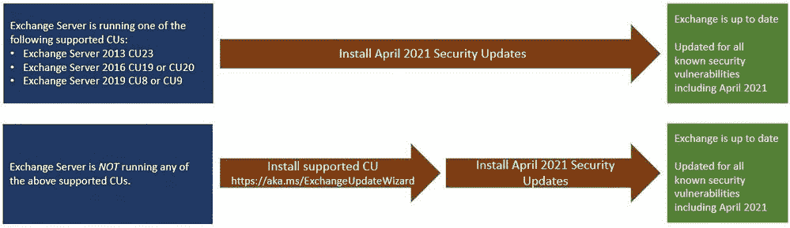

# 使用我们的网络漏洞扫描器检测 Microsoft Exchange RCE # proxy not found | Pentest-Tools.com

> 原文：<https://pentest-tools.com/blog/detect-proxynotfound-remotely>

*运行本地 Microsoft Exchange 服务器？*

如果你没有注意到[国家安全局的样板公告](https://cyber.dhs.gov/ed/21-02/#supplemental-direction-v2)，还有另一批漏洞需要扫描——我们构建了你需要的东西。

我们刚刚在我们的网络漏洞扫描器中添加了一个新的检测模块。它检查您的 Exchange 服务器是否容易受到攻击链的攻击，该攻击链利用四个最近的 CVE 并导致[远程代码执行](/blog/detect-proxyshell)。

我们的扫描工具是世界上第二款能够远程识别易受攻击的服务器的扫描工具。这意味着您可以通过网络连接到目标来探测系统，而无需本地访问或凭据。

这就是我们建造它的原因。

## **没有咨询？没有 PoC？没问题！**

自从这些简历发表(2021 年 4 月 13 日)以来，我们一直在寻找一份详细的技术咨询——但它从未到来。也没有可靠的 PoC 漏洞脚本浮出水面，所以我们自己解决了问题。

我们的团队构建了一个检测模块，用于识别易受 NSA 披露的身份验证前和身份验证后漏洞组合攻击的 Exchange 服务器:

坏演员喜欢这些，因为前两个漏洞甚至不需要对暴露的 Exchange 服务器进行身份验证。他们所要做的就是进行彻底的侦察，并向他们的目标发送特制的请求来得到 RCE。

如果你已经与 ProxyLogon 打过交道(为此我们在三月份推出了专用扫描器[),你会知道这些安全弱点有类似的操作模式。](https://pentest-tools.com/network-vulnerability-scanning/proxylogon-scanner)

**主动出击[发现暴露的服务器](https://pentest-tools.com/network-vulnerability-scanning/network-security-scanner-online-openvas)**

## **打补丁与否？检测#proxynotfound 攻击链**

如果恶意参与者向易受攻击的 Exchange 服务器进行了身份验证，则他们只能利用该批中的最后两个 CVE。但是，通过将其中两个缺陷串联起来，他们可以完全跳过这一步。

今年 4 月，我们看到攻击者使用了相同的方法，他们将 ProxyLogon 与 post-auth vulns 结合起来，以嵌入 webshells 并在未打补丁的 Exchange 服务器上实现持久性。虽然这不是 ProxyLogon 情况的复制品，但我们可以用这个警示故事来指导补救工作。

一旦您知道哪些服务器需要打补丁，您就可以部署[微软针对这些问题发布的累积更新](https://techcommunity.microsoft.com/t5/exchange-team-blog/released-april-2021-exchange-server-security-updates/ba-p/2254617)。

**抢占先机&找到暴露的 EXCHANGE 服务器[扫描您的目标](https://pentest-tools.com/network-vulnerability-scanning/network-security-scanner-online-openvas)**