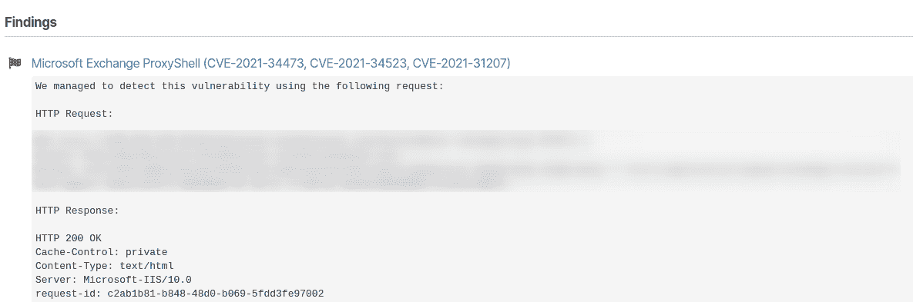

# 用 Pentest-Tools.com | Pentest-Tools.com 检测 ProxyShell(预授权 Microsoft Exchange RCE)

> 原文：<https://pentest-tools.com/blog/detect-proxyshell>

在过去的几个月里，本地 Microsoft Exchange 服务器为 IT 和安全专家带来了大量工作。

三月份， [ProxyLogon](https://pentest-tools.com/network-vulnerability-scanning/proxylogon-scanner) 通过 CVE-2021-26855 使服务器容易受到服务器端请求伪造的攻击，因此我们为它推出了一个专用的扫描仪。

5 月， [#proxynotfound](/blog/detect-proxynotfound-remotely) 弹出，因此我们将对它的检测集成到我们的网络漏洞扫描器中，以便更快地检测和报告。

现在坏演员正在竞相利用 **ProxyShell** ，这是一个攻击链，利用三个 CVE 在目标主机上获得[远程代码执行](/blog/?s=Remote+Code+Execution):

网络和应用零日研究员 Orange Tsai 在 2021 年美国黑帽大会上展示了 ProxyShell，一旦公开，技术细节吸引了道德黑客和恶意黑客。

<template x-if="showVideo"></template>

由于这些漏洞和攻击链经常发生，增加了它们的负面影响，随之而来的是恐慌。当网络犯罪分子专注于安装 web 外壳和获得持久性时，黑客和防御者正忙于检测、报告和修补易受攻击的目标。

如果您使用[我们的网络漏洞扫描器](https://pentest-tools.com/network-vulnerability-scanning/network-security-scanner-online-openvas)扫描出易受攻击的目标，您将获得一份**现成的报告**，其中预先填充了风险描述和建议。

下面是 [**样本报告**](https://pentest-tools.com/usage/pentest-reporting-tool) 的样子:

这里是建议部分的预览:

为 Exchange Server 应用最新的 Microsoft 补丁程序可以修复此漏洞。

*如果受影响的服务器暴露在互联网上，我们建议寻找危害指示器(IoCs ),因为很有可能恶意行为者已经危害了它。*

**在几分钟内扫描你的目标:[找到暴露的服务器](https://pentest-tools.com/network-vulnerability-scanning/network-security-scanner-online-openvas)**

**利用兴趣仍然很高**根据最新数据，估计有 13，000 台 Exchange 服务器仍然易受攻击:

> *proxy shell——简短摘要和漏洞扫描结果[https://t.co/UdOeTHD0Fk](https://t.co/UdOeTHD0Fk)[# dfir](https://twitter.com/hashtag/dfir?src=hash&ref_src=twsrc%5Etfw)[# proxy shell](https://twitter.com/hashtag/proxyshell?src=hash&ref_src=twsrc%5Etfw)[pic.twitter.com/rMQfZqUmU4](https://t.co/rMQfZqUmU4)*
> 
> —zero bs*GmbH(@ zero*B _ S)[2021 年 8 月 11 日](https://twitter.com/zero_B_S/status/1425363043425431554?ref_src=twsrc%5Etfw)

## 更新

**后期编辑**【2021 年 8 月 12 日】新闻周期可能已经过去了 ProxyShell，但糟糕的演员肯定还没有:

> *超过 18%的 Exchange 服务器仍然没有针对 ProxyShell 漏洞安装补丁。近四成易受 CVE 影响-2021-31206:[https://t.co/7yetz9GoJw](https://t.co/7yetz9GoJw)[pic.twitter.com/0r2AOQsibB](https://t.co/0r2AOQsibB)*
> 
> —shod an(@ shod anhq)[2021 年 8 月 11 日](https://twitter.com/shodanhq/status/1425508828246953989?ref_src=twsrc%5Etfw)

对于防御者来说，利用 ProxyShell 的[并不需要任何凭证，并且可以在端口 443 上触发，该端口由 Exchange 的客户端访问服务(CAS)使用。然而，它确实让恶意攻击者非常感兴趣和方便。](https://pentest-tools.com/exploit-helpers/sniper)

关于本地 Microsoft Exchange 服务器的**商业价值**的提醒:公司电子邮件服务器保存着商业机密、机密对话和附件，几乎是组织的命脉。

有动机的网络犯罪分子知道如何利用对服务器的访问以多种方式赚钱(勒索、数据泄露和出售、侦察后续攻击、供应链攻击的垫脚石、商业电子邮件泄露等)。).