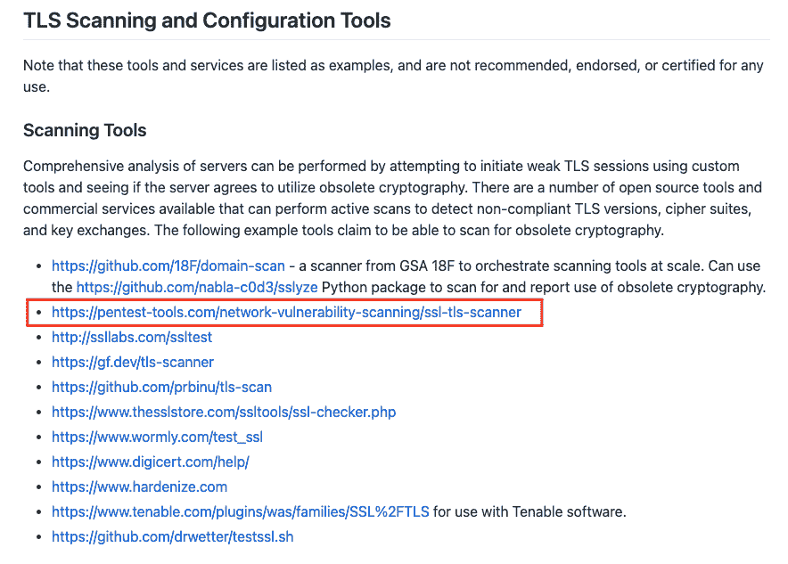
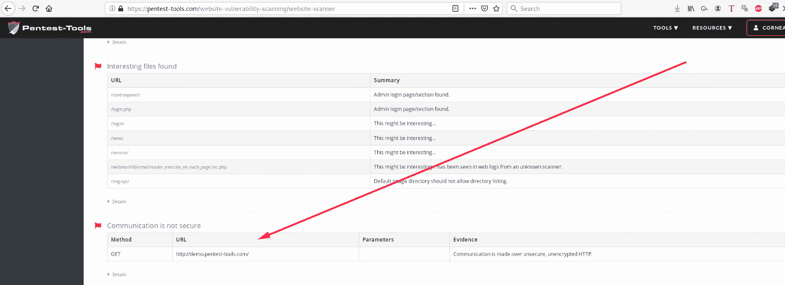
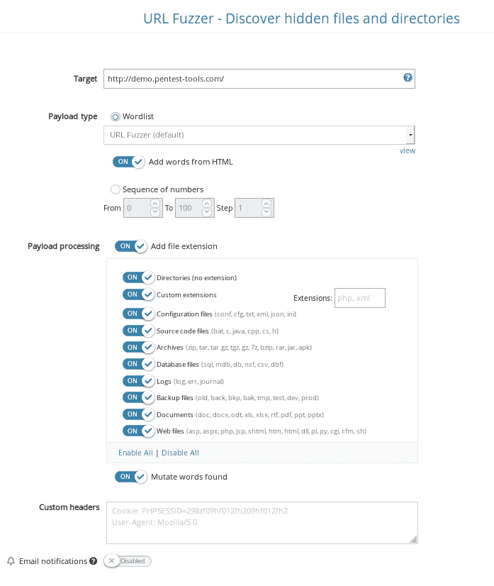
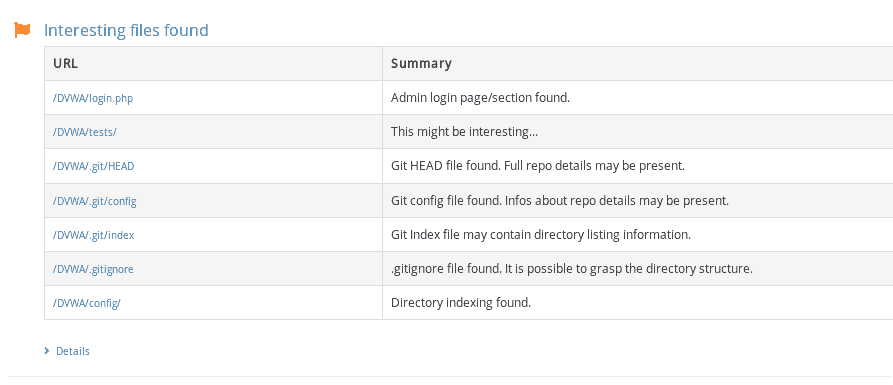

# 如何用 Pentest-Tools.com 检测敏感数据暴露| Pentest-Tools.com

> 原文：<https://pentest-tools.com/blog/detect-sensitive-data-exposure>

最优秀的安全专家对基本漏洞有着非常深刻的理解，这种漏洞会在每个项目中出现。

对于 web 应用程序，这意味着要密切关注 OWASP 前 10 名，并知道如何寻找和报告其中的漏洞类型，以获得最大效果。

为了使这变得更容易，我们将奉献整个系列来讲述如何通过 Pentest-Tools.com 检测 OWASP 十大漏洞。

我们已经完善了此工作流程，现在我们正在分享它，以使您作为 pentester 的生活更轻松，您的工作更愉快。

闲聊到此为止——让我们深入了解与**敏感数据泄露**相关的各类问题的细节。

## **什么是敏感数据暴露？**

当应用程序暴露敏感数据时，就会出现这种类型的安全漏洞，这些敏感数据包括应该受到保护以免被不必要的访问的任何信息。

例如，它可以包括个人数据、客户信息、包含数据库凭证的配置文件、内部团队注释等等。

## **数据泄露与敏感数据暴露量对比**

在继续之前，让我们弄清楚这些术语。

这两者的区别类似于入口处有锁的车库和没有锁的车库。

数据泄露是脆弱的保护机制的后果，攻击者必须打破“锁”

敏感数据暴露发生在没有保护机制的情况下，因此攻击者不必破坏任何东西，因为一开始就没有“锁”。这就像听起来一样糟糕。

## **敏感数据暴露问题的根本原因**

发生这种 web 应用程序风险的主要原因是应用程序在设置授权控制时配置错误。我们进入下面的细节。

## **敏感数据泄露与其他 OWASP 问题有何不同？**

此类别中的漏洞主要是由于人为错误造成的。缺乏安全意识或粗心大意会导致错误配置——这仍然是全球软件安全问题的主要原因之一。

## **为什么敏感数据曝光如此无孔不入？**

有两个原因:

因此，我们使用的很多软件都会出现错误配置。

正如你所料，攻击者喜欢这样，因为你需要非常低级的技术技能来利用这个漏洞。

今天的大多数网络应用程序都容易受到这种安全缺陷的攻击，并且攻击几乎总是未被发现，除非这些信息后来通过黑暗网络或破解论坛被披露。

## **最容易暴露敏感数据的数据类型**

碰巧的是，两种类型的数据最容易出现这种安全问题:

### **在途数据**

通常在网络内部的数据经常在移动，在您的服务器、应用程序和用户之间流动。它在网络中传播时非常容易受到攻击，因为它通过未受保护的数据通道或应用程序编程接口(API)移动，这些接口允许应用程序相互通信。

您可以发起中间人(MiTM)之类的攻击来拦截这些数据，并监控明文通信，从中找到并获取敏感信息。

另一个与协议相关的通信安全问题是不使用像 SSL (安全套接字层)和 TLS(传输层安全)这样的[加密技术来加密传输中的数据。如果您将自己放在客户端和目标服务器之间，将会暴露未加密的数据，包括客户端用来对服务器进行身份验证的凭据。](https://github.com/nsacyber/Mitigating-Obsolete-TLS)

#### **如何检测通过 Pentest-Tools.com 传输的数据中的敏感数据暴露问题**

以下是我们推荐的测试这一特定类别漏洞的工作流程。我们的一个工具甚至是 [NSA 资源列表的一部分，用于消除过时的 TLS/SSL 配置问题](https://github.com/nsacyber/Mitigating-Obsolete-TLS)和漏洞！

以下是**如何使用 Pentest-Tools.com**进行这部分互动:

1.登录您的 Pentest-Tools.com 帐户。

2.在工具和 Web 应用程序测试菜单下，选择[网站扫描器](https://pentest-tools.com/website-vulnerability-scanning/website-scanner)。

在网站扫描仪配置中，设置您的目标 URL。选择“完全扫描”选项。*不要*添加任何认证方法，因为你的目标是找到你可以在没有授权的情况下访问的资源。为了节省时间，您还可以选择在扫描完成时收到电子邮件通知。

完成后，向下滚动到结果部分，检查加密问题，例如“通信不安全”，这可能会通过拦截攻击暴露传输中的数据。

### **静态数据**

静态数据是指存储或保存在系统中的数据:

*   文件服务器和网络共享

*   文件管理系统

*   外部物理存储

*   数据库

*   终端:笔记本电脑、个人电脑、平板电脑

*   移动设备

*   云。

它被认为不太容易受到攻击，因为它没有跨系统移动的风险。安全错误配置是静态数据暴露的主要原因。

例如，开发人员创建了令人敬畏的平台、产品和应用程序，但有时他们会通过其 GitHub/GitLab 存储库公开私钥和秘密令牌。

以下是一份已披露漏洞报告的示例:

【HackerOne.com】*来源:*

另一个大问题是，当网站管理员创建没有强密码保护的网站备份时，任何人都可以通过浏览器访问。一旦他们取回备份，所有的源代码就会被公开。

*而 99%的情况下，源代码包括什么？*一个配置文件。
*配置文件包括什么？*完全正确！也包含登录凭据的数据库连接字符串。

#### **如何通过 Pentest-Tools.com 识别静态数据的敏感数据暴露问题**

1.登录您的 Pentest-Tools.com 帐户。

2.在工具下，找到 Web 应用程序测试菜单并选择 [URL Fuzzer](https://pentest-tools.com/website-vulnerability-scanning/discover-hidden-directories-and-files) 。

 3。在 URL Fuzzer 配置中，设置您的目标 URL。启用除自定义扩展选项之外的所有选项。如果您想在扫描结束时做其他事情，请选择在扫描结束时收到电子邮件通知。

滚动到结果部分，在那里您将寻找“找到感兴趣的文件”。

## **我如何防止敏感数据暴露？**

当组织缺乏基本的安全控制时，数据泄露的风险很高。
泄露敏感凭证可能会让组织损失数百万美元，并因为不符合诸如 [PCI DSS](https://www.pcisecuritystandards.org/) 、 [HIPAA](https://www.hhs.gov/hipaa/index.html) 、 [GDPR](https://gdpr-info.eu/) 和 [CCPA](https://oag.ca.gov/privacy/ccpa) 等标准而招致监管机构的处罚和罚款。这个漏洞也有可能破坏公司的声誉。

为了增强对试图触发数据泄露的攻击的防范，安全和开发团队应该牢牢掌握应用程序/系统架构。

除此之外，下面的指导方针也很有帮助:

*   在 web 应用程序上安装 SSL 证书，以保护传输中的数据

*   *切勿*以纯文本格式传输或存储数据。始终使用强大的算法对数据进行编码/加密，并确保您的网站应用程序对存储的密码使用哈希算法

*   从 GitLab/Github 存储库和 web 应用程序中删除包含私钥、秘密令牌、凭证、PII 数据或任何备份档案的任何文件

*   更新并使用最新版本的应用程序和补丁

*   采用用户行为监控程序来检测可能泄露敏感数据的内部威胁。

## **系统管理员如何修复这类漏洞？**

系统管理员可以通过扫描其基础设施，查找通过未加密/明文协议与 Pentest-Tools.com 进行通信的资产，从而防止这类安全漏洞被利用。
我们还建议用我们的 [URL Fuzzer](https://pentest-tools.com/website-vulnerability-scanning/discover-hidden-directories-and-files) 识别任何人都可以通过互联网访问的所有敏感文件。

## **关键要点**

*   使用加密的通信协议:远程登录上的 SSH、HTTP 上的 HTTPS、FTP 上的 SFTP 等等。

*   检查哪些文件可以通过您的 web 应用程序公开访问，并对它们进行清理。

*   检查您的项目存储库中是否有任何遗忘的令牌、密钥或其他意外遗留的机密细节。