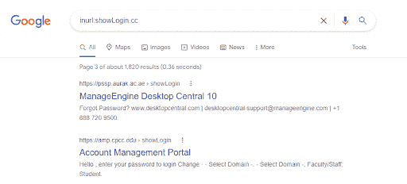
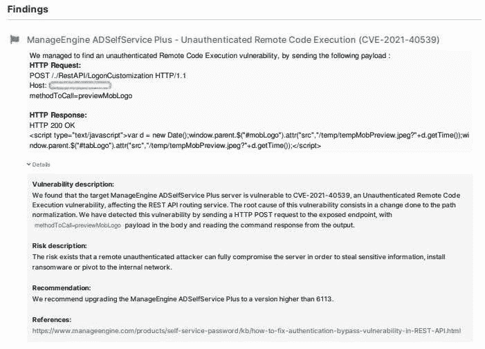

# 如何检测 Zoho ManageEngine ADSelfService Plus RCE(CVE-2021-40539)| Pentest-Tools.com

> 原文：<https://pentest-tools.com/blog/detect-zoho-rce-cve-2021-40539>

被出现的如此多的高风险漏洞淹没？每年都有数以千计的数据被披露，2021 年也不例外。

系统变得复杂，网络攻击变得更加复杂，修补仍然是许多组织面临的挑战。作为信息安全专家，我们有责任帮助公司(和个人)理解关键漏洞的真正含义和影响，并帮助他们在情况变得更糟之前找到它。

这就是这篇文章的内容。

当你在 Zoho ManageEngine ADSelfService Plus([cvss v3](https://nvd.nist.gov/vuln/detail/CVE-2021-40539)[**9.8**](https://nvd.nist.gov/vuln/detail/CVE-2021-40539))这样的服务中处理像未经认证的 RCE 这样的关键 CVE 时，打补丁被证明是一个困难、耗时和资源密集型的过程。

2021 年 9 月 8 日，美国网络安全和基础设施安全局(CISA) [发布了一项关于 ManageEngine 的 ADSelfService Plus 被积极利用的警告](https://www.cisa.gov/uscert/ncas/alerts/aa21-259a)。该漏洞包括**未经验证的远程代码执行**，攻击者可以在服务器上上传文件，并绕过验证服务访问这些文件。

让我们更深入地了解这个问题的来龙去脉。

## **什么是 Zoho ManageEngine ADSelfService Plus？**

ManageEngine ADSelfService Plus 是一款面向云应用和活动目录基础设施的集成式自助密码管理和单点登录解决方案。

Zoho Corp 在全球拥有超过 5000 万用户，大约 18 万家公司运行 ManageEngine 服务。这些数字足以更好地了解这个安全问题的严重性，以及为什么这个漏洞有可能在 Zoho 软件产品中传播。

## **Zoho manage engine ADSelfService Plus RCE vuln 如何工作**

当用户尝试使用 REST API 功能时，URL 由 ManageEngine 服务进行身份验证。攻击者可以使用特制的 URL 绕过这个身份验证过程**，因为这些请求没有得到正确的处理。这为恶意行为者提供了获得*未经认证的远程代码执行*权限的途径。**

由于检查不当，如果一个恶意的行为者通过网络访问端口 443，传递一个 URL 为**的 **POST** 请求。/RestAPI/LogonCustomization** 和下面的数据**methodToCall = previewMobLogo**在请求体中**，**它们也可以绕过安全检查机制。

毫不奇怪，自 2021 年 9 月以来，这个漏洞在互联网上被广泛利用。更重要的是，根据美国联邦调查局(FBI)、美国海岸警卫队网络司令部(CGCYBER)和网络安全和基础设施安全局(CISA)的说法，自 2021 年 8 月以来，这一漏洞已被广泛[滥用](https://us-cert.cisa.gov/ncas/alerts/aa21-259a)。

据报道，威胁分子使用了不同的技术和程序，包括:

*   常见的 web 外壳[T1505.003]

*   模糊和去模糊文件[T1027 和 T1140]

*   用户凭据泄露【

*   正在过滤 Active Directory 数据库的副本或注册配置单元[T1003.003]

*   对 C2 使用自定义加密[T1573.001]

APT 参与者使用的工具有:

*   dropper–在系统上投放外壳的特洛伊木马

*   哥斯拉——汉语的外壳

*   ng lite——访问的后门

## **易受攻击的 ManageEngine ADSelfService Plus 版本**

追踪为 [CVE-2021-40539](https://nvd.nist.gov/vuln/detail/CVE-2021-40539) ，根据 Zoho [安全发布](https://www.manageengine.com/products/self-service-password/kb/how-to-fix-authentication-bypass-vulnerability-in-REST-API.html)该安全问题影响 ManageEngine ADSelfService Plus 版本 6113。它的 CVSSv3 分数为 9.8 分，因为利用它不需要非常复杂的攻击。

自 2021 年 9 月以来，补丁已经可用，但很可能仍有大量易受攻击的实例存在。

## **CVE 的商业影响-2021-40539**

成功利用此漏洞后，未经验证的攻击者可以获得远程代码执行俱乐部的“完全访问票”。

通过 RCE 访问，攻击者可以轻松获取活动目录帐户和密码，甚至在网络上创建自己的帐户。攻击者还可以通过重置密码来接管整个域，对组织造成巨大的破坏。

您可以通过查看位于`C:\ManageEngine\ADSelfService Plus\logs`的日志文件来检测您的系统是否遭到破坏，更具体地说，就是检查与 [Java](/blog/log4shell-scanner-detect-cve-2021-44228) 相关的访问日志和错误日志，其中包括对 addSmartCardConfig 或 getSmartCardConfig 中的 NullPointerException 的引用以及 web shells 的存在。

### **那么，您如何证明该漏洞的业务影响呢？**

我将向您展示如何找到可能受其影响的实例。

ManageEngine 实例使用基于 web 的接口，因此您可以**使用 Google Dorks** 通过以下搜索查询找出 ADSelfService 主机:



## **如何在道德黑客活动中检测 CVE-2021-40539**

为了**检测 CVE-2021-40539** ，我建议遵循以下两个步骤:

```
curl -k -s https://<HOST>/./RestAPI/LogonCustomization"
```

从这里开始，您需要在请求体中发送数据。

```
curl -k -s "https://<HOST>/./RestAPI/LogonCustomization" -d "methodToCall=previewMobLogo" –path-as-is
```

然后，输出将如下所示:

```
<script type=”text/javascript”>
var d = new Date();
window.parent.$(“#mobLogo”).attr(“src”,”/temp/tempMobPreview.jpeg?”+d.getTime());
window.parent.$(“#tabLogo”).attr(“src”,”/temp/tempMobPreview.jpeg?”+d.getTime());
</script>
```

如果你想尝试另一种更快的检测策略，请继续阅读本指南。

确认 CVE-2021-40539 正在影响你的目标的最快、最简单的方法是在 Pentest-Tools.com 上运行一个[网络漏洞扫描](https://pentest-tools.com/network-vulnerability-scanning/network-security-scanner-online-openvas)。

该工具映射网络边界上暴露的所有服务，并检查潜在的漏洞，例如:

*   扫描开放端口，收集有关协议、服务类型和版本的数据

*   查询具有已知漏洞的数据库，以检查特定版本的服务是否受到任何问题的影响

*   检查目标是否确实易受攻击-在此阶段不提取任何数据，但应用与服务的最小交互(扫描仪的轻型版本)。它对服务请求进行微调，并检查响应以发现它是否易受攻击。



我们的[网络扫描器](https://pentest-tools.com/network-vulnerability-scanning/network-security-scanner-online-openvas)的轻量级版本是一种更快的方法，但是容易返回更多的假阳性结果。为了获得更好、更准确的结果，我们推荐使用完整版的扫描器，它可以执行更多、更深入的扫描，以检测各种漏洞。

## **如何减轻 CVE-2021-40539**

立即采取行动，并确保在您的环境中应用现有的补丁，因为 ManageEngine 已经发布了[针对 CVE-2021-40539](https://www.manageengine.com/products/self-service-password/kb/how-to-fix-authentication-bypass-vulnerability-in-REST-API.html) 的修补程序。

| 产品构建 | 固定版本 |
| --- | --- |
| ADSelfService Plus 6113 | 6114 |

## **注重预防和缓解，最大限度地降低风险和业务影响**

随着令人担忧的关键漏洞的出现，理解和应对这种环境变得越来越困难。但是，通过清晰、基本的安全措施进行预防和缓解始终在我们的控制之中，并帮助我们减少或消除这些风险。

作为一名攻击性安全专家，您有能力帮助您的同事、客户和信息安全社区找到易受攻击的目标，并采取行动尽最大努力保护它们。我们都是贡献者。检查系统，让它变得更好！