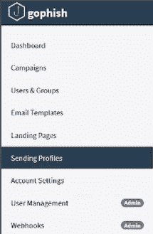

# DMARC 协议电子邮件安全| Pentest-Tools.com

> 原文：<https://pentest-tools.com/blog/dmarc-protocol-email-security>

在本文中，您将熟悉 DMARC，这是一种鲜为人知的电子邮件安全协议，可以帮助企业防止网络钓鱼活动。

看完这篇文章，你会知道:

*   什么是 DMARC 以及它为什么有用

*   攻击者如何从错误配置的 DMARC 策略中获利

*   如何修复易受攻击的实例。

## 放弃

您将要阅读的内容严格用于教育目的。我们不允许将这些知识用于非法活动。

## **什么是 DMARC，为什么需要它？**

DMARC 代表基于域的消息认证、报告和一致性。简而言之，这是一种验证您发送的电子邮件的方法。它通过指定所需策略的 DNS 记录来实现。

鉴于大多数网络攻击始于网络钓鱼活动，DMARC 安全性是一个重要因素。如果配置不当，会造成很大的损害。

DMARC 允许组织通过防止攻击者使用其域名和子域名进行网络钓鱼攻击来保护其品牌和声誉。这可以帮助用户免于成为此类攻击的受害者，还可以防止组织卷入欺诈活动。

使用策略验证电子邮件发件人。DMARC 告诉接收邮件服务器，当它们收到看似来自您的组织但未通过身份验证检查的邮件时，该如何处理。

DMARC 建立在密钥认证标准 **SPF** (发件人策略框架)和 **DKIM** (域密钥识别邮件)的基础上。它补充了用于发送电子邮件的基本协议 SMTP，因为 **SMTP** 不包括任何用于实现或定义电子邮件认证策略的机制。

SMTP(简单邮件传输协议)始于 1980 年，从那时起，它就成为发送电子邮件的首选协议。因为 SMTP 在创建时没有考虑安全性，所以它不包含任何安全机制。这就是为什么专家必须创建像 DMARC 这样的电子邮件安全协议来帮助防止欺骗和欺诈。

## 为什么 DMARC 协议如此重要？

电子邮件安全是网络安全中最少涉及的话题之一，尽管它有一定的影响。

在构建分层防御策略时，组织可以遵循所有推荐的准则。尽管如此，在您的公司环境中，一个缺乏经验且毫无戒心的用户只需点击一个链接或下载并运行一个恶意附件，就能为攻击者提供一个进入网络的立足点。大多数攻击链都是从电子邮件开始的。

公司意识到，网络犯罪分子瞄准员工，诱骗他们采取有害行动，例如向攻击者汇款。这就是为什么术语[](https://www.proofpoint.com/us/threat-reference/business-email-compromise)(商务邮件妥协)变得如此普遍。

超过 90%的**成功的 [网络攻击都始于网络钓鱼邮件](https://www.cisa.gov/shields-up#:~:text=Think%20before%20you%20click.,numbers%2C%20or%20other%20sensitive%20information.) ，因此在每个组织中优先考虑电子邮件安全是显而易见的。**

**网络钓鱼策略涉及许多创造性的方法，诱骗人们将敏感信息(如密码或信用卡号)提供给假装是可靠来源的人。**

**这通常是通过电子邮件或社交媒体消息来完成的，这些消息包含虚假网站的链接，这些网站看起来合法，但实际上旨在窃取受害者的信息。**

**但是，网络钓鱼也可能涉及自称来自合法组织并要求提供机密信息的人的电话或短信。**

**
来源:[FBI.gov](https://www.fbi.gov/how-we-can-help-you/safety-resources/scams-and-safety/common-scams-and-crimes/business-email-compromise)**

**DMARC 协议非常重要，因为它有助于防止电子邮件用户收到垃圾邮件和其他形式的恶意电子邮件。它通过允许电子邮件域所有者在其 DNS 记录中发布策略来实现这一点，这些策略指定哪些服务器有权代表他们发送电子邮件。**

**这使得攻击者更难发送看似来自受信任域的电子邮件，这有助于保护该域的声誉，并减少其用户收到的垃圾邮件和网络钓鱼电子邮件的数量。**

## **一点历史**

**DMARC 是由包括 Google、Microsoft、Yahoo 和 AOL 在内的一些组织在 2011 年开发的安全协议。**

**DMARC 的目标是解决**电子邮件欺骗**的问题，攻击者发送看似来自合法域的欺诈性电子邮件，诱骗收件人泄露敏感信息或点击恶意链接。**

**自成立以来，DMARC 已被世界各地的组织广泛采用，作为一种保护其域免受电子邮件欺骗和网络钓鱼攻击的方法。DMARC 目前得到了所有主流 ISP 的支持(比如 Google、微软、Yahoo！等等。).**

**如今，DMARC 仍然是希望提高电子邮件安全性并保护其品牌不被滥用的组织的重要工具。**

**那么，了解 DMARC 如何提高你的测试技能呢？这就是问题所在。**

## **DMARC 是如何工作的？**

**当邮件服务器的电子邮件无法通过认证检查时，DMARC 会提供帮助。因此，每封未能通过身份验证检查的电子邮件都必须通过 DMARC 策略的验证。**

**一个公司可以实施的三个 DMARC 政策**:**** 

*   ****“p = none”策略**，有时也称为“monitor”策略，它告诉收件人的电子邮件提供商在电子邮件未通过 DMARC 时不要采取任何行动。**

*   ****“p = quarantine”策略**将可疑电子邮件移动到不同的文件夹，如收件人的垃圾邮件文件夹，而不是收件箱。**

*   ****“p = reject”策略**告诉提供商阻止任何未通过 DMARC 的电子邮件，因此该电子邮件甚至不会到达您的收件人。**

**好的，*但是**为什么 DMARC 没有 SFP 和 DKIM** 就不能工作？*让我们来分解一下:**

*   ****SPF** 允许发件人定义允许哪些 IP 地址发送特定域的邮件。**

*   ****DKIM** 提供加密密钥和数字签名，以验证电子邮件消息未被更改。**

*   ****DMARC** 将 SPF 和 DKIM 认证机制统一到一个通用框架中，并允许域所有者声明如果来自该域的电子邮件未通过授权测试，他们希望如何处理该电子邮件。** 

**在网络安全方面，我们把中情局作为一切的基础。我们可以很容易地看到它是如何应用于电子邮件安全的:**

****保密性****

**SFP 协议确保只允许来自某个域的声明 IP 发送电子邮件。**

****诚信****

**DKIM 协议通过加密电子邮件并用数字签名验证它们来保证完整性。**

****供货情况****

**正如将未经授权的用户排除在组织数据之外很重要一样，数据应该在授权用户需要时随时可供他们使用。这意味着保持系统、网络和设备正常运行。因此，在您的组织中创建一个 **DMARC** 策略计划是确保可用性的一种方式。**

****

### **如何检测不正确的 DMARC 配置**

**需要注意的是，DMARC 攻击对于不太知名的邮件服务提供商非常有效。这并不意味着 Gmail、Yahoo Mail 或 ProtonMail 等服务完全受到保护。如果攻击者想要发起成功的攻击，他们可以获得域信誉，从而绕过安全措施。**

**以下是您如何在道德黑客活动中提供这种域欺骗风险。**

**您可以使用下面的命令
轻松地**检查一个域的 DMARC 策略****

```
**``dig _dmarc.domain txt +short``**
```

```
**`rua=mailto:eusebiu.boghici+dmarc@pentest-tools.com`**
```

**该部分告诉接收服务器将 DMARC 失败的集合报告发送到哪里。汇总 DMARC 报告每天发送给记录所属域的管理员。**

**如你所见，【Pentest-Tools.com】[域设置了**拒绝**策略，这意味着它会阻止任何未通过 DMARC 验证的电子邮件。](https://pentest-tools.com)**

## **如何利用 DMARC 错误配置**

**开发过程非常简单。**

**我们将设置一个 VPS(虚拟专用服务器)和一个域。我们将在 VPS 服务器上下载一个 [工具](https://github.com/6point6/mail-spoofer) 并将其连接到新域。最后，我们将从购买的域名发送电子邮件。**

**考虑这样一个场景，我们有一个道德黑客商店，域名为 **hacking-goodies.shop** 。(请注意[**hacking-goodies . shop**](http://hacking-goodies.shop)归[Pentest-Tools.com](https://pentest-tools.com)所有，我们给你在上面测试 DMARC 相关攻击的完全权限)。**

**首先，我们需要**检查设置了什么 DMARC 策略**。**

```
**`dig _dmarc.hacking-goodies.shop txt +short`**
```

**正如我们之前所说的， **none 策略**不会做任何事情，这意味着它将允许邮件进入收件人的收件箱。**

**太好了！我们有完美的攻击方案。让我们继续获取域名和副总裁，并建立我们的攻击。**

### **获取您的域名**

**首先，我们需要一个域，这样我们就可以安装 [邮件欺骗器](https://github.com/6point6/mail-spoofer) 并发送电子邮件作为 hacking-goodies.shop**

**为了简单起见，我们使用了 [GoDaddy](http://godaddy.com) 作为新域，但是您可以使用任何符合您偏好的域提供者。**

### **设置域**

**购买域后，您需要将名称服务器替换为 Cloudflare 自定义名称服务器。**

**在 Cloudflare 中，您将添加域并转到 DNS 面板。要使攻击成功，必须删除“DNS 管理”下的任何内容。**

**在域名服务提供商的专用面板中向下滚动并更换给定的域名服务器。**

**现在您需要为下一步的配置文件获取一个 API 键。**

**前往 https://dash.cloudflare.com/profile/api-tokens 的[T3](https://dash.cloudflare.com/profile/api-tokens)，点击**创建令牌**。**

**重定向后，点击**编辑区域 DNS** 旁边的**使用模板**。**

**接下来，转到**区域资源**并选择您的域。**

**完成上述所有步骤后，您应该**获得您的 API 密钥**。请保存它，不要与其他任何人分享。**

### **设置 VPS**

**注意:您可能需要重复此步骤，因为 VPS IPs 可能会有不良声誉，因此，邮件服务将不会传递您的电子邮件。**

**对于 VPS(虚拟专用服务器)部分，我们使用了 [Vultr](http://vultr.com) ，因为他们似乎有最好的 IP 块声誉。**

**幸运的是，VPS 不需要太多的资源，所以我们可以使用最便宜的资源，并且仍然可以得到一个正常运行的实例。**

**首先，当您创建 VPS 时，请注意使用您创建的域名准确设置主机名。**

**登录 VPS 后，输入以下**命令**:**

```
**`apt-get update && apt-get install docker-compose`**
```

 **接下来，**在实例上克隆 GitHub 库**:
git 克隆[https://github.com/6point6/mail-spoofer](https://github.com/6point6/mail-spoofer)**

**转到**新创建的目录。****

**接下来，您需要编辑设置文件并**添加您的域和 API 密钥**。**

**用您的域名替换**example.com**，并在 CLOUDFLARE *API* 关键参数中添加您之前保存的 API 密钥。**

**完成上述所有步骤后，输入 **docker-compose up** ，耐心等待大约 7-10 分钟，让你的网络服务器启动。**

### **发送网络钓鱼邮件**

**你需要做的最后一步是把邮件发给受害者。**

**在浏览器中导航到您的 VPS IP 端口 3333，并使用默认凭据登录:**

*   **用户:管理员**

*   **密码:gophish**

**转到发送配置文件选项卡，然后单击创建配置文件。**

****

****用必要的信息替换输入**。在我们的场景中，我们将按如下方式填写它们:**

**名称:测试**

**来自:**

**主机:后缀:25**

**完成所有这些后，填写收件人的电子邮件并发送出去。要知道，邮件会在 5 分钟左右到达目标。**

## **防范 DMARC 电子邮件安全风险**

**太好了！您了解了利用 DMARC 错误配置在实践中是如何工作的，以及设置服务器来实现它是多么容易。**

**现在，如果你想保护自己，为你的同事或客户写令人信服的 pentest 报告，理解电子邮件分析的过程是非常必要的。**

**电子邮件标题包括电子邮件的技术细节，如发件人、收件人、路径、回邮地址和附件。**

**通常，这些细节足以确定电子邮件中是否有可疑/异常的内容，并决定对电子邮件采取进一步的行动。这个过程可以手动完成，也可以借助工具来完成。**

### **如何分析潜在的恶意电子邮件**

**让我们换个角度，看看作为受害者，我们如何识别是否收到了网络钓鱼电子邮件。**

**这封邮件看似来自我们的黑客商店领域，*但这真的是首席执行官要求我们重设密码的邮件吗？***

**这是一封伪造的电子邮件，但是，实际上，你无法辨别，因为这封电子邮件是以合法所有者的身份发送的。**

**如果我们点击**查看原始消息**，我们可以通过查看标题来检查它是否是一封网络钓鱼邮件。查看下图，并尝试了解如何检测泄漏。**

**通过验证从部分收到的**，很容易看到邮件来自的域。这一部分告诉我们电子邮件域的来源。****

**如果电子邮件中的域名与接收部分中的不匹配，你应该忽略它(或者像一个好奇的黑客一样分析它)。**

## **显示 DMARC 重要性的统计数据**

*   **在全球范围内， **96%的网络钓鱼攻击**通过电子邮件到达[ [来源](https://easydmarc.com/blog/phishing-statistics-easydmarc-report-january-june-2022/) ]**

*   ****金融**部门是这些类型攻击的最大目标[ [来源](https://easydmarc.com/blog/phishing-statistics-easydmarc-report-january-june-2022/) ]。** 

**我们自己的研究表明:**

*   ****财富 50 强公司中有 44%容易受到上述电子邮件欺骗的攻击****

*   ****罗马尼亚 13 家银行中有 10 家**容易受到由错误配置导致的 DMARC 电子邮件欺骗(76.92%)。**

## **最后的想法**

**作为一名 pentester，报告 DMARC 的错误配置是很重要的，因为它对组织来说是一个很大的威胁。**

**读完这篇文章后，您现在应该理解了错误配置 DMARC 策略的风险，以及正确使用 DMARC 的重要性。例如，APT 团体可以从网络钓鱼活动开始，进入公司的内部网络，轻松部署勒索软件或破坏他们的资产和声誉。**

**通过发布 DMARC 策略并监控其使用情况，组织可以大大降低成为基于电子邮件的攻击目标的风险，并有助于保护其品牌和声誉。**

**总的来说，如果组织想要保护自己和用户免受电子邮件欺骗攻击，实施 DMARC 是一个重要的步骤。**