# 保护您的 web 服务器的基本 HTTP 头| Pentest-Tools.com

> 原文：<https://pentest-tools.com/blog/essential-http-security-headers>

在本文中，我们讨论最重要的 HTTP 头，您应该在您的 [web 服务器](https://pentest-tools.com/website-vulnerability-scanning/website-scanner)上配置这些头，以提高其安全性。

我们将了解每个报头的作用，以及利用其错误配置可以实施哪些攻击。

下面是我们将要讨论的有趣的 HTTP 头的类型:

作为 HTTP 协议的一部分，客户端和 web 服务器使用 HTTP 头来共享信息。当我们在浏览器的地址栏中输入一个 URL 或点击任何链接时，web 浏览器会发送一个包含客户机头的 HTTP 请求，而 HTTP 响应包含服务器头。使用我们的 [HTTP 请求记录器，了解如何](https://pentest-tools.com/exploit-helpers/http-request-logger)[更快地模拟网络钓鱼攻击](https://pentest-tools.com/blog/how-to-simulate-phishing-attacks-with-http-request-logger)。

下面是这样一个调用 Google 的网页时的 HTTP 请求-响应对:

有几十个 HTTP 头，解释它们不是本文的目的。不过，你可以在 Mozilla 的 HTTP Headers 页面的 [**找到一个很好的参考和每个头的详细信息。**](https://developer.mozilla.org/en-US/docs/Web/HTTP/Headers)

我们将讨论具有安全影响的 HTTP 服务器头。

### **1。HTTP 严格的传输安全(HSTS)**

HTTP 严格传输安全指示浏览器只能通过 HTTPS 访问 web 服务器。一旦在服务器上进行了配置，服务器就会在响应中以`Strict-Transport-Security`的形式发送报头。收到这个报头后，浏览器将只通过 HTTPS 向该服务器发送所有请求。HSTS 报头有 3 个指令:

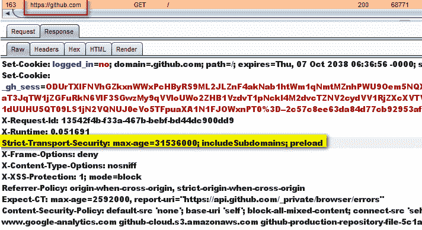

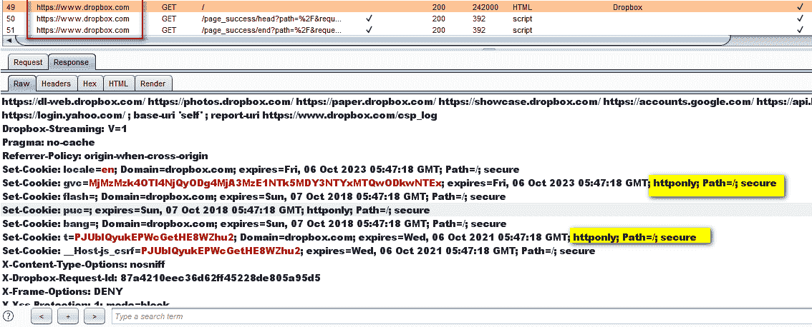

*   **IncludeSubDomains** :这也适用于对网站子域的控制。

*   **预加载**:预加载列表是硬编码到谷歌 Chrome 浏览器中的网站列表，这些网站只能通过 HTTPS 进行通信。网站的所有者可以提交其 URL 以包含在预加载列表中。该列表由谷歌维护，但其他浏览器也使用它。预载列表可在[这里](https://chromium.googlesource.com/chromium/src/+/master/net/http/transport_security_state_static.json)找到:

**攻击场景**

如果没有启用 HSTS，对手可以进行中间人攻击，并从用户的 web 会话中窃取敏感信息。想象一个场景，受害者连接到一个开放的 Wi-Fi，而这个 Wi-Fi 实际上是在攻击者的控制之下。通过 HTTP 访问网站将允许攻击者拦截请求并读取敏感信息。(该网站位于 HTTPS，但用户通过 HTTP 访问，后来被重定向到 HTTPS)。如果同一个用户早些时候访问了该网站，浏览器中记录的 HSTS 详细信息会导致连接自动通过 HTTPS 进行。

### **2。内容安全政策**

内容安全策略用于指示浏览器仅加载策略中定义的允许内容。这使用了白名单方法，告诉浏览器在哪里加载图像、脚本、CSS、小程序等。如果实施得当，该策略可以防止利用[跨站点脚本(XSS)](https://pentest-tools.com/website-vulnerability-scanning/xss-scanner-online) 、点击劫持和 HTML 注入攻击。

头的名字是`Content-Security-Policy`，它的值可以用以下指令定义:`default-src`、`script-src, media-src`、`img-src`。它们指定了浏览器应该从何处加载这些类型的资源(脚本、媒体等)。

以下是一个设置示例:

```
Content-Security-Policy: default-src 'self'; media-src media123.com media321.com; script-src script.com; img-src *;
```

这被浏览器解释为:

**例题**

**为 dropbox.com 正确设置内容-安全-策略**标题:

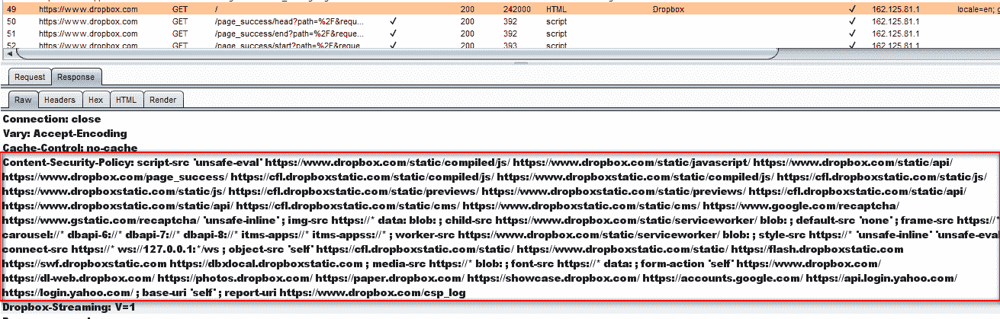 **内容-安全-策略**没有为 apple.com 设置标题:

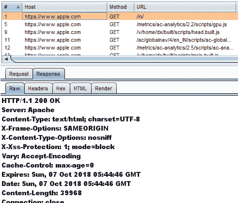关于内容安全政策的更多信息可以在 [Mozilla 网站](https://developer.mozilla.org/en-US/docs/Web/HTTP/CSP)上找到。

### **3。访问控制允许来源**

`Access-Control-Allow-Origin`是 CORS ( [跨源资源共享](https://developer.mozilla.org/en-US/docs/Web/HTTP/CORS))头。这个头允许定义的第三方访问给定的资源。这个头是由[同源策略](https://developer.mozilla.org/en-US/docs/Web/Security/Same-origin_policy)造成的限制的一个变通方法，该策略不允许两个不同的源读取彼此的数据。

例如，如果*站点 ABC* 想要访问*站点 XYZ* 的资源，*站点 XYZ* 将使用带有*站点 ABC* 地址的`Access-Control-Allow-Origin`报头进行响应。通过这种方式，*网站 XYZ* 告诉浏览器谁被允许访问其内容:

```
Access-Control-Allow-Origin: SiteABC.com
```

**攻击场景**

如果`Access-Control-Allow-Origin`配置薄弱，攻击者可以通过使用另一个第三方网站从目标网站读取数据。许多开发人员在标题中使用通配符`Access-Control-Allow-Origin`，允许任何网站从其网站读取数据。

### **4。设置 Cookie**

应用程序设置的 cookie 值由服务器在`Set-Cookie`头中发送。收到这个头之后，浏览器将在`Cookie`头中发送带有每个 HTTP 请求的 cookies。

HTTP cookies 通常包含敏感信息(尤其是会话 cookie ),需要防止未经授权的访问。

可以设置以下属性来保护 cookies:

*   `Secure`:设置了此属性的 cookie 将只通过 HTTPS 发送，而不会通过明文 HTTP 协议(容易被窃听)发送。

*   `HTTPOnly`:浏览器不允许 JavaScript 代码访问设置了该属性的 cookies 的内容。这有助于减少通过 [XSS 攻击](https://pentest-tools.com/website-vulnerability-scanning/xss-scanner-online)的会话劫持。

**例题**

dropbox.com 的 Cookie 属性`HTTPOnly`和`Secure`设置正确:

没有为 boeing.com 设置 Cookie 安全属性:

## **5。x 帧选项**

这个标题通过禁止浏览器在一个 *iframe* 元素中加载页面来保护用户免受[点击劫持攻击](https://owasp.org/www-community/attacks/Clickjacking)。`X-FrameOptions`有 3 个指令:

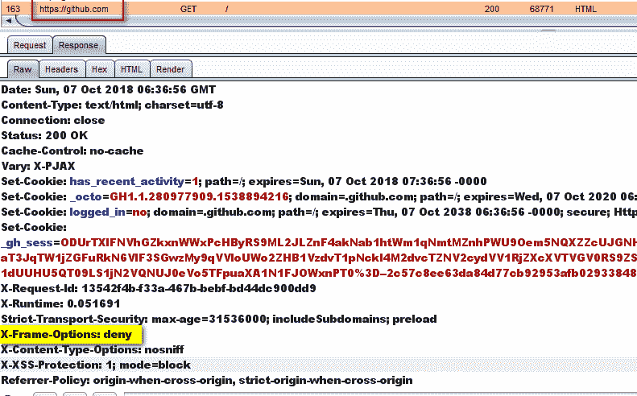

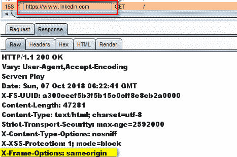

**攻击场景**

对手可能会诱骗用户访问恶意网站，该网站会将目标应用程序加载到不可见的 iframe 中。当用户点击恶意应用程序(例如基于网络的游戏)，点击将被“窃取”并发送到目标应用程序(点击劫持)。因此，用户将在未经其同意的情况下点击合法的应用程序，这可能会导致执行一些不必要的操作(例如删除账户等)。

**示例**

**X-Frame-Options** 标头已正确实施，可拒绝 dropbox.com 的帧加载:

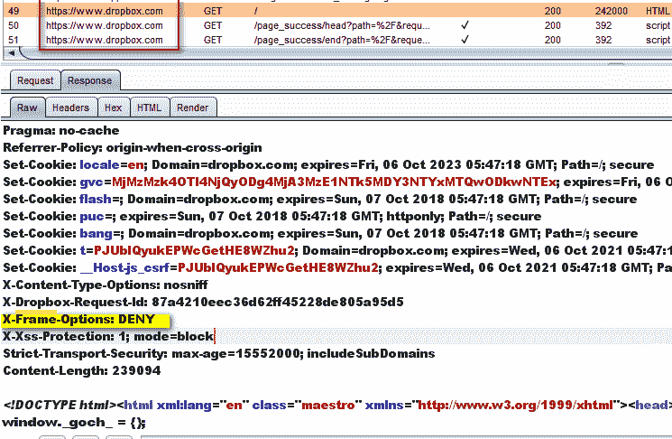

**X-Frame-Options** header 未在 ibm.com 上实现:

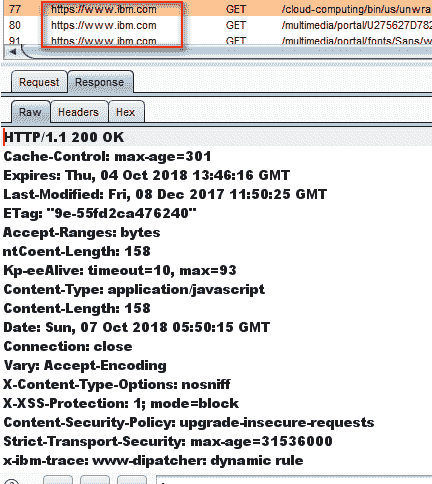

### **6。X-XSS 保护**

这个头被设计用来防止[跨站点脚本攻击](https://pentest-tools.com/blog/xss-attacks-practical-scenarios)。它与现代浏览器使用的 XSS 过滤器一起工作，它有 3 种模式:

*   **X-XSS-保护:0；**–值 0 将禁用 XSS 过滤器

*   **X-XSS-保护:1；**–值 1 将启用过滤器，在检测到 XSS 攻击的情况下，浏览器将净化页面内容以阻止脚本执行。

*   **X-XSS-保护:1；mode = block**–如果检测到 XSS 攻击，与 block 模式一起使用的值 1 将阻止页面的呈现。

**例题**

**X-XSS-保护**标题在 linkedin.com 上正确实现:

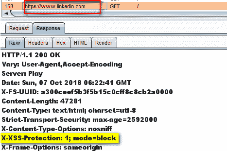

instagram.com 上的 **X-XSS 保护**标题丢失:

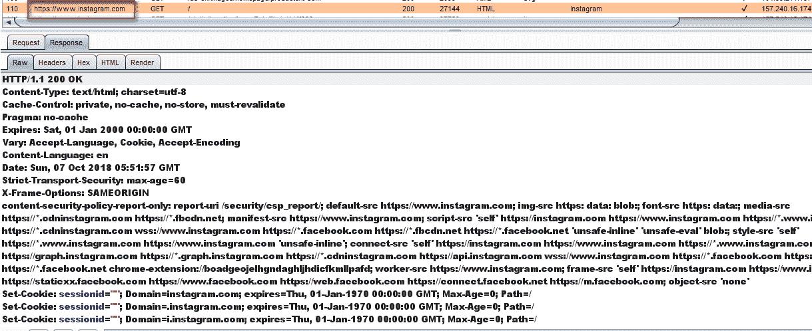

### **7。x-内容-类型-选项**

此响应标头用于防止 MIME 嗅探漏洞。那么什么是哑剧嗅探呢？MIME 嗅探是 web 浏览器的一项功能，用于检查所提供文件的内容。它的工作原理如下:

1.  网络浏览器请求一个文件。服务器发送一个设置了 HTTP 头*内容类型*的文件。

2.  网络浏览器“嗅探”该文件的内容，以确定文件格式。

3.  分析完成后，浏览器会将其结果与服务器发送的结果进行比较。如果不匹配，浏览器将使用已识别的格式。

这可能会导致安全漏洞。怎么会？

**攻击场景**

1.  应用程序允许用户上传图像文件并验证其扩展名

2.  用户上传扩展名为 jpg 或 png 的图像文件，但该文件也包含恶意 HTML 代码

3.  浏览器使用包含代码并在浏览器中执行的 HTML 来呈现文件

通过将头文件`X-Content-Type-Options`设置为 **nosniff** ，浏览器将不再“嗅探”接收到的文件内容，而是使用来自 *Content-Type* 头文件的值。这个头是专门针对 IE 和 Chrome 浏览器的。

该报头可以与另外两个报头一起使用，以增强安全性。

*   **Content-Disposition** :强制浏览器显示下载 pentest.html 文件的弹出窗口。

    ```
    Content-Disposition: attachment; filename=pentest.html
    ```

*   **X-Download-Options** :当这个头设置为 *noopen* 时，用户在打开文件前会被强制先保存在本地，而不是直接在浏览器中打开文件

**例题**

**为 linkedin.com 正确实现 X-Content-Type-Options** 标题:

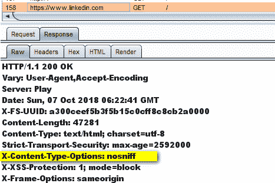

**X-Content-Type-Options**header 未在 instagram.com 上实现:

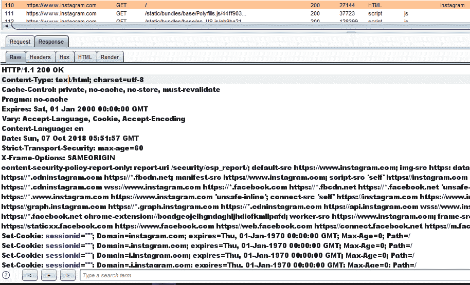

### **1。服务器:**

这个头包含关于后端服务器的信息(类型和版本)。例如，下面的截图显示运行耐克网页的网络服务器是`Jetty`，版本是`9.4.8.v20171121`。

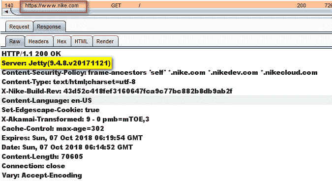

具备这方面知识的对手可能会寻找针对 Jetty 9 . 4 . 8 版本的漏洞。这些信息可以在公共数据库中找到，例如:

你只需要搜索具体的产品和版本。以下是影响 Jetty web 服务器的漏洞:

[https://nvd.nist.gov/vuln/search/results?form_type=Basic&结果 _ 类型=概述&查询=突堤&搜索 _ 类型=全部](https://nvd.nist.gov/vuln/search/results?form_type=Basic&results_type=overview&query=jetty&search_type=all)

**好例子**

可以通过重新配置 web 服务器来屏蔽服务器信息。举个例子，Linkedin 的网站上有一个很好的配置(服务器名被修改为“Play”):

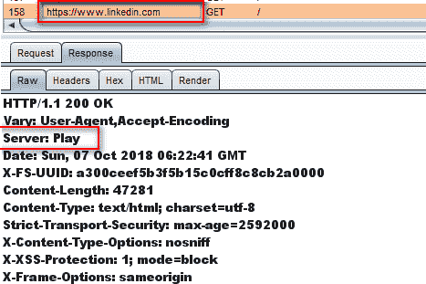

### **2。x-供电人:**

它包含 web 应用程序中使用的 web 框架或编程语言的详细信息。例如，https://msc.mercedes-benz.com[的 web 应用程序是用`PHP 7.1.22`构建的，由`Plesk`托管。](https://msc.mercedes-benz.com)

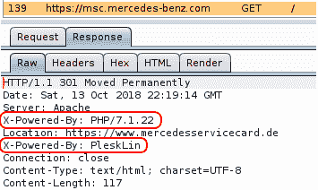

### **3。x-AspNet-版本:**

顾名思义，它显示了 ASP。NET 框架。这些信息可以帮助对手根据框架及其版本微调其攻击。

以下是来自 http://demo.testfire.net[服务器](http://demo.testfire.net)的标题示例

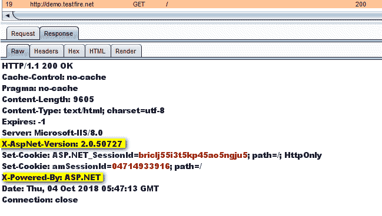

#### **结论**

可以在服务器上配置 HTTP 头，以增强 web 应用程序的整体安全性。这些标头不会使应用程序更加安全，但它们可以防止利用应用程序的潜在漏洞。