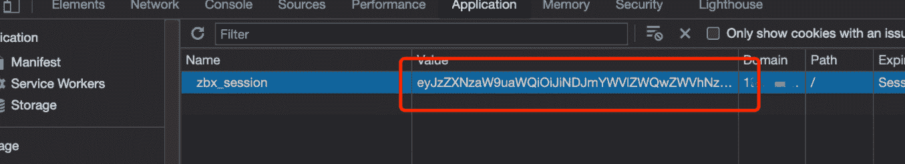
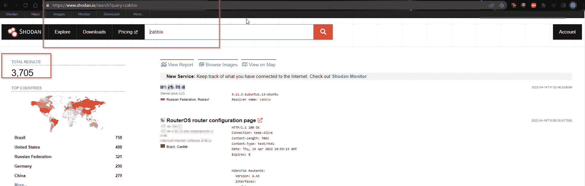
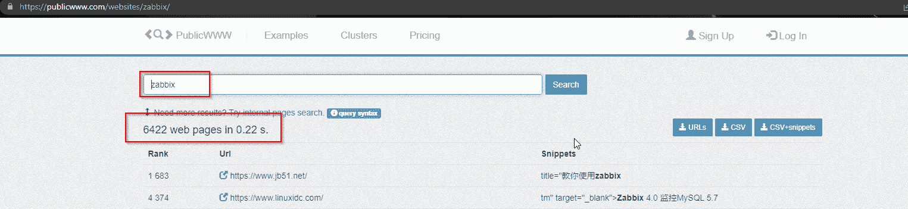
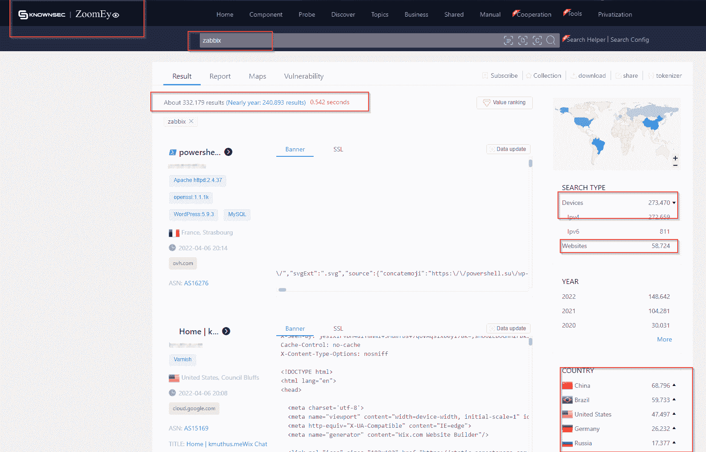

# 如何利用 Zabbix 不安全的会话存储(CVE-2022-23131)| Pentest-Tools.com

> 原文：<https://pentest-tools.com/blog/exploit-zabbix-unsafe-session-storage-cve-2022-23131>

Zabbix 是一个强大的、可配置的开源安全监控平台，它提供了整个 IT 基础设施的全面视图，无论是在内部还是在云中。您可以使用它来收集和跟踪各种设备上的网络流量等指标，其方式与 Nagios 和 Pandora FMS 等其他解决方案类似。

由于 Zabbix 越来越受欢迎，并且可以管理大多数公司的基础设施，它已经成为威胁参与者的一个高调目标。因此，像不安全会话存储漏洞这样的安全问题当然会吸引有动机的网络罪犯。

如果您需要找到可利用的目标，并为您的道德黑客活动收集漏洞验证的证据，那么本指南就是为您准备的！

## 什么是 CVE-2022-23131？

CVE-2022-23131 正在影响 Zabbix，这是一种企业级产品，用作网络安全解决方案，对设备和基础设施组件进行详细监控。更准确地说，它指的是 Zabbix Web 前端，这是一个仪表板，系统管理员使用它来收集指标和配置 Zabbix 服务器。

这是一个正在被高级持续威胁利用的**高危漏洞** ( [**CVSSv3 9.8**](https://nvd.nist.gov/vuln/detail/CVE-2022-23131) )，CISA 也[警告过](https://www.cisa.gov/uscert/ncas/current-activity/2022/02/22/cisa-adds-two-known-exploited-vulnerabilities-catalog)。

Cookies 是许多 CVE 的罪魁祸首，尤其是在 web 应用程序或界面中处理它们的方式。开发人员通常使用 cookies 来存储身份验证数据，这使他们成为攻击者的目标——CVE 就是这种情况。🙂

很难估计数字上的影响，因为 Zabbix 在世界各地广泛传播，其经销商计划传播得更远，因此不太可能被跟踪。但是，可以肯定的是，受此安全问题影响的设备和公司数量不容忽视。

威胁行为者可以通过利用此 CVE 获得对多个基础架构端点的访问权限:

*   **物联网设备**监控和控制工业工作环境中的温度、湿度或空气质量

*   **内部基础设施**

*   **云中的资产**，因为 Zabbix 是一个可以用于这两种情况的解决方案。

## **Zabbix 中的不安全会话存储是如何工作的**

人们可以使用 **SAML 认证**来攻击该漏洞。默认情况下，此功能不启用。尽管如此，它仍然是最常用的 SSO(单点登录)方法之一。这种类型的身份验证经常在企业环境中使用，这种设置实际上是为了增强网络安全性。

存在许多安全标准错误，例如记下密码、为个人帐户重复使用同一个密码或使用易受暴力攻击的弱密码。在这些情况下，用户可能会泄露一个或多个密码。在这种情况下，Zabbix 通过使用 SAML 身份验证降低了密码耗尽的风险，从而增强了网络安全性。

作为一个专注于企业的网络安全解决方案，Zabbix 还从 OS 级监控、网络设备、物联网传感器、数据库、应用程序、云服务、容器、虚拟机等方面收集指标。

损害这种规模的产品可能会导致攻击者拥有对您整个基础设施的**访问权限**，从 Zabbix 监控的所有来源收集数据，并可能获得对这些设备的 SSH/RDP 访问权限，具体取决于您的基础设施设置和 Zabbix 部署。

从攻击者的角度来看，成功利用 CVE-2022-23131 相当简单，需要访问 Zabbix 企业部署。恶意参与者可以**创建一个会话 cookie** ，并使用 SAML 身份验证选项以 Zabbix Admin 特权帐户的身份成功登录。

该漏洞在 Github 上公开[可用。](https://github.com/Mr-xn/cve-2022-23131/blob/main/zabbix_session_exp.py)

在运行生成管理员 cookie 值的漏洞之后，下一步是在您的浏览器开发工具中替换该值，并使用 SAML 身份验证。

## **易受攻击的 Zabbix 版本**

在我们进行研究时，发现的漏洞影响了所有受支持的 Zabbix Web 前端版本，包括 5.4.8、5.0.18 和 4.0.36 版本。

## **CVE-2022-23131 的业务影响**

成功利用 CVE-2022-23131 可导致企业所有者无法访问关键系统、泄露机密信息，并最终造成经济损失。

受影响的基础设施可用于各种恶意目的，如僵尸网络、网络钓鱼活动或滥用公司的受信任地位来利用另一家公司。这是高度危险的，取决于公司的地位和资源。

根据公司的概况，可以创建并公开共享信息泄露、勒索甚至虚假报告，以损害公司的声誉或其他公众形象(例如，通过此 CVE 受到损害的媒体公司，其基础架构用于公开传播虚假信息，可以为这种假新闻提供动力并影响决策者。

该漏洞可能会导致**供应链攻击**，这取决于业务的性质，因为它提供对基础设施设备的访问。

## **如何找到易受 CVE 攻击的目标-2022-23131**

有多种方法可以找到易受攻击的目标，其中一种是使用 Shodan:

在撰写本指南时，对“Zabbix”的搜索产生了 3.705 个结果。

产生的 6422 个网页包括可能易受此 CVE 攻击的 Zabbix 部署。

OSINT 的一个不太受欢迎但同样有趣的选择是 [Zoomeye](https://www.zoomeye.org/) :

虽然没有其他选项受欢迎，但 Zoomeye 产生了相当多的结果:332，179。

## **如何缓解扎比克斯的 CVE-2022-23131**

你现在可以做的第一件事就是将运行 Zabbix Web 前端的实例升级到版本 **6.0.0beta2、5.4.9、5.0.19 或 4.0.37** 来保护你的基础设施。

此外，请注意，如果 Zabbix 部署是使用 SAML 身份验证的**而不是**，那么该漏洞就不适用。

## **未打补丁的系统仍然是企业的痛点**

对于许多安全专家来说，发现安全解决方案易受攻击可能是一个令人震惊的事实。仅仅因为一个产品在设计时考虑到了安全性，并不意味着它是防弹的，这是完全正常的。赛门铁克和网络安全管理软件产品是大公司遭受网络攻击的两个例子，这些攻击对客户和其他组织都有很大影响。

错误发生的事实不会自动降低软件的可信度。然而，供应商修复漏洞的方法真实地证明了他们作为企业和团队是多么成熟和负责任。

尽管一些公司可能已经受到 CVE 的影响，但 Zabbix 仍然是一个遵循许多安全标准的可靠解决方案。安全团队应该致力于实现已经可用的修补程序，以确保他们可以继续安全地使用它。