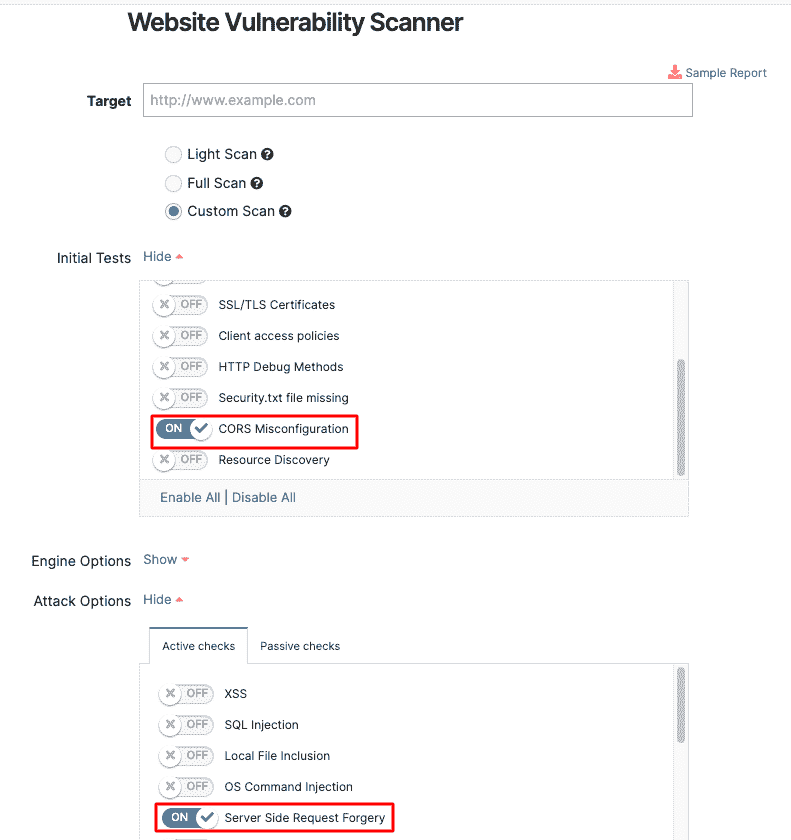
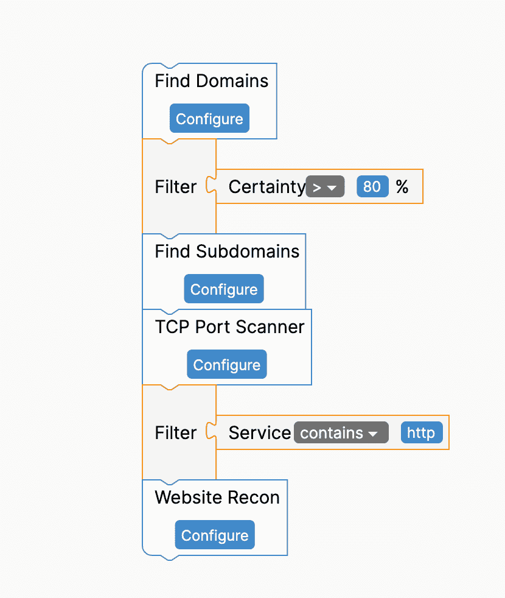
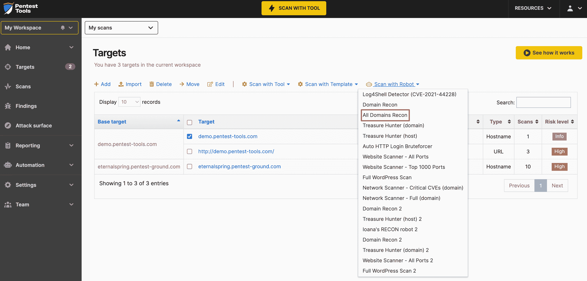
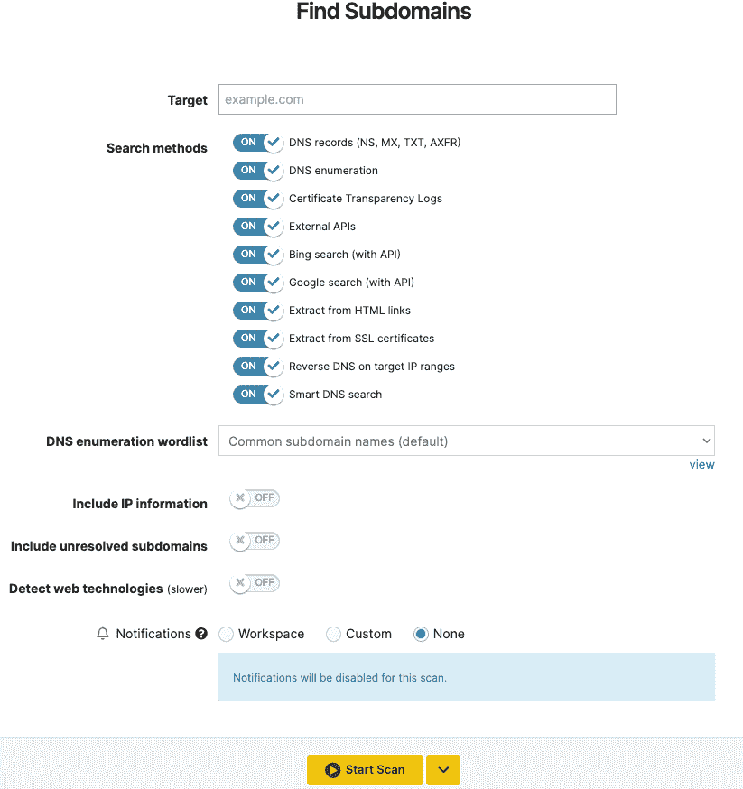

# 二月更新:运行更深入、更全面的扫描| Pentest-Tools.com

> 原文：<https://pentest-tools.com/blog/february-updates-deeper-comprehensive-scans>

支持您的道德黑客活动是我们推出的每一批每月更新所做的事情。

以下是我们的实践方式:

1.  **用狙击手确认 4 个关键 CVE**的开采风险

2.  **使用网络扫描器检测 7 个关键漏洞**

3.  使用我们的网站扫描仪查找 CORS 配置问题&SSTI·沃恩斯

4.  使用**新的 All Domains Recon** 机器人自动化您的工作流程

5.  使用**单词表**和**查找子域**

**让我们来解开这些更新:**

## **1。用 Sniper 确认这 4 个关键 CVE 的可利用性(CVSSv3 得分 9.0+)**

我们的安全研究团队每个月都会继续工作，为最新的高风险漏洞集成新的利用模块。

使用[狙击自动剥削者](https://pentest-tools.com/exploit-helpers/sniper)，你可以在 2 分钟内获得剥削者确认**:**

*   Zabbix 实例中的**关键 RCE 漏洞**。这是 CISA(美国网络安全和基础设施安全局)[目录](https://www.cisa.gov/uscert/ncas/current-activity/2022/02/22/cisa-adds-two-known-exploited-vulnerabilities-catalog)的一部分，该目录包含威胁参与者使用的已知已被利用的漏洞——[CVE-2022-23131](https://nvd.nist.gov/vuln/detail/CVE-2022-23131)(CVS sv3 9.8)

*   影响特定 Apache Struts 2 版本的**高危漏洞**——[CVE-2021-44228](https://nvd.nist.gov/vuln/detail/CVE-2021-44228)(cvss v3 10.0)和[CVE-2021-45046](https://nvd.nist.gov/vuln/detail/CVE-2021-45046)(cvss v3 9.0)

*   Zoho ManageEngine 桌面中心(CVE)中的身份验证绕过漏洞-2021-44515 (CVSS v3 9.8)

## **2。用网络扫描器检测 7 个高危漏洞**

我们的[网络扫描器](https://pentest-tools.com/network-vulnerability-scanning/network-security-scanner-online-openvas)，你可能已经熟悉了，不断得到新的检测模块。

举例来说，您可以扫描您的目标并检查上述 CVEs plus:

使用我们的网络扫描仪中的**全面扫描选项**,获得一份预填有用补救信息的综合报告，以确定您最重要的业务资产的优先级。

## **3。通过 2 个新的网站扫描仪模块实现更好的检测**

我们的[网站扫描器](https://pentest-tools.com/website-vulnerability-scanning/website-scanner)刚刚变得更加强大，增加了两个新的检测模块，分别针对 web 应用中的**(跨源资源共享)错误配置问题和 SSTI(服务器端模板注入)。**

**为了充分利用它，进入**网站扫描器**，添加你的 URL **目标**，选择**全面扫描**。**

**然后，从**初始测试**中启用 **CORS 错误配置**，从**攻击选项中启用服务器端模板注入(主动检查**选项卡)。或者选一个，如果两个都不需要。**

**我们的扫描引擎将分析来自目标的 HTTP 响应，并查找配置错误的 CORS 机制和不正确的输入验证。**

****

## ****4。使用新的 All Domains Recon 机器人**自动化您的工作流程**

**要自动执行这些繁琐的任务，并有更多的时间做自己喜欢的工作，请使用新的 All Domains Recon Pentest 机器人进行集中扫描。**

****全领域侦察机器人**是领域侦察机器人的增强版，从发现目标的所有领域开始。它只过滤高确定性结果(大于或等于 80%)，并继续发现在目标上发现的所有子域。**

**然后，它进行前 1000 个端口扫描和服务发现。最后，它运行网站 Recon 来收集服务、技术和截图。机器人将所有数据聚集在中央，统一[攻击面视图](https://pentest-tools.com/features/attack-surface)。**

****

**要使用它，请转到**目标**，选择**机器人扫描**，并使用新的 All Domains Recon Pentest 机器人运行聚焦扫描:**

****

## ****5。建立你自己的单词表，并使用它来查找子域****

**正如承诺的那样，我们继续为我们的安全工具添加更多的单词表。**

**[查找子域](https://pentest-tools.com/information-gathering/find-subdomains-of-domain)工具现在包括创建你自己的用户名和密码列表或者使用默认列表的选项。**

**这加快了你使用 **DNS 枚举**检测新的子域名的速度。**

**要创建自己的列表，请转到**单词列表**，选择**添加**，并开始添加运行特定测试任务所需的单词列表。**

**创建自定义单词表后，转到**查找子域**，插入**目标**，选择特定单词表，并使用它运行聚焦扫描。仅此而已！**

****

**希望这些更新能让你的工作流程更加顺畅，并帮助你专注于你最喜欢的任务。**