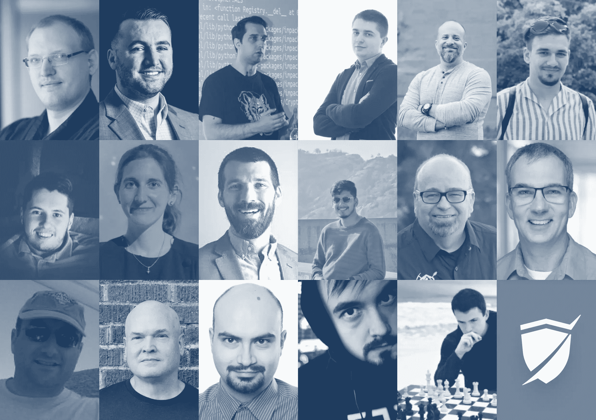
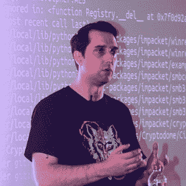

# 17 Infosec 专家谈论渗透测试的未来| Pentest-Tools.com

> 原文：<https://pentest-tools.com/blog/future-of-penetration-testing>

不管你有没有意识到，2022 年已经快过去了。作为攻击性安全专家，我们看到我们工作的某些方面几乎是实时发展的。因此，想要了解 pentesting 可能如何变化，对于做出更好的决策至关重要。

pentesters 会使用更专业的工具进行安全评估吗？

随着该领域的发展，他们将如何改进流程以保持相关性？

敏锐而有建设性的心态足以让他们走上成功之路吗？还有什么？

你会得到所有这些问题的答案，在这个专家综述中，你会得到更多不同的有见地的贡献。

我联系了来自不同行业(教育、金融、网络安全、医疗保健等)的 17 位经验丰富的攻击性安全专家。)来了解他们如何描绘渗透测试的未来。

这些道德黑客分享了关于 pentesting 将如何在 5 个关键的现实世界领域发展的宝贵而微妙的意见:**趋势、培训、流程、心态和工具**。

让我们开始吧！

## 影响测试变革的基本趋势

社会工程是影响渗透测试未来的一个趋势，随后是向标准化、国际冲突和漏洞奖励的转变。

做出贡献的有道德的黑客还认为，pentesting 市场将把重点放在识别供应链中的安全漏洞**上。对于安全团队来说，云安全将成为一个更加重要的领域。[量子计算机](#gabrielle-botbol)的出现也将改变安全专业人员适应新挑战的方式。**

**好奇发现*更多*见解？让我们直接进入安全专家的全部贡献。**

****

**Social-Engineer，LLC |第八层 会议 [的联合组织者|认证 SEPP(社会工程渗透测试专家)的高级团队领导](https://layer8conference.com/)**

> **我相信**渗透测试的未来在社会工程**。我是一个传统意义上的圣灵降临者，我试图从里到外获得对网络的访问。我还负责寻找网站和移动应用程序的漏洞。我通读了 API 文档，并尝试进入无线接入点。虽然这听起来有很多变化，但有一件事让我印象深刻，那就是最终，它还是大同小异。一个没有打补丁的主机会一次又一次地容易受到同样的网络攻击，所以解决办法就是打补丁！一旦漏洞被修补，它就不再脆弱了。**
> 
> **因此，让我们将堆栈上移一点，进入 OSI 模型的非官方第八层，即人类。我喜欢社会工程，因为每个人都是不同的。社会工程没有补丁，同样的攻击或利用也不会每次都奏效。攻击者意识到了这一点，并理解今天的网络边界可能比五年或十年前更加安全。通过易受攻击的员工获得访问权限现在是首选的攻击媒介。在政策、教育、培训和激励全部跟上之前，**渗透测试**和绕过安全控制的未来将通过**社会工程**。**

****

**首席执行官 [Bit Sentinel](https://bit-sentinel.com/ro/) |创始人 [DefCamp](https://def.camp/) |联合创始人[cyber edu](https://cyberedu.ro/)** 

**Andrei 强调了不止一个，而是三个新兴趋势，它们将在渗透测试在未来十年如何发展成为一门学科中发挥重要作用:**标准化**、**国际冲突**和**漏洞奖励计划**。**

**让我们逐一看一下:**

> **1.公司已经变得依赖技术，正因为如此，**标准化是必须的**。这就强制执行了不同行业运营的最低要求。在某种程度上，你可以说它会给渗透测试人员带来更多的工作，你可能是对的。同时，随着时间的推移，最低要求通常会变成推荐要求，根据我的经验，这不足以抵御网络威胁。**
> 
> **2.**国际冲突**迫使行业和政府考虑投资网络安全，尤其是攻击性安全能力。我觉得**这种趋势会发展**，我们将会看到网络安全专家之间越来越多的相互联系，以及政府开发自己的“虚拟导弹”的需求。渗透测试人员和安全研究人员将在这里发挥重要作用。**
> 
> **3.**漏洞奖金**创造了将国际网络安全专家社区作为一个巨大大脑的前提。这可以在某种程度上限制一些恶意组织的影响，因为他们的 0 天不会长时间不被发现。与此同时，bug bounty 为渗透测试人员带来了额外的收入来源，这可以阻止聪明人迁移到更发达的国家。**

****

**渗透测试仪在 [LIFARS](https://www.lifars.com/) |全球前 0.1%在 TryHackMe & HacktheBox。**

> ****云计算正在加速发展**，企业也越来越依赖它。作为一个相对较新的学科，它仍然被许多人误解，并且经常配置不良。目前，云安全工程师和云渗透测试人员非常缺乏，无法满足网络安全市场日益增长的需求。**
> 
> **因此，在未来十年，**云安全可能会成为比本地系统安全更重要的领域**。渗透测试人员不需要关注环境中哪些端口是开放的，而是需要仔细检查云策略的权限和存储服务的配置，并尝试在端口锁定的环境中提升权限。**

****

**[默默无闻实验室](https://obscuritylabs.com/) 的联合创始人兼首席执行官**

> **在未来十年，渗透测试人员将不得不适应威胁形势，渗透测试将从简单的攻击路径转移到**多攻击链场景**，进入对抗性仿真领域(红队交战)。**
> 
> **它将由联邦、州、地方和企业各级各部门的投资推动。安全编码实践、主动防御和监督方面的进步将导致外部利用的减少。我们已经看到这种趋势在过去的 5-7 年中有所体现，通过网络钓鱼获得初始访问权限的情况大量增加，这是造成影响和伤害的必要条件。**
> 
> **这意味着测试市场将会把重点放在主要软件公司和制造商的供应链测试上。我们还将看到评估和向利益相关者报告调查结果所需的技能组合、专业知识水平和工具的变化。**
> 
> **但是，这不会消除不成熟组织的传统测试，需要评估错误配置、修补程序、网络分段和内部安全控制。**
> 
> **虽然人工智能和机器学习在网络安全行业中越来越普遍，以帮助操作员进行静态和主动威胁识别、分析师警报疲劳和漏洞发现，但它们尚未取代工具集背后的操作员。**
> 
> **我不认为这在未来十年里会改变我们工作的进攻和防守性质。**我们还不能代替循环中的人类**！**

****

**演讲者|导师|道德黑客&获奖渗透测试者** 

**Gabrielle 分享了她的实践和教育测试资源(指南、开源工具等。)来帮助攻击性安全专家更好地完成他们的工作。**

**当被问及渗透测试的新兴趋势时，Gabrielle 毫不犹豫地说:**

> ****Quantum** 将在渗透测试未来十年的发展中发挥重要作用**。未来十年，随着量子计算机的上市，我们将迎来另一场数字革命。****
> 
> **在网络安全方面，这一技术进步带来的进步与风险一样多。**
> 
> **量子计算机将不再使用基于操纵 1 或 0 状态的比特的操作，而是基于 0 或 1 状态的叠加。因此，它的计算能力将远远超过我们现在的计算机。**
> 
> **这将为网络犯罪分子的网络攻击提供更多资源。例如，他们将有能力更快地破解密码算法。他们还将更快地解密大量数据，包括通过攻击至关重要的组织来解密公司或社会的最敏感数据。**

**如果你好奇想了解更多关于即将到来的量子计算浪潮的含义，请听这一集有见地的 [黑客人类播客](https://thecyberwire.com/podcasts/hacking-humans/215/notes) 。**

**接下来，我们想知道随着渗透测试行业的发展，infosec 专家将如何通过培训来保持他们的技能。**

## **随着渗透测试的发展，需要使用常青树培训元素**

**根据 IT 安全专家的四条常青树建议，保持你的技能和思维敏捷:** 

**大家多多探索吧！**

****

**高级安全顾问|核心领导 Pentester at[cobalt . io](https://www.cobalt.io/)| infosec 会议的发言人|培训师&Synack 的红色团队成员。**

**以下是他认为需要注意的事项:**

> **持续学习&研究每天出现的最新趋势和攻击是一个重要因素。您将了解一些新的零日或 CVE 软件，您可以测试或有趣的攻击链由研究人员完成，等等。**
> 
> **我在我的 Learn365 挑战中遵循这一点，目标是**学习至少一种新东西**，或者阅读一篇新文章，简而言之，**在 365 天中每天都获得一些知识**。这个个人挑战帮助我成长了很多。**

****

**职业黑客| GIAC 安全专家| Pentest-Tools.com专业服务和渗透测试负责人**

**拉兹万强调了现身并参加 infosec 活动以联系志同道合的同行的重要性( [LinkedIn](https://www.linkedin.com/company/pentesttools) 也是一个很好的地方！).**

> **简而言之:专注于持续学习，接受新的挑战。**
> 
> **长话短说:我喜欢参加许多网络安全社区活动(会议、聚会等)。)和与人交流，了解最新的网络安全趋势。我建议每一个对自己的行业充满热情的人在日常工作之外参加培训、比赛和网络研讨会，包括通过各种平台进行的在线培训。**
> 
> **此外，**在学习的过程中，一定要玩得开心。****

****

**博士|网络安全教育主任|网络安全项目经理 [威胁](https://threatgen.com/) 。 [的主持人干脆 Cyber](https://www.youtube.com/c/GeraldAuger/streams)**

> **我相信**保持最新的行业新闻和更新**是成为一名成功的 pentester 最常青的方面之一。但是你需要把这和技术敏锐度结合起来。安全研究人员和威胁参与者不断寻找和探索新的弱点，以各种方式将技术武器化。**
> 
> **如果五旬节派不能跟上时代的变化，他们就有变得陈腐的风险，技能老化失去效力。他们没有通过现代方法测试客户资产的渗透率，这也给客户造成了伤害。**
> 
> **有许多渠道可以获取当前的威胁情报和新闻，但为了共享一个精心策划的、时间有效的资源，我在每个工作日上午主持了一次为期 45 分钟的每日网络威胁简报会，数百名从业者参加了会议，以获取他们每日所需的情报。随时加入 [这个秀](https://www.youtube.com/c/GeraldAuger/streams) 把这个常青树的做法加入你的日常。**

****

**德拉格斯公司 的主要渗透测试仪。**

> **随着渗透测试领域的发展，保持你的进攻技能和心态的敏锐和灵活是为了在概念和心态上更适应远离陆地的生活。我最近注意到一个趋势，似乎有更多的焦点放在**学习各种各样的策略、技术和程序**(TTP)上，涵盖了非常广泛的设备、服务等。以及利用它们的工具。**
> 
> **收集所有这些 TTP 肯定会在某个时候让你或你团队中的某个人受益，但不能保证它现在就能让你受益。**
> 
> **在漏洞评估中，有时您无法根据参与规则引入第三方工具或漏洞，甚至可能会看到您从未见过的东西。**
> 
> **理解生活在陆地上的概念、您正在评估的系统，并培养一种能够利用诸如网络上的现有通信、资产上安装或存储的内容等事物的适应性思维。**
> 
> **它们不仅对这些案例有更好的好处，而且对您将要进行的所有渗透测试评估都有好处。**
> 
> **此外，这进一步使您有机会向客户展示和了解他们环境中的潜在疏忽和/或错误配置。**

## **改进您的流程和交付高质量服务的方法**

**没有[对人](#alexei-doudkine)的投资，你就无法实施流程改进。但是你可以通过[阅读技术博客文章](#daniel-bechenea)、评论和 bug-bounty 报告来改进你的方法论(例如 OWASP)。**

**永远记得[在行业内建立关系](#chris-gates)并关注商业影响，以提供更好的道德黑客评估。**

**在下面探索我们的贡献者的全部见解。**

****

**联合创始人|进攻安全总监 [Volkis](https://www.volkis.com.au/)**

> **有个简单的答案:**人！****
> 
> **一切从人开始。信息安全是不断变化的，除非你热爱它，否则跟上信息的步伐是令人生畏的。我们的团队对 infosec 充满热情，热爱他们所做的事情，这意味着学习这些新事物不再是一件苦差事，而是更加有趣。**
> 
> **重要的是要记住，信息安全只是其中的一个方面。它不存在于真空中。我们必须深入了解我们的客户围绕 infosec 的目标，以及他们如何与其他行业甚至同行业的竞争对手区分开来。例如，勒索软件在 10 年前几乎不存在，而现在，它是大多数组织最大的担忧。**
> 
> **“这就是一直以来的做法”在 Volkis 是被禁止的。如果有更好的方法，我们的内部流程、报告风格和先入之见总是需要讨论和改变。我们定期回顾我们所做的事情，故意唱反调，看看我们是否能做得更好。**

****

**Pentest-Tools.com OSCP |安全研究主管|产品负责人**

> **在渗透测试环境中保持最新是具有挑战性的。每天都有新技术发布，你必须筛选出哪些是有价值的，哪些不是。通过阅读技术博客文章、评论和漏洞报告，我不断尝试改进我的方法。**
> 
> **在我看来，任何 pentest 项目的一个重要过程是侦察和漏洞发现阶段的自动化。你必须**开发一个能够交付高质量结果的自动化流程**，把手工测试(和有趣的部分)留在你的手中。**
> 
> **对于每一个新的项目，您必须至少学习一种新技术，以及如何处理特定的技术或框架。**

****

**[Robinhood](https://robinhood.com/us/en/) 的高级进攻安全经理**

> **通过关注 Twitter 上的 infosec 专家和你公开发现的研究，努力跟上渗透测试的新兴趋势。确保你参加或观看会议讨论。采取(较小的)供应商推介，看看他们正在解决什么问题。主要供应商通常不会创新。他们购买创新的小公司。**
> 
> **从战略的角度来看，**与年轻或职场新手建立关系**，并定期与他们讨论他们的挑战以及他们在工作/垂直行业中的追求。**
> 
> ****在社区中建立关系**与人们交谈，了解他们面临的挑战。你需要花时间来指导和填补知识空白。**
> 
> **记住这一点:**影响，影响，影响** -如果你**关注影响，**你也将交付高质量的服务。**
> 
> **要有策略，平衡你在当前职位上需要学习的内容和你在未来职位上需要/想要学习的内容，或者你认为未来会发生的事情(例如测试 web 3/区块链服务/产品)。**

**他还强调:**

> **问自己以下 5 个问题:**
> 
> 1.  **我会进入 [倦怠期](https://www.mayoclinic.org/healthy-lifestyle/adult-health/in-depth/burnout/art-20046642) 吗？**
>     
>     
> 2.  **我在身体上、精神上、情感上和精神上照顾好自己了吗？**
>     
>     
> 3.  **我是在做让我兴奋的事情还是为了钱？**
>     
>     
> 4.  **我在担心我的 [控制圈](https://www.instagram.com/p/ChaOUmTuuCw/) 之外的事情吗？**
>     
>     
> 5.  **我努力实现的 [够大](https://instagram.com/p/CiiSiKlOPn4/) 吗？**

## **随着学科的发展，帮助你成长的关键思维特征**

**[持续的适应](#joff-thyer)是一种需求，但混合着[对进攻性安全领域的好奇心](#phillip-wylie)。无论你是提供渗透测试服务、审计，还是处理漏洞扫描，[关注最新的行业新闻](#cristian-cornea)和更新也会让你在该领域保持相关性。**

**不要错过安全专家分享的这 3 个关键见解。**

****

**渗透测试人员|讲师|开发人员|研究员 [黑山信息安全](https://www.blackhillsinfosec.com/)**

> **思维特征很简单...“不断适应和变化是要求”。**

****

**渗透测试员|讲师|主讲人|发表作者| [黑客工厂播客](https://www.itspmagazine.com/the-hacker-factory-podcast) 主持人**

> **让我在攻击性安全领域保持相关性的思维特征是好奇心。技术和安全世界是动态的，不断变化的。**
> 
> **光有好奇心并不能让我保持相关性。它需要持续的教育和跟上行业的发展，包括最新的技术、工具和技巧。**

****

**渗透测试专家| OSEP | OSWE | OSCP | CEH | CPTC | PenTest+| zero tak Security 的创始人**

**多年来让我走上正确道路的一个主要观点是**在我的舒适区之外寻找安慰**(这听起来很奇怪，对吧？).你应该在适应的同时尽可能多地进化！**

> **不要因为你知道某个课程是一个众所周知的行业，但是你讨厌去做，就去上这个课程。相反，这样做是因为你喜欢这个话题，你对学习新事物充满热情。**
> 
> **技术在变，你也应该变！让我问你一个问题，让你自己思考一下:如果区块链和虚拟现实正在普及，并且网络在那个时候不再是一个东西，那么 10 年后所有的网络渗透测试人员会发生什么？**
> 
> **当您思考 Cristian 的问题时，让我们看看我们探索的渗透测试的另一个重点领域。所有帮助攻击性安全专家改进工作流程和自动化繁琐任务的工具。**
> 
> **要明白[为工作选择正确的工具](#peter-bassil)需要时间和经验。从工具中学习并依赖它们的最好方法之一是[读取它的代码](#sacha-ikvenko)并监控它，看看它在网络级别是如何工作的。**

****

**CISO |研究员|网络安全发言人 [刺猬安全](https://hedgehogsecurity.co.uk/) |直布罗陀认证中心经理|加州理工医疗服务中心 CISO**

**关于工具，要记住的最重要的事情是，它们仅仅是你工具箱中的一个工具。总有一个合适的能胜任工作，也有一个不合适的。**选择合适的工具需要时间和经验**。**

> **举个例子，找出网络上所有活动的主机是一件简单的事情。我带着我的实习生经历了三个不同的实验室环境，每一个都越来越难列举出主机。令人惊讶的是，新测试人员经常依赖 Nessus、OpenVAS 或类似的输出。**
> 
> **即使 Nmap 也确实总是正确的，除非您了解所有不同的交换机。有时，简单的工具，如 ARP，可以告诉你什么阻碍了你正在使用的扫描仪。有时你不得不卷起袖子，用一些 tcpdump 动作把自己弄得脏兮兮的。**
> 
>  ****圣灵降临者需要精通他们的工具**。就像铁匠是锤和火的大师，他们的工作介质是金属，圣灵降临节必须是他们工具的大师。**
> 
> ****

**网络威胁情报和攻击性安全专家** 

**漏洞利用工具是具有附加功能的功能性概念验证。**

> **从它那里学习和依赖它的最好方法是阅读它的代码并监视它，看看它在网络级别是如何工作的。**
> 
> **当阅读工具源代码时，我喜欢找到触发漏洞的代码行。用这种方法我学到了很多。**
> 
> **当阅读工具源代码时，我喜欢找到触发漏洞的代码行。用这种方法我学到了很多。**

**始终以学生的心态对待渗透测试**

## **我希望阅读这 17 个观点能激发你对 pentesting 如何发展的新想法，以及你如何更好地将这些见解整合到你的安全测试工作中。**

**非常感谢**所有抽出时间分享专业知识和经验的攻击性安全专家**！他们慷慨的分享帮助我们看到了渗透测试行业十年后的样子。**

 **我计划保持这篇综述的开放性，并更新更多 infosec 同行的意见，因此，**如果你想投稿，请随时联系**。我将非常乐意 [收到你的](https://pentest-tools.com/about) ！**

 **我计划保持这篇综述的开放性，并更新更多 infosec 同行的意见，因此，**如果你想投稿，请随时联系**。我将非常乐意 [收到你的](https://pentest-tools.com/about) ！**