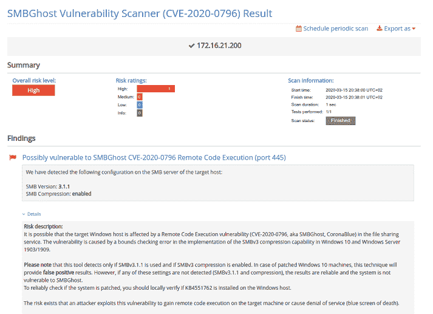

# 如何用 Pentest-Tools.com 检测微软 SMBGhost 漏洞| Pentest-Tools.com

> 原文：<https://pentest-tools.com/blog/how-to-detect-microsoft-smbghost-vulnerability>

在过去的几周里，在微软服务器消息块 3.1.1 (SMBv3)中发现的一个严重的 RCE 漏洞一直让微软用户和安全社区保持警觉。

为了帮助我们的客户更好地检测他们的 Windows 主机是否受到严重的 SMBGhost 漏洞的影响，**我们在 Pentest-Tools.com 上开发并添加了[一个新的专用扫描器](https://pentest-tools.com/network-vulnerability-scanning/network-security-scanner-online-openvas)。**

正如你现在可能知道的，我们并没有为每个突然出现的漏洞创造新的工具。这是促使我们构建新扫描仪并扩展平台的原因。

这个漏洞特别严重，因为它是**“可蠕虫化的**”，并且有可能通过内部网络从一个易受攻击的系统快速传播到另一个系统。更有甚者**，该漏洞让人想起导致 WannaCry 爆发的[永恒蓝色漏洞](https://research.checkpoint.com/2017/eternalblue-everything-know/)** 。

## **1。我们对 SMBGhost 漏洞的了解**

2020 年 3 月 10 日，在其月度补丁星期二期间，微软泄露了一个严重的 SMB 漏洞的信息，该漏洞是由安全研究人员意外发现的。

被跟踪为 [**CVE-2020-0796**](https://cve.mitre.org/cgi-bin/cvename.cgi?name=CVE-2020-0796) 的 RCE 漏洞存在于微软服务器消息块 3.0 (SMBv3)处理某些请求的方式中。

微软 SMB v3.1.1 是一个主要用于新操作系统的协议，这意味着它会影响运行以下操作系统的机器: **Windows 10** (版本 1903 和 1909)和 **Windows Server** (1903 和 1909)。

该漏洞不会暴露 Windows 7、8 或 8.1 等旧版本，因为它们不支持 SMBv3.1.1 压缩。

为了利用这一漏洞，一名未经认证的攻击者向目标 SMBv3 服务器发送特制的数据包，并“说服用户连接到它”，微软在 T2 安全顾问更新中表示。

成功利用该漏洞可能允许黑客在目标 SMB 服务器或 SMB 客户端上执行代码。然而，在我们发表这篇文章之前，一个有效的 RCE 漏洞还没有被发现。考虑到 Windows 内核中实现的现有安全措施，创建一个似乎很困难。

对该漏洞的深入[技术分析](https://www.mcafee.com/blogs/other-blogs/mcafee-labs/smbghost-analysis-of-cve-2020-0796/)得出结论，某些 SMB 数据包可能会导致缓冲区溢出，并通过获得 BSOD(蓝屏死机)消息使 Windows 主机崩溃。

创建拒绝服务攻击(BSOD)的 [**概念验证**](https://github.com/maxpl0it/Unauthenticated-CVE-2020-0796-PoC) 已经**可用，**包括来自安全研究人员的简短[演示视频](https://twitter.com/kryptoslogic/status/1238057276738592768)。

我们使用该工具的目的是使发现您的 Windows 计算机是否存在暴露于 SMBGhost 漏洞的风险变得容易。

我们开发的  [**SMBGhost 扫描器**](https://pentest-tools.com/network-vulnerability-scanning/network-security-scanner-online-openvas)**检查目标主机的 SMB 版本**以识别**SMB 服务是否启用了压缩**。它首先扫描 Windows 文件共享服务通常使用的 TCP 445 端口。

扫描仪还允许您**检测*不*易受攻击**的 Windows 主机(例如，它们不支持 SMBv3.1.1 或它们禁用了 SMBv3 压缩)。

为了验证这些设置，我们的工具尝试启动与目标服务器的 SMB 协商，提出 SMB 版本 3.1.1 方言:`0x0311`和启用压缩的`NegotiateContextCount: 2`。如果 SMB 响应数据包包含建议的设置，我们的扫描器会声明目标可能易受 SMBGhost 攻击。

**下面是 SMBGhost 扫描的示例报告:**

## **3。使用此更新保护您的 Windows 主机**

微软已经发布了针对 SMBv3 协议中发现的漏洞的**安全补丁**，称为 [KB4551762](https://support.microsoft.com/en-us/help/4551762/windows-10-update-kb4551762) ，用于 Windows 10 1909 版本和 Windows 10 1903 版本的更新。我们建议尽快应用这些软件更新！

在一份安全公告中，该公司还提供了一些 [**变通方案**](https://portal.msrc.microsoft.com/en-us/security-guidance/advisory/ADV200005) **来禁用 SMBv3 压缩**或**阻塞 TCP 端口 445** 。

## **4。使用 SMBGhost 扫描器发现易受攻击的 Windows 主机**

我们创建了这个**扫描器**来帮助您轻松扫描 Windows 主机并检测这个 RCE 漏洞。无论您是系统管理员还是安全顾问，您都可以 [**使用该扫描器**](https://pentest-tools.com/network-vulnerability-scanning/network-security-scanner-online-openvas) 执行简单的安全测试**并检测您的 Windows 机器是否受到 SMBGhost 漏洞的影响。**