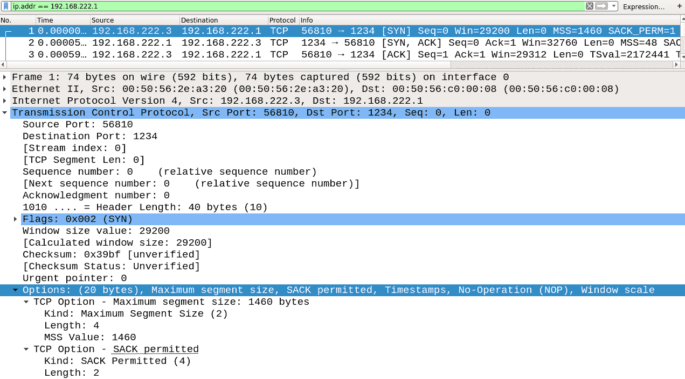
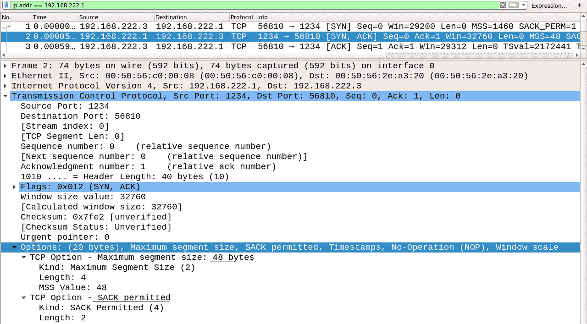
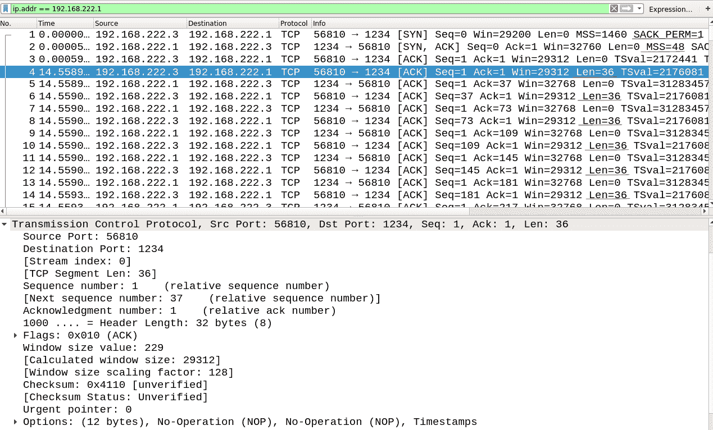

# 如何检测与 Wireshark | Pentest-Tools.com 麻袋恐慌漏洞

> 原文：<https://pentest-tools.com/blog/how-to-detect-sack-panic-vulnerability-wireshark>

Pentest-Tools.com 的安全团队最近对 SACK Panic 漏洞(于 2019 年 6 月首次披露)进行了深入分析，以找出其对 Linux 机器的可利用性。

在这项研究中，我们发现了一种使用 Wireshark(流行的网络流量分析器)检测易受攻击的服务器的新方法。

本文提供了有关 SACK Panic 漏洞的详细信息、一种新的检测方法，以及一组针对 SACK Panic 推荐的缓解措施。

虽然影响似乎仅限于[拒绝服务](https://www.us-cert.gov/ncas/tips/ST04-015)攻击，但这个问题需要得到解决，以使用户了解这些缺陷如何破坏他们的网络基础设施，以及为什么修补是必不可少的。

## **1。关于 SACK 恐慌漏洞的关键细节**

现已发现三个安全缺陷，这些缺陷与 TCP 选择性确认数据包的操作以及较低的最大段大小(MSS)值有关。

您可以跟踪以下 CVE 发现的三个漏洞:

[**CVE-2019-11477**](https://cve.mitre.org/cgi-bin/cvename.cgi?name=CVE-2019-11477)——这就是**实际造成**内核恐慌的漏洞。

[**CVE-2019-11478**](https://cve.mitre.org/cgi-bin/cvename.cgi?name=CVE-2019-11478) 和 [**CVE-2019-11479**](https://cve.mitre.org/cgi-bin/cvename.cgi?name=CVE-2019-11479) 影响较小，仅产生密集的资源使用和潜在的拒绝服务攻击。

为了更好地理解 SACK 恐慌，我们需要浏览以下这些定义:

**TCP 选择性确认** ( **SACK** )是 TCP 使用的一种技术，用于帮助缓解由于重新传输丢失的数据包(段)而导致的拥塞。

**最大段尺寸** ( **MSS** )是在数据包的 TCP 报头中设置的参数，指定了包含在重构的 TCP 段中的数据总量。

**通用分段卸载** ( **GSO** )是一种纯软件卸载，处理设备驱动程序因缺乏硬件支持而无法执行卸载的情况。

在传统方式中，数据将被分割成小的独立数据包，并逐个通过网络堆栈。GSO 使用网络堆栈和一个包含所有数据的大数据包。如果你想深入了解，你可以在这里阅读更多信息。

## **2。麻袋恐慌如何发生**

SACK Panic 选项代表选择性确认。这是一种更智能的 TCP 机制，旨在消除冗余数据。它是在 1996 年由 2018 年的[征求意见(RFC)文件](https://tools.ietf.org/html/rfc2018)引入的。

TCP 是一种面向连接的协议，在传输数据的过程中，它被分割成最大段大小(MSS)的段。这是在 SYN 数据包中的连接开始时协商的，其中会考虑最低的 MSS 值。

在演示部分，我们将讨论作为“发送者”和“接收者”的两个系统。

由于各种原因，在传输过程中，可能会发生另一端无法接收到数据包的情况。在这种情况下，在 SACK 被引入之前,“发送者”必须重新发送一整窗口的数据包，以便接收者只得到没有发送的数据包。

例如，假设一个“发送者”有 10 个数据包，而“接收者”得到了除数据包 4 和 7 之外的所有其他数据包。然后，在下一个 ACK 系统中,“接收者”可以附加一个 SACK 选项，声明它从 1-3 接收到分组；5 和 6；8-10.因此，“发送者”将只需要重新发送 2 个包而不是 10 个。

为了控制所有的传输和重传队列，Linux 内核使用了一个名为 sk_buff 的结构。

[结构 sk_buff](http://vger.kernel.org/~davem/skb_data.html) 保存数据，并且可以包含不同层的报头。

这个结构有一个名为 [struct tcp_skb_cb](https://elixir.bootlin.com/linux/v5.1.12/source/include/net/tcp.h#L797) 的相关控制缓冲区，用于跟踪 tcp 数据包的不同方面。

在该控件中，还包括结构，以及段数或片段数( **tcp *gso* segs** )，显示如下:

```
struct tcp_skb_cb {
  __u32 seq; /* Starting sequence number /
  __u32 end_seq; / SEQ + FIN + SYN + datalen /
  __u32 tcp_tw_isn;
  struct {
    U16 tcp_gso_segs;
    U16 tcp_gso_size;
  };
}
```

这个 tcp *gso* segs 字段是一个无符号双字节整数，并将其限制为 65536 (64K)。

此处[定义为](https://elixir.bootlin.com/linux/latest/source/include/linux/skbuff.h#L302):

```
#define MAX_SKB_FRAGS (65536/PAGE_SIZE + 1)
```

一个 **sk_buff** 中 Linux 上的最大碎片数(PAGE_SIZE = 4096)正好是 17 个碎片。

每个数据片段最多可有 32KB，因此 sk_buff 中最多可保存 17 * 32K 字节的数据。

从这里开始，**低 MSS** 开始发挥作用。如果我们将 MSS 值设置为**48**(Linux 上 TCP 连接的最小值)，并且 **TCP 选项**聚集 40 个字节的 MSS 值，我们可以创建小至 **8 个字节的数据段**。

考虑到 sk_buff 中的最大数据为 17 * 32KB，将其除以仅仅 8 个字节，我们得到 [69632](https://www.google.com/search?q=17+*+32+*+1024+%2F+8) 个段。

查看 tcp *gso* segs 中达到 64K 的段限制，我们可以很容易地观察到潜在的溢出。

SACK 背后的机制允许我们在 TCP 的重新传输过程中合并数据包，并组合多个 SKB 队列，从而产生潜在的 17 个数据包 SKB。

```
static bool tcp_shifted_skb (struct sock *sk, …, unsigned int pcount, ...) {
   tcp_skb_pcount_add(prev, pcount);
   BUG_ON(tcp_skb_pcount(skb) < pcount); <= Things go south
   tcp_skb_pcount_add(skb, -pcount);
}
```

在这个源代码[代码](https://elixir.bootlin.com/linux/v5.1/source/net/ipv4/tcp_input.c#L1269)中，如果 TCP 片段达到 17，tcp gso_segs 整数溢出，就会触发 BUG *ON()调用。*

## **3。如何用 Wireshark 检测 SACK 死机**

为了检测目标服务器是否易受攻击，我们将使用 Wireshark。我们将这两部分称为客户端、您的端点和目标。

在我们的测试中，客户端的 IP 地址是 192.168.222.1，目标的 IP 地址是 192.168.222.3

在我们开始之前，**让我们在客户端做一个快速设置**:

*1。设置你的 MSS 选项*

将“advmss”选项添加到通往目标的路线中。

```
$ ip route change your_ip_route advmss 48
```

*2。确保 SACK 已打开:*

```
$ cat /proc/sys/net/ipv4/tcp_sack
```

如果它返回 1，那么它是开的。

*3。打开 Wireshark 并开始监听。*

```
$ wireshark OR Turn on Wireshark via GUI.
```

选择接口，并为 IP 设置过滤器，如下所示:

```
ip.addr == client_ip OR target_ip
```

*4。使用以下命令启动从客户端到服务器*的 TCP 连接:

可以使用 nc -lvp 端口；nc ip _ 目标端口。或者，您可以在目标网站上尝试 HTTP GET。

```
On the target:
$ nc -lvp 1234

On the client:
$ nc 192.168.222.3 1234
```

**注意**:别忘了换 IP。

进一步进行实际检测:



在上图中，您可以看到客户端的选项应该是什么样子。重要的是 MSS options 值是 48，SACK-permitted 选项是 on。



这是易受攻击的目标的反应。它显示 SACK 选项已启用。在这种情况下，如上一章所述，MSS 通常默认设置为所用的最低 MSS 值。



一些网站不尊重 MSS 协商，所以你需要检查流量是否被限制在 48 字节以内。如您所见，TCP 数据的长度(' Len = x ')被限制为 36，因为 TCP 选项有 12 个字节。

概括地说，如果 SACK 在双方都被允许，并且 MSS 协商将数据限制为 48 字节减去选项，那么系统就是易受攻击的。

当然，您可以使用以下命令来检查 Linux 版本:

这将对 Linux 版本进行指纹识别，并对漏洞进行双重检查。

## **4。如何缓解 TCP SACK 恐慌漏洞**

为了防止您的系统易受这些攻击并提高其安全性，应用以下修复程序之一是非常重要的:

**修复#0:** **给你的系统打补丁**。

确保您在此处应用了可用的最新补丁[或简单地运行以下命令:](https://github.com/Netflix/security-bulletins/blob/master/advisories/third-party/2019-001.md)

```
$ sudo apt-get dist-upgrade
```

**修复#1:** **使用过滤器阻止低 MSS 的连接。**

这些过滤器可能会中断依赖于此设置的合法连接，因此在应用它们时要小心。

```
 $ iptables -t mangle -A PREROUTING -p tcp -m conntrack --ctstate NEW -m tcpmss ! --mss 536:65535 -j DROP
```

**修复#2** : **禁用麻袋处理**

为此，您必须是超级用户，因为普通管理员用户没有权限更改该值。

```
$ echo 1 > /proc/sys/net/ipv4/tcp_sack
```

请记住，上面提到的安全措施之一应该足以缓解 TCP SACK Panic 漏洞。没有必要全部应用*它们。*

## **有兴趣了解更多？**

以下是我们为您挑选的一些关于麻袋恐慌的相关文章和资源: