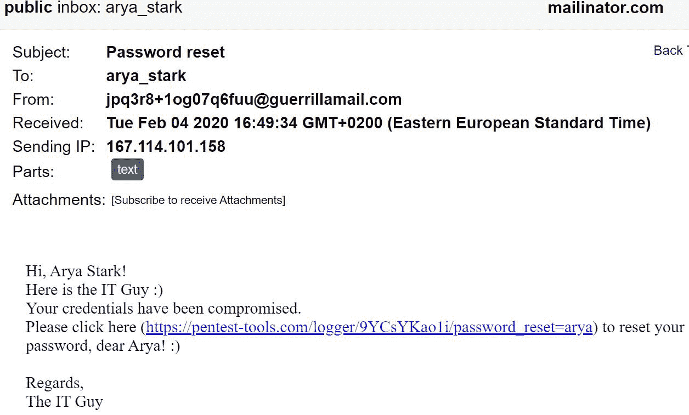
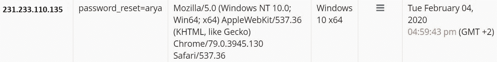
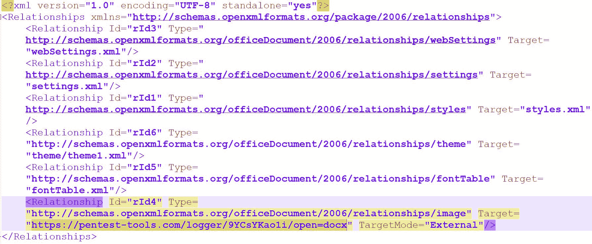

# 如何用 HTTP 请求记录器模拟网络钓鱼攻击| Pentest-Tools.com

> 原文：<https://pentest-tools.com/blog/how-to-simulate-phishing-attacks-with-http-request-logger>

作为一名渗透测试人员或红队安全顾问，当您希望**使用社会工程技术模拟网络钓鱼攻击**时，您可能会面临许多挑战。

从引诱受害者点击链接或打开 Word 文档，到监控谁点击了网络钓鱼链接、时间和次数，有大量的策略和细节需要考虑。

因为我们团队的目标是通过提供合适的工具来简化您的工作，所以我们编写了一份您可以立即使用的实践指南！

请继续关注我们，探索这些**实际场景**，在这些场景中，**可以使用 [HTTP 请求记录工具](https://pentest-tools.com/exploit-helpers/http-request-logger)******更快**更有效地部署网络钓鱼活动。**

**让我们开始吃吧！**

## ****什么是 HTTP 请求记录器？****

**[HTTP 请求记录器](https://pentest-tools.com/exploit-helpers/http-request-logger)是一个工具，可以让你轻松地创建唯一的 HTTP 端点(处理程序)，它可以**记录收到的所有请求**，包括源 IP、用户代理、URL 参数、时间戳等。**

**爱马仕**

```
`https://pentest-tools.com/logger/<10_chars_random_string>/<optional_parameters>`
```

**“10 个字符的随机字符串”属性使得 HTTP 处理程序是独一无二的，这意味着**没有其他 Pentest-Tools.com 用户可以访问它**(除非他们知道确切的 URL)。此外，可选参数是网络钓鱼活动中 URL 的重要组成部分。**

**您可以使用相同的 HTTP 处理程序根 URL 非常容易地为每个受害者定制特定的 URL。**

**例如，假设有三个目标:约翰·斯诺、艾莉亚·史塔克和詹姆·兰尼斯特。您可以为这三个目标中的每一个目标向 HTTP 处理程序添加一个自定义参数。通过这种方式，您将获得三个**不同且有效的网络钓鱼网址**，它们会告诉您受害者点击链接的时间和次数。**

**URL 可能如下所示:**

```
`https://pentest-tools.com/logger/<10_chars_random_string>/victim=John_Snow
https://pentest-tools.com/logger/<10_chars_random_string>/victim=Arya_Stark
https://pentest-tools.com/logger/<10_chars_random_string>/victim=Jaime_Lannister`
```

**HTTP 处理程序的**生命周期为 60 天**，剩余时间到期后，它将不再记录收到的请求。**

### ****如何生成 HTTP 记录器****

**在深入一些实际例子之前，下面是如何创建 HTTP 处理程序的**:****

**登录你的 Pentest-Tools.com 账户后，进入**工具- >漏洞助手&工具- > HTTP 请求记录器**并将其**标签**设置为所需值。**

**新创建的处理程序将如下所示:**

****

## ****场景# 1–如何检查谁点击了网络钓鱼链接****

**您可以使用 [HTTP 请求记录器](https://pentest-tools.com/exploit-helpers/http-request-logger)来模拟网络钓鱼攻击。**

**为了展示它是如何工作的，让我们使用三个著名的目标:艾莉亚·史塔克、约翰·斯诺和杰米·兰尼斯特。**

**在这个演示中，我们使用[mailinator.com](https://www.mailinator.com/)为他们创建了一次性电子邮件地址。我们还利用[guerrillamail.com](https://www.guerrillamail.com/)为“IT 人”创建了一个虚假的电子邮件地址，该地址会试图说服受害者点击钓鱼链接。**

**让我们假设艾莉亚收到了以下邮件:**

****

**注意，我们为艾莉亚·史塔克创建了一个定制参数( **password_reset=arya** )。这样，我们就可以准确地统计出**她点击了**多少次链接，从哪个 **IP 地址**，使用了什么**操作系统**(基于受害者浏览器设置的用户代理)。**

****

****

**此外，我们可以**检查 HTTP 头**请求包括:**

****

**按照同样的模式，我们模拟出约翰·斯诺和杰米·兰尼斯特也是这次网络钓鱼攻击的受害者。**

**您还可以通过其他更分散的方式嵌入钓鱼链接！您可以使用图像、跟踪像素等等，但是这些技术将在另一篇文章中讨论。**

**我们的工具会持续监控目标是否被说服、被说服了多少次以及何时被说服。无论何时你考虑，你可以**导出这些结果在[一个 PDF 报告文件](https://pentest-tools.com/usage/pentest-reporting-tool)** 。**

****

## ****场景# 2–使用 Word 文档的高级网络钓鱼攻击****

**在这个场景中，我们计算了有多少受害者试图打开发送到他们电子邮件地址的 Word 文档。我们没有在文档中放置任何宏，我们只嵌入了一个从外部 URL(我们的 HTTP 处理程序)加载的图片对象。**

**每次用户打开文档时，Microsoft Office 都会向我们的处理程序发出 HTTP 请求来加载图像，从而泄露用户的 IP 地址和其他详细信息。**

**为了制作一个欺骗性的文档，从一个空的 docx 文件开始，按 CTRL+F9 嵌入一个外部对象。**

**您将看到`{ }`出现。**

**右键单击它，然后转到“编辑字段…”**

****

**创建如下所示的请求字段(字段名-> include picture；URL:[https://pentest-tools.com/logger/9YCsYKao1i/open=docx](https://pentest-tools.com/logger/9YCsYKao1i/open=docx)，勾选“数据未随文件存储”，点击确定:**

****

**接下来，将“图像”的大小调整为 1×1 像素，这样它就看不见了，很容易被受害者发现。保存文档并将其发送给受害者。**

**一旦他们打开它，请求就会被执行。您可以立即在仪表盘中查看结果！**

****

**如果您试图**分析当您嵌入外部图像资源时在幕后**发生了什么，您可以打开。带有 7-zip 文件的 docx 文件，并转到 file . docx \ word \ _ rels \ document . XML . rels 文件。**

****

**从这里，您可以观察 id 为 **rId4** 的 Relationship 参数，它包括我们设置为目标的 HTTP 请求记录器链接。此外，TargetMode 参数的值为“External”。**

****专业提示**:这种网络钓鱼场景的关键思想是**受害者必须打开收到的 Word 文档**。**他们不必启用宏或点击任何“确定”按钮**。这表明用户很容易被诱骗点击链接或打开文档，而没有意识到网络钓鱼攻击。**

****使用 HTTP 请求记录器进行更简单、更快速的网络钓鱼测试****

**现在，您已经看到了这些实际场景，在这些场景中，您可以使用 HTTP 请求记录器来使您的工作更加简单和快速，您已经准备好开始了！**

**我们构建这个工具是为了简化您的工作流程，无论您是 pentester 还是安全顾问，它提供了一个定制的 HTTP 服务器，可以在一个地方记录和显示所有的 HTTP 请求。**

**您可以使用该工具**更好地模拟网络钓鱼攻击**和**执行更快的安全测试。****

**如果您觉得这个简短的教程很有用，请不要犹豫，在您未来的渗透测试中使用 HTTP 请求记录器工具为您的客户创造更好的安全意识！**

#### ****本指南中提到的工具:****