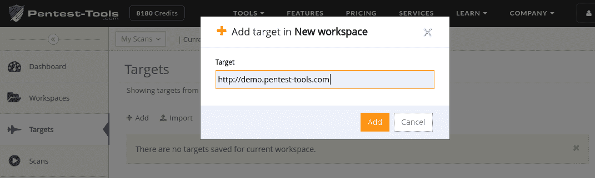
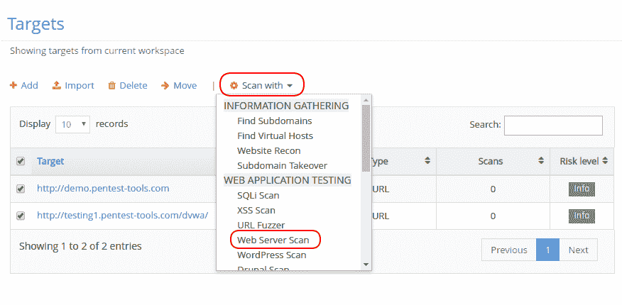
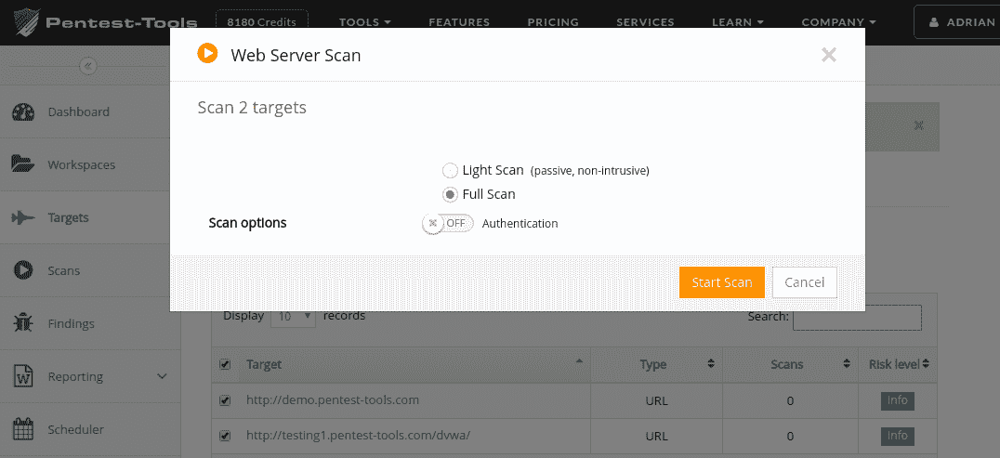
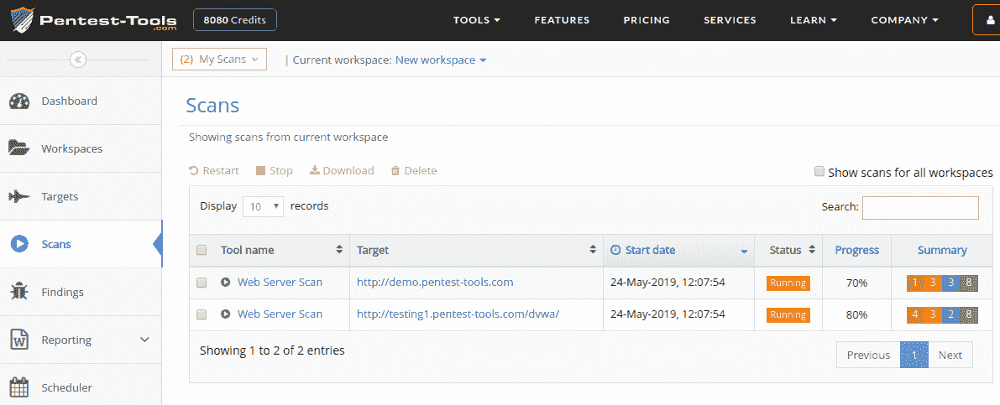
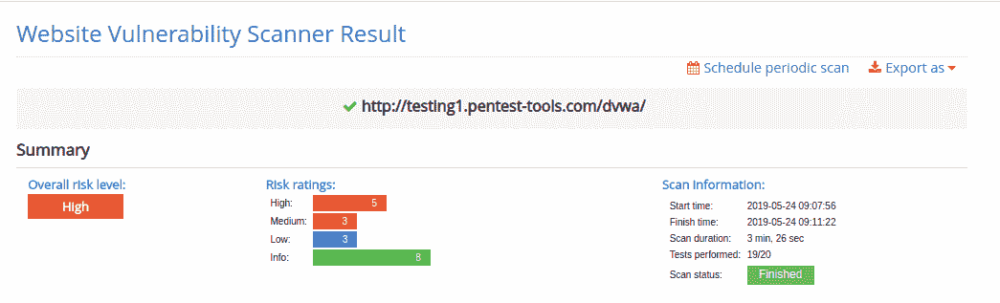
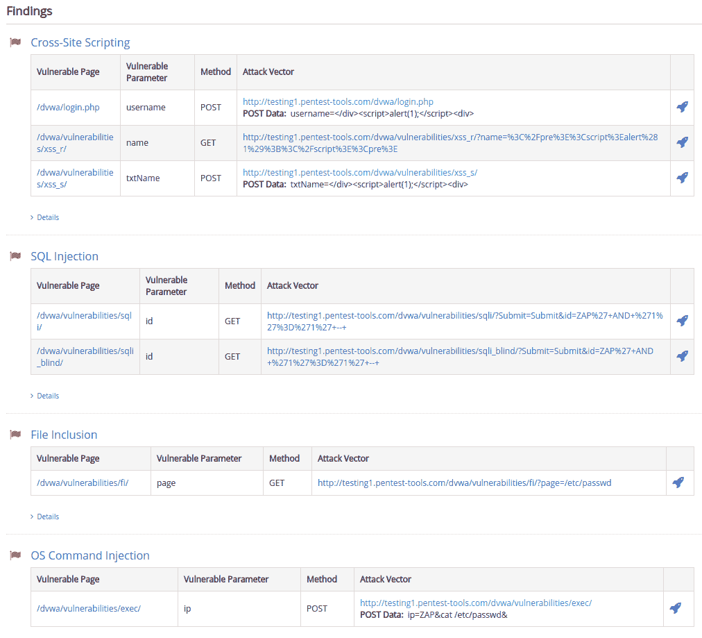
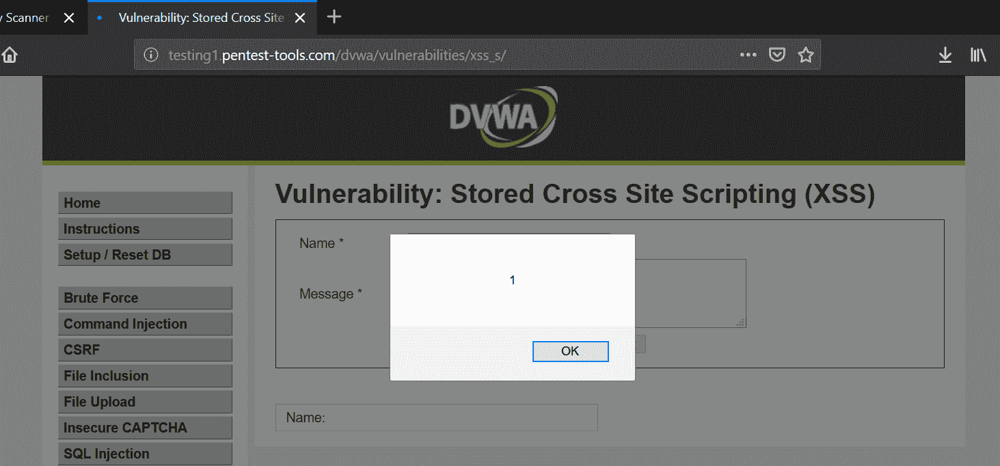
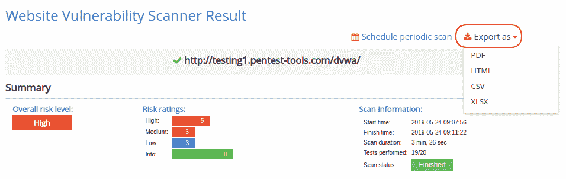

# 如何用 Pentest-Tools.com | Pentest-Tools.com 做一个基本的网站漏洞评估

> 原文：<https://pentest-tools.com/blog/howto-web-vulnerability-assessment-with-pentest-tools>

让我们看看如何使用来自[Pentest-Tools.com](https://pentest-tools.com)的工具对您的 web 应用程序进行基本的安全评估。

该评估的结果将是您的 web 应用程序的大致安全状况，您也将有机会看到该平台在 [web 安全测试](https://pentest-tools.com/alltools#web-application-testing)方面的能力。

以下是本文的主要主题:

## **1。入门**

首先，您需要在**目标**页面上添加您的目标 URL。您可以逐个添加目标(使用**添加**按钮)或从文本文件导入多个目标。

默认情况下，目标将被添加到您的**当前工作区**中。建议为您的每个项目准备一个专用工作区，以便对目标及其相关扫描结果进行分组。

对于基本的 web 应用程序评估，我们建议您从 [**网站漏洞扫描器**](https://pentest-tools.com/website-vulnerability-scanning/website-scanner) 开始，这是一个全面的工具，试图发现广泛的特定 web 应用程序漏洞(例如。SQL 注入、XSS、目录列表、敏感文件检测、过时的服务器软件等等)。您可以在该工具的网页上看到完整的测试列表，向下滚动到技术细节部分。

**网站漏洞扫描器**可以执行**轻度**扫描和**完全**扫描(将在下文详述)。请注意，**完全**扫描已经测试了 SQL 注入和跨站点脚本，因此没有必要在 top 上运行其他工具，如 [SQLi 扫描器](https://pentest-tools.com/website-vulnerability-scanning/sql-injection-scanner-online)或 [XSS 扫描器](https://pentest-tools.com/website-vulnerability-scanning/xss-scanner-online)。

对于更高级的测试，你应该尝试更集中的工具，如 [**URL Fuzzer**](https://pentest-tools.com/website-vulnerability-scanning/discover-hidden-directories-and-files) 和特定的 CMS 工具，如 [**WordPress Scanner**](https://pentest-tools.com/cms-vulnerability-scanning/wordpress-scanner-online-wpscan) 、 [**Drupal Scanner**](https://pentest-tools.com/cms-vulnerability-scanning/drupal-scanner) 等。

## **3。光扫描与全扫描**

你可以看到我们的许多工具有两种扫描类型:**光**和**全**。**光扫描**设计为在您不想发出任何警报时使用。它们主要是被动的，只对目标系统执行一些合法的请求。然而，正如你所料，**光扫描**并没有深入到多深的地方，它们只是在安全测试方面触及了表面。

**全扫描**要深入得多，它们试图覆盖目标系统的所有[攻击面](https://pentest-tools.com/features/attack-surface)(抓取应用程序、发现隐藏文件、使用更多攻击媒介等)。全扫描**包含由**光扫描**执行的所有测试，因此没有必要同时运行它们。**

### **运行全面的网站漏洞扫描**

开始全面的网站漏洞扫描只需进入目标页面，选择要扫描的目标，然后从“扫描方式”下拉列表中选择工具。请注意，您可以轻松地一次开始扫描多个目标，这对**批量扫描**非常有用。

您将看到一个弹出窗口，显示网站漏洞扫描器的**扫描选项**。在这里，您还可以选择配置**认证**选项(将在另一篇文章中讨论):

按下“开始扫描”后，您将进入“扫描”页面，在这里您可以实时查看扫描进度和结果摘要。

### **查看扫描结果**

漏洞扫描的结果包含一个简短的调查结果摘要，后跟一个包含调查结果详细信息的部分。在这里，您可以看到针对 DVWA ( [该死的易受攻击的 web 应用](http://www.dvwa.co.uk/))实例的结果，它包含许多故意的 Web 漏洞:

 

### **漏洞详情和建议**

由 [**网站漏洞扫描器**](https://pentest-tools.com/website-vulnerability-scanning/website-scanner) 返回的所有漏洞都包含详细的**风险描述**和一个**建议**部分，让您轻松了解漏洞并学习如何修复它。

此外，漏洞的证据还包含**攻击媒介**，您可以使用它来触发漏洞并验证它。以下是如何使用 POST 方法在易受攻击的表单上触发跨站点脚本的示例。您需要点击*火箭*符号，POST 请求将针对目标应用程序自动完成，并预先填充攻击参数。

### **报告能力**

您可以下载 PDF 或 HTML 格式的*简单报告*，其中包含针对单个目标的单次扫描结果。

然而，该平台还有一个**高级报告**功能，您可以使用它来生成可编辑的 Docx 报告，其中包含来自当前工作区中所有目标的发现。更多阅读在 [**高级报告页面**](https://pentest-tools.com/usage/pentest-reporting-tool) 和本帖[**Pentest 5 分钟报告写作**](https://pentest-tools.com/blog/pentest-report-generator-defcamp-2018) 。

按下“导出为”下拉菜单并选择所需格式，即可获得*简单报告*。

 **注意:**默认情况下，报告包含 Pentest-Tools.com 标志。但是如果您有 [**企业包**](https://pentest-tools.com/pricing) ，您可以选择在 pdf 报告中设置您公司的徽标。

这篇文章只是触及了 Pentest-Tools.com 这个在线渗透测试和漏洞评估平台的皮毛。

从高级的信息收集工具到网络基础设施测试和开发工具，还有更多。

查看我们的 [**定价页面**](https://pentest-tools.com/pricing) 以全面访问该平台。