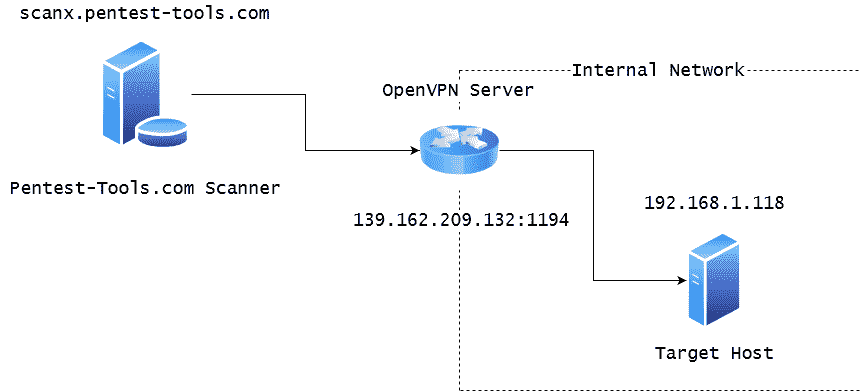
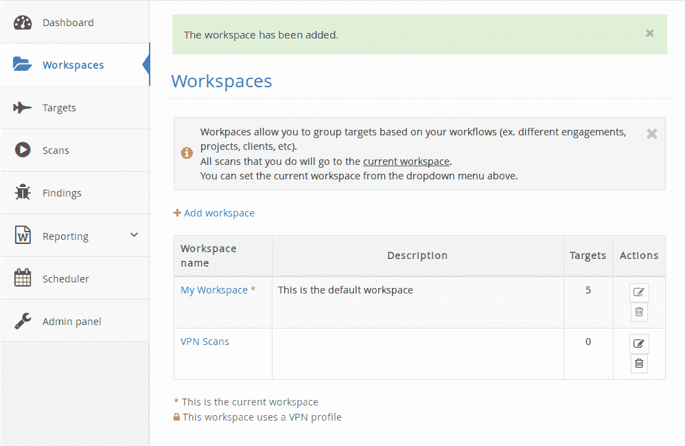
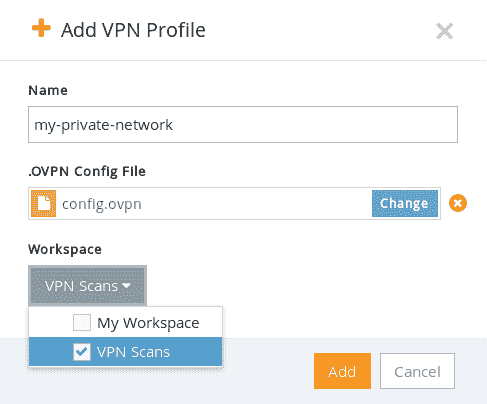
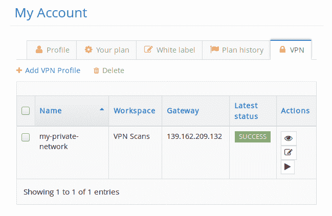
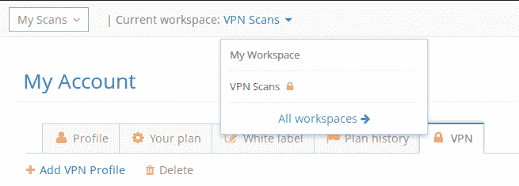
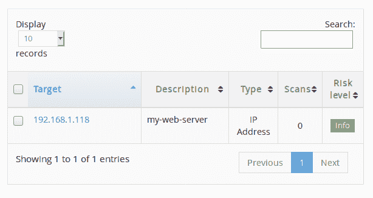
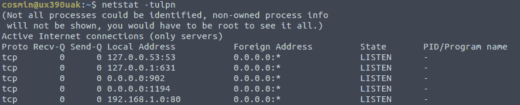
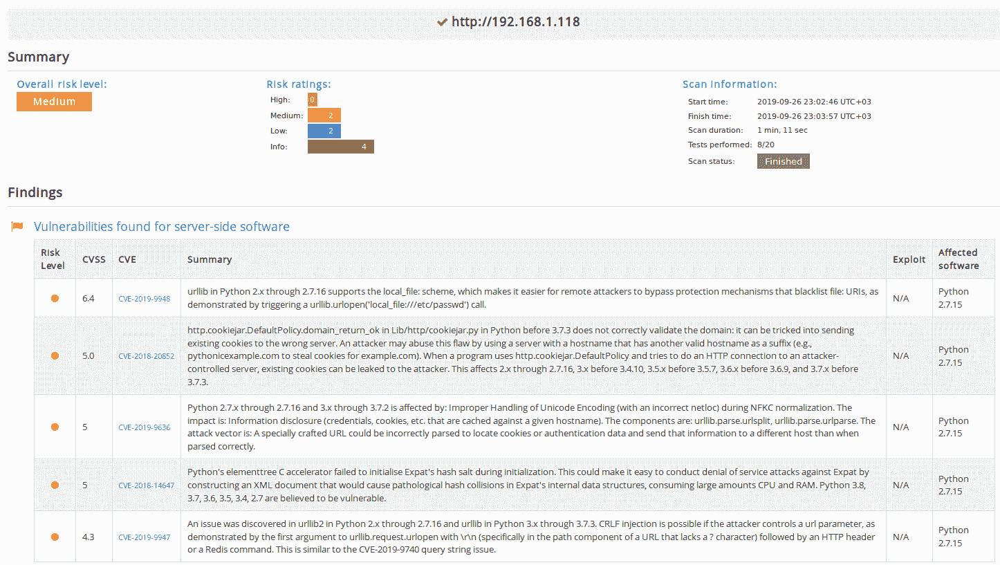

# 如何使用 Pentest-Tools.com | Pentest-Tools.com 执行内部网络扫描

> 原文：<https://pentest-tools.com/blog/internal-network-scanning>

在本文中，我们将向您展示如何使用我们来自 Pentest-Tools.com 的安全工具从您的**内部网络**扫描主机。这是我们最近添加到平台中的一项新功能，它使用 **VPN 隧道**来访问内部网络。

**【2020 年 6 月更新】**我们增加了一种新方法来扫描您的内部网络，不需要任何特殊配置。只需使用**VPN 代理**并开始扫描。要了解如何轻松地在 Pentest-Tools.com 上配置 [VPN 代理](https://pentest-tools.com/blog/vpn-agent-formats-api-methods-updates)并创建新的 VPN 配置文件，请阅读我们的[分步技术教程](https://support.pentest-tools.com/en/vpn-profiles/internal-network-scan-vpn-agent)。

## **1。它是如何工作的？**

简单地说，我们使用 **OpenVPN** 在我们的扫描机器和您的网络之间创建一个**安全隧道**。这样，我们的扫描器可以通过 VPN 隧道从您的内部网络到达主机。为此，你需要有一个正确配置的 **OpenVPN 服务器**。

## **2。这对我的网络安全吗？**

您应该知道，每个到达或离开您网络的数据包都是完全加密的，没有其他人通过这个通道访问您的网络。

此外，您可以配置您的 VPN 服务器，只允许访问您想要扫描的某些内部主机，而不是整个网络。这样你就可以完全放心，没有人会通过 VPN 来破坏你的网络。

## **3。如何通过 VPN 配置扫描**

让我们考虑一个场景，我们想要对私有网络 192.168.1.0/24 内部的目标运行 [TCP 端口扫描器](https://pentest-tools.com/network-vulnerability-scanning/tcp-port-scanner-online-nmap)。

示例 OpenVPN 服务器可以在 IP 139.162.209.132 的端口 1194(OpenVPN 服务的默认端口)上公开访问，它还被设置为内部目标主机的默认网关。

让我们看看如何配置此设置，以便我们的扫描仪可以访问内部主机，如下图所示:



### **第一步:从 OpenVPN 服务器中导出配置文件**

您应该导出。OpenVPN 服务器上的 ovpn 配置文件。该文件包含 OpenVPN 客户端连接到服务器的信息。您通常可以直接从 VPN 网关或路由器的 web 界面导出此文件。

如果你想在你的网络中安装一个新的 OpenVPN 服务器，我们建议你看看这个简化过程的[脚本](https://github.com/angristan/openvpn-install)。

导出的。ovpn 文件应该如下所示(这只是一个示例 OpenVPN 配置文件)。您应该注意以下几行:

*   `remote {your-external-ip} {port}`–确保您的外部 IP 是正确的，并且**端口没有被任何防火墙**阻塞。[这里的](https://www.first2host.co.uk/f/open-port-iptables/)是正确打开 VPN 端口的 iptables 指南。

*   `proto {TCP/UDP}`–我们建议使用 TCP 而非 UDP，以获得更可靠的连接。

*   `dhcp-option DNS {internal-dns-ip}`(可选)–如果您的本地网络中有内部 DNS 服务器，并且您希望通过主机名扫描目标，则这是必需的。

```
config.ovpn
client
dev tun
proto tcp
sndbuf 0
rcvbuf 0
remote 139.162.209.132 1194
resolv-retry infinite
nobind
persist-key
persist-tun
remote-cert-tls server
auth SHA512
cipher AES-256-CBC
setenv opt block-outside-dns
key-direction 1
verb 3
<ca>

-----BEGIN CERTIFICATE-----
MIIDQjCCAiqgAwIBAgIUBa2MqM7dbcE5eePAwPituT+RqZAwDQYJKoZIhvcNAQEL
BQAwEzERMA8GA1UEAwwIQ2hhbmdlTWUwHhcNMTkwOTEyMTI1NDEwWhcNMjkwOTA5
MTI1NDEwWjATMREwDwYDVQQDDAhDaGFuZ2VNZTCCASIwDQYJKoZIhvcNAQEBBQAD
ggEPADCCAQoCggEBAMnIwLMKPAg8BzPPslPoprPi8FmoNVQfGopCHAZg1BaHXqWS
g9pfWkUlNr4yIbsb9INw89pLYELsThDj+gBCRW/SMND/RaJo+VGBeThGnv31bXKe
tLtifO9sb8xucwnn0gfwr7yEBfkU/hAPYZM4gRPxjLBmWv8TEFdvrx6o6fGvCNuu
G9+2qXLCUDpHnuvHO4lfeRlM+RPU4LhrL2GUOvRRTf17Xv4ttEo6NdxRNKkE+DeF
```

登录我们的平台后，您必须为您的内部目标创建一个新的工作空间。此工作区可以包含内部 IP 地址或主机名，您可以将其与外部 IP 地址或主机名分开。转到工作区并添加一个新的工作区(在我们的例子中，它将被称为 **VPN 扫描**)。



然后，您必须转到我的帐户，VPN 选项卡，以创建一个 VPN 配置文件，其中包括 ovpn 文件。您还必须将 VPN 配置文件分配给一个或多个工作区。

当一个工作空间具有相关联的 VPN 配置文件时，将通过 VPN 扫描该工作空间中的所有目标。



添加后，建议通过单击“操作”列中的“播放”按钮来测试配置。



如果您的 VPN 连接成功，您就可以进行第一次内部扫描了。但是，如果您遇到任何连接问题，您可以通过查看连接日志来解决问题(按操作中的查看按钮)。**请确保 OpenVPN 端口对互联网开放**——这是最常遇到的连接问题。

### **步骤 3:向 VPN 工作区添加一个内部目标**

首先，确保您已经切换到最近添加的工作区(将 **VPN 扫描**设置为您当前的工作区)。



请注意锁图标，它表示该工作区有一个关联的 VPN 配置文件。在此工作区内执行的任何扫描都会使用导入的配置文件创建到目标网络的 VPN 隧道。请注意，每次执行新的扫描都会建立一个新的 VPN 隧道。

如果您有多个并行扫描，您将与 VPN 服务器建立相同数量的 VPN 隧道。



现在我们可以创建目标了。我们将添加目标 IP 地址 **192.168.1.118** 。该主机将暴露本地网络内部的端口 80。对于这个例子，我们运行一个简单的 [python web 服务器](https://www.linuxjournal.com/content/tech-tip-really-simple-http-server-python):


请注意，绑定位于 192.168.1.0:80，因此只能从本地网络访问。



此外，这可以通过运行以下命令来完成:

**$ sudo python-m 简单 http 服务器 80–bind 192。168 .1 .0**

### **第四步:扫描目标**

在目标主机上对前 100 个端口进行简单的 [TCP 端口扫描](https://pentest-tools.com/network-vulnerability-scanning/tcp-port-scanner-online-nmap)将检测到端口 80 打开。请记住，该端口只对本地网络开放，不对互联网开放。

你也可以用我们的[网站漏洞扫描器](https://pentest-tools.com/website-vulnerability-scanning/website-scanner)扫描它。它会检测 *SimpleHTTP 0.6 和 Python 2.7.15* 。

看起来 Python 的 BaseHTTPServer 附带了几个 CVE:



为了快速发现漏洞和潜在的安全风险，您应该定期执行内部和外部扫描。[扫描您的内部网络](https://pentest-tools.com/alltools#infrastructure-testing)可以帮助您识别:

*   缺少安全补丁和过时的网络服务

*   修复在您当前基础架构中发现的漏洞的方法

*   意外的攻击媒介

*   您的基础架构安全状况的全貌