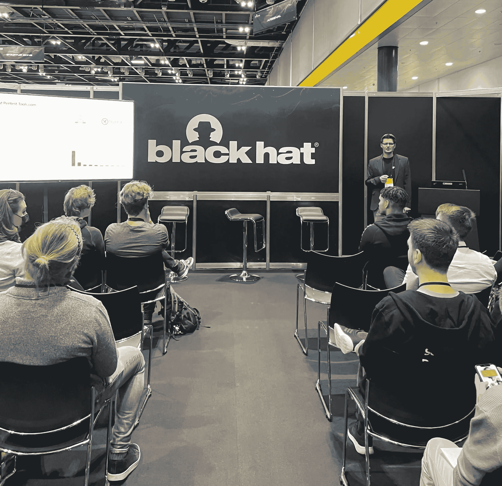
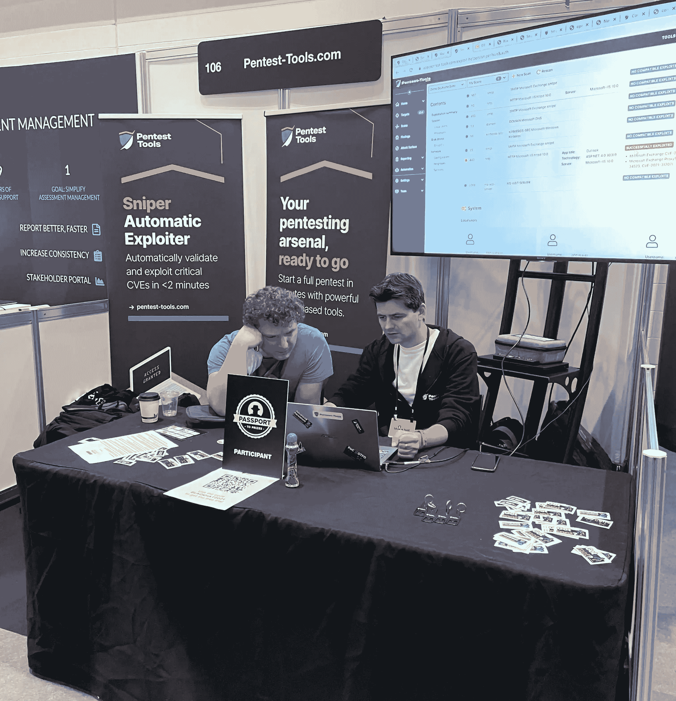

# 幕后——采访我们的创始人兼首席执行官阿德里安·富图纳| Pentest-Tools.com

> 原文：<https://pentest-tools.com/blog/interview-adrian-furtuna-founder-and-ceo>

网络犯罪的不断增加无疑促使公司更加认真地对待他们的网络安全，许多公司已经转向渗透测试，作为对抗日益增多的威胁的一种方式。虽然这种既定的实践非常有效，但仍有许多必要的改进来帮助它适应技术生态系统的当前需求。

CyberNews 采访了我们的创始人&首席执行官**阿德里安·富图纳**，谈论渗透测试的来龙去脉。这就是为什么阿德里安认为，无论技术多么先进，有些方面仍然需要人类的方法。

## **从发射到升空——我们的简略故事**

大约十年前，当我在一家*四大*公司做渗透测试员时，我开始了[Pentest-Tools.com](https://pentest-tools.com/)的个人兼职项目。

这个想法来自于我在日常工作中经常遇到的几个问题:

*   作为一名测试者，*我不得不使用来自不同供应商的多种工具*(开源的和商业的)。它们很难管理和更新，我觉得有必要从一个地方操作它们。

*   我用公司的笔记本电脑进行渗透测试*，在工作时间之外还有更长的扫描。我需要一种方法从一个始终运行的系统中运行扫描，这样我就可以让它们整夜运行，并在第二天早上得到结果。*

*   *对于大多数渗透测试人员来说，报告曾经是——现在仍然是——一个很大的痛点*。那时候我们在做。docx 手动报告，从多个工具汇总结果、添加证据、编写执行摘要、创建风险矩阵、格式化等非常耗时。

为了解决这些问题，我创办了 Pentest-Tools.com，这是第一个基于云的渗透测试平台。该项目有组织地发展，并开始在喜欢从远程位置运行扫描的志同道合的用户中获得更多的关注。

所以在 2016 年，我辞去了全职工作，开始专注于公司。我组建了一个三人小组，开始添加新功能、新工具和改进网页界面。

现在，我们有超过 35 名员工，并且作为一家自举公司，我们仍在有机增长。

我们很感激有来自世界各地的许多[客户](https://pentest-tools.com/customers)，他们欣赏我们的工作，每天都在使用我们的平台。

## **支持生产力和增长的完整 pentest 设置**

[Pentest-Tools.com](https://pentest-tools.com/)支持安全专业人员从单一位置执行端到端渗透测试。正如我们的一位客户所说，他们可以使用该平台建立一个“pentests 库”,其中包含许多关键元素，他们可以重复使用并进行微调，以使他们的工作更好、更有效。

该平台嵌入了超过 [25 个专有和开源工具](https://pentest-tools.com/alltools)，用于侦察、漏洞扫描(web 和网络)和利用。所有这些工具都以标准化的格式生成结果，这意味着 pentesters 可以将所有报告速度提高 80%。

除了工具之外，该平台还有一些[关键特性](https://pentest-tools.com/features)使其与众不同:

## **将自动化与独特的人类逻辑相结合**

整个平台为 pentester 提供了一个完整的设置，旨在完成出色的工作，并继续提高他们的技能和知识。

从我作为渗透测试人员 10 多年的经验来看，我坚信基于人类的安全测试[无法被算法](https://pentest-tools.com/blog/pentest-robots-automation-feature)完全取代，也无法获得同样高质量的结果。

虽然这项活动中有许多元素可以——也应该——实现自动化，但也有一些元素绝对需要人性化:

*   理解应用程序的逻辑

*   区分两个明显相似的漏洞的影响

*   理解目标系统和其他系统或人之间的交互

*   知道什么时候停下来，什么时候进一步推进，等等。

为了在工作流程中为这些独特的人类能力创造更多的空间，您需要自动化渗透测试人员活动的一些部分。碰巧的是，这些也是一些最重复的任务:发现[攻击面](https://pentest-tools.com/features/attack-surface)，对漏洞进行第一手扫描，在可能的情况下尝试[自动利用](https://pentest-tools.com/exploit-helpers/sniper)，并在必要时重复所有这些任务。

对于这些类型的任务，我们创建了一个名为“ [pentest robots](https://pentest-tools.com/features/pentest-robots) ”的功能这是一个自定义的扫描流程，pentester 可以对其进行配置，从而以一定的顺序运行带有自定义选项的特定工具，以涵盖日常工作中枯燥但必要的任务。

通过卸载这些繁琐的工作，渗透测试人员有更多的时间来关注项目中需要更高级技能的有趣部分(例如开发)。

## **类似的攻击方式，但针对的是较弱的目标**

关于威胁行动者的运作模式，我不认为有重大变化，因为他们已经在家工作。

然而，他们的目标可能已经发生了变化——从直接攻击目标组织转向攻击现在远程工作的员工个人。因此，家庭网络的安全性变得越来越重要，因为它本质上构成了企业网络的入口点。

##  **赚钱机会——网络犯罪的巨大诱因**

具有讽刺意味的是，如今许多常见的攻击技术已经司空见惯了至少 10 年:

*   利用旧的/未打补丁的软件

*   破解弱密码

*   利用常见的 web 应用程序缺陷，如 SQL 注入、任意文件读取、不适当的访问控制等。

不同的是，网络犯罪分子找到了一种新颖的方法，以勒索软件的形式将这些攻击货币化。这种威胁是真实的，我们已经一次又一次地看到它对目标组织的运营和财务造成的破坏性影响。

通常，如果攻击者获得了敏感信息数据库的访问权限，他们可以很容易地在黑市上出售它，赚一些钱。

不良行为者有动机、方法和大量机会以高风险、广泛存在的漏洞的形式使用这两者，这些漏洞在组织设法修补它们之前会在系统中存在多年。

## **为什么渗透测试*不是*走向安全成熟的第一步**

渗透测试(也称为 pentesting)是一种主动方法，用于验证公司 IT 环境中实施的安全机制的有效性。此评估包括模拟对手发现和利用漏洞(例如，缺少补丁、弱密码、不安全的配置、编程错误等)的尝试，最终目标是获取敏感数据的访问权限并危害目标系统。

就技术或安全成熟度而言，公司应该在尝试实施基本安全措施后*才签订渗透测试合同。如果你已经知道你的前门没有锁，花钱请人检查它是否安全是没有意义的。*

就公司概况而言，任何处理机密数据或必须保护数字的组织都可以受益于在攻击者之前发现其弱点。

例如，鉴于其独特的信息安全要求，金融机构需要定期进行渗透测试。他们还有将测试报告转化为整个公司行动点的内部流程。尽管银行是最容易被攻击的组织，这也是你很少听说银行被攻击的原因之一。

## **布置好你的防御(在开始进攻之前)**

渗透测试只是有助于保持公司良好网络安全态势的一系列措施之一。

防御性安全措施甚至比渗透测试更重要。公司至少需要基本的安全措施，如定期软件更新、定期备份关键数据、防病毒软件、入站和出站流量过滤机制(如 WAF)、SSL/TLS 和[VPN 以保护传输中的数据](https://cybernews.com/best-vpn/)，以及加密以保护静态数据。这个清单很长，但是，谢天谢地，由于有大量的解决方案和熟练的专家可以实施它们，解决起来要容易得多。

##  **将现有的安全技能上线**

我认为个人用户改善个人网络安全状况的最佳“工具”是致力于他们的网络教育和意识，然后善加利用。

类似于我们如何努力保护我们的有形资产(我们的家，我们的珠宝，我们的汽车等)。)，我们需要学习如何保护我们的数字资产(电子邮件帐户、云存储、社交媒体档案等)。因为它们在我们生活中的重要性不断增加。

任何人都可以做的简单的事情是保持软件更新，避免未经授权的软件(因为它充满了恶意软件)，不要访问可疑的网站，对他们点击的链接格外挑剔，只安装来自可信来源的应用程序，以及运行强大的反恶意软件解决方案。

我们使用的应用程序越少，我们对安全性的威胁就越小。我们在互联网上暴露的数据越少，我们的数字足迹就越安全。保持简单真的对互联网上的个人安全有效。

[Pentest-Tools.com](https://pentest-tools.com/)已经发展成为一个完整的渗透测试平台。它现在使用户能够从单个目的地执行整个测试项目流程:[侦察](https://pentest-tools.com/alltools#reconnaissance-tools)、[漏洞](https://pentest-tools.com/alltools#web-vulnerability-scanners)、[检测](https://pentest-tools.com/alltools#offensive-tools)、[利用](https://pentest-tools.com/alltools#offensive-tools)，以及[报告](https://pentest-tools.com/usage/pentest-reporting-tool)。

现在，我们已经达到了平台开发的这一成熟点，我们的目标是让它尽可能地对处理似乎正在溢出到技术生态系统中的新漏洞的 pentesters 有用。

这包括尽快更新我们的漏洞扫描工具，检测最新的关键漏洞。这意味着添加[自动利用](https://pentest-tools.com/exploit-helpers/sniper)功能，帮助 pentesters 快速验证真正易受攻击的目标。这需要在保持平台为用户服务的同时做到这一点，而不会给用户带来过重的管理负担。

这就是为什么我们投入大量精力为客户创造更好的用户体验，并改进测试流程以保持简单性。

我们希望[Pentest-Tools.com](https://pentest-tools.com/)成为 IT 和安全专业人员的首选之地，他们希望从一个可靠的、[始终保持最新的](https://pentest-tools.com/change-log)和优化的平台上运行全面的渗透测试，从而使他们能够成长。

【这篇采访最初[发表在 CyberNews.com](https://cybernews.com/security/adrian-furtuna-pentest-tools-com-you-need-penetration-testing-to-maintain-a-good-cybersecurity-posture/)上。]