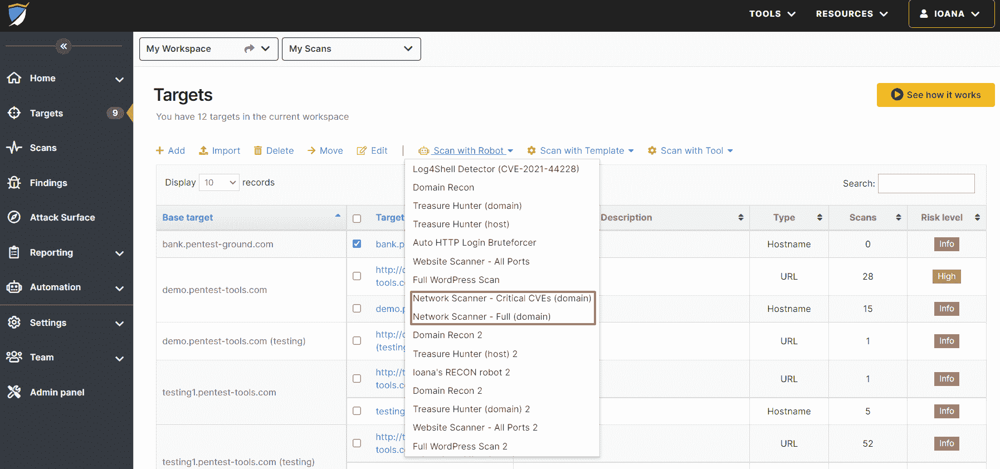
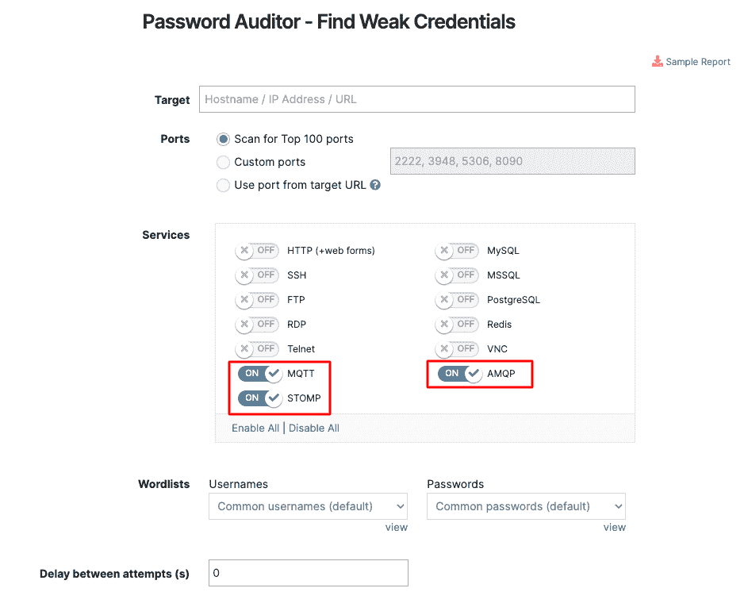
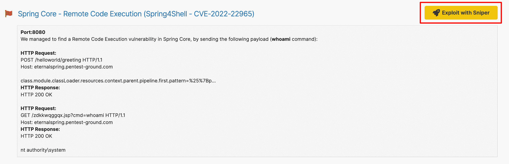
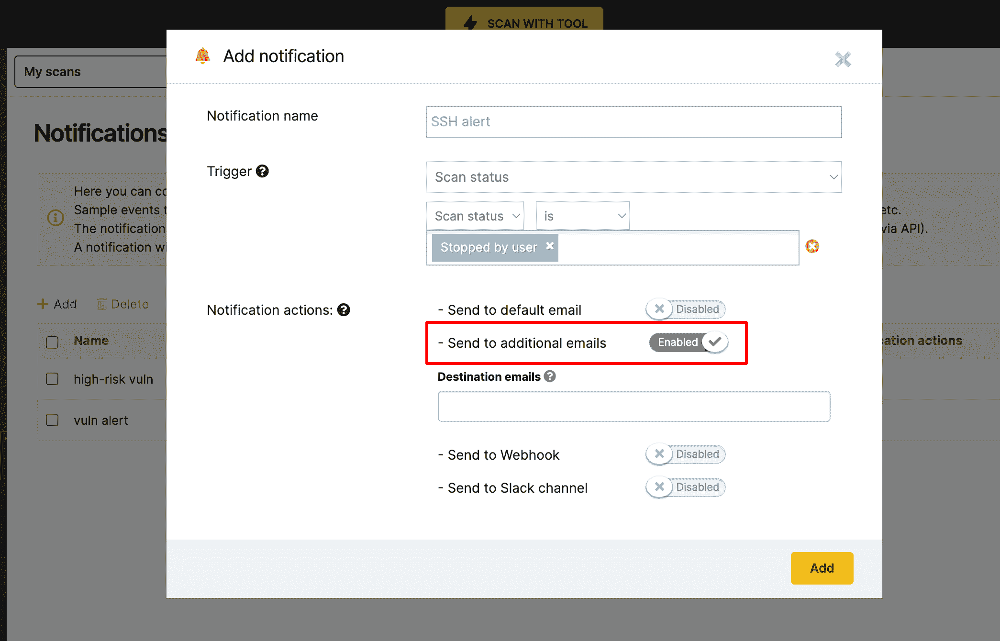
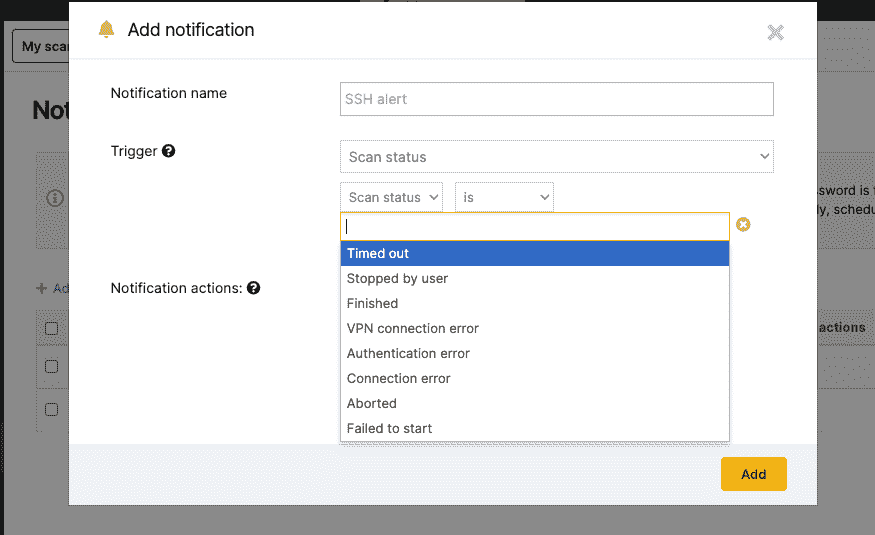

# 一月更新:新的 pentest 机器人和更强的集成| Pentest-Tools.com

> 原文：<https://pentest-tools.com/blog/january-updates-new-pentest-robots-stronger-integration>

“[非常适合简化任何安全项目](https://www.g2.com/products/pentest-tools-com/reviews/pentest-tools-com-review-5244620)”这种反馈让我们努力推出每月更新。

以下是我们上个月为兑现这一承诺所做的工作。现在您可以:

1.  **用狙击手确认 9 种新型高冲击力 CVE**的可开发性

2.  **使用我们的网络扫描仪检测 11 个广泛存在的漏洞**

3.  使用这些**新 pentest 机器人**自动执行网络扫描任务

4.  在 **MQTT、AMQP 或 STOMP 服务中查找更多弱凭证**

5.  **利用**网络扫描器的发现**用狙击手** *更快*

6.  实时通知团队成员特定的扫描结果 **(+更多触发器)**

**让我们解开这些更新**

## **1。用狙击手**获得这 9 个新的关键 cv 的剥削证明

我们的漏洞研究团队上个月做了大量工作，为最新的高风险漏洞集成了 9 个以上的利用模块。

[狙击自动剥削者](https://pentest-tools.com/exploit-helpers/sniper?utm_source=converkit&utm_medium=email&utm_campaign=updatesJAN2022)现在给你 2 分钟内的剥削证明**:**

1.  **多个 Netgear 路由器中的 **RCE 漏洞**，攻击者无需认证即可利用*——[CVE-2020-1749](https://nvd.nist.gov/vuln/detail/CVE-2020-17409)(cvss v3 7.5)和[CVE-2020-27866](https://nvd.nist.gov/vuln/detail/CVE-2020-27866)(cvss v3 8.8)***

2.  **Java 日志包中**臭名昭著的 Log4j 漏洞**——[CVE-2021-44228](https://nvd.nist.gov/vuln/detail/CVE-2021-44228)(CVSS v3 10.0)和[CVE-2019-17571](https://nvd.nist.gov/vuln/detail/CVE-2019-17571)(cvss v3 9.8)**

3.  **各种 Grafana 版本中的**路径遍历漏洞**——[CVE-2021-543898](https://cve.mitre.org/cgi-bin/cvename.cgi?name=CVE-2021-43798)**

4.  **Zoho ManageEngine ADSelfService Plus-[CVE-2021-40539](https://nvd.nist.gov/vuln/detail/cve-2021-40539)(cvss v3 9.8)中的 **REST API 认证绕过漏洞****

5.  **多个 Oracle WebLogic 服务器中的高危 **RCE 漏洞**——[CVE-2018-2894](https://cve.mitre.org/cgi-bin/cvename.cgi?name=CVE-2018-2894)(cvss v3 9.8)和[CVE-2020-14883](https://cve.mitre.org/cgi-bin/cvename.cgi?name=CVE-2020-14883)(cvss v3 7.2)**

6.  **另一个 **RCE 漏洞**在各种 Apache Struts 版本中被发现——[CVE-2018-11776](https://cve.mitre.org/cgi-bin/cvename.cgi?name=CVE-2018-11776)(cvss v3 8.1)** 

## ****2。用网络扫描器检测 11 个高危漏洞****

**作为平台上最常用的三大工具之一，我们经常用新的检测功能更新我们的[网络扫描仪](https://pentest-tools.com/network-vulnerability-scanning/network-security-scanner-online-openvas)。现在，您可以使用它来检查上述 CVEs plus:**

*   **Apache HTTP servers 中的**服务器端请求伪造(SSRF)漏洞**-[CVE-2021-40438](https://cve.mitre.org/cgi-bin/cvename.cgi?name=CVE-2021-40438)(cvss v3 9.0)**

*   **Apache Solr、Tomcat、Druid 和 Flink 实例中广泛存在的 Log4Shell 漏洞以及 VMware vCenter & Mobilelron 核心服务器—[CVE-2021-44228](https://cve.mitre.org/cgi-bin/cvename.cgi?name=CVE-2021-44228)(cvss v3 10.0)**

**对于更快的扫描，使用我们的 [**Log4Shell pentest 机器人**](https://pentest-tools.com/features/pentest-robots) 在您的约定中有效地 [**检测 Log4Shell**](https://pentest-tools.com/blog/log4shell-scanner-detect-cve-2021-44228) 。**

## ****3。使用这两款新的 pentest 机器人**自动执行网络扫描任务**

**为了充分利用您的时间并检测您网络中的关键漏洞，您可以运行我们随时可用的 pentest 机器人或构建自己的机器人。**

**我们刚刚添加了 *2 个新的*网络扫描机器人，你可以在[登录你的 Pentest-Tools.com 账户](https://app.pentest-tools.com/login)时使用。**

****网络扫描器完全(域)**首先发现目标域的所有子域，然后检查每台机器上的唯一 IP。然后，它对目标域网络中的每台计算机运行全网络扫描程序，以检测潜在的易受攻击的系统。**

****网络扫描器-关键 CVEs(域)**使用域作为入口点运行更集中的扫描。它识别目标的所有子域，并继续检查机器上的唯一 IP。然后，它使用狙击手的检测模块为目标域网络中的每台机器运行网络扫描器狙击手检测模块。**

**两个 [pentest 机器人](https://pentest-tools.com/features/pentest-robots)都编写了一份详尽的报告，其中包含丰富的发现，可以在你的约会中使用。**

****

## ****4。发现更多支持这些服务的弱凭证****

**如果你使用的是 **MQTT、AMQP 或 STOMP 服务**，对你的目标运行我们的密码审计器**来自动发现其中的默认和弱凭证**。**

**进入 [**密码审计**](https://pentest-tools.com/network-vulnerability-scanning/password-auditor) ，添加您的**目标**，启用您选择的服务。是的，就这些！**

****

## ****5。利用网络扫描仪发现狙击手更快****

**当您使用我们的网络扫描仪运行**全面扫描**时，默认情况下它还包括狙击手的检测模块。**

**如果你发现了有趣的发现想要进一步利用，你可以通过新的“**利用狙击手**按钮快速完成。**

**你可以在这里找到它:**

**添加另一个短语，描述他们点击按钮后会发生什么。**

**点击它后，用 Sniper 运行聚焦扫描，从目标系统中利用和提取工件。
**

## ****6。向特定用户发送实时扫描通知****

**需要通知您的团队或多个用户特定的扫描结果吗？在 Pentest-Tools.com 有更简单的方法。**

**进入**设置**，选择**通知**，填写扫描的具体条件。**

**当扫描结果符合您选择的所有条件时，您添加的用户会收到一封包含所有详细信息的电子邮件。**

****

**此外，我们还增加了**新的触发**(例如，被用户停止、VPN 连接错误、认证错误)，使通知对您和您的团队更有帮助。**

**将激光聚焦扫描通知发送到您的收件箱或 webhook URL，以简化协作并让每个人都了解情况。**

****

***这些更新改进了你的测试工作流程吗？*请在下面的评论中告诉我们，或者将您的功能需求发送给我们。**