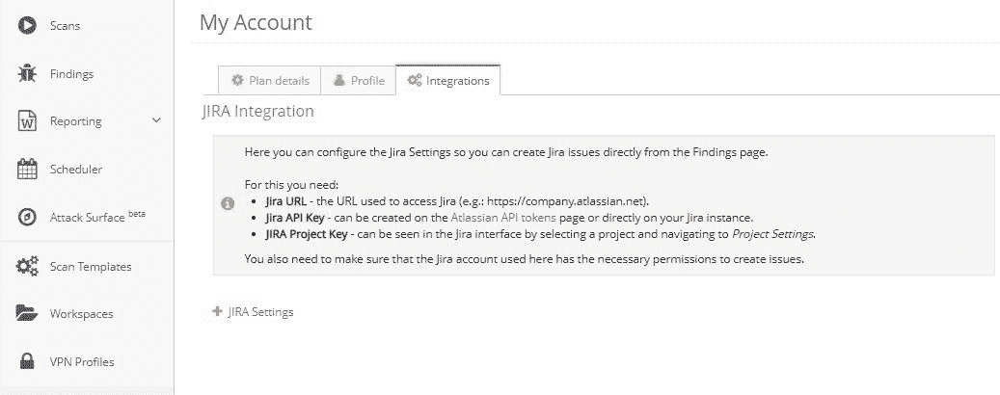
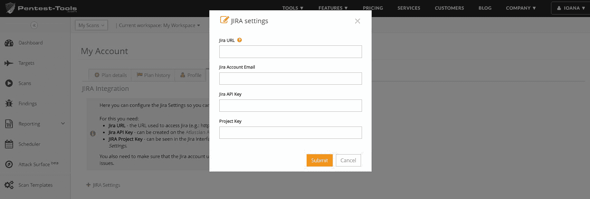
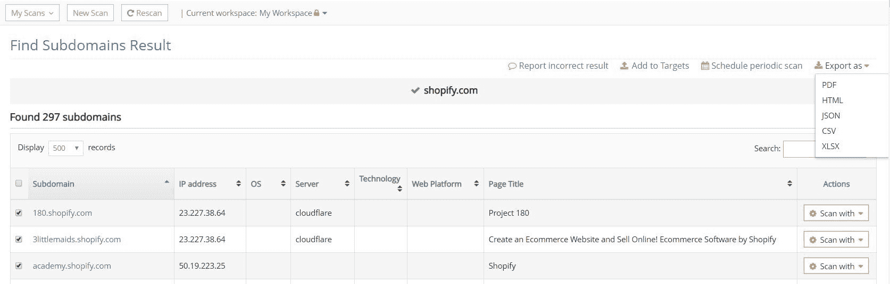
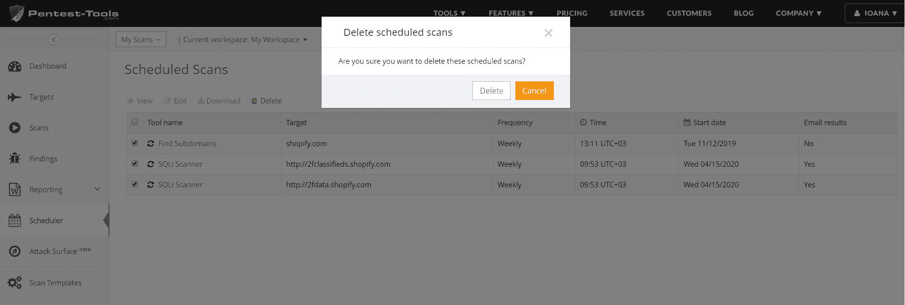

# Pentest-Tools.com 吉拉集成，将结果导出为 JSON 和更多平台更新

> 原文：<https://pentest-tools.com/blog/jira-integration-platform-updates>

Updated at

August 17, 2022

这里是我们在当前更新中部署的 4 个平台更新，以使 Pentest-Tools.com 成为满足您的测试需求的更强大的资产。

1.  新功能:**Pentest-Tools.com<吉拉整合**

2.  新功能:**从仪表板将扫描导出为 JSON】**

3.  改进:**网站漏洞扫描器认证模块**

4.  改进:**一次删除多个预设扫描**

[**登录使用更新**](https://pentest-tools.com)

## **1。跟踪吉拉的测试结果**

现在，您可以将 Pentest-Tools.com 和吉拉整合起来，更好地对您使用我们的平台发现的结果进行优先排序，并自动将它们作为机票发送到吉拉。

快速注意:该功能仅适用于**企业客户**。

要成功设置吉拉集成，您必须:

1.  登录您的**Pentest-Tools.com 账户**

2.  前往**我的账户**

3.  访问**集成**选项卡

填写需要的**吉拉设置** : **吉拉 URL，吉拉 API key，吉拉项目 key。**

下一步，转到**调查结果**，选择您想要发送到吉拉的调查结果(如果需要，添加**过滤器**)作为问题。它们将被自动添加到您的项目待办事项中。

将我们的平台集成到您的工作流程中，可以让您和您的团队成员更轻松地扩展您的安全工作并优先解决问题。

## **2。从仪表板将扫描导出为 JSON】**

在您的 Pentest-Tools.com 仪表板中，我们添加了将扫描结果导出为 JSON 文件的选项。

为此，进入**扫描**，选择一个特定的**工具**，并选择想要导出为 JSON 格式的扫描结果。

如果您想用其他自动化工具处理扫描结果，这个特性很有用，因为 JSON 文件**使您的工作更容易。**

## **3。改进了我们网站漏洞扫描器的认证**

我们已经努力重写了我们网站漏洞扫描器的认证模块，以增加对**单页应用(SPA)的支持。**

这一改进使您能够对使用流行框架(如 AngularJS、React 或 Meteor.js)实现的各种 spa 进行身份验证。

<template x-if="showVideo"></template>

## **4。同时删除多个预设扫描**

我们增强了**调度器**功能，因此您可以**轻松地同时删除多个调度扫描**。

这一改进简化了您的工作流程，因此您不必再浪费时间来选择和删除每个预设扫描。

为此，转到 **Scheduler** ，从列表中选择您想要删除的扫描，您就完成了！

尝试一下新的平台功能，看看它们如何改进您的工作流程和扫描结果！