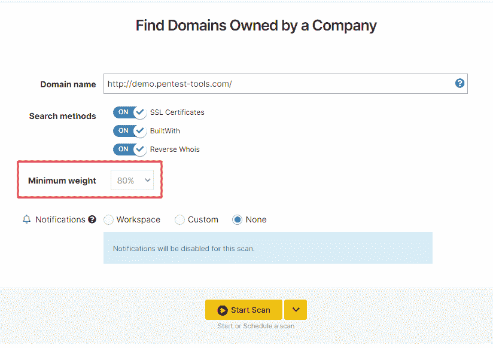
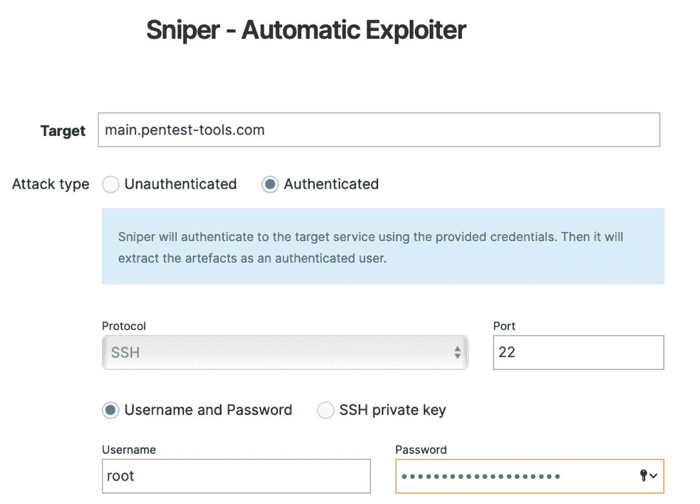

# 三月更新:Spring4Shell:找到并确认可利用的目标和更多更新| Pentest-Tools.com

> 原文：<https://pentest-tools.com/blog/march-updates-spring4shell-find-confirm-exploitable-targets>

几天前，当 [**Spring4Shell**](/blog/detect-exploit-spring4shell-cve-2022-22965) 出现时，如果你立刻想到 Log4Shell，你并不孤单。冷静的分析显示，这次 CVE 没有去年的 Log4j 漏洞那么严重。然而，在检测和修补方面，它仍然是一个优先事项。原因如下。

[CVE-2022-22965](https://cve.mitre.org/cgi-bin/cvename.cgi?name=2022-22965) 影响运行在 Java 上的 Spring Core 框架(MVC 和 Spring WebFlux 应用程序)，开发人员在工作中广泛使用。CISA 还将该 CVE 添加到其已知被利用漏洞的[目录中，强调恶意行为者正在他们的攻击中积极使用它。](https://www.cisa.gov/known-exploited-vulnerabilities-catalog)

为了帮助您找到易受攻击的目标，并优先为业务关键型目标打补丁，我们的安全研究团队刚刚为 Spring4Shell 推出了**检测和利用模块。**

[用我们的**网络扫描仪**和**狙击手**登录你的 Pentest-Tools.com 账号](https://app.pentest-tools.com/login)搜索受此次 CVE 影响的目标。

[**现在检测 spring 4 shell**](https://pentest-tools.com/exploit-helpers/sniper)

这还不是我们所做的全部。

在上个月，我们还推出了一系列新的**更新**来支持您的安全测试工作:

1.  3 个新的高风险简历你可以利用狙击手

2.  在查找域扫描中定义最小权重值的选项

3.  使用狙击手自动探测仪运行**认证扫描的能力**

让我们打开它们吧！

## **1。用狙击手确认这 3 个关键 cv 的开发风险**

除了 Spring4Shell 之外，我们的安全研究团队还更新了[狙击自动开发工具](https://pentest-tools.com/exploit-helpers/sniper),使其具有以下开发功能:

*   影响特定 Spring 云网关和功能版本的 **RCE 漏洞**——CVE-2022-22947(cvss v3 10.0)

*   另一个**影响不同春云函数版本的 RCE 漏洞**——[CVE-2022-22963](https://nvd.nist.gov/vuln/detail/CVE-2022-22963)(cvss v3。9.8)

*   在 Apache Struts 中发现的严重 **RCE 漏洞**–[CVE-2017-12611](https://nvd.nist.gov/vuln/detail/CVE-2017-12611)(cvss v3 9.8)

[利用这些简历 ](https://pentest-tools.com/exploit-helpers/sniper)

## **2。指定最小权重值，并将其用于查找域**

现在，您可以选择在运行“查找域”扫描时设置特定的最小权重值。这允许您更好地过滤扫描结果并验证准确的结果。

要使用它，去寻找领域，添加您的目标，并选择一个最小的权重，以获得更详细的结果过滤。

## **3。通过狙击手认证扫描获得更好的概念验证**

我们增强了狙击手自动开发工具的新功能，允许您**执行认证扫描**并获得更丰富的关于 PoCs 目标的详细信息。

Sniper 使用您提供的凭证对您的目标系统进行认证，并作为认证用户提取[工件](https://pentest-tools.com/exploit-helpers/sniper#artefacts)。

查看我们的[专用支持文章](https://support.pentest-tools.com/scans-tools/sniper-authenticated-scans)中的步骤，了解如何使用这个**新的狙击功能**。

希望这些更新能帮助你简化你的面试，做更多你喜欢的事情。