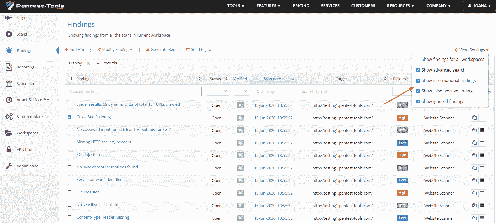
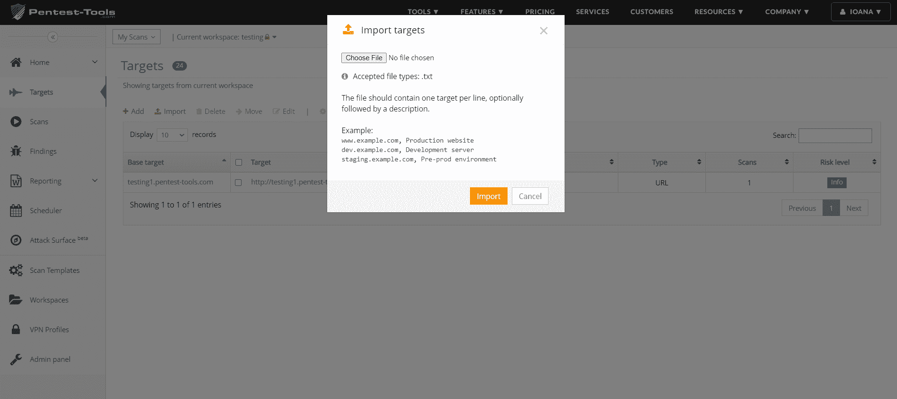

# 调查结果的新过滤器，导入带有描述和更多更新的目标| Pentest-Tools.com

> 原文：<https://pentest-tools.com/blog/new-filters-findings-more-updates>

这里是我们在当前更新中部署的 3 个平台改进，使 Pentest-Tools.com 成为您测试任务的宝贵资产。

1.  **调查结果页面添加了新的过滤器**

2.  **导入带描述的目标**

3.  **docx 报告中的白色标签自定义标志**

[**登录使用更新**](https://pentest-tools.com)

## **1。使用新的过滤器轻松组织和更好地管理调查结果**

我们在**搜索结果**页面添加了新的过滤器，仅显示您使用 Pentest-Tools.com 发现的相关搜索结果。

您现在可以选择从扫描结果中排除**误报、信息性或被忽略的**结果。要做到这一点，进入**查看设置**并选择你需要的漏洞报告的发现。

## **2。轻松导入带描述的新目标**

现在，您可以使用. txt 格式从本地文件导入新目标(主机名、IP 地址或 URL)及其描述。

为此，进入**目标，**点击**导入**按钮**，**并选择接受。txt 文件格式。

选择的文件应该包括目标名称，后跟可选的描述，并用逗号分隔，例如:*"*www.example.com，生产 web 服务器"。

成功的导入将在您的列表中显示目标。

## **3。在 Docx 报告中定制您的品牌标志**

对于我们的企业客户，我们改进了使用 Docx 格式的徽标定制报告的方式。

使用白标功能，您现在可以在从**调查**页面生成的任何`docx`报告的标题中添加您品牌公司的徽标。

将您的 pentest 报告标记为 Docx 格式，并与您的客户分享，以便对发现的关键发现进行优先排序！