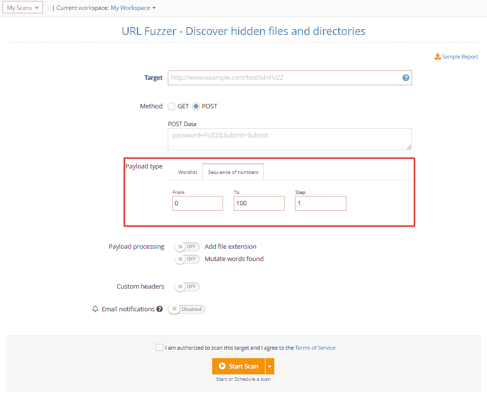

# 新模块、方法和有效载荷-4 月更新| Pentest-Tools.com

> 原文：<https://pentest-tools.com/blog/new-modules-methods-payload-april-updates>

对于我们来说，这是忙碌的一个月，我们很高兴分享我们的工作成果！

这 4 项平台改进旨在简化您的工作流程，因此您可以节省时间和精力来完成重要任务:

1.新网站扫描器的检测模块:**敏感数据抓取**
2。**新** : 3 我们为高危漏洞
3 打造的检测模块。使用一系列数字作为 URL Fuzzer
4 的有效负载。URL 模糊器现在支持**POST 方法**

让我们打开它们吧！

## **1。网站漏洞扫描器的新检测模块**

我们在新的网站漏洞扫描器(目前处于测试阶段)中添加了一个检测模块，该模块可以在您的 web 应用程序中搜索敏感信息，如电子邮件地址、社会保险号和信用卡号。

要使用它，进入**网站扫描器**，添加你的网址**目标**，选择**全面扫描**。

展开**攻击选项**，选择**被动检查**选项卡，确保开启**敏感数据抓取**。我们的扫描引擎将分析来自您的目标的 HTTP 响应，并寻找个人身份信息(PII)。

## **2。我们从头开始构建的三个新的定制模块**

我们添加了 **3 个定制检测模块**来帮助您识别特定的高风险漏洞。他们是这样做的:

*   **检测铪网络犯罪集团在 ProxyLogon 攻击中使用的受损[微软 Exchange 服务器](https://www.microsoft.com/security/blog/2021/03/02/hafnium-targeting-exchange-servers/)上部署的恶意网络外壳**

*   找到受未经认证的 RCE 漏洞( [CVE-2021-22986](https://support.f5.com/csp/article/K03009991) )影响的潜在**易受攻击的 F5 BIG-IP 设备**

*   检查暴露于[VMware vCenter RCE](/blog/vmware-rce-cve-2021-21972)(CVE-2021-21972)的系统**。**

需要了解您的环境是否受到这些特定漏洞的影响？

从带有 OpenVAS 的[网络漏洞扫描器中选择**全面扫描选项**，并在您的搜索结果中查看它们。](https://pentest-tools.com/network-vulnerability-scanning/network-security-scanner-online-openvas)

## **3。使用一系列数字作为 URL Fuzzer** 的有效载荷

除了*默认和自定义单词列表*，你现在可以选择使用**一系列数字作为 URL Fuzzer 的有效载荷**。

要启用它，请转到**有效载荷类型**，选择**数字序列**，并填写运行特定安全测试评估所需的序列数字。

## **4。URL Fuzzer 现在支持 POST 方法**

我们添加到 [**URL Fuzzer**](https://pentest-tools.com/website-vulnerability-scanning/discover-hidden-directories-and-files) 的另一个改进是**使用 POST 方法**的选项，这是最常见的 HTTP 方法之一。

为此，请转到 **URL Fuzzer** ，选择 **POST 选项**，并使用“FUZZ”maker 添加您希望在每个 HTTP 请求中发送的数据。

 *准备好带着这些更新兜风了吗？*