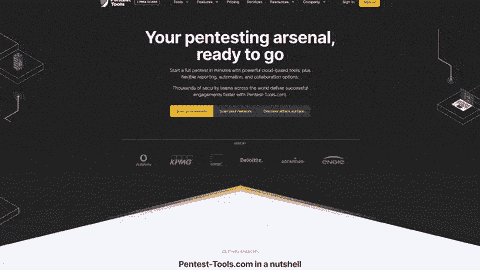
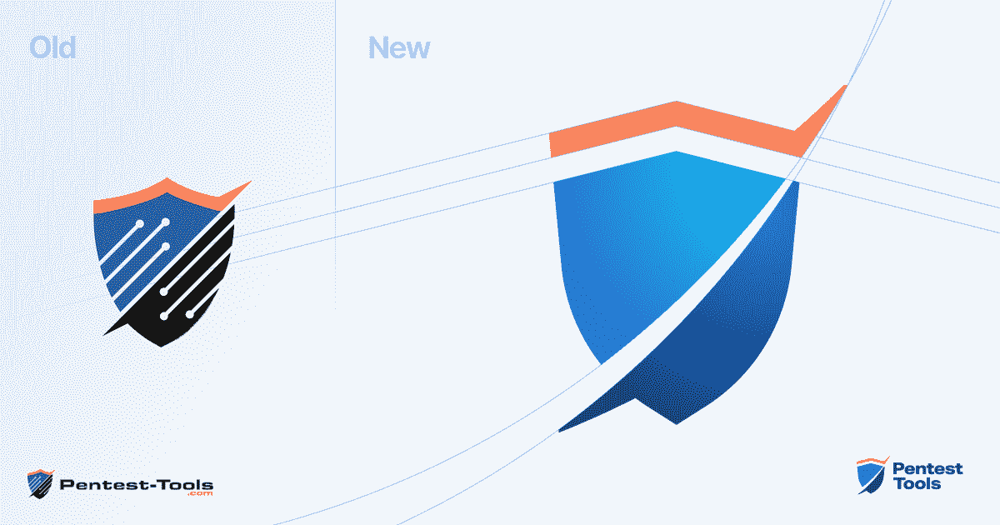

# 我们正在上升！查看新网站和品牌更新！Pentest-Tools.com

> 原文：<https://pentest-tools.com/blog/new-website-brand-update>

作为一名有道德的黑客，你知道一项技术总有比看起来更复杂的东西。

你深沉的能力和无尽的好奇心告诉你，幕后的工作比外人意识到的要付出更多的努力。这就是为什么我们很高兴与你分享进入新 Pentest-Tools.com 网站[**的选择和想法！**](https://pentest-tools.com/)

## **这些是我们建立在**基础上的核心原则

作为一个团队，我们已经将[赋予安全团队以卓越的速度、一致性和灵活性来交付成功的渗透测试项目作为我们的使命](https://pentest-tools.com/about)。拥有一个能够实现所有这些功能并支持[免费试用我们 pentest 工具的用户的网站](https://pentest-tools.com/alltools)对我们来说，与确保平台本身(独立于网站)以最佳性能运行一样重要。

因为我们相信*说到做到*，我们现在有了一个网站，更好地反映了我们作为一个公司、一个团队以及通过技术表达自己和与他人联系的人们的现状。

### **超高速**

让我们出去一会儿，好吗？

我们希望你会注意到新网站真的很快。我们的团队选择了尖端技术和框架的混合，如 **Vue JS** 、 **Nuxt。JS** 和**顺风**让你在[**【Pentest-Tools.com**](https://pentest-tools.com/)上的体验流畅、反应灵敏、即刻收获。

想免费试用我们的[网站漏洞扫描器](https://pentest-tools.com/website-vulnerability-scanning/website-scanner)或者看看我们的[寻找域名](https://pentest-tools.com/information-gathering/find-domains-owned-by-company)工具能挖掘出什么？在桌面上使用它们就像在移动设备上一样简单快捷。因为你需要根据灵感行动，哈哈！当他们罢工的时候，我们正在进行移动现实的测试。

### **一致性**

[**Pentest-Tools.com**](https://pentest-tools.com/)品牌更新展现了我们公司这些年来的发展历程。新的颜色、字体和图像集合带来了我们团队在日常工作中投入的能量和注意力。

新网站不仅看起来很舒服(无论是字面上还是象征性的)，而且导航起来也更直观。流畅的用户界面消除了干扰，让您专注于工作，同时帮助我们以更快的速度提供您需要的工具和内容。

> *作为对良好流程价值的坚定信仰者，我们打造 Pentest-Tools.com 品牌的方法是专注于迭代。*
> 
> *我们对眼前的目的地有一个很好的想法，我们正在将我们所知道的关于我们的客户、网络安全行业和我们所有经验的一切投入其中。*
> 
> 新网站是一个很好的开始，我们为团队每天取得的成绩感到骄傲。渴望目的地，但享受旅程的每一步。–[**Octavian Arnaut**](https://www.linkedin.com/in/octavianarnaut/)设计负责人

### **灵活性**

我们新网站的核心目标之一是确保每个人都能在网站上享受更丰富的体验和更快的流量。从事测试工作的人有着广泛的需求和背景，所以我们对为他们服务的**可访问性** **选项**进行了重大修改。

我们遵守《康复法案指南》的第 508 节和 W3C 的《网页内容无障碍指南》(WCAG)。

> “每一次网站重组和重新设计都是一次冒险。
> 
> 正如在每一个这样的过程中一样，在考虑开始旅程之前，有许多陷阱和陷阱需要你处理，有许多问题需要你回答清楚:我们让用户参与了多少？，什么样的技术组合最适合这项工作？，我们应该在多大程度上重新调整或彻底从头开始设计一切？，等等。
> 
> 我想公开感谢每一个人的努力，并祝贺他们的奉献和最终结果超越了每一个期望。"–[**维奥雷尔·莫卡努**](https://www.linkedin.com/in/viorelmocanu) 数字增长负责人

## 并非一切都会改变。以下是保持不变的

因为网站和 Pentest-Tools.com 平台分开运行，[你的测试武器库](https://pentest-tools.com/alltools)保持不变。你所知道和喜爱的用于侦察、漏洞发现和攻击性安全活动的 **25+工具**仍然存在，并且随着每个[月更新](/blog/categories/platform-updates)而变得更好。

您仍然可以每 24 小时 **2 次免费扫描**工具，如[查找子域](https://pentest-tools.com/information-gathering/find-subdomains-of-domain)、 [TCP 端口扫描](https://pentest-tools.com/network-vulnerability-scanning/tcp-port-scanner-online-nmap)、[网站侦察](https://pentest-tools.com/information-gathering/website-reconnaissance-discover-web-application-technologies)、 [SSL/TLS 漏洞扫描器](https://pentest-tools.com/network-vulnerability-scanning/ssl-tls-scanner)，以及其他带有[轻度扫描选项](https://support.pentest-tools.com/en/getting-started)的工具。

在接下来的几个月里，我们将完成这个博客和我们基于云的付费用户平台的改造。请相信我们会保留您所知道和喜爱的关于 Pentest-Tools.com 的一切，并让它变得更加美好！

> 对我来说，最大的挑战是确保新的免费扫描流程和旧的流程一样工作，而且更好！
> 
> *从改进的目标输入验证到扫描历史下拉菜单和扫描报告中增强的导航，我必须确保没有任何细节被忽略。*
> 
> 在新网站工作对我来说是一种特权。我有机会为网站架构的重大变革做出贡献，我为这一成就感到激动！在这几个月里，我学到了超出我想象的东西，我期待着应用我从中学到的技能和知识。–[**斯蒂芬·盖尔斯库**](https://www.linkedin.com/in/stefan-galescu/) ，前端开发人员

## 每个人都做出了贡献——非常感谢我们的团队！

信息安全是一个领域，在这个领域，技术上的精通被誉为终极成就。我们希望扩展这一观点，并增加更多的细微差别。

虽然技术技能无疑是重要的，但沟通能力也同样重要，无论是通过设计、UX、书面内容、视频、视觉还是其他元素来体现。

虽然我们分享对所有技术事物的热爱，但我们也非常欣赏以一种人性化、包容性和友好的方式使用技术。这就是为什么我们很高兴 Pentest-Tools.com 团队的每个人都贡献了他们最好的想法、工作和精力。

*我的职责是通过在 Bitbucket 管道中构建 CI/CD，确保新前端可扩展，从而确保开发人员的体验尽可能好。*

> *我们首先在不同的主机平台和部署方法上做了几个基准测试，最终选择了 Kubernetes。这在一开始对我来说似乎是一个挑战，因为这是我第一次使用 K8s，但我发现它比我想象的要容易。*
> 
> 在新网站上工作是一次美好的经历，我期待着即将到来的新挑战！

## **相信流程——质量胜于数量**

有了这个新网站，我们为公司范围的更新奠定了基础，利用每个人的经验、激情和个人承诺为信息安全社区做出有意义的贡献。

正如我们一直所做的那样，我们将继续积极寻求您(我们的用户)的反馈，并应用它来改善 Pentest-Tools.com 工作的各个方面，在此过程中增加一点乐趣。

我们团队的热情和奉献证明了更多的好东西正在路上！

“在这个新项目中工作是一个循环，包括学习、应用、为它不能工作而生气，以及重复这个过程。边做边学绝对是我的方法！

> 学习、分享知识、寻找全新问题的解决方案、当我们意识到有更简单的解决方案时重新迭代代码的结合——这一切都让我保持警觉，并与团队保持紧密联系。"**–[德拉戈斯三都](https://www.linkedin.com/in/dragos-nicolae-sandu/)，软件开发者**