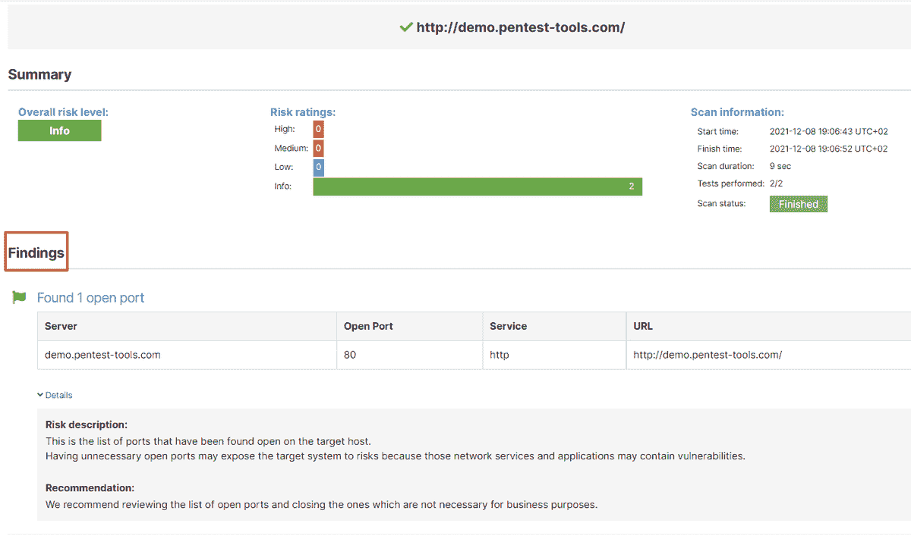

# 强大工作流的 11 月更新，包括 log 4 shell | Pentest-Tools.com 的检测

> 原文：<https://pentest-tools.com/blog/november-updates-log4shell>

立即为您提供所需的工具**以加快检测和报告速度始终是我们的首要任务。尤其是当您的工作对于有效地确定补救的优先顺序至关重要时。因此，每个月的更新，我们都努力做到这一点。**

**当您登录您的[Pentest-Tools.com](https://app.pentest-tools.com/login?utm_source=converkit&utm_medium=email&utm_campaign=updatesNOV2021)账户时，您可以使用我们的**网络扫描器**和**网站扫描器找到易受 [Log4j 漏洞(CVE-2021-44228)](/blog/log4shell-scanner-detect-cve-2021-44228) 攻击的目标。****

****发现易受攻击的目标[检测 log 4 shell](https://pentest-tools.com/network-vulnerability-scanning/network-security-scanner-online-openvas)****

**我们所做的不仅仅是对这个关键的 CVE 进行整合探测。**

**下面是我们推出的 7 个*更新*，让你的工作**更加强大和高效**:**

1.  ****利用狙击自动剥削者攻击 4 个新的高危漏洞****

2.  ****安排 pentest 机器人**运行自动化测试序列**

3.  ****删除您创建的不再需要的特定 HTTP 记录器****

4.  **使用**全新、流畅的狙击界面**获得详细的扫描结果**

5.  **在您的报告中包括**密码审计结果****

6.  ****使用网络扫描仪重点查找关键简历****

7.  ****发现新网站扫描仪模块的 Python & Perl 代码注入**问题**

**让我们打开它们吧！**

## ****1。狙击手现在自动利用这 4 个新的 CVE(cvss v3 评分 9.8+)****

**用 [**狙击自动剥削者**](https://pentest-tools.com/exploit-helpers/sniper) 在 2 分钟内确认、利用、做后期利用**为:****

1.  **Gitlab 社区版(CE)和企业版(EE)中的 **RCE 漏洞**—[CVE-2021-22205](https://nvd.nist.gov/vuln/detail/CVE-2021-22205)**

2.  **可视化工具 DVR 中的另一个**关键 RCE 攻击者可以通过使用 Linux 上的 shell 元字符- [CVE-2021-42071](https://nvd.nist.gov/vuln/detail/CVE-2021-42071)****

3.  **在 Unix Bash shell 中发现的 **Shellshock Bash RCE 漏洞**——[CVE-2014-6271](https://nvd.nist.gov/vuln/detail/cve-2014-6271)**

4.  **多个 Apache Struts web 应用中的 **RCE 漏洞**——[CVE-2017-9791](https://nvd.nist.gov/vuln/detail/CVE-2017-9791)**

**[**试狙击**](https://pentest-tools.com/exploit-helpers/sniper)**

## ****2。使用预定的 pentest 机器人自动执行定期定制测试序列****

**现在，您可以使用预定义或定制的 pentest 机器人运行计划扫描，以自动执行重复的 pentest 任务。**

**为了保持您的工作流程高效，请转到**目标**，选择一个特定的 **URL 目标**，并选择**用机器人扫描**。然后，选择您需要的 pentest 机器人，启用**调度机器人**，并在您的收件箱中获得扫描通知。**

**您可以从 **5 个现成的 pentest 机器人**中进行选择(域侦察、寻宝者-域或主机-自动 HTTP 登录 Bruteforcer、网站扫描器-所有端口、全 WordPress 扫描),或者通过将您的 pentest 逻辑与我们的工具和功能相结合来构建您的 pentest 机器人。**

**挖掘 pentest 机器人的巨大潜力:**

**[**预定一个机器人**](https://pentest-tools.com/features/pentest-robots)**

## ****3。删除不再需要的 HTTP 处理程序****

**您现在可以轻松地删除不需要的 HTTP 处理程序，即使它们仍然有效或过期(60 天后)。它有助于保持您的工作空间处于最佳状态！**

**转到您创建的**我的处理程序**，选择一个特定的处理程序，然后点击**动作**按钮。**

****

## ****4。狙击手的成功自动利用——在全新的界面中****

**每天不得不费力地阅读大量信息是一项艰巨的任务。我们会一如既往地支持你！**

**我们的团队已经修改了[狙击手自动剥削者](https://pentest-tools.com/exploit-helpers/sniper)报告，并添加了视觉提示和方便的导航菜单，这样您就可以找到您需要的内容，并在瞬间导出报告。**

**下面是新报告的快照:**

****

## ****5。在您的报告中自动添加密码审计结果****

**我们已经改进了我们的[密码审计器](https://pentest-tools.com/network-vulnerability-scanning/password-auditor)扫描仪，增加了**生成结果的选项**。**

**除了在您的 web 应用程序中查找弱凭据之外，它现在还将详细的发现添加到您的报告中，以便您可以提供更丰富的建议！。**

**转到**密码审计器**，插入你的 **URL 目标**，用它运行一个扫描，看看结果涌入:**

**从**调查结果**页面中，选择相关的调查结果并将其添加到您的 Pentest-Tools.com 报告中。简单，随时可用，不涉及任何配置工作。**

**[**报告弱凭据**](https://pentest-tools.com/network-vulnerability-scanning/password-auditor)**

## ****6。使用网络扫描仪运行聚焦扫描，查找关键简历****

**如果您想以一种轻松、非侵入性的方式专门检查高风险、可利用的漏洞，请尝试我们添加到网络扫描器中的新选项。**

**用 OpenVAS 进入网络漏洞扫描器，添加你的 **URL 目标**，选择**狙击扫描:****

**这种类型的扫描只运行[狙击手的探测能力](https://pentest-tools.com/exploit-helpers/sniper) *没有*利用部分。这是一种非侵入性的方法，所以对你的目标没有风险。**

## ****7。网站扫描程序内置了更强的代码注入检测功能****

**我们的网站漏洞扫描器变得更加强大，它为您的 web 应用程序中的 **Python 和 Perl 代码注入**提供了两个新的检测模块！**

**要使用它，请进入 [**网站扫描器**](https://pentest-tools.com/website-vulnerability-scanning/website-scanner) ，添加您的 **URL 目标**，并选择**全面扫描**。展开**攻击选项**，选择**主动检查**选项卡和**启用 Python 或 Perl 代码注入(**或两者，如果你需要的话 **)** 。**

**我们的扫描引擎将分析来自目标的 HTTP 响应，并检查任意 Python 和 Perl 代码。**

**希望这些更新能改进你的工作，帮助你专注于重要的任务！**