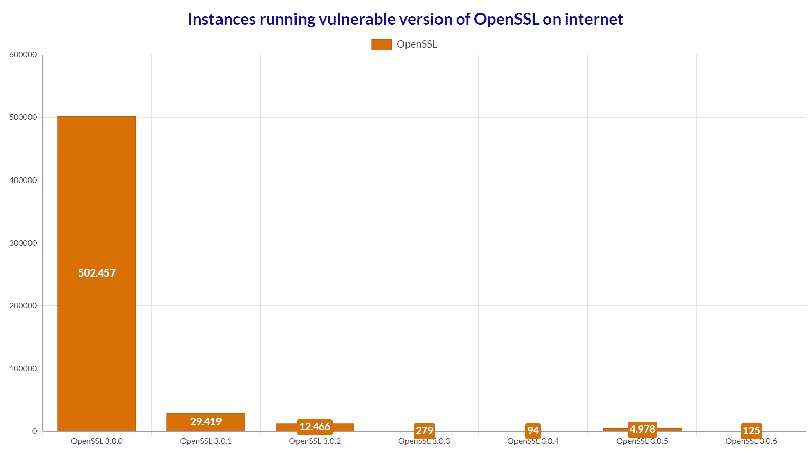
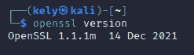
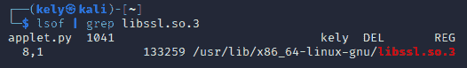
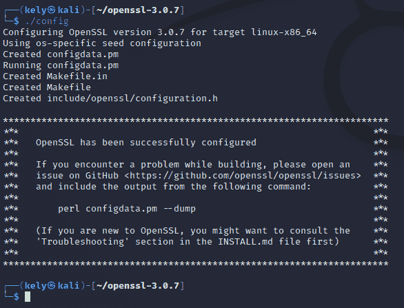
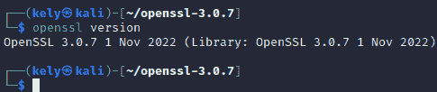

# 关于新的 OpenSSL 漏洞你需要知道什么| Pentest-Tools.com

> 原文：<https://pentest-tools.com/blog/openssl-vulnerabilities-2022>

在保护系统之前，我们需要了解我们要保护什么以及如何保护。今天，我们将探讨两个新的漏洞，它们在本月引起了社区的关注。

最重要的是，你将学会如何修补它们，以及它们有多大的影响力。

## 当你知道它要来的时候

2022 年 11 月 1 日，OpenSSL 团队发布了一份 [咨询](http://openssl.org/news/secadv/20221101.txt) ，详细介绍了两个高严重性漏洞， **CVE-2022-3602** 和 **CVE-2022-3786** 。

CVE-2022-3602 被预先宣布为严重错误，但后来被降级为高，引起了社区的仇恨浪潮。重要的是要记住，CVE-2022-3602 是北极熊在 10 月 17 日私下报告的，一天后，维克多·杜霍夫尼报告了 **CVE-2022-3786** 。

这是自著名的 Heartbleed 漏洞(CVE-2014-0160)以来第一个达到这种严重程度的问题。

在本帖中，我们将分解两个新的 OpenSSL 漏洞，但我们将重点关注 CVE-2022-3602 的技术细节。

## 什么是 OpenSSL，如何使用？

OpenSSL 库用于加密功能，特别是在网络连接的环境中。

例如，web 服务器经常使用 OpenSSL 来创建加密的连接。邮件服务器和 VPN 技术(如 OpenVPN)也使用 OpenSSL 来创建安全的通信通道。包括网络设备、嵌入式系统和容器映像在内的各种产品都包含该库。

OpenSSL 有三个主要组件:

*   这是一个加密库，实现了许多协议

*   libssl -一个实现所有 TLS 协议直到 TLSv1.3 的库

*   OpenSSL -一个命令行工具，用于各种操作(例如生成证书)

## 这些漏洞是什么？

这些漏洞是**内存损坏问题**，也称为缓冲区溢出/溢出，攻击者可以在受害者的机器上执行任意代码并接管它。

### CVE-2022-3786

X.509 电子邮件地址可变长度缓冲区溢出

该漏洞存在于验证后解析 TLS 证书的过程中。这会导致堆栈上的四字节溢出。攻击者可以在证书中创建恶意的电子邮件地址，使包含“.”的多个字节溢出堆栈上的(十进制 46)字符。

### CVE-2022-3602

X.509 电子邮件地址 4 字节缓冲区溢出

解析 TLS 证书后导致 CVE-2022-3602。不同之处在于，漏洞发生在名称约束检查之后。值得注意的是，受信任的 CA 需要签署恶意证书才能成功。

## 
统计数据，或者我们如何了解威胁等级

### 那么问题有多大呢？

很明显，我们没有新版本的心脏出血。以下示例展示了与 Heartbleed 相比，受影响的实例较少。我们从 [【石家庄】](https://shodan.io) 收集了运行 OpenSSL 易受攻击版本的实例的数据。

如您所见，大约有 550.000 个实例运行易受攻击的 OpenSSL 版本。值得注意的是，并非所有这些实例都容易受到攻击，因为堆栈布局和保护等重要因素起着重要作用。

他们中的大多数都使用 OpenSSL 3.0.0，其中首次引入了 punycode 解码功能。

最新的 OpenSSL 版本包含在多个流行的 Linux 发行版的最新版本中，如 Redhat Enterprise Linux 9、Ubuntu 22.04+、CentOS Stream9、Kali 2022.3、Debian 12 和 Fedora 36。

Docker 还估计，大约有 [**1，000 个**](https://www.docker.com/blog/security-advisory-critical-openssl-vulnerability/) [图像库可能会在各种 Docker 官方图像和 Docker 验证的发布者图像中受到影响](https://www.docker.com/blog/security-advisory-critical-openssl-vulnerability/)。

Akamai 对其基础设施进行了一项 [研究](https://www.akamai.com/blog/security-research/openssl-vulnerability-how-to-effectively-prepare) ，他们发现大约有**50%的受监控环境中至少有一台机器至少有一个进程依赖于易受攻击的 OpenSSL 版本。在这些网络中，网络中依赖于易受攻击的 OpenSSL 版本的机器的百分比从 0.2%到 33%不等。**

**在接下来的几个月里，安全社区有很多工作要做。(为什么总是在年底出现这种情况？)**

## ****深潜 CVE-2022-3602****

**除了拒绝服务(DoS)之外，这种 CVE 还会导致 RCE。我们来详细了解一下这个漏洞是如何运作的。为此，我们必须解开这一切开始的地方。**

**好吧，但是导致这一切的开发人员的错误在哪里呢？**

**程序员有一个笑话，类似于“如果代码有效，不要碰它！”，只是这次我们将它应用于安全环境中。OpenSSL 的开发者在 OpenSSL 3.0.0 中引入了一个名为[**ossl _ punycode _ decode**](https://github.com/openssl/openssl/blob/openssl-3.0.6/crypto/punycode.c#L118)的新功能，提供 puny code 域名的解码功能。**

**现在，您可能想知道 punycode 是什么，它是如何导致如此高风险的漏洞的。**

**Punycode 是一种简单高效的传输编码语法，设计用于应用程序中的国际化域名(IDNA)。它唯一且可逆地将 Unicode 字符串转换成 ASCII 字符串。**

**计算机将 IDNA 域转换成双关码域。在 OpenSSL 中，ossl *punycode* decode 获取一个 punycode 域的字符串缓冲区，并将其转换为 Unicode 进行额外的处理。**

**由于该漏洞是缓冲区溢出，在某处，数据超出缓冲区，导致覆盖相邻内存位置。**

**在 CVE-2022-3602 中，这发生在 **X.509 证书验证**期间。该编码漏洞出现在 ossl *punycode* decode 函数中，该函数用于将 punycode 域转换为 Unicode。**

**此编码漏洞使得远程攻击者能够使用签名的恶意 TLS 证书在机器上执行代码。**

**这里 可以看到有漏洞函数 [的库。](https://github.com/openssl/openssl/blob/openssl-3.0.6/crypto/punycode.c#L118)**

**Through statistical analysis, write a good lesson plan for commenting on test papers, so that we can be prepared when commenting and get to the point.**

**即使攻击者成功克服了所有其他挑战，他们也只能向堆栈中写入一个 4 字节的项目。过去，四个字节通常足以替换堆栈上的返回指针并执行任意代码，但现在不行了。这是因为像 ASLR 和金丝雀这样的保护措施会很容易阻止这种攻击。**

## **我怎么知道自己是否脆弱？**

**有几种方法可以确定您的实例是否使用了易受攻击的版本。你首先要知道，只有 OpenSSL 3.0.0-3.0.6 版本容易受到这些 CVE 的攻击。让我们检查所有的方法并检测那些易受攻击的版本。**

**如果您想要手动检查您的机器，您需要通过一系列步骤来检测运行的 OpenSSL 版本。**

### **系统**

**在 Linux 操作系统中键入以下内容将向我们展示系统上使用的 OpenSSL 版本。如果版本在 3.0.0-3.0.6 之间，您就有风险，应该立即更新。**

****

****openssl 版本****

### **动态链接**

**接下来，我们需要深入挖掘，寻找动态加载的流程。我们将使用 **lsof** 命令来完成。**

****

****lsof | grep libssl.so.3****

**我们还发现这些脚本在检测中很有用**

**Linux & *Nix 扫描器(Bash 脚本):[https://github . com/malware tech/SpookySSLTools/blob/main/OpenSSL _ scan . sh](https://github.com/MalwareTech/SpookySSLTools/blob/main/openssl_scan.sh)**

**Windows 扫描器(PowerShell):[https://github . com/malware tech/SpookySSLTools/blob/main/OpenSSL _ scan . PS1](https://github.com/MalwareTech/SpookySSLTools/blob/main/openssl_scan.ps1)**

**来源:[malwaretech.com](https://www.malwaretech.com/2022/11/everything-you-need-to-know-about-the-openssl-3-0-7-patch.html)**

### **静态链接软件**

**现在最难的部分来了，因为静态编译的软件 **lsof** 不会检测 OpenSSL 版本，也不会检测那些脚本。这就是为什么对于**静态**编译的软件，我们需要使用 **readelf** 命令。**

**`readelf -a [binary] | grep -i osslpunycodedecode`**

**我们发现的另一个有用的方法是将下面的正则表达式直接应用于二进制文件:**

**`Unix-like: strings /path/to/executable | grep “^OpenSSL\s*[0-9].[0-9].[0-9]”`**

**`Windows: select-string -Path C:\path\to\executable.exe -Pattern “OpenSSL\s*[0-9].[0-9].[0-9]” -AllMatches | % { $.Matches } | % { $.Value }`**

**来源:[malwaretech.com](https://www.malwaretech.com/2022/11/everything-you-need-to-know-about-the-openssl-3-0-7-patch.html)**

## **我很脆弱，现在该怎么办？**

**好的一面是给你的系统打补丁非常容易。您可以通过更新 OpenSSL 版本来轻松缓解这种威胁。**

**按照以下步骤将您的 OpenSSL 版本更新到 3.0.7**

1.  **wget[https://www . OpenSSL . org/source/OpenSSL-3 . 0 . 7 . tar . gzt 3](https://www.openssl.org/source/openssl-3.0.7.tar.gz)**

2.  **chmod+x openssl-3.0.7.tar.gz**

3.  **塔尔-zxf openssl-3.0.7.tar.gz**

4.  **cd openssl-3.0.7/**

5.  **。/config**

****

6.  **sudo 安装制造商 gcc**

7.  **sudo make**

8.  **sudo make 测试**

9.  **sudo mv /usr/bin/openssl ~/tmp**

10.  **sudo make 安装**

11.  **sudo ldconfig /usr/local/lib64/**

12.  **sudo ln-s/usr/local/bin/OpenSSL/usr/bin/OpenSSL**

13.  **sudo ldconfig**

**在所有这些命令之后，我们得到了 OpenSSL 3.0.7 版本，现在我们比攻击者领先了一步。**

****

## **开发先决条件**

**既然我们已经学习了如何修补我们的系统，让我们看看成功攻击所需的条件。成功攻击的发生有两个重要条件。**

1.  **首先，也是最重要的一点，这种攻击要么依靠证书颁发机构(CA)来签署恶意证书，要么依靠用户跳过警告，让应用程序不正确地检查证书。** 

2.  **然后，显示堆栈布局和保护。如果第一个条件失败，这两个因素很容易让威胁消失。**

**鉴于上述情况，加上这些攻击复杂且难以实现的事实，我们认为通过 CVE-2022-3602 获得远程代码执行(RCE)是非常困难的。**

## **你应该有多担心？**

**多亏了致力于提高安全性的开明人士，我们现在有了保护措施(ASLR、NX 堆栈、堆栈 cookies ),使得利用堆栈溢出变得非常复杂和难以实现。此外，考虑到这个漏洞很大程度上是客户端的，您可能会收到警告。所以这些简历非常适合那些不先阅读就对所有事情都点击“是”的用户。**

**要回答这个问题，你不应该忽视它，认为攻击者利用这些 CVE 太难了。您应该尽快对 OpenSSL 3.0.7 进行安全更新。**

## **常见问题解答**

### **问:所有 OpenSSL 版本都容易受到这些漏洞的攻击吗？**

**答:不，这些错误是作为 Punycode 解码功能的一部分引入的(目前仅用于处理 X.509 证书中的电子邮件地址名称约束)。这段代码最初是在 OpenSSL 3.0.0 中引入的。OpenSSL 1.0.2、1.1.1 和其他早期版本不受影响。**

### **问:我需要更换我的 TLS 服务器证书吗？**

**答:没有。**

### **问:这些漏洞和心脏出血一样吗？**

**答:不会，因为前提是必须配置客户端或服务器来验证证书中的恶意电子邮件地址。**

### **问:有可能更早地防止这些漏洞吗？**

**答:答案是**是的**。稍加模糊就能发现这个漏洞。**

### **问:这些漏洞的 CVSS 得分是多少？**

**答:两份简历的 CVSS 得分都是 7.5 分(高)。**

## **结论**

**来自网络安全社区的许多人批评了 OpenSSL 处理这些漏洞的公告和补救的方式。他们给人们施加压力，宣布它是关键的，然后降级到高。**

**也许得到降级的警告会很好，但是，当您有一个小型安全团队需要进行分类和分析直到最后一刻时，这并不容易。**

**我们必须感谢他们将此公之于众的努力，我们没有遇到漏洞在最后时刻升级的情况。**

**这一预先声明让企业有时间为最坏的情况做准备，并为快速解决方案规划关键资产。**