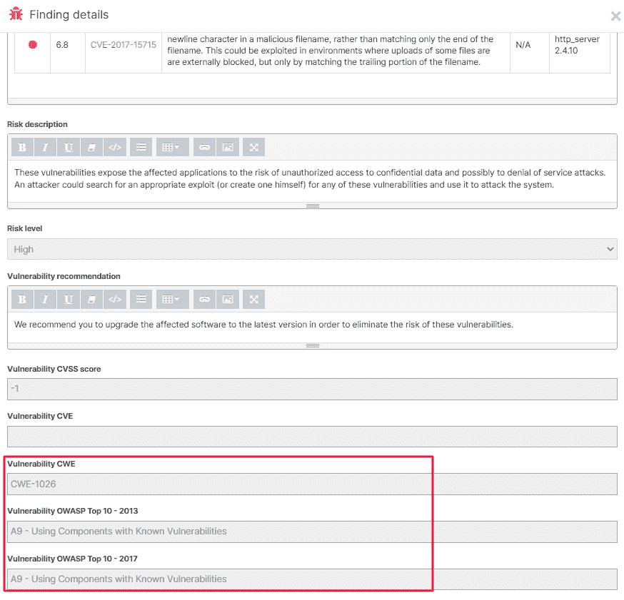
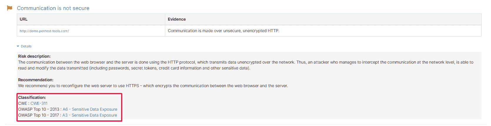
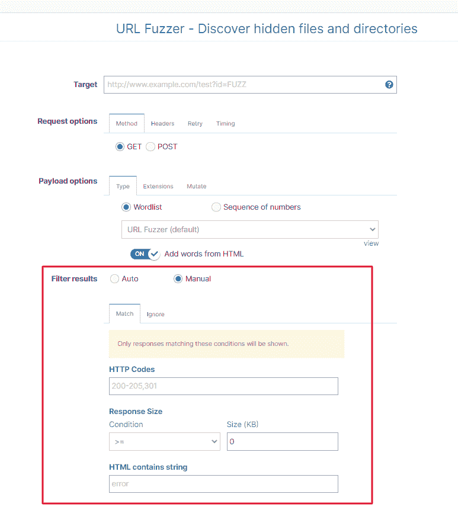

# 增加了 OWASP 和 CWE vuln 分类，增加了单词列表限制，更多更新| Pentest-Tools.com

> 原文：<https://pentest-tools.com/blog/owasp-cwe-vuln-classification-wordlist-june-updates>

本月，我们推出了 5 项平台改进，简化了您的测试，让您可以做更多自己最喜欢的工作:

1.网站扫描结果–**OWASP 2013/2017&CWE vuln 信息**增加

2.**单词列表限制增加:**添加更多的 5X 单词列表

3.**新增**:密码审计器现在支持 **NTLM 认证**

4.**根据客户匹配过滤 URL 模糊器结果**

5.**使用 URL Fuzzer 定制请求计时选项**

## 让我们打开它们吧！

## **1。网站扫描结果包括 OWASP 2013/2017 & CWE vuln 信息**

你从我们的[网站扫描器](https://pentest-tools.com/website-vulnerability-scanning/website-scanner)获得的发现描述现在包括他们所属的 2013 年和 2017 年 OWASP 十大类及其分配的 CWE 号。

要查看此信息，请转到**调查结果**并选择您需要查看更多详细信息的结果。你也可以从**扫描**中看到它，在那里你可以检查目标的扫描结果。只需点击**详情**即可查看**分类**。

请记住，当您选择将哪些调查结果纳入报告时，您可以自动****将这些细节纳入报告**。**

****

****

## ****2。单词列表限制现在增加到 50.000 个单词****

**好消息！我们将单词列表限制从 10.000 个单词增加到 **50.000 个单词**。你现在可以添加*甚至*更多的单词(用户名，密码，配置文件等。)从您的 Pentest-Tools.com 帐户测试您的目标。**

**对于您创建的每个单词列表，您可以**包含多达 50.000 个单词**，其中每个单词的最大长度为 200 个字符。**

**使用我们提供的默认单词表或添加您自己的单词表，以便更快、更流畅地进行测试。**

## ****3。密码审计器现在支持 NTLM 认证****

**我们还改进了[密码审计器](https://pentest-tools.com/network-vulnerability-scanning/password-auditor)，增加了对 NTLM(新技术局域网管理器)认证协议的支持。**

**通过 NTLM 的身份验证使用质询-响应协议，并且作为单点登录(SSO)的一种形式，不要求用户通过网络发送未受保护的密码。**

## ****4。基于自定义匹配过滤 URL Fuzzer 结果****

**我们做的另一个改进是选择**根据你选择的条件自动过滤 [URL Fuzzer](https://pentest-tools.com/website-vulnerability-scanning/discover-hidden-directories-and-files) 结果**。**

**根据您的参与情况，您现在可以:**

*   ***忽略或匹配*某些 HTTP 代码**

*   ***如果 HTML 包含字符串，忽略或匹配***

*   ***忽略或匹配*响应大小的某些条件。**

****

## ****5。URL Fuzzer 现在包括自定义请求计时选项****

**我们还在 [URL Fuzzer](https://pentest-tools.com/website-vulnerability-scanning/discover-hidden-directories-and-files) 中添加了一个**定制请求选项**，它允许您为 HTTP 请求定义特定的时间。**

**当您转到 **URL Fuzzer** ，添加您的 URL **目标**，并选择**计时**时，您可以定义工具将为您运行的并行请求的数量。**

**您还可以设置每个请求最多重试 10 次。**

**这是新选项的快照:**