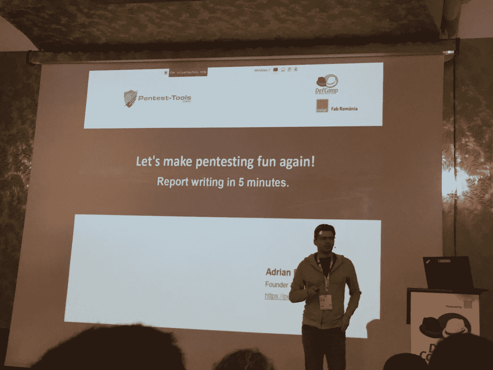
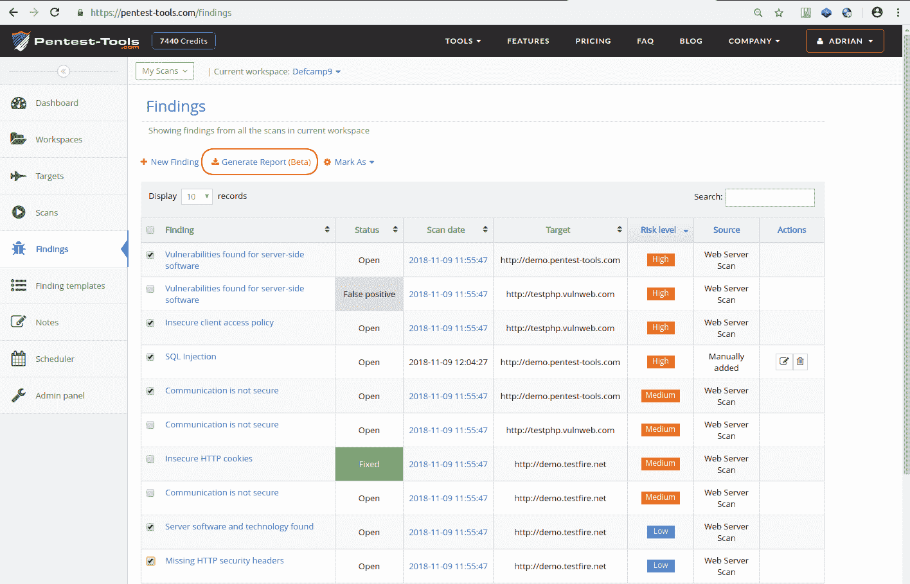
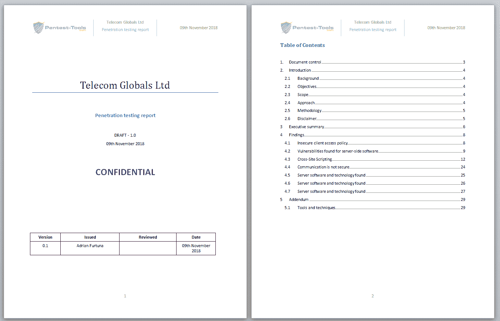
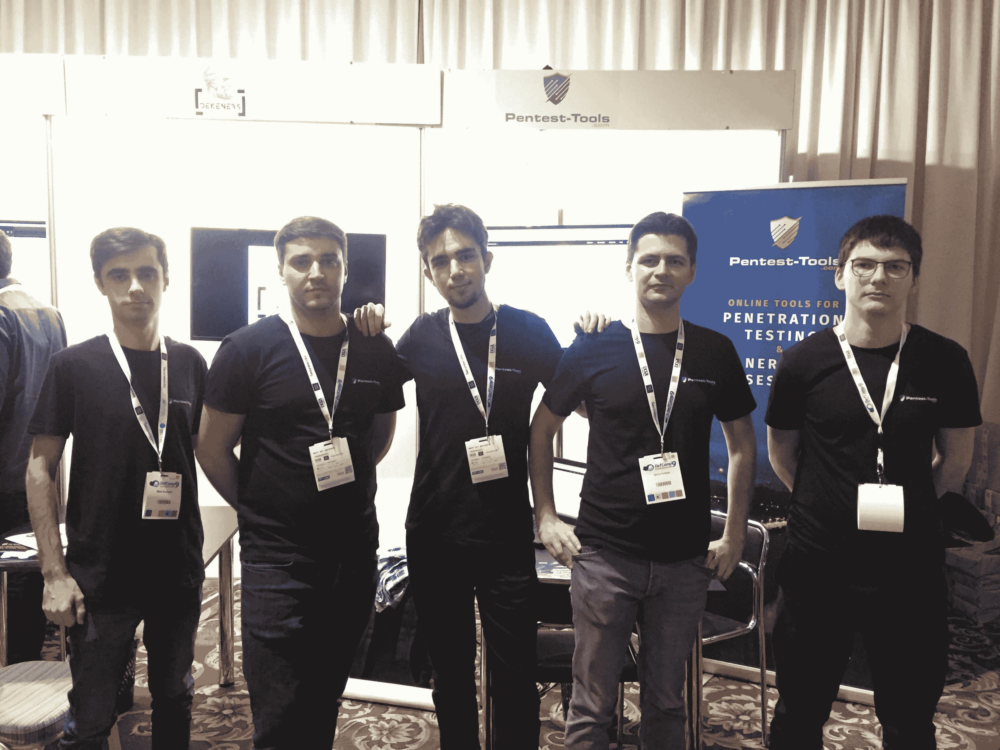

# 5 分钟内完成 Pentest 报告(Defcamp 2018 演讲)| Pentest-Tools.com

> 原文：<https://pentest-tools.com/blog/pentest-report-generator-defcamp-2018>

厌倦了写 pentest 报告？让我们自动化这个过程，让你回到黑客！包括幻灯片。

上周五，我们有幸参加了中东欧最大的安全会议 [**Defcamp 2018**](https://def.camp/) 。

除了在那里有一个展览摊位并与许多有趣的人交谈之外，我们的创始人&首席执行官[Adrian furt un 还举办了一场关于我们最新功能的演示](https://www.youtube.com/watch?v=fTc48Qpx9eg&list=PLnwq8gv9MEKhpkg2-sWdc3OV_pyXslZoL&index=36&t=1525s):关于 [**Pentest 报告生成器**](https://pentest-tools.com/usage/pentest-reporting-tool) 。

这个想法是为了减少写报告花费的时间(和摩擦),忘记格式、执行摘要、介绍和其他细节。这个功能试图尽可能多地涵盖这方面的工作，以便让 pentester 专注于有趣的东西。

报告生成器基于我们添加的另一个新特性:**发现**。这是应用程序中的一个新视图，包含来自当前工作区的所有扫描的聚合结果。有了这个集合，您现在可以选择您想要在报告中包含哪些发现，并按下按钮**生成报告**。

您将获得一个可编辑的报告(。docx for Microsoft Word)，该文件格式良好，可以发送到您的客户端。

您还可以选择手动添加从平台外部(其他扫描仪或手动)获得的结果，这样您就不会受限于我们扫描仪的结果。

添加手动调查结果时，您可以利用**调查结果模板**功能，在该功能中，您可以预定义带有标准描述、风险和建议的调查结果。我们将有一个单独的博客帖子专门报道写作，我们将详细介绍这些功能。

下面的视频展示了如何生成可编辑的 pentest 报告。docx)从你在 Pentest-Tools.com 的发现。

<template x-if="showVideo"></template>

***更新*** : [**这里是 Pentest 报表生成工具**](https://pentest-tools.com/usage/pentest-reporting-tool) 的完整描述。

### **我们的牛逼团队**

在这篇简短博文的结尾，是 Pentest-Tools.com 团队(在我们的 Defcamp 展台)让所有的奇迹发生了。

这里是我们在 Defcamp 2018 上的演讲的幻灯片。当视频发布时，我们将更新这篇博文。

更新:可以在这里观看演示[。](https://www.youtube.com/watch?v=fTc48Qpx9eg&list=PLnwq8gv9MEKhpkg2-sWdc3OV_pyXslZoL&index=36&t=1525s)

请随意[尝试我们的报告生成工具](https://pentest-tools.com/usage/pentest-reporting-tool)(目前是测试版)并向我们发送反馈！

**感谢**

我们要感谢[**Orange Fab Romania**](https://www.orangefab.ro/en/)为我们参加 Defcamp 提供便利，也要感谢 [**Defcamp**](https://def.camp/) 的组织者，他们每年都为这个令人敬畏的会议做着出色的工作！