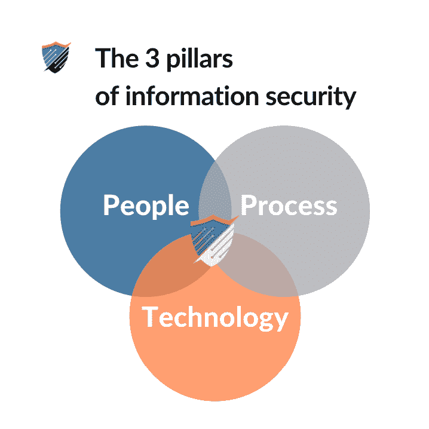
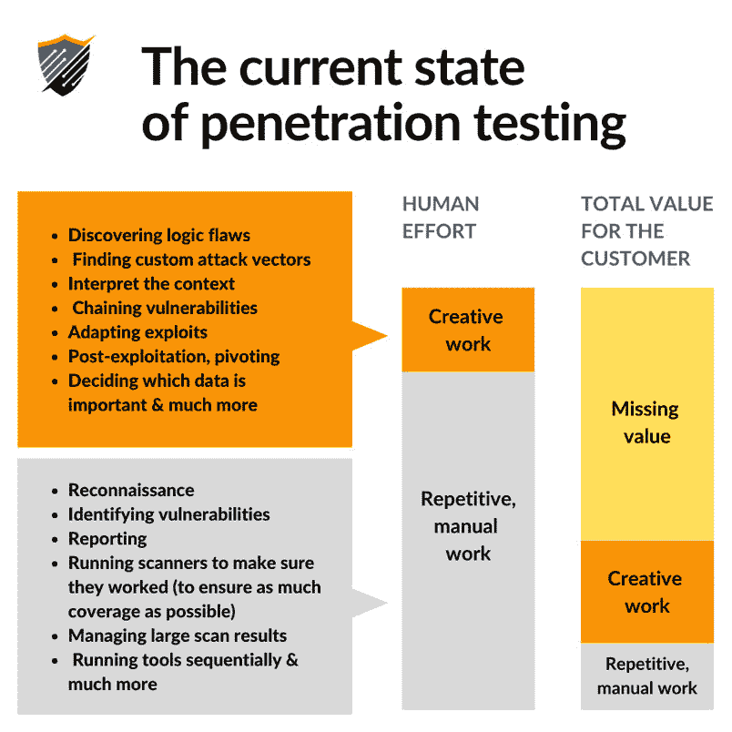
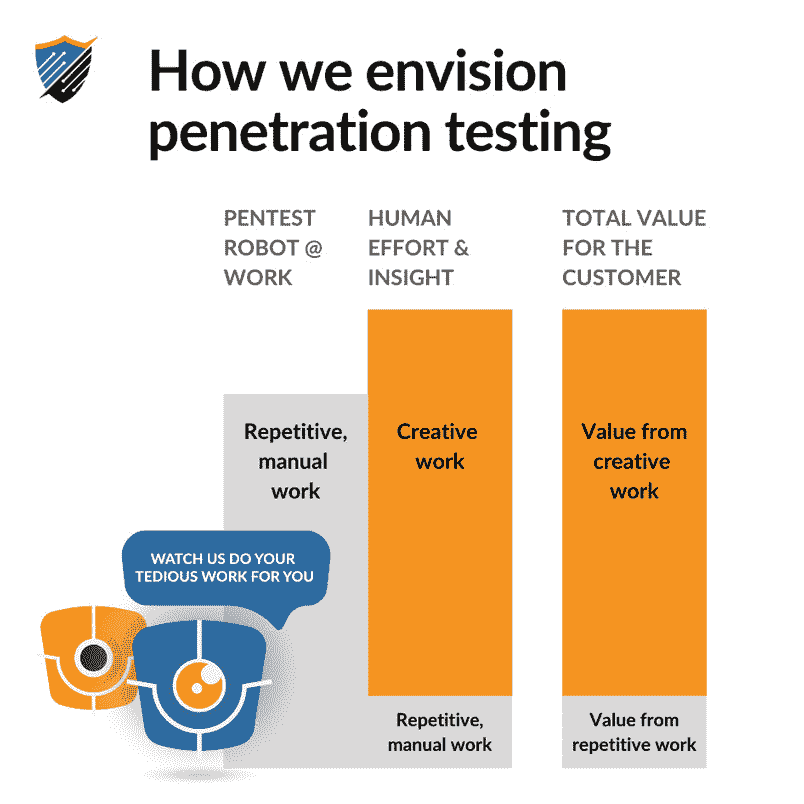
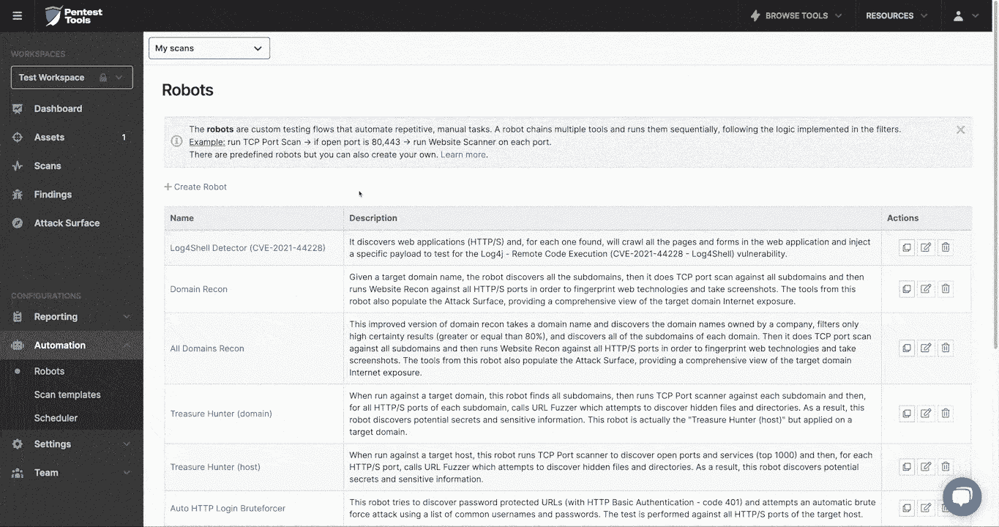

# Pentest 机器人 pentesters 的火箭燃料，而不是它们的替代品| Pentest-Tools.com

> 原文：<https://pentest-tools.com/blog/pentest-robots-automation-feature>

让我从一开始就说:完全自动化是扩展渗透测试的错误方法。

整个“机器将取代人类”的观点并不适合我们。它太简单了，没有抓住安全测试和更大的信息安全生态系统中涉及的复杂性和深度。

那么，我们为什么要在黑帽欧洲 2020 大会上推出自动化功能 pentest 机器人呢？

因为我们相信自动化不应该是一个全有或全无的命题。

以下是我们的观点，以及我们的创始人兼首席执行官 [**阿德里安·富图纳**](https://www.safetydetectives.com/blog/interview-adrian-furtuna-pentest-tools/) 、我们的客户成功主管**【Adina mihai ta】**我们的软件开发人员之一 Cosmin Tudor** ，他几个月来一直专注于该项目，以及我们的董事长 **Andrei Pitis** ，他捕捉到了业务背景。**

## ****粉碎自动化陈词滥调****

**人们。过程。技术。**

**这三个组件构成了信息安全的基础。你不能没有其他的就只有一个。**

**然而，行业外人看到的大多是技术部分。大多数人想要一颗神奇的子弹，并希望合适的技术产品能够实现它。但这并不现实，尤其是在信息安全领域。**

**安全性是一个如此复杂的挑战，它如此依赖于人性(人和他们设计的流程),单靠技术是不够的。更可行和可靠的方法是将那些阻止人类做他们最擅长的事情的工作自动化。**

**我们的意思是。**

**我们知道渗透测试人员和高度熟练的安全专业人员交付出色的工作，因为他们使用自己的主观判断[看到其他人看不到的东西](/blog/categories/security-research)(资产、模式、安全和业务问题之间的联系等)。).你不可能自动完成。**

**技术*可以*解决的问题是我们在过去 8 年建造【Pentest-Tools.com】T2 的过程中一次又一次看到的问题:大量的重复、手工工作、等待时间、维护、为链工具编写脚本、筛选结果。**

**因为我们不喜欢炫耀炒作的话，而是喜欢安静地工作来解决我们从经验中知道的紧迫问题，我们开发了 [pentest 机器人](https://pentest-tools.com/features/pentest-robots)来解决这个问题。**

**渗透测试的当前状态**

> **与机器人玩耍是如此有趣，但对工程师来说，没有什么比为用户节省时间更令人愉快的了。我真的相信这个特性会帮助专家们在工作中变得更加高效。**

****软件开发商 Cosmin Tudor****

## ****什么是圣灵降临者真正需要的****

**参与安全测试的测试人员、顾问和其他专家真正需要的是更多的时间。**

**更多的时间来发现和利用有趣的漏洞。**

**有更多的时间来设计复杂的测试流程，这些流程根据工具的逻辑来组合工具，以展示具有高业务影响的不寻常的发现。更多时间开发漏洞。**

**有更多时间寻找(更好的)客户并拓展业务。**

**更多的时间阅读和做研究。更多的时间来训练他们的队伍。**

**更多的时间让他们的思想自由地漫游一会儿。(也有更多的时间睡觉！)**

> ***我们注意到，尽管尽了最大努力，我们的一些客户还是没有时间充分利用我们的一些新功能，例如攻击面视图。因为他们迫切需要解决具体问题，所以他们有时会专注于单一工具，而不会探索我们平台的全部功能。我们希望 pentest 机器人将使他们能够专注于更具战略性的工作领域。***

****Adina Mihaita，客户成功主管****

**我们如何设想渗透测试**

**通过 pentest 机器人，**我们希望为我们的客户赢得宝贵的时间**,这样他们就可以在技能和专业知识方面进行试验、成长和升级。这就是我们帮助他们将任务甚至流程自动化到他们想要的程度的原因。**

> ***我内心的圣灵非常高兴有这样一个玩具可以玩。虽然使用 pentest 机器人很有趣，但它实际上是一个强大的自动化功能，可以帮助我减少 pentest 期间的重复工作，并让我专注于互动中有趣的方面。***

****阿德里安·富图纳，创始人&首席执行官****

**在安全测试中，**你无法取代批判性思考者**，他们利用自己的主观判断来识别不寻常的缺陷或连锁看似无关的漏洞，以获得更高的特权。**

**一个好的测试者永远不会被机器人取代。但是一个机器人可以让它们的效率成倍提高。以下是方法。**

> ***主要是，我们的客户希望自动化或加快他们工作的某些方面，如漏洞扫描或报告。到目前为止，我们已经在平台中内置了日程安排和高级报告，并在不断更新和改进它们。有了 pentest 机器人，他们真的可以在生产力和效率方面实现飞跃。***

****Adina Mihaita，客户成功主管****

## ****演示:pentest 机器人如何工作****

**有了这个新特性，我们将继续在 pentesting 中实现可行、有效的自动化。**

**我们刚刚在 2020 年黑帽欧洲展上推出了 [pentest 机器人](https://pentest-tools.com/features/pentest-robots)，它们现在可供所有 Pentest-Tools.com 客户使用！**

> ***我们在这方面拥有独特的优势，因为我们已经将一系列 pentesting 工具集成到我们的平台中，这些工具以前需要专家手动运行。***
> 
> **pentest 机器人是我们在这些现有工具的基础上增加的一个自动化层，旨在实现更顺畅的工作流程。构建这一特性是我们平台扩展和成熟过程中的一个自然步骤。**

****阿德里安·富图纳，创始人&首席执行官****

**但是说够了，是时候向你展示这个东西是如何工作的了！**

**在这个演示中，Adrian 解释了 pentest 机器人背后的 *why* 和 *how* ，演示了如何在活动目标上构建和使用 pentest 机器人。**

**在你开始行动之前，有一些事情需要你直接从团队内部关注:**

> **侦察机器人的伸缩性和速度一开始可能并不明显，但它在几分钟内发现的潜在弱点的数量确实令人印象深刻。看他们挖来挖去真的很好玩！**

****软件开发商 Cosmin Tudor****

 **<template x-if="showVideo"></template>

**侦查机器人**–[发现目标域的所有子域](https://pentest-tools.com/information-gathering/find-subdomains-of-domain)。然后继续进行全面的[端口扫描](https://pentest-tools.com/network-vulnerability-scanning/tcp-port-scanner-online-nmap)和[服务发现](https://pentest-tools.com/information-gathering/website-reconnaissance-discover-web-application-technologies)。对于每个网络端口，它会进行侦察以收集技术和截图。你可以在统一的[攻击面视图](https://pentest-tools.com/features/attack-surface)中找到聚合的所有数据。

**Web 登录 Bruteforcer 机器人**–[识别目标主机的所有 Web 端口](https://pentest-tools.com/network-vulnerability-scanning/tcp-port-scanner-online-nmap)。对于每个 web 端口(80、443、8080、8443 等)，它使用公共 web 接口 URL 列表运行 [URL Fuzzer](https://pentest-tools.com/website-vulnerability-scanning/discover-hidden-directories-and-files) 。对于找到的每个登录接口，它运行[密码审计器](https://pentest-tools.com/network-vulnerability-scanning/password-auditor)来找到脆弱的通用凭证。

*   **全网页扫描机器人**–识别目标主机的所有网页端口(80、443、8080、8081，任何讲 http/s 的端口)。对于每个 web 端口，它会进行一次[全面的网站扫描](https://pentest-tools.com/website-vulnerability-scanning/website-scanner)，搜索 SQL 注入、XSS、操作系统命令注入以及 OWASP Top 10 中的所有其他漏洞等等！在结束之前，这个 pentest 机器人会生成一个包含所有发现的汇总报告。

*   想象一下选择你的目标，点击“用机器人扫描”，处理你积压的任务(或者休息一下！)而他们为你做所有的工作。听起来如何？

*   对于机器人来说，一个可靠的起点是 Pentest-Tools.com 拥有大量的工具。[发现工具](https://pentest-tools.com/alltools)在 pentest 机器人的动态中也发挥着巨大的作用。再加上漏洞扫描器，你就有了一个复杂的测试方法。

**软件开发商 Cosmin Tudor**

> 真正让我们兴奋的是想象我们的客户将如何利用他们的创造力、知识和经验来制造我们可能从未想到过的机器人！

Pentesters 会惊讶地发现，机器人允许他们通过组合各种工具、过滤器和可用条件来创建一些独特的测试流程。例如，他们可以创建测试特定端口的机器人，以特定技术为目标，只包含特定的 URL 或由特定公司拥有。

**艾德里安·富图纳，创始人&首席执行官**

> Pentest 机器人迎合了每个黑客(包括我们自己)内心的控制狂。将深度定制与最高效率相结合是我们的目标，也是我们继续努力的方向。 [Pentest 机器人](https://pentest-tools.com/features/pentest-robots)刚刚登陆，但我们能和它们一起享受的乐趣才刚刚开始！

**我们如何进一步开发 pentest 机器人**

我们喜欢让事情变得简单、现实和透明。因此，我们并不回避承认，虽然当前类型的 pentest 机器人适用于大多数 pentesters，但一些专家可能想要更大的灵活性。

## 改进已经在我们的产品路线图上，我们将每月推出它们！

为了让 pentest 机器人更直观，我们还需要做一些工作。

**软件开发商 Cosmin Tudor**

> *目前，用于组合工具的逻辑块非常基本(过滤器和/或条件)，但我们正在努力增加更多的逻辑功能，以便平台用户可以创建更复杂的机器人。*

**阿德里安·富图纳，创始人&首席执行官**

> 

正如你在我们的[月度平台更新](/blog/categories/platform-updates)中看到的，我们正在努力改进的不仅仅是 pentest 机器人。

*我们收到很多关于通知的问题，因为我们的客户希望仅在扫描结果符合特定标准时收到警报。他们需要更多可以在没有他们监督的情况下运行的工具。因此，我们正在努力改进和扩大我们的警报，以进一步减少噪音，节省他们更多的时间。*

**Adina Mihaita，客户成功线索**

> 我们实际上是如何做到这一点的，我们不断地从我们的客户和社区那里得到反馈。我们自己也使用该平台，并把握行业脉搏。着眼于大局，着眼于细节，我们努力追求真正的性能。

这不是一个容易的壮举，但我们喜欢一个好的挑战！

我们从建造 pentest 机器人中学到了什么

不管你有多少年的经验，信息安全总是让你保持警觉。这就是为什么[我们培养学生的心态](/blog/build-infosec-career)，不断学习、尝试，并与社区分享我们的知识。

## 我们不害怕承认我们有时很难找到理想的解决方案，但我们总是尽最大努力兑现我们的承诺。我们非常珍惜客户对我们业务的信任，因此我们有责任培养这种信任。

由于 pentest 机器人代表了安全测试市场的一项创新，因此面临着许多挑战。作为任何创新，你不知道它是否会从一开始就成功。

*然而，我面临的主要挑战是设计一个直观的机器人创建工具(使用类似 RPA 的图形化方法),实现测试工具和功能的强大组合，同时易于所有客户使用和理解。*

> **阿德里安·富图纳，创始人&首席执行官**
> 
> **获得更多的时间，也获得更多的$$**

既然我们已经对新的 pentest 机器人了如指掌，那我们就来谈生意吧。

## 有很多未开发的潜力，安全测试专家和其他安全测试专家可以用正确的工具打开这些潜力。

Pentesters 和顾问不仅仅是安全专家，他们还经常戴着企业主的帽子。我们知道他们需要更多的时间与业务决策者沟通，因为他们对风险看得不像他们那么远。这不仅仅是关于[写引人注目的报告](https://pentest-tools.com/usage/pentest-reporting-tool)(虽然那是很大一部分！)，而是在信任和相互尊重的基础上发展关系。

推销服务、获得 pentests 的预算、批准新工具的付款——这些都需要清晰而有说服力的沟通。这是进步和成长的基础。

*信息安全成为世界上每一家企业的基础要素。从不断变化的数据隐私合规性要求开始，随着业务变得越来越数字化，安全方面几乎涵盖了每一项业务决策。良好的安全性带来的不仅仅是安心，还有更多的商业机会。*

**安德烈·皮蒂斯，董事长**

> 为了提供当今高端、集中的测试组织所需要的那种测试，pentesters 需要他们所能得到的所有帮助。Pentest 机器人提供了这种帮助，自动化了多达 80%的手动 pentest 任务，因此专家可以将他们的专业知识集中在 20%上，这是非常重要的。

*我们的客户面临的最大压力来自于他们自己的客户(内部或外部)对服务不断增长的需求。我们旨在通过为他们提供一系列自动化重复任务的选项，帮助他们在不增加开销的情况下满足这一需求，以便他们可以专注于最重要的任务。*

**Adina Mihaita，客户成功主管**

> 这不仅仅是与更复杂、更激动人心的目标合作。到 2025 年，pentesting 市场的价值将达到 45 亿美元，因此产生更多收入和扩张的潜力巨大。

*我相信 Pentest-Tools.com 的使命是用工具和工作流程来增强圣灵降临者的力量——就像某种外骨骼。我也相信阿德里安的价值观，这是我 10 多年前就知道的，那时我们都在 Ixia 工作。我已经同意担任董事会主席，帮助他进一步发展公司。*

**安德烈·皮蒂斯，董事长**

> 如你所知，我们对自己的工作和使命有着强烈的感受。这反映在我们团队的日常工作中，即专注于帮助您交付(更好的)您真正喜欢的工作。

**安德烈·皮蒂斯，董事长**

如你所知，我们对自己的工作和使命有着强烈的感受。这反映在我们团队的日常工作中，即专注于帮助您交付(更好的)您真正喜欢的工作。**