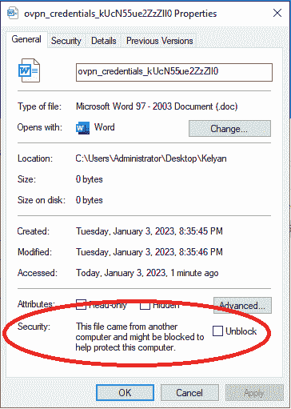
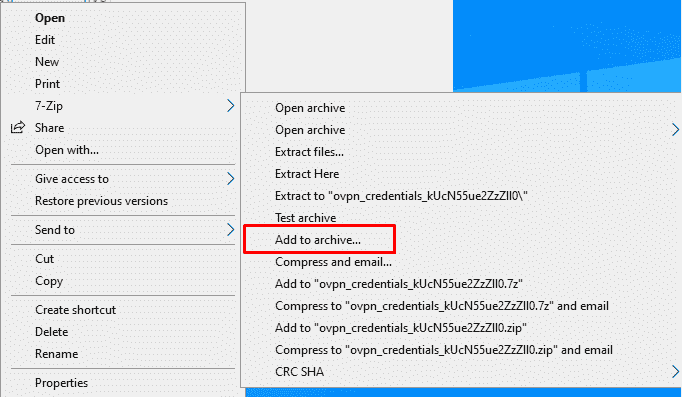
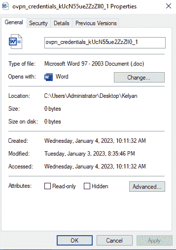
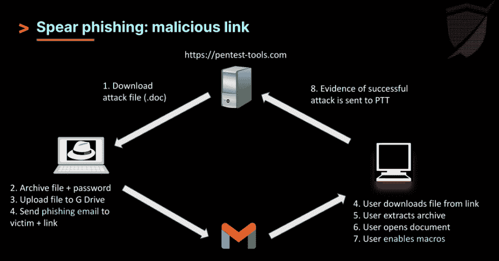

# 通过一个 7-Zip 错误配置钓鱼一家公司| Pentest-Tools.com

> 原文：<https://pentest-tools.com/blog/phishing-7-zip-misconfiguration>

阅读关于网络钓鱼的文章有时会感到乏味，因为许多文章只是重复使用相同的旧场景和防范策略，而没有深入技术细节或提供任何新内容。但是别担心，我们会掩护你的！

具体来说，我们将介绍攻击者如何利用 7-Zip 中的错误配置来禁用 Web (MOTW)标记，并发起更有效的网络钓鱼攻击。我们还将展示 Sniper Auto-Exploiter 中的客户端攻击特性如何帮助消除在这种情况下手动设置和配置反向 shells 的需要。

请继续阅读，以便更好地理解这种技术是如何工作的，以及有哪些缓解方案。所以，喝杯咖啡，坐下来，准备扩展你在这些重要的网络安全问题上的知识。

## 放弃

本材料仅用于教育目的，不得非法复制。[hacking-goodies . shop](http://hacking-goodies.shop)归[Pentest-Tools.com](http://pentest-tools.com)所有，它允许你测试本文描述的技术。请不要试图重现本材料中描述的任何行为，这些行为不属于受法律合同约束的道德黑客行为。

## **为什么我们决定写这篇文章**

回到 2022 年 11 月，Pentest-Tools 的创始人艾德里安·富图纳(Adrian Furtuna)， [在](https://youtu.be/XNOUKFVbxlw) [狙击中为](https://pentest-tools.com/exploit-helpers/sniper) 推出了一个新功能:Auto-Exploiterat[DefCamp](http://def.camp)称为**客户端攻击。**

网络钓鱼攻击是一种网络攻击，它使用电子邮件或其他形式的通信来欺骗人们泄露敏感信息，如登录凭据或财务信息。您可能知道，您可以使用 VBA 宏来创建各种类型的恶意攻击，这些攻击可以通过电子邮件或其他方式进行。当用户打开文档或点击链接时，就会执行宏并发起攻击。

VBA (Visual Basic for Applications)是一种内置于许多 Microsoft Office 应用程序中的编程语言，包括 Excel、Word 和 PowerPoint。它用于创建宏，宏是由用户定义的事件触发的自动操作序列，例如单击按钮或打开文档。

VBA 用于创建广泛的定制解决方案，包括数据分析工具、重复任务自动化和定制用户界面的创建。然而，恶意行为者也喜欢用它来制造网络钓鱼攻击。

在很短的一段时间内，微软通过引入网络标记(MOTW)修补了这种类型的攻击。如果文件是从 internet 下载的，此功能会阻止宏运行。

## 是什么让 7-Zip 成为如此好的网络钓鱼载体

您可能知道，7-Zip 是一种广泛使用的文件归档软件，它允许用户将多个文件压缩和打包成一个归档文件。它是开源的，支持多种文件格式，包括它自己的. 7z 格式，以及其他格式，如。zip 和. rar。

除了文件归档功能，7-Zip 还包括一个名为“7z”的命令行实用程序，可以对归档文件进行各种操作，例如提取文件、将文件添加到归档文件或创建新的归档文件。这个工具允许极大的灵活性和多功能性，使 7-Zip 成为个人和专业使用的有用工具。

接下来，我们将了解一个简单的 7-Zip 错误配置如何禁用 Office 应用程序(如 Excel、Word 和 PowerPoint)中的 Web 标记，然后您可以在网络钓鱼防范模拟中使用它。

## **这种错误配置是如何产生的？**

漏洞本身非常简单明了。简单地说，当你存档一个文件并给它设置密码时，7-Zip 会删除 alert 属性。

正如您在下面看到的，当您检查从互联网下载的文件的属性时，它会显示一个警告，不允许您运行宏。

如果您勾选**解锁**框，您可以取消它并执行宏。在网络钓鱼环境中，这没有帮助，因为受害者在看到警报时不会进一步手动选中**解锁**框。(大多数用户不知道去哪里做这件事。)

但是，通过在 7-zip 中存档带有密码的文件，您可以摆脱警报并更秘密地传递它。右击该文件并选择**添加到档案**。

输入任意密码，然后点击**确定。**

完成这些简单的步骤后，解压文件并再次检查文件属性。

如您所见，MOTW 已被完全擦除，当受害者试图查看文件属性时，它不再出现。

## **好吧，但是攻击者如何从这个场景中获利呢？**

下图解释了这种情况下的步骤

想象一下下面的场景(我们将这个 [DMARC 错误配置](https://pentest-tools.com/blog/dmarc-protocol-email-security) 添加到我们的网络钓鱼活动中):您想要内部访问 hacking-goodies.shop，这样您就可以给自己发送一些免费的好东西。

你通过 OSINT 发现 Steve 是技术部门的新员工，在那里他可以接触到很多机密信息。你还发现该公司使用 name . surname @ hacking-goodies . shop 格式发送员工电子邮件。

利用收集到的数据，您可以通过伪造邮件和发送恶意文件(显然是出于安全意识的目的)来轻松冒充公司的 CEO。

在上面的例子中，我们创建了一个适合 Steve 情况的场景，并呈现了一个他被迫下载文件的场景。

这只是一个简单的例子，但是想象一下高级持续威胁(APT)组织或国家支持的攻击者(SSA)使用这种错误配置以及他们可以从中获得的能力！

## 演示时间:网络钓鱼模拟

深入一点，你会弄脏你的手，练习你刚刚学到的东西。

观看我们的同事 [Stefan](https://pentest-tools.com/blog/authors/stefan-iridon) 在一个短视频**中演示如何使用 [狙击手:自动开发者的](https://pentest-tools.com/exploit-helpers/sniper) **客户端攻击**功能运行该场景。**

在这次网络钓鱼模拟中，没有目标会受到损害。

如何在 pentests 中用狙击手自动剥削者模拟客户端攻击

[https://www.youtube-nocookie.com/embed/https://www.youtube.com/watch?v=67oihoQVG5g?autoplay=1](https://www.youtube-nocookie.com/embed/https://www.youtube.com/watch?v=67oihoQVG5g?autoplay=1)

视频

<template x-if="showVideo"></template>

使用被动攻击功能，您可以从我们的网站轻松创建攻击处理程序，从而让您在短时间内获得清晰简洁的结果。这可以节省您宝贵的时间和精力，因为它消除了手动设置和配置反向 shells 的需要。

## 但是这个新功能的好处不仅仅是方便。Sniper 在 handler 过程中提取的 [工件](https://pentest-tools.com/exploit-helpers/sniper#artefacts-for-vulnerability-validation) 可以提供一个公司暴露于潜在威胁的更加准确和有说服力的图片。通过收集有关系统配置、打开的端口和安装的软件的详细数据，您可以描绘出需要解决的漏洞的全面而令人信服的画面。

如何缓解这种类型的网络钓鱼攻击

网络钓鱼就是注重细节。你可能收到过太明显的钓鱼邮件，不会上当。然而，即使是训练有素的道德黑客也会遇到对手。

这里有 **3** 个简单的步骤来防止这种攻击场景，您可以窃取并添加到您的 pentest 报告中:

## 1.实施网络分段

实施网络分段以限制任何潜在恶意软件或其他恶意代码的传播。这有助于遏制攻击，并使攻击者更难访问关键系统。

2.培训员工

### 就如何识别和报告潜在的安全威胁(如网络钓鱼攻击、可疑电子邮件和恶意链接)向员工提供定期培训。这有助于降低员工成为攻击受害者以及无意中使公司面临风险的风险。

3.注意细节

### 注意细节可以缓解几乎所有的网络钓鱼攻击。检查域名产地，MOTW，电子邮件发件人和语法是必不可少的，以防止成为受害者。

**结论**

### 这种 7-Zip 错误配置对于黑客来说是一个强大的工具，他们试图绕过 Microsoft Word 关于从互联网下载文件的警告。在网络钓鱼活动中。通过使用 7-Zip 命令行实用程序并战略性地配置存档文件，攻击者可以通过擦除“Web 标记”属性来欺骗受害者下载恶意软件，该属性旨在防止宏在文件从互联网下载时运行。

个人和组织需要意识到这种潜在的漏洞，并采取措施保护自己，例如实施适当的防御措施，培训团队成员在下载文件或使用电子邮件时保持谨慎，并练习安全的浏览习惯。

## 总的来说， [狙击手自动剥削者](https://pentest-tools.com/exploit-helpers/) 中新的人工制品提取功能对于任何寻求节省时间的有道德的黑客来说都是有价值的补充。这些功能可以节省您的精力，同时为公司面临的潜在威胁提供更准确、更有说服力的描述。

这种 7-Zip 错误配置对于黑客来说是一个强大的工具，他们试图绕过 Microsoft Word 关于从互联网下载文件的警告。在网络钓鱼活动中。通过使用 7-Zip 命令行实用程序并战略性地配置存档文件，攻击者可以通过擦除“Web 标记”属性来欺骗受害者下载恶意软件，该属性旨在防止宏在文件从互联网下载时运行。

个人和组织需要意识到这种潜在的漏洞，并采取措施保护自己，例如实施适当的防御措施，培训团队成员在下载文件或使用电子邮件时保持谨慎，并练习安全的浏览习惯。

总的来说， [狙击手自动剥削者](https://pentest-tools.com/exploit-helpers/) 中新的人工制品提取功能对于任何寻求节省时间的有道德的黑客来说都是有价值的补充。这些功能可以节省您的精力，同时为公司面临的潜在威胁提供更准确、更有说服力的描述。