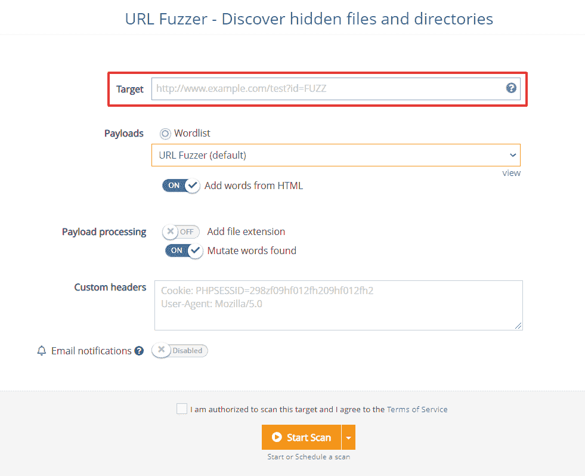

# 利用这 5 个平台更新运行激光聚焦扫描| Pentest-Tools.com

> 原文：<https://pentest-tools.com/blog/run-scans-5-platform-updates>

Updated at

February 08, 2023

这个月我们推出了 5 个值得一试的新更新。为什么？

因为我们不断改进，所以你可以对你的工作流程做一些小小的调整，从而节省大量的时间。

1.创建自定义标题(并与 URL Fuzzer 一起使用)
2。使用 URL Fuzzer
3 设置您自己的自定义有效负载。获得关于开放端口的电子邮件扫描通知
4。寻找子域-更多可用的搜索方法！
5。吉拉整合-关于目标的信息&增加了工作空间

让我们打开它们吧！

现在**你可以从你的 Pentest-Tools.com 账户设置你自己的 HTTP 头列表** (Cookies 或用户代理)。

要启用它，请转到 [URL Fuzzer](https://pentest-tools.com/website-vulnerability-scanning/discover-hidden-directories-and-files) ，插入您的 URL **target** ，并指定一个标头列表，这些标头将随 fuzzing 过程中包含的每个请求一起发送。

使用它们来加快您发现 web 应用程序中隐藏的文件和目录的速度，以及检查常见 web 漏洞的速度。

## **2。在 URL Fuzzer 中添加自定义负载来检测特定漏洞。**

我们对 URL Fuzzer 的另一个改进是使用“FUZZ”标记在自定义位置添加有效载荷的选项**。**

为此，只需将它们包含在 URL 路径或查询字符串参数中。

如果你想让它工作，不要把它们包含在域或子域中。

这里有一个例子:

```
http://example.com/dirs/FUZZ/index.php?id=3
```



## **3。获取关于开放端口的电子邮件扫描通知**

你现在可以**为**设置电子邮件通知，当 Pentest-Tools.com 发现**打开的端口不是你选择的**的端口时。

要使用此功能，请选择我们的一个工具，启用通知，并设置我们应该提醒您打开哪些端口的条件。
当扫描结果与您选择的所有条件匹配时，您会立即收到电子邮件通知，并获得详细信息。

## **4。查找子域现在包括更多的数据源**

我们已经用更多的搜索方法增强了[查找子域](https://pentest-tools.com/information-gathering/find-subdomains-of-domain)工具，因此你可以用 Pentest-Tools.com 得到更好的结果。

使用它们来收集关于您的 pentesting 项目目标的重要信息。

## **5。向吉拉票证添加目标和工作区**

如果您正在使用吉拉集成来更好地对您使用我们的平台发现的结果进行优先排序，我们有好消息！

您现在可以**将目标名称和工作区添加到您创建的标签**中，并自动将它们发送到吉拉。

使用它来更快地确定具体问题的优先级，并更好地扩展您的工作。

快速提醒:吉拉集成仅适用于企业客户的**。**

准备好接受这些更新了吗？