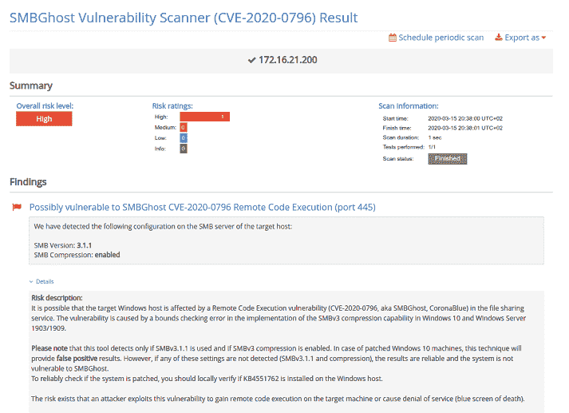
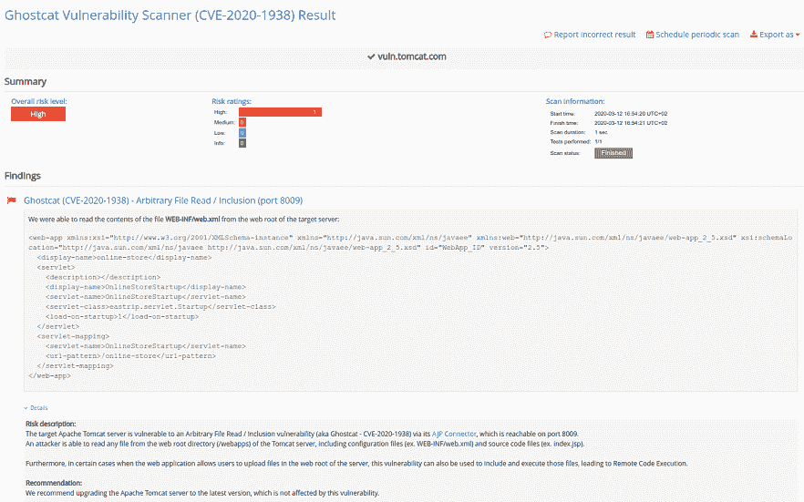

# [新扫描仪]检测 Pentest-Tools.com | Pentest-Tools.com 的 SMBGhost 和 Ghostcat 漏洞

> 原文：<https://pentest-tools.com/blog/scanners-detect-smbghost-ghostcat>

漏洞扫描器是必不可少的测试工具，可以在黑客之前快速发现关键的安全缺陷。越具体越有用！

为了帮助我们的客户更好地检测他们的系统是否受到 SMBGhost 和 GhostCat 漏洞的影响，我们在 Pentest-Tools.com 上构建并添加了**两个新的专用扫描仪。**

## 1.使用我们的 SMBGhost 漏洞扫描器发现易受攻击的 Windows 主机

我们开发的 [**SMBGhost 扫描器**](https://pentest-tools.com/network-vulnerability-scanning/network-security-scanner-online-openvas)**检查目标的 SMB 版本**以识别您的 Windows 主机是否受到微软 SMBGhost 漏洞(CVE-2020-0796)的影响。

该漏洞存在于 Microsoft SMBv3.1.1 协议中，会影响所有运行 Windows 10 和 Windows Server 的计算机。成功利用该漏洞后，黑客可以在易受攻击的目标机器上执行任意代码，或使主机因 BSOD 错误而崩溃。

你可以在我们的博客文章中阅读更多关于 SMBGhost 漏洞的信息。

**下面是 SMBGhost 漏洞样本报告的样子:**

**检测并报告 SMBGhost fast** 并获得漏洞的完整报告，包括描述、证据、风险和修复建议。

**[试用新的 SMBGhost 扫描仪](https://pentest-tools.com/network-vulnerability-scanning/network-security-scanner-online-openvas)**

## **2。用我们的 GhostCat 漏洞扫描器检测易受攻击的 Tomcat 服务器**

我们在 Pentest-Tools.com 上的第二个新工具 [**GhostCat 扫描器**](https://pentest-tools.com/network-vulnerability-scanning/network-security-scanner-online-openvas) ，通过试图经由 AJP 连接器从服务器的 WEB 根目录读取文件 *WEB-INF/web.xml* ，检测受 CVE-2020-1938 影响的易受攻击的 Apache Tomcat 服务器。

**查看 Pentest-Tools.com ghost cat 扫描仪结果的样本报告**:

Apache JServ 协议(AJP)中存在 **GhostCat 漏洞** (CVE-2020-1938)，该漏洞会影响 Apache Tomcat 服务器版本 6.x、7.x、8.x 和 9.x

无论您是系统管理员还是安全顾问，您都可以**使用 GhostCat 扫描仪**来执行简单的安全测试**并检测您的 Apache Tomcat 服务器是否受到影响**。

[**试用新 GhostCat**](https://pentest-tools.com/network-vulnerability-scanning/network-security-scanner-online-openvas) [扫描仪](https://pentest-tools.com/network-vulnerability-scanning/network-security-scanner-online-openvas)

如果您想了解更多关于 Pentest-Tools.com 的信息或找到您问题的快速答案，**探索我们的[支持中心](https://support.pentest-tools.com)** 或发送电子邮件至 support@pentest-tools.com